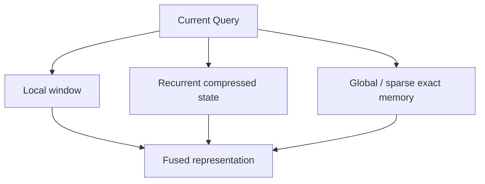

# 检索边界与混合模型

> 类型：专题详解。所属：[专题总览](README.md)。涉及模型版本、API 和性能数字的旧稿内容尚未逐条重新核验，见[版本与验证范围](../../版本与验证范围.md)。

<a id="read-28"></a>

<a id="26-为什么-fixed-state-天然不擅长-exact-retrieval"></a>

## 为什么 Fixed State 天然不擅长 Exact Retrieval

<a id="261-信息容量"></a>

### 1 信息容量

若长度 $L$ 无限增长，而 state dimension 固定：

```math
S_t\in\mathbb R^D,
\qquad D\text{ fixed},
```

所有历史被压入同一个有限表示。无损恢复任意 token identity 不可能无限扩展。

<a id="262-state-size--recall-trade-off"></a>

### 2 State-size / recall trade-off

BASED 工作系统地强调：固定 state 模型的 recall 与 state size 存在 trade-off。增大 $d_k,d_v$、增加 heads 或 local window 可改善 recall，但同时增加：

- state HBM；
- 每 token state read/write；
- transition FLOPs；
- chunk workspace。

<a id="263-retrieval-不是-perplexity-的同义词"></a>

### 3 Retrieval 不是 Perplexity 的同义词

模型可以有很好的平均 PPL，却在以下任务失败：

- UUID/随机字符串复制；
- multi-key needle；
- code symbol 精确引用；
- 长 agent trace 中某次工具返回；
- 同一个 Key 多次更新后的最后值。

因此评估需同时覆盖 language modeling、associative recall、state tracking 和真实 long-context tasks。

<a id="264-为什么-delta-rule-只是缓解不是消灭容量上限"></a>

### 4 为什么 Delta Rule 只是缓解，不是消灭容量上限

Delta rule 能定向覆盖旧关联、减少同 Key 冲突；gate 能清理无关内容。但有限 matrix state 仍然有限，多个相似 Key 和大量独立 associations 最终仍会竞争容量。

---


<a id="read-29"></a>

<a id="27-hybrid-attention不是过渡方案而是-memory-hierarchy"></a>

## Hybrid Attention：不是过渡方案，而是 Memory Hierarchy

现代架构越来越少采用纯 Linear Attention，而是把不同记忆路径分工。

| 路径 | 适合的信息 | 状态形态 | 序列成本 |
|---|---|---|---:|
| Local window | 最近语法、局部推理 | 最近 token KV | $O(w)$ |
| Linear state | 主题、累积状态、可压缩关联 | 固定 matrix/vector state | $O(1)$ decode |
| Full/MLA | 任意 token 精确交互 | 全量 token KV | $O(L)$ decode |
| Sparse exact | 远程精确 retrieval | 全量/分层 KV + index | $O(K)$ 主 Attention |



Hybrid 的本质是：

```math
\boxed{
\text{大部分 token 走固定成本路径，少部分层/信息走精确高成本路径}
}
```

---


<a id="read-30"></a>

<a id="28-hybrid-的三种组织方式"></a>

## Hybrid 的三种组织方式

<a id="281-layer-wise-interleaving"></a>

### 1 Layer-wise interleaving

若每四层中三层 Linear、一层 Full/MLA：

```text
Linear → Linear → Linear → Full → ...
```

优点：

- 实现和 checkpoint 结构清晰；
- Full 层周期性恢复 token-level global interaction；
- KV Cache 只存在于部分层。

缺点：

- Full 层仍是长 context bottleneck；
- 信息必须通过 residual stream 在不同 memory system 间传递；
- Full 层放在哪些深度会影响 recall。

<a id="282-within-layer-parallel-hybrid"></a>

### 2 Within-layer parallel hybrid

同一层并行执行 Attention 与 SSM/Linear path，再融合：

```math
y_t=g_t\odot y_t^{attn}+(1-g_t)\odot y_t^{linear}.
```

优点是每层都能访问两种 memory；代价是两条路径都执行，节省取决于 attention path 宽度与频率。

<a id="283-tokenblock-adaptive-hybrid"></a>

### 3 Token/block-adaptive hybrid

模型学习哪些 token 需要 exact attention、哪些可压入 state。潜在效率更高，但带来：

- 动态 routing；
- ragged kernel；
- 负载不均；
- 离散决策训练；
- Serving 成本难预测。

截至 2026，这仍是活跃研究方向，工程成熟度通常低于固定 layer ratio。

---


<a id="read-31"></a>

<a id="29-现代开源模型路线对比"></a>

## 现代开源模型路线对比

<a id="291-deepseekmla--sparse-exact-route而不是-recurrent-la"></a>

### 1 DeepSeek：MLA + Sparse exact route，而不是 recurrent LA

截至 DeepSeek-V3.2 的公开结构，DeepSeek 的主线是：

```math
\text{MLA latent KV}
+\text{DSA learned sparse selection}.
```

它仍保留 token-level latent memory，强调 exact retrieval 与减少实际扫描。与 KDA/GDN 的区别是：

- DSA：历史 token 仍在，按 Query 找 Top-K；
- Linear state：历史被持续压缩，不再逐 token 保存。

因此 DeepSeek 是非常有价值的对照组：同样解决百万 context，选择了“压窄 + 稀疏检索”，而不是“固定 recurrent state”。

<a id="292-qwengated-deltanet--gatedglobal-attention"></a>

### 2 Qwen：Gated DeltaNet + Gated/Global Attention

Qwen3-Next 引入以 GDN 为主、周期性 global attention 的 Hybrid 结构，后续 Qwen3.5 等版本延续。常见公开比例为约 3:1：

```math
3\times\text{GDN}+1\times\text{Global Attention}.
```

它的 Infra 逻辑：

- 约四分之三层用固定 matrix state；
- 约四分之一层保留 exact/global interaction；
- KV Cache 层数相应减少；
- decode 的主 Attention 成本下降，但 GDN state update 成为新 kernel 热点。

Qwen3.8-Flash-Next 的公开架构说明继续保留 GDN 主干，并把 global layer 进一步替换/升级为 Qwen Sparse Attention，形成：

```math
\text{Linear compressed state}
+\text{Sparse exact memory}.
```

这与本文的 memory hierarchy 主线完全一致。

<a id="293-kimi-linearkda--periodic-mla"></a>

### 3 Kimi Linear：KDA + periodic MLA

Kimi Linear 使用约 3:1 的 KDA-to-global MLA layer ratio。公开 48B total / 3B active 模型以 KDA 作为大多数 token mixer，用 periodic MLA 保留精确全局交互。

Kimi 报告的关键创新点：

- KDA 的 channel-wise forget gate；
- specialized DPLR chunk algorithm；
- NoPE/global MLA Hybrid；
- 公开 KDA kernel、checkpoint 与 vLLM 集成。

论文报告在其 matched experiment 中，1M context decode throughput 相对 full MLA 可达到最高约 6.3×，并把 KV Cache 使用量最多降低约 75%。这些是作者报告的特定模型/硬件结果，不是 KDA 的理论固定倍率。

<a id="294-glm从-dsa-到-sparse--linear-hybrid"></a>

### 4 GLM：从 DSA 到 Sparse + Linear Hybrid

GLM-5 采用 DSA；GLM-5.2 继续通过 IndexShare 降低稀疏 Indexer 成本；GLM-5.3-Flash 官方说明首次在 GLM 系列采用 Sparse + Linear Attention Hybrid。

演化非常清楚：

```math
\text{Full/MLA}
\rightarrow
\text{Sparse exact}
\rightarrow
\text{Sparse exact + fixed recurrent state}.
```

Linear path 负责大部分低成本历史压缩，Sparse path 保留精确 long-context capability。

<a id="295-minimaxlightning-attention-的大规模验证"></a>

### 5 MiniMax：Lightning Attention 的大规模验证

MiniMax-01 将 Lightning Attention 与 MoE 结合，公开训练/推理到百万级 context；MiniMax-M1 继续使用 Hybrid/Lightning Attention 支撑长 reasoning 输出。

其里程碑意义在于：

- 不是只在 1B 小模型上验证线性 token mixer；
- 把长序列算子、MoE parallelism 与通信重叠共同设计；
- 展示 Linear/Hybrid Attention 与 ultra-long context、reasoning serving 的系统结合。

后续 MiniMax-M2 系列报告也公开讨论了 Hybrid 模型在更难 multi-hop reasoning 上暴露的质量差距，这再次说明标准 benchmark parity 不等于精确长程推理完全等价。

---


<a id="read-32"></a>

<a id="30-其他具有里程碑意义的-hybrid-模型"></a>

## 其他具有里程碑意义的 Hybrid 模型

<a id="301-based明确提出-recallthroughput-pareto-frontier"></a>

### 1 BASED：明确提出 Recall–Throughput Pareto Frontier

BASED 组合简单 Linear Attention 与 Sliding Window Attention，重点不是复杂 gate，而是系统研究 state size、window size、recall 和 generation throughput 的关系。

它提供了一个很重要的评估框架：

> 不要只问 Linear Attention 的 PPL；要画出 recall–memory–throughput 的 Pareto frontier。

<a id="302-griffin--recurrentgemma"></a>

### 2 Griffin / RecurrentGemma

Griffin 把 gated linear recurrence 与 local attention 组合；Google 后续发布 RecurrentGemma。它证明 local exact path + recurrent global-ish state 是另一种可扩展 Hybrid 配方。

<a id="303-jamba"></a>

### 3 Jamba

Jamba 将 Transformer Attention、Mamba 与 MoE 混合。它的重要性在于把 Hybrid token mixer 与 conditional FFN capacity 一起放进大模型，展示架构不再是单一 operator 的选择。

<a id="304-sambazambanemotron-h-等"></a>

### 4 Samba、Zamba、Nemotron-H 等

这些路线以不同层调度混合 Mamba/SSM 与 Attention：

- 固定周期插入 Attention；
- 不同深度使用不均匀比例；
- 共享 Attention blocks；
- Mamba/Attention 并行或串行融合。

它们共同说明行业收敛点不是“SSM 取代 Transformer”，而是寻找 exact memory 与 recurrent memory 的最佳配比。

<a id="305-dart从-recurrent-state-再解码出可检索-memory"></a>

### 5 DART：从 Recurrent State 再解码出可检索 Memory

2026 年 DART 从 Mamba-2/SSD chunk states 中解码 Key/Value，再对 state memories 做 Attention，尝试在“每 token KV”与“单一 final state”之间建立中间层级。

这条方向值得关注，因为它把 Hybrid 从“不同层放不同算子”推进到：

```math
\text{同一 recurrent memory}
\rightarrow
\text{按 chunk 保存}
\rightarrow
\text{按 Query 检索 state memories}.
```

它仍是较新的研究结果，但很能代表下一阶段：不是回到完整 KV，而是让 compressed states 本身成为可检索层级。

---


<a id="read-33"></a>

<a id="31-里程碑时间线"></a>

## 里程碑时间线

| 年份 | 工作 | 关键推进 |
|---:|---|---|
| 1992 | Fast Weight Programmers | 用慢网络生成指令，在线编程快速权重记忆 |
| 2018–2020 | Efficient Attention | 用结合律改变 Attention 计算顺序 |
| 2020 | Transformers are RNNs | Kernel LA 的 recurrent form 与 $O(1)$-in-$L$ decode state |
| 2020–2021 | Performer / FAVOR+ | 随机特征近似 Softmax kernel |
| 2021 | Linear Transformers are FWP | 统一 Linear Attention 与 fast-weight memory，指出容量限制 |
| 2021–2022 | Delta-rule FWP / ABC / S4 | 纠错写入、bounded memory、结构化 SSM |
| 2023 | RWKV、RetNet、Hyena、Mamba | 并行训练 + recurrent inference、selective state、长卷积 |
| 2024 | GLA、BASED、Mamba-2/SSD、DeltaNet parallel | 数据门控、recall Pareto、SSM-Attention 对偶、硬件化 delta rule |
| 2024 | Griffin、Jamba、Samba | Hybrid Attention/SSM 成为模型级路线 |
| 2025 | Gated DeltaNet | decay 与 delta correction 统一 |
| 2025 | MiniMax-01、Qwen3-Next | 大规模 Hybrid/Linear 模型公开验证 |
| 2025 | Kimi Linear / KDA | channel-wise forget、DPLR chunk、KDA+MLA 3:1 Hybrid |
| 2026 | GLM-5.3-Flash | Sparse + Linear Hybrid 进入 GLM 系列 |
| 2026 | GDN-2、DART | erase/write 解耦；可检索 recurrent state memory |

---

---

[所属专题](README.md) · [百科总览](../../README.md)
