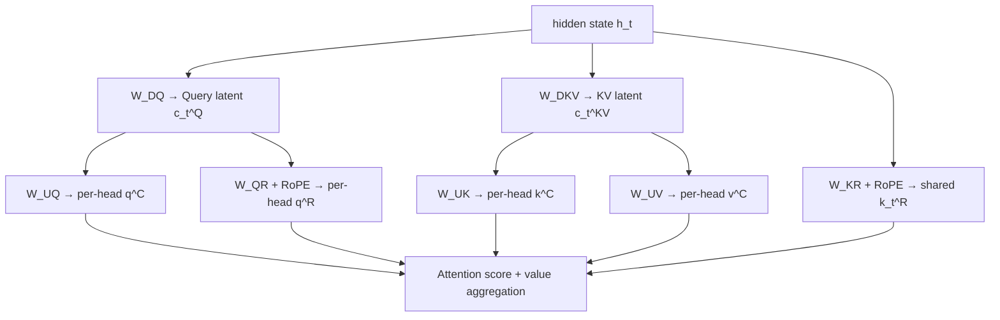

# 低秩投影与矩阵吸收

> 类型：专题详解。所属：[专题总览](README.md)。涉及模型版本、API 和性能数字的旧稿内容尚未逐条重新核验，见[版本与验证范围](../../版本与验证范围.md)。

<a id="read-04"></a>

<a id="3-从一个天真的-low-rank-kv开始"></a>

## 从一个“天真的 Low-rank KV”开始

<a id="31-联合压缩而不是分别缓存低秩-k-和-v"></a>

### 1 联合压缩，而不是分别缓存低秩 K 和 V

标准 MHA 先直接投影出完整 K/V：

```math
k_t=W_Kh_t,\qquad v_t=W_Vh_t
```

MLA 改成两段式：

```math
c_t^{KV}=W^{DKV}h_t,\qquad c_t^{KV}\in\mathbb{R}^{d_c}
```

```math
k_t^C=W^{UK}c_t^{KV},\qquad
v_t^C=W^{UV}c_t^{KV}
```

其中：

```math
W^{DKV}\in\mathbb{R}^{d_c\times d}
```

```math
W^{UK}\in\mathbb{R}^{(n_hd_k)\times d_c},\qquad
W^{UV}\in\mathbb{R}^{(n_hd_v)\times d_c}
```

关键不是 $W_K$ 或 $W_V$ 各自低秩，而是 K 与 V 共享同一个 $c_t^{KV}$。每个 token 只需保存一份 latent。

这是一种端到端学习的参数化，不是模型训练完以后对 KV Cache 做一次 SVD 压缩。训练会共同学习：

- 哪些 token 信息应该进入 latent；
- 哪些维度对 Key 的匹配有用；
- 哪些维度对 Value 的内容传递有用；
- 不同 head 应该如何从共享 latent 中解码出自己的子空间。

<a id="32-query-为什么也做低秩压缩"></a>

### 2 Query 为什么也做低秩压缩？

完整 MLA 还可以写：

```math
c_t^Q=W^{DQ}h_t
```

```math
q_t^C=W^{UQ}c_t^Q
```

Query 是当前步临时量，不进入历史 Cache，因此压缩 Query **不直接减少 KV Cache**。DeepSeek-V2 报告给出的目的主要是减少训练阶段 activation memory。

这也解释了不同规模实现可以做不同选择：DeepSeek-V2 大模型使用 Query low-rank projection，而报告中的 V2-Lite 不压 Query；官方 V3 配置则包含 `q_lora_rank=1536`。

注意这里配置名中的 `q_lora_rank` 是 Attention 内部的低秩结构 rank，不等同于参数高效微调里的 LoRA adapter。二者都使用低秩分解，但角色不同：前者是基础模型架构，后者通常是冻结基座后的增量参数。

<a id="33-latent-bottleneck-为什么通常还要-norm"></a>

### 3 Latent bottleneck 为什么通常还要 Norm？

低秩瓶颈会改变激活分布和输出尺度。DeepSeek-V2/V3 的实际实现会在压缩 latent 后加 RMSNorm，并在宽度瓶颈处使用额外 scaling。官方参考实现实际缓存的是：

```math
\operatorname{RMSNorm}(c_t^{KV})
```

而不是未经归一化的原始 latent。

这提醒我们：论文中为了表达核心思想写出的最简公式，与稳定训练所需的工程实现之间，通常还隔着 normalization、scaling、precision policy 和并行切分。

---


<a id="read-05"></a>

<a id="4-完整-mlacontent-分支与-rope-分支"></a>

## 完整 MLA：Content 分支与 RoPE 分支

<a id="41-一张张量形状表"></a>

### 1 一张张量形状表

以下使用 batch $B$、本次 token 数 $S$、模型维度 $d$、Query heads $n_h$：

| 张量 | 典型形状 | 是否跨历史缓存 | 含义 |
|---|---:|---|---|
| $h$ | $[B,S,d]$ | 否 | Attention 输入 |
| $c^Q$ | $[B,S,d_c']$ | 否 | Query latent |
| $q^C$ | $[B,S,n_h,d_{nope}]$ | 否 | 不带位置旋转的 Query content |
| $q^R$ | $[B,S,n_h,d_r]$ | 否 | 每头 RoPE Query |
| $c^{KV}$ | $[B,S,d_c]$ | **是** | 联合 KV latent |
| $k^C$ | $[B,S,n_h,d_{nope}]$ | naive 路径才显式展开 | 每头 content Key |
| $v^C$ | $[B,S,n_h,d_v]$ | naive 路径才显式展开 | 每头 Value |
| $k^R$ | $[B,S,1,d_r]$ | **是** | 所有 heads 共享的 RoPE Key |

DeepSeek-V3 的公开配置给出：

| 参数 | 数值 |
|---|---:|
| hidden size | 7168 |
| attention heads | 128 |
| Query latent rank | 1536 |
| KV latent rank $d_c$ | 512 |
| NoPE head dim $d_{nope}$ | 128 |
| RoPE head dim $d_r$ | 64 |
| Value head dim $d_v$ | 128 |

因此一个完整 Query head 的打分维度是：

```math
d_q=d_{nope}+d_r=192
```

但持久缓存宽度只有：

```math
d_{cache}=d_c+d_r=512+64=576
```

这里的 576 是**每 token、每 layer 的总宽度**，不再乘 128 个 KV heads。

<a id="42-完整前向公式"></a>

### 2 完整前向公式

Query 路径：

```math
c_t^Q=W^{DQ}h_t
```

```math
[q_{t,1}^C;\ldots;q_{t,n_h}^C]=W^{UQ}c_t^Q
```

```math
[q_{t,1}^R;\ldots;q_{t,n_h}^R]
=\operatorname{RoPE}(W^{QR}c_t^Q)
```

KV 路径：

```math
c_t^{KV}=W^{DKV}h_t
```

```math
[k_{t,1}^C;\ldots;k_{t,n_h}^C]=W^{UK}c_t^{KV}
```

```math
[v_{t,1}^C;\ldots;v_{t,n_h}^C]=W^{UV}c_t^{KV}
```

```math
k_t^R=\operatorname{RoPE}(W^{KR}h_t)
```

每个 head 的 Query 与 Key 由拼接组成：

```math
q_{t,i}=[q_{t,i}^C;q_{t,i}^R]
```

```math
k_{j,i}=[k_{j,i}^C;k_j^R]
```

注意 $k_j^R$ 没有 head 下标：它由所有 Query heads 共享。

Attention：

```math
p_{t,j,i}
=\operatorname{softmax}_j\left(
\frac{
(q_{t,i}^C)^{\mathsf T}k_{j,i}^C
+(q_{t,i}^R)^{\mathsf T}k_j^R
}{\sqrt{d_{nope}+d_r}}
\right)
```

```math
o_{t,i}=\sum_{j\le t}p_{t,j,i}v_{j,i}^C
```

```math
u_t=W^O[o_{t,1};\ldots;o_{t,n_h}]
```

<a id="43-结构图"></a>

### 3 结构图



推理时图中真正需要跨 step 保留的只有 `c_t^KV` 与 `k_t^R`。`k^C`、`v^C` 是否显式构造，取决于当前采用 MHA mode 还是矩阵吸收后的 MQA mode。

---


<a id="read-06"></a>

<a id="5-为什么-rope-会破坏矩阵吸收"></a>

## 为什么 RoPE 会破坏矩阵吸收？

这是 MLA 最容易“记住结论、没有理解原因”的部分。

<a id="51-没有-rope-时key-projection-可以移到-query-一侧"></a>

### 1 没有 RoPE 时，Key projection 可以移到 Query 一侧

对 content 分支：

```math
(q_{t,i}^C)^{\mathsf T}k_{j,i}^C
=(q_{t,i}^C)^{\mathsf T}W_i^{UK}c_j^{KV}
```

利用矩阵乘法结合律：

```math
(q_{t,i}^C)^{\mathsf T}W_i^{UK}c_j^{KV}
=\left((W_i^{UK})^{\mathsf T}q_{t,i}^C\right)^{\mathsf T}c_j^{KV}
```

定义 absorbed query：

```math
\widetilde q_{t,i}^C=(W_i^{UK})^{\mathsf T}q_{t,i}^C
\in\mathbb{R}^{d_c}
```

于是无需为每个历史 token 恢复 $k_{j,i}^C$，直接算：

```math
(\widetilde q_{t,i}^C)^{\mathsf T}c_j^{KV}
```

<a id="52-把-rope-粗暴放进-content-key-后发生什么"></a>

### 2 把 RoPE 粗暴放进 content Key 后发生什么？

把位置 $j$ 的旋转矩阵记为 $R_j$。若：

```math
k_j=R_jW^{UK}c_j^{KV}
```

Query 也旋转：

```math
q_t=R_tq_t^{raw}
```

打分变成：

```math
(q_t^{raw})^{\mathsf T}R_t^{\mathsf T}R_jW^{UK}c_j^{KV}
```

$R_j$ 依赖历史位置 $j$，位于 Query 与 $W^{UK}$ 之间。你无法构造一个与 $j$ 无关的 absorbed query，一次变换后就和所有历史 latent 做点积。

若强行保留这种结构，只能：

- 为每个位置保存展开后的 rotated K，失去 Cache 压缩；或
- 每个 decode step 为所有历史 token 重新展开 K，计算代价不可接受。

<a id="53-decoupled-rope-的解决方式"></a>

### 3 Decoupled RoPE 的解决方式

MLA 把注意力 score 拆为：

```math
\underbrace{(q_{t,i}^C)^{\mathsf T}k_{j,i}^C}_{\text{content / NoPE}}
+
\underbrace{(q_{t,i}^R)^{\mathsf T}k_j^R}_{\text{position / RoPE}}
```

content 分支不做旋转，因此可以吸收 $W^{UK}$；位置分支维度较小，直接缓存 $k_j^R$。

它本质上是在说：

> **把“内容寻址”和“相对位置寻址”放到两个子空间中；只让较小的位置子空间承担不可吸收的 position-dependent 运算。**

这并不意味着 content 与 position 完全独立，因为两部分 logits 在 softmax 前相加，共同决定最终注意力权重。

---


<a id="read-07"></a>

<a id="6-矩阵吸收为什么不用把历史-kv-解压出来"></a>

## 矩阵吸收：为什么不用把历史 K/V 解压出来？

<a id="61-key-side-absorption"></a>

### 1 Key-side absorption

上一节已经得到：

```math
\widetilde q_{t,i}^C=(W_i^{UK})^{\mathsf T}q_{t,i}^C
```

完整 score 可写为：

```math
s_{t,j,i}
\mathrel{=}
(\widetilde q_{t,i}^C)^{\mathsf T}c_j^{KV}
+(q_{t,i}^R)^{\mathsf T}k_j^R
```

将二者拼接：

```math
\widetilde q_{t,i}=[\widetilde q_{t,i}^C;q_{t,i}^R]
```

```math
\widetilde k_j=[c_j^{KV};k_j^R]
```

则：

```math
s_{t,j,i}=\widetilde q_{t,i}^{\mathsf T}\widetilde k_j
```

这时缓存只有一个共享的 $\widetilde k_j$，多个 Query heads 去读它，执行形态类似 MQA。

<a id="62-value-side-absorption"></a>

### 2 Value-side absorption

原本：

```math
o_{t,i}=\sum_j p_{t,j,i}W_i^{UV}c_j^{KV}
```

因为 $W_i^{UV}$ 与历史位置无关：

```math
o_{t,i}
=W_i^{UV}\left(\sum_jp_{t,j,i}c_j^{KV}\right)
```

先在 latent 空间聚合：

```math
z_{t,i}=\sum_jp_{t,j,i}c_j^{KV}
\in\mathbb{R}^{d_c}
```

再恢复 head output：

```math
o_{t,i}=W_i^{UV}z_{t,i}
```

最后的 $W_i^{UV}$ 还可以与输出投影 $W_i^O$ 合并：

```math
u_t=\sum_iW_i^OW_i^{UV}z_{t,i}
```

于是可以预先构造：

```math
\widetilde W_i^O=W_i^OW_i^{UV}
```

这就是论文所说的：$W^{UK}$ 可以吸收到 Query 路径，$W^{UV}$ 可以吸收到输出投影。

<a id="63-吸收不是删掉参数"></a>

### 3 “吸收”不是删掉参数

需要区分：

- 训练时：$W^{UK}$、$W^{UV}$ 仍是模型的可学习参数；
- 推理初始化或权重加载时：可以根据它们构造等价的 absorbed weights；
- 权重更新、LoRA merge、量化布局改变后：absorbed weights 也必须同步重建或使用相应 fused path；
- 数学等价不保证浮点逐 bit 一致，运算顺序与精度会带来小的数值差异。

---

---

[所属专题](README.md) · [百科总览](../../README.md)
