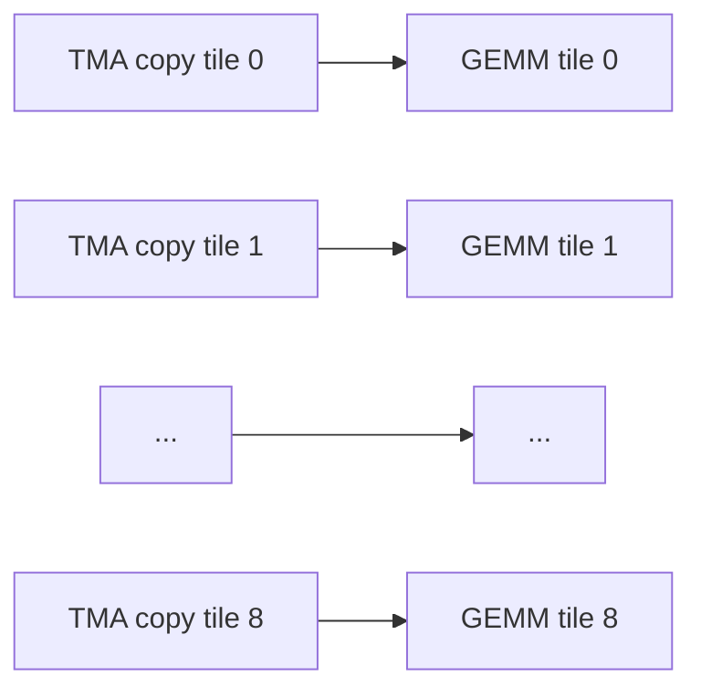

# 内核并行与运行时

> 类型：专题详解。所属：[专题总览](README.md)。涉及模型版本、API 和性能数字的旧稿内容尚未逐条重新核验，见[版本与验证范围](../../版本与验证范围.md)。

<a id="read-11"></a>

<a id="10-paged-latent-cachemla-如何进入-vllm--sglang-一类运行时"></a>

## Paged Latent Cache：MLA 如何进入 vLLM / SGLang 一类运行时？

PagedAttention 的核心思想与 Attention 类型无关：把逻辑连续的序列 Cache 映射到不要求物理连续的固定大小 pages/blocks。

标准 GQA page 里的 token record 可能是：

```math
[K^{1:n_{kv}},V^{1:n_{kv}}]
```

MLA page 里的 token record 变为：

```math
[c^{KV},k^R]
```

运行时仍需要：

- block table：逻辑 block 到物理 page 的映射；
- slot mapping：新 token 写入哪个物理位置；
- cache sequence lengths：每个请求有效历史长度；
- prefix-cache 引用计数：多个请求共享前缀页；
- eviction / offload / transfer policy。

变化最大的是每个 token record 的宽度显著缩小，因此：

- 同样 HBM 能容纳更多 pages；
- Prefix Cache 能保留更多热门前缀；
- PD 分离时需要传输的 Cache payload 更小；
- CPU/NVMe offload 的读写字节数下降；
- 但 page table、长度数组等元数据占比相对上升。

FlashMLA 的 decode 接口接收 `block_table`、`cache_seqlens` 与 tile scheduler metadata，说明生产 kernel 不是面对一个规整的 $[B,L,D]$ 张量，而是在处理 continuous batching 下不同长度、分页存储的 ragged KV。

---


<a id="read-12"></a>

<a id="11-roofline-视角mla-为什么是以算换存而不只是少算"></a>

## Roofline 视角：MLA 为什么是“以算换存”而不只是“少算”？

<a id="111-mqa-mode-mla-的近似算术强度"></a>

### 1 MQA-mode MLA 的近似算术强度

设：

- $h_q$：本 GPU 上 Query heads 数；
- $s_q$：每个请求本步 Query token 数，普通 decode 为 1，MTP/speculative decode 可大于 1；
- $s_k$：历史 KV token 数；
- $d_k=576$；
- $d_v=512$。

core attention 的主要 FLOPs 近似：

```math
F\approx2h_qs_qs_k(d_k+d_v)
```

当 $s_k\gg h_qs_q$ 时，主要 HBM 读取近似为：

```math
Bytes\approx2s_kd_k
```

这里假设 BF16 为 2 bytes。于是：

```math
AI=\frac{F}{Bytes}
\approx h_qs_q\frac{d_k+d_v}{d_k}
```

带入 576/512：

```math
AI\approx1.89h_qs_q\ \text{FLOPs/byte}
```

若单卡保留 128 个 Query heads，普通 decode 的 $s_q=1$：

```math
AI\approx242\ \text{FLOPs/byte}
```

这已经远高于传统单 Query、每头各读一份 KV 的低复用 decode。FlashMLA 团队用近似 $d_k\approx d_v$ 得到约 $2h_qs_q$，并指出其 H800 部署在 $h_qs_q\approx128$ 时接近或进入 compute-bound 区间。

<a id="112-为什么cache-更小反而可能让-kernel-计算更重"></a>

### 2 为什么“Cache 更小”反而可能让 kernel 计算更重？

因为 MQA mode 不展开 head-specific K/V，而让每个 Query head 直接与 576 维 latent key 做打分、在 512 维 latent value 上累加：

```math
\text{少读很多 byte}
\quad\Longleftrightarrow\quad
\text{对共享 byte 做更多 head-wise compute}
```

这正是现代 GPU 喜欢的交换：

- HBM bandwidth 增长慢于 Tensor Core FLOPs；
- 规则 GEMM/FMA 比跨 HBM 搬大体积 KV 更容易扩展；
- 共享 latent 被大量 Query heads 重用，提高数据复用。

但“计算相对便宜”不是无条件真理。最优模式会受这些因素影响：

- GPU 的 ridge point；
- 本地 Query head 数；
- $s_q$ 是否因 MTP 增大；
- 序列长度与 batch；
- KV 精度；
- Tensor Parallel 切分；
- kernel 对目标架构是否充分优化。

因此生产系统需要 backend selection，而不是看到 MLA 就固定使用同一条 kernel 路径。

---


<a id="read-13"></a>

<a id="12-flashmla算法变成高性能-kernel-时发生了什么"></a>

## FlashMLA：算法变成高性能 kernel 时发生了什么？

<a id="121-它与-flashattention-的关系"></a>

### 1 它与 FlashAttention 的关系

两者共同使用的核心思想是：

- 分块读取 Q/K/V；
- 不把完整 attention score matrix 写回 HBM；
- 使用 online softmax，在扫描 KV blocks 时维护 running max、normalizer 与 output accumulator；
- 尽量在 registers/shared memory 中完成中间计算。

但 MLA decode 的形状很特殊：

- Query heads 多；
- 共享 KV head 少；
- K 维 576、V 维 512；
- Query length 通常为 1 或一个很小的 speculative group；
- 请求长度 ragged；
- output accumulator 很宽，register pressure 高。

所以 FlashAttention 的通用 schedule 不能直接照搬。

<a id="122-为什么一个-64times512-output-tile-会带来-register-压力"></a>

### 2 为什么一个 $64\times512$ output tile 会带来 register 压力？

FlashMLA 的 deep-dive 以一个 $64\times512$ output matrix 为例：若 accumulator 使用 32-bit registers：

```math
64\times512=32{,}768
```

个 32-bit registers。Hopper 每个 SM 的寄存器资源有限，单个 output tile 已经占据巨大空间，难以像 FlashAttention-3 的传统 ping-pong 那样同时保留两份完整 output accumulator。

<a id="123-seesaw-scheduling"></a>

### 3 Seesaw scheduling

FlashMLA 将 512 宽的 output 分成左右两半：

```math
O=[O_L,O_R]
```

两个 warpgroups 交错处理相邻 KV blocks 的：

- $QK^{\mathsf T}$ Tensor Core 运算；
- max / exp / rescale 等 CUDA Core 运算；
- $PV$ Tensor Core 运算；
- 下一批数据的 TMA 搬运。

因为不再需要两份完整 output matrix，团队把这种单 output、两侧交替的 schedule 称为 seesaw（跷跷板）调度。

需要认识的硬件术语：

| 术语 | 含义 |
|---|---|
| Warpgroup | Hopper 上协同执行 WGMMA 的一组 warps，通常为 128 threads |
| WGMMA | Warpgroup-level Matrix Multiply-Accumulate，Hopper Tensor Core 矩阵指令 |
| TMA | Tensor Memory Accelerator，异步搬运多维 tensor tile 的硬件单元 |
| Registers | 每线程最快的片上存储；容量有限，过度使用会降低 occupancy |
| L2 cache hint | 给数据缓存/驱逐策略的提示，减少不必要的 cache 污染 |

<a id="124-细粒度-tmagemm-pipeline"></a>

### 4 细粒度 TMA–GEMM pipeline

对于 $64\times576$ 的 K block，FlashMLA 文档描述为 9 次 $64\times64$ TMA copy。第一小块到达后就启动对应 GEMM，不等待完整 576 维全部搬完：



本质是把“加载 576 维，再计算”改成细粒度生产者–消费者流水，降低 memory latency 暴露。

<a id="125-split-kv-与-tile-scheduler"></a>

### 5 Split-KV 与 tile scheduler

长序列 decode 若只给一个 thread block 扫完整个 $s_k$，并行度不足。常见做法是把 KV sequence 切成多个 splits：

1. 多个 blocks 分别计算局部 max、LSE 与 partial output；
2. combine kernel 按 online-softmax 规则合并；
3. tile scheduler 根据不同请求长度，把 jobs 分给 SM，降低长短请求造成的尾部不均衡。

FlashMLA 还使用 Programmatic Dependent Launch 去重叠 split-KV 与 combine 的启动/执行。它优化的不只是 GEMM，而是：

```math
\text{ragged requests}
+\text{KV splitting}
+\text{SM load balance}
+\text{kernel launch dependency}
```

<a id="126-如何看待性能数字"></a>

### 6 如何看待性能数字

FlashMLA 官方仓库报告过 H800 SXM5 特定软件版本和 shape 下：

- memory-bound 配置最高约 3000 GB/s；
- compute-bound 配置最高约 660 TFLOPS；
- deep-dive 报告约 80% 的受降频后 Tensor Core 峰值利用率。

这些是 kernel benchmark，不等于端到端 serving 提升，也不能直接迁移到任意 GPU、batch、长度分布或量化设置。端到端还包括 projection、MoE、通信、调度、采样和框架开销。

---


<a id="read-14"></a>

<a id="13-并行策略为什么-mla-与-tp-的关系很微妙"></a>

## 并行策略：为什么 MLA 与 TP 的关系很微妙？

<a id="131-head-parallel-tp-会改变算术强度"></a>

### 1 Head-parallel TP 会改变算术强度

假设 128 Query heads 做 TP=8，则每 rank 只有：

```math
h_q^{local}=16
```

若共享 latent cache 在各 TP ranks 上复制，则每个 rank 都要读同一份历史 cache，但只用 16 个 heads 复用它：

```math
AI\propto h_q^{local}s_q
```

算术强度约下降 8 倍，更容易重新变成 memory-bound。

同时，单份 latent KV 不像 128 个独立 KV heads 那样容易沿 head 维均匀切分。常规 head-parallel TP 往往会复制 latent KV，除非引入 sequence/context sharding 或专门的数据布局。

所以 MLA 的“小 Cache”并不自动意味着“TP 越大越好”。

<a id="132-为什么-deepseek-decode-的-mla-使用-dp-而不是-tp"></a>

### 2 为什么 DeepSeek decode 的 MLA 使用 DP 而不是 TP？

DeepSeek 公开的 V3/R1 在线推理概览中：

- prefill：Routed Expert EP32，MLA/Shared Expert DP32；
- decode：Routed Expert EP144，MLA/Shared Expert DP144。

也就是说 MoE experts 跨卡切分，而 Attention 在不同 DP ranks 上复制、各自处理不同请求。对 MLA decode，这带来两个好处：

- 每张卡保留完整 128 Query heads，提高共享 latent 的复用与算术强度；
- 避免每层 Attention 的 TP collectives。

代价是每张 Attention rank 都要放完整 MLA 参数，并独立承担自己请求的 KV Cache。系统借助大规模 Expert Parallel（EP）解决 MoE 参数与计算分布，再通过调度在 DP instances 间平衡 KV 占用和请求数。

<a id="133-context-parallel-能否切-latent-cache"></a>

### 3 Context Parallel 能否切 latent Cache？

可以沿 sequence 维把历史 latent 分到多个设备，但每步需要：

1. 各 rank 计算局部 attention max/LSE/output；
2. 跨 rank 合并全局 softmax 统计；
3. 处理负载不均、网络延迟与 page ownership。

MLA 减小了 Cache payload，也会减少 cache migration/offload 流量；但 exact dense attention 仍需要扫描所有 shard。是否使用 CP 取决于单请求长度是否已经超出单卡容量，以及互联带宽/延迟能否接受。

---


<a id="read-15"></a>

<a id="14-mla-与-prefilldecode-disaggregation"></a>

## MLA 与 Prefill–Decode Disaggregation

PD 分离把两种硬件画像不同的阶段放到不同 workers：

| 阶段 | 特征 | 更关心什么 |
|---|---|---|
| Prefill | 多 Query、大 GEMM、计算密集 | TTFT、compute throughput |
| Decode | 少 Query、反复读历史、请求持续存在 | TPOT、HBM capacity/bandwidth |

MLA 同时改善两者之间的“交接”：prefill 完成后，需要将新生成的 KV state 交给 decode worker。传输 compressed latent 而不是完整多头 K/V，可以降低：

```math
T_{transfer}\approx\frac{KV\ bytes}{Network\ bandwidth}+latency
```

中的 payload 项。

但 MLA 不会消除：

- request routing；
- cache location tracking；
- 网络拥塞；
- prefix-cache 命中一致性；
- decode worker 的 HBM 容量上限。

所以它是 PD 系统的重要 enabler，而不是完整解决方案。

---


<a id="read-16"></a>

<a id="15-一个接近官方实现的简化伪代码"></a>

## 一个接近官方实现的简化伪代码

下面刻意保留 tensor shape 和两种执行路径，省略 bias、mask broadcasting、并行 Linear、量化和 fused kernel：

```python
def mla_forward(x, cache, mode):
    # x: [B, S, d]

    # Query low-rank path
    cq = rms_norm(x @ W_DQ.T)                         # [B, S, q_rank]
    q = cq @ W_UQ_ALL.T                              # [B, S, H*(d_nope+d_rope)]
    q = q.view(B, S, H, d_nope + d_rope)
    q_nope, q_rope = split(q, [d_nope, d_rope])
    q_rope = apply_rope(q_rope, positions)            # [B, S, H, d_rope]

    # Joint KV compression + shared positional key
    kv_and_pe = x @ W_DKV_AND_KR.T                    # [B, S, d_latent+d_rope]
    c_kv, k_rope = split(kv_and_pe, [d_latent, d_rope])
    c_kv = rms_norm(c_kv)                             # [B, S, d_latent]
    k_rope = apply_rope(k_rope[:, :, None, :], positions)

    # Persistent cache always stores compressed states
    cache.append(c_kv, k_rope)

    if mode == "mha":
        # Training / prefill physical plan
        kv_full = c_kv @ W_UKV_ALL.T
        kv_full = kv_full.view(B, S, H, d_nope + d_value)
        k_nope, value = split(kv_full, [d_nope, d_value])
        key = concat(k_nope, expand_heads(k_rope))
        query = concat(q_nope, q_rope)
        out = flash_attention(query, key, value)

    elif mode == "mqa":
        # Decode physical plan
        # Per head: W_UK_i.T maps d_nope -> d_latent
        q_abs = einsum("bshd,hdc->bshc", q_nope, W_UK)
        scores = (
            einsum("bshc,btc->bsht", q_abs, cache.c_kv)
            + einsum("bshr,btr->bsht", q_rope, cache.k_rope)
        ) * softmax_scale
        probs = softmax(scores, dim=-1)
        z = einsum("bsht,btc->bshc", probs, cache.c_kv)
        out = einsum("bshc,hdc->bshd", z, W_UV)

    return out.flatten_heads() @ W_O.T
```

真实高性能 decode 会把 score、online softmax、latent value accumulation、split-KV 和部分输出变换融合，避免像伪代码那样产生巨大中间张量。

---


<a id="read-17"></a>

<a id="16-训练侧需要注意什么"></a>

## 训练侧需要注意什么？

<a id="161-参数量不等于-cache-量"></a>

### 1 参数量不等于 Cache 量

MLA 可能增加或重排 projection 参数，但 KV Cache 由每 token 需要保存的动态状态决定。不要用“Attention 参数更多/更少”直接推断 Cache。

静态权重：

```math
W^{DKV},W^{UK},W^{UV},W^{DQ},W^{UQ},W^{QR},W^{KR},W^O
```

动态 Cache：

```math
c_t^{KV},k_t^R
```

两者是不同账本。

<a id="162-query-compression-主要影响-activation-与-projection"></a>

### 2 Query compression 主要影响 activation 与 projection

Query 不跨 step 缓存，降低 Query rank 不会改变 KV Cache 公式，却可能：

- 降低训练中间激活宽度；
- 改变 Q projection FLOPs/参数；
- 形成额外 bottleneck，需要 Norm/scale 保持稳定；
- 影响 Tensor Parallel 的列切/行切方式。

<a id="163-低精度策略要区分权重激活cachecore-attention"></a>

### 3 低精度策略要区分权重、激活、Cache、core attention

一个系统可能同时存在：

- FP8 projection GEMM；
- BF16 core MLA；
- FP8 latent Cache；
- FP32 online-softmax accumulators/LSE；
- BF16 RoPE cache。

因此“模型是 FP8”远远不够描述真实 precision path。DeepSeek 的公开在线系统说明中，projection/dispatch 使用 FP8，而 core MLA 与 combine 使用 BF16；FlashMLA 的 FP8 cache path也是读 FP8、反量化到 BF16 后做 attention。

<a id="164-activation-recomputation-仍然重要"></a>

### 4 Activation recomputation 仍然重要

MLA 没有让训练 Attention 变成 $O(S)$。dense training/prefill 的 score interactions 仍是：

```math
O(S^2)
```

FlashAttention 解决的是 IO 与中间矩阵落盘，activation checkpointing 解决保存哪些层输出，而 MLA 的核心收益主要落在推理 Cache。三者可以叠加，但不能互相替代。

---

---

[所属专题](README.md) · [百科总览](../../README.md)
