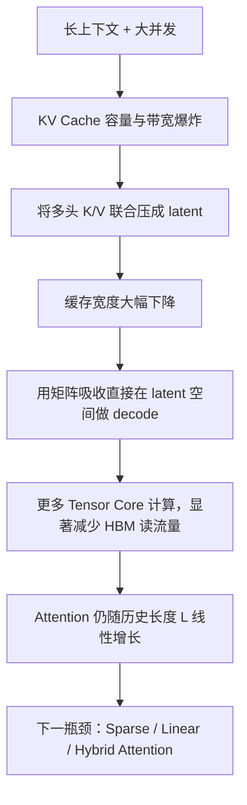

# 基础与KV表示

> 类型：专题详解。所属：[专题总览](README.md)。涉及模型版本、API 和性能数字的旧稿内容尚未逐条重新核验，见[版本与验证范围](../../版本与验证范围.md)。

<a id="read-01"></a>

<a id="0-先给结论"></a>

## 先给结论

MLA 的核心并不是“又一种减少 KV head 数量的方法”，而是把每个历史 token 原本需要保存的多头 Key/Value，联合编码成一个低维 latent：

```math
c_t^{KV}=W^{DKV}h_t
```

推理时持久缓存：

```math
\boxed{c_t^{KV}+k_t^R}
```

而不是：

```math
\boxed{K_t^{1:n_h}+V_t^{1:n_h}}
```

其中，$k_t^R$ 是单独承担 Rotary Position Embedding（RoPE，旋转位置编码）的共享位置 Key。之所以必须把它拆出来，是因为位置相关的旋转矩阵会破坏后续最关键的“矩阵吸收”。

完整的 Infra 因果链是：



一句话概括：

> **MLA 用额外、规则且适合 Tensor Core 的计算，换取更少的 KV Cache 容量、更低的 HBM 流量和更大的可服务 batch。它改变的是每个历史 token 的状态宽度，没有消除历史长度 $L$。**

这也是理解它的正确入口：MLA 首先是一次 **data movement optimization（数据搬运优化）**，其次才是一种 attention 参数化形式。

---


<a id="read-02"></a>

<a id="1-为什么标准-attention-在-decode-阶段需要-kv-cache"></a>

## 为什么标准 Attention 在 decode 阶段需要 KV Cache？

<a id="11-自回归生成中哪些量会重复使用"></a>

### 1 自回归生成中，哪些量会重复使用？

设第 $t$ 个 token 进入某层 Attention 后得到：

```math
q_t=W_Qh_t,\qquad k_t=W_Kh_t,\qquad v_t=W_Vh_t
```

生成第 $t+1$ 个 token 时，需要用新 Query 与所有历史 Key 做相关性计算：

```math
s_{t+1,j}=\frac{q_{t+1}^{\mathsf T}k_j}{\sqrt{d_h}},\qquad j\le t+1
```

再以 softmax 权重汇聚历史 Value：

```math
o_{t+1}=\sum_{j=1}^{t+1}\operatorname{softmax}(s_{t+1,:})_jv_j
```

历史 token 的 $k_j,v_j$ 在它们被生成之后就不会变化，因此没有理由每一步都从 $h_j$ 重新投影。KV Cache 就是把这些历史 Key/Value 保留下来。

它消除了重复 projection，却引入了另一种成本：

- 容量：上下文越长、并发越高，占用 HBM 越多；
- 带宽：每个 decode step 都要再次读取整段历史 KV；
- 调度：请求长度不同，KV 页分配、回收、共享和迁移变复杂；
- 通信：做 Tensor Parallel（TP）、Context Parallel（CP）或 Prefill–Decode Disaggregation（PD 分离）时，KV 可能需要复制、分片或跨节点传输。

<a id="12-为什么-decode-经常不是算不动而是喂不饱"></a>

### 2 为什么 decode 经常不是“算不动”，而是“喂不饱”？

prefill 一次处理很多 Query token，矩阵通常较大：

```math
Q\in\mathbb{R}^{L\times d},\qquad K,V\in\mathbb{R}^{L\times d}
```

同一份 K/V tile 会被多个 Query 重用，数据复用率较高。

普通单 token decode 中：

```math
Q\in\mathbb{R}^{1\times d}
```

历史 K/V 读进来后，往往只服务一个新 Query。每读一个 byte 能完成的 FLOPs 较少，Arithmetic Intensity（算术强度，FLOPs/byte）低，因此容易受 HBM bandwidth 限制。

这解释了一个看似反直觉的现象：

> GPU 的 Tensor Core 峰值很高，但单 token decode 仍可能很慢，因为时间花在从 HBM 搬历史 KV，而不是做矩阵乘法。

---


<a id="read-03"></a>

<a id="2-先把-mhamqagqamla-放在同一个坐标系里"></a>

## 先把 MHA、MQA、GQA、MLA 放在同一个坐标系里

定义：

| 符号 | 含义 |
|---|---|
| $N$ | Transformer 层数 |
| $L$ | 每个请求已缓存的 token 数 |
| $n_h$ | Query head 数 |
| $n_{kv}$ | KV head 数 |
| $d_k,d_v$ | 每个 Key/Value head 的维度 |
| $d_c$ | MLA 的 KV latent rank |
| $d_r$ | MLA 中解耦 RoPE 分支维度 |
| $b$ | 每个缓存元素字节数，例如 BF16 为 2 |

忽略 page padding、scale 与元数据后，单请求 KV Cache 近似为：

### MHA

```math
M_{\mathrm{MHA}}
=bNLn_h(d_k+d_v)
```

每个 Query head 有自己的 K/V head，表达力强，但缓存最宽。

### MQA

```math
M_{\mathrm{MQA}}
=bNL(d_k+d_v)
```

所有 Query heads 共用一组 K/V，缓存最省，但共享程度很强。

### GQA

```math
M_{\mathrm{GQA}}
=bNLn_{kv}(d_k+d_v),\qquad 1<n_{kv}<n_h
```

它在 MHA 与 MQA 之间折中，是今天大量 Dense LLM 的常见选择。

### MLA

```math
M_{\mathrm{MLA}}
=bNL(d_c+d_r)
```

MLA 只缓存联合 latent 和共享 RoPE Key。它看似也只有“一份缓存”，但不能因此说它等于 MQA：

- MQA 直接让所有 Query heads 使用同一组显式 K/V；
- MLA 保存的是一个共享 latent；
- 每个 head 仍拥有不同的 $W_i^{UK}$、$W_i^{UV}$，可以从同一 latent 解码出不同的 head-specific K/V；
- 通过矩阵吸收，decode kernel 又可以把它等价重写成 MQA-shaped computation。

因此更准确的表述是：

> **MLA 在模型语义上仍保留多头解码能力，在推理执行上可以转写成“一份 latent KV 被多 Query heads 共享”的 MQA mode。**

| 机制 | 压缩的对象 | 多头差异保留在哪里 | Cache 宽度 | 主要风险 |
|---|---|---|---:|---|
| MHA | 不压缩 | 显式 K/V heads | $n_h(d_k+d_v)$ | Cache 最大 |
| MQA | KV head 数 | Query heads | $d_k+d_v$ | KV 共享过强 |
| GQA | KV head 数 | KV groups + Query heads | $n_{kv}(d_k+d_v)$ | 质量/内存折中 |
| MLA | K/V 联合 latent rank | 每头 up-projection 与 Query | $d_c+d_r$ | 结构、内核和 RoPE 更复杂 |

DeepSeek-V2 的消融中，报告作者在相近参数量的实验设置里观察到 MHA 优于 GQA/MQA，而 MLA 同时获得更小 Cache 与更好的基准结果。这里应理解为该论文实验的结果，不应外推成“MLA 在任意模型和训练预算下必然优于 MHA”。

原论文还有一个很方便的换算。DeepSeek-V2 设置：

```math
d_c=4d_h,\qquad d_r=\frac{1}{2}d_h
```

所以 MLA 每 token、跨 $N$ 层的缓存元素数为：

```math
(d_c+d_r)N=4.5d_hN
```

而一个 GQA group 的 K+V 为：

```math
2d_hN
```

因此：

```math
\frac{4.5d_hN}{2d_hN}=2.25
```

即 DeepSeek-V2 的 MLA Cache 宽度等价于约 **2.25 个 GQA KV groups**。它同时仍保留 head-specific 的解码矩阵，这正是论文强调其能力不等于只有 2.25 个显式 KV heads 的原因。

---

---

[所属专题](README.md) · [百科总览](../../README.md)
