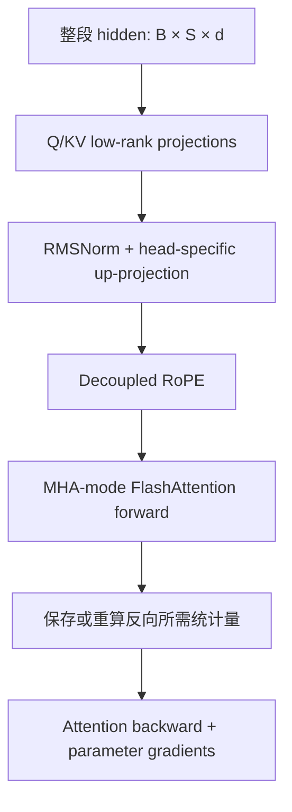
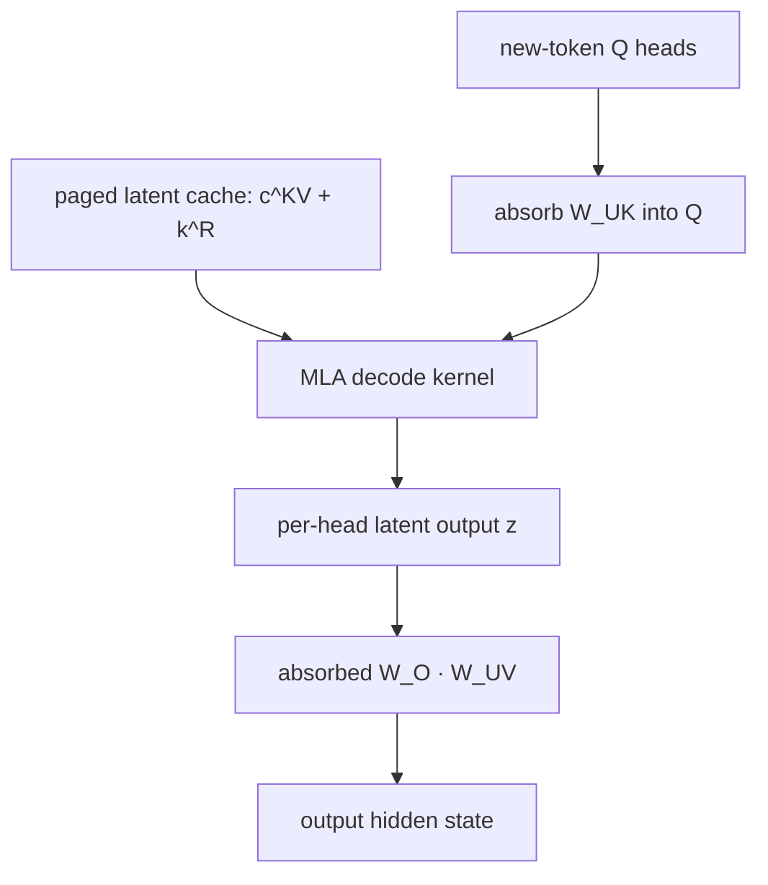

# 执行模式与容量

> 类型：专题详解。所属：[专题总览](README.md)。涉及模型版本、API 和性能数字的旧稿内容尚未逐条重新核验，见[版本与验证范围](../../版本与验证范围.md)。

<a id="read-08"></a>

<a id="7-mha-mode-与-mqa-mode同一个-mla-为什么有两套执行图"></a>

## MHA mode 与 MQA mode：同一个 MLA 为什么有两套执行图？

DeepSeek-V3.2 附录和当前 FlashMLA 文档明确区分两种 MLA 计算模式。

<a id="71-mha-mode展开-kv-再调用高效-mha"></a>

### 1 MHA mode：展开 K/V 再调用高效 MHA

本次计算先从 latent 得到：

```math
k^C=W^{UK}c^{KV},\qquad v^C=W^{UV}c^{KV}
```

再按普通多头 Attention 计算。对 DeepSeek-V3 型维度：

- `head_dim_k = 128 + 64 = 192`；
- `head_dim_v = 128`；
- heads = 128。

优点：

- head dimension 较小；
- prefill 有很多 Query，展开成本可以被摊薄；
- 能直接利用高度成熟的 FlashAttention MHA kernel；
- training/prefill 的大矩阵形态更容易得到高 Tensor Core 利用率。

缺点：若对历史 Cache 每步都展开完整 K/V，会把 MLA 的 decode 优势抵消。因此 MHA mode 更适合训练和 prefill，而不是长历史单 token decode。

<a id="72-mqa-mode在-latent-空间直接做-attention"></a>

### 2 MQA mode：在 latent 空间直接做 Attention

吸收后：

- `head_dim_k = d_c + d_r = 576`；
- `head_dim_v = d_c = 512`；
- 只有一份共享 latent KV；
- 128 个 Query heads 读取同一份历史 latent。

优点：

- 不展开所有历史 K/V；
- 历史 Cache 读流量大幅下降；
- 对长 context decode 尤其有利。

代价：

- core attention 的 K/V 维度从 192/128 变成 576/512；
- 计算 FLOPs 明显增加；
- 每个 head 的 latent output 很宽，register pressure 很大；
- 需要专门 kernel，而不是把标准 MQA kernel 原样套上去。

| 阶段 | 常见模式 | 为什么 |
|---|---|---|
| Training | MHA mode | 多 Query、大 GEMM；反向传播与现有 FA kernel 更成熟 |
| Prefill | MHA mode | 展开一次并处理整段 Query，计算利用率高 |
| Decode | MQA mode | 避免每一步展开/读取完整历史多头 K/V |
| 短序列或特殊硬件 | 动态选择 | 启动开销、shape、带宽/算力比可能改变最优点 |

这不是两种不同模型，而是同一组权重在结合律下的两种等价执行计划，类似数据库优化器为同一个查询选择不同 physical plan。

---


<a id="read-09"></a>

<a id="8-trainingprefilldecode-三条完整数据流"></a>

## Training、Prefill、Decode 三条完整数据流

<a id="81-training"></a>

### 1 Training



训练没有跨请求生命周期的“持久 KV Cache”，但仍有 activation memory。Query/KV low-rank bottleneck、FlashAttention 的不落地 attention matrix、activation checkpointing/recomputation 是三种不同层面的节省：

- low-rank：减少特定投影路径的中间激活宽度；
- FlashAttention：不把完整 $S\times S$ attention matrix 写入 HBM；
- recomputation：反向时重做部分前向，少保存 activation。

不能把这三者都笼统称为“KV Cache 优化”。

<a id="82-prefill"></a>

### 2 Prefill

prefill 接收一段 prompt，一次产生很多 Query/KV token：

1. 计算 $c^{KV}$ 与 $k^R$；
2. 将 $c^{KV}+k^R$ 写入分页 latent cache，供未来 decode；
3. 在本次 prefill 内临时展开 $k^C,v^C$；
4. 以 MHA mode 调用 FlashAttention；
5. 临时展开量在该层计算完成后即可释放。

核心点是：

> **使用 MHA mode 做 prefill，不等于把完整 MHA K/V 永久写入 Cache。持久状态仍可以是 compressed latent。**

<a id="83-decode"></a>

### 3 Decode

每个 decode step：

1. 新 token 生成 $c_t^{KV}$ 与 $k_t^R$，追加到 cache；
2. 生成每个 head 的 $q_{t,i}^C,q_{t,i}^R$；
3. 对 $q^C$ 做 Key-side absorption，得到 $\widetilde q^C$；
4. 读取历史 $[c_j^{KV};k_j^R]$；
5. 用 online softmax 分块计算 score；
6. 在 latent Value 空间累计 $z_{t,i}$；
7. 通过 absorbed output projection 返回 hidden state。



---


<a id="read-10"></a>

<a id="9-kv-cache-账本mla-到底省了多少"></a>

## KV Cache 账本：MLA 到底省了多少？

<a id="91-通用公式"></a>

### 1 通用公式

对一批不同长度的请求 $L_1,\ldots,L_B$：

```math
M_{\mathrm{MLA}}
=bN(d_c+d_r)\sum_{r=1}^{B}L_r
```

真实系统还要加：

```math
M_{real}=M_{payload}+M_{page\ padding}+M_{scales}+M_{metadata}+M_{workspace}
```

其中：

- `page padding`：每个请求最后一页未填满的空间；
- `scales`：FP8/INT8 KV quantization 的 scale；
- `metadata`：block table、sequence length、slot mapping 等；
- `workspace`：split-KV partial outputs、LSE、scheduler metadata 等临时区。

<a id="92-deepseek-v3-维度的-bf16-示例"></a>

### 2 DeepSeek-V3 维度的 BF16 示例

使用：

```math
N=61,\quad d_c=512,\quad d_r=64,\quad b=2
```

每 token、每 layer：

```math
(512+64)\times2=1152\ \text{bytes}
```

每 token、跨 61 层：

```math
1152\times61=70{,}272\ \text{bytes}
\approx68.625\ \text{KiB}
```

单个 128K-token 请求：

```math
70{,}272\times131{,}072
\approx8.58\ \text{GiB}
```

这仍然不是一个“小数字”，但比完整多头 Cache 小得多。

为了说明口径差异，可以使用两种 MHA baseline：

| 口径 | 每 token 每层元素数 | 128K × 61 层 BF16 |
|---|---:|---:|
| MLA | $512+64=576$ | 8.58 GiB |
| 论文传统 MHA 口径：$2n_hd_h$，$d_h=128$ | 32,768 | 488 GiB |
| 与 MLA QK/V 形状完全对齐：$n_h(192+128)$ | 40,960 | 610 GiB |

相应理论宽度比约为：

```math
\frac{32768}{576}\approx56.9\times
```

或在形状对齐口径下：

```math
\frac{40960}{576}\approx71.1\times
```

为什么 DeepSeek-V2 摘要写的是 “KV Cache 减少 93.3%”，而这里理论宽度能减少 98% 以上？因为二者不是同一个比较口径：前者是论文针对具体模型/基线的系统级报告数字，后者是固定本专题假设后的纯 payload 维度比。严谨分析必须同时写清 baseline、层数、head 维度、精度和是否包含系统开销。

<a id="93-平均-5k-context-的量级"></a>

### 3 平均 5K context 的量级

若单请求平均缓存约 5,000 tokens，则仅 MLA BF16 payload：

```math
68.625\ \text{KiB/token}\times5000
\approx335\ \text{MiB/request}
```

这直接决定单卡能维持多少 decode sequences。MLA 节省出的 HBM 不只是“能放更长的单请求”，更常被用来增加并发 batch，从而把权重读取和 MoE expert GEMM 摊到更多 token 上。

<a id="94-fp8-latent-cache"></a>

### 4 FP8 latent cache

FlashMLA 当前文档给出一种每 token 656 bytes 的 FP8 Cache layout：

| 区域 | 大小 | 内容 |
|---|---:|---|
| NoPE latent | 512 B | 512 个 FP8 E4M3 值 |
| scales | 16 B | 每 128 维一个 FP32 scale，共 4 个 |
| RoPE | 128 B | 64 个 BF16 值，不量化 |
| 合计 | 656 B | 每 token 每 layer |

相比全 BF16 的 1152 B：

```math
1-\frac{656}{1152}\approx43.1\%
```

额外 payload reduction。

保留 RoPE 分支为 BF16 是一个很典型的 selective precision policy：容量大头的 512 维 content latent 使用 FP8，而只有 64 维、对位置打分敏感的部分保持 BF16。

<a id="95-各维度不是随便设的一张设计旋钮表"></a>

### 5 各维度不是随便设的：一张设计旋钮表

| 设计量 | 增大后可能获得什么 | 增大后付出什么 | 主要影响阶段 |
|---|---|---|---|
| $d_c$：KV latent rank | 更强的联合 K/V 表达容量 | Cache、PD 传输、MQA-mode QK/PV FLOPs、register 压力都增加 | 全部，尤其 decode |
| $d_r$：RoPE dim | 更大的相对位置信号子空间 | 不可吸收 Cache 增大；QK FLOPs 增加 | 长上下文 |
| $d_c'$：Query rank | Query projection 容量 | 参数、projection FLOPs 与训练 activation 增加 | training/prefill |
| $d_{nope}$ | 每个 head 的 content matching 容量 | MHA-mode QK FLOPs、$W^{UK}$ 参数增加 | training/prefill |
| $d_v$ | 每个 head 的 value/output 容量 | MHA-mode PV、$W^{UV}$ 与 $W^O$ 成本增加 | 全部 |
| $n_h$ | 更多 attention subspaces；MQA mode 复用 latent 的次数增加 | Query/output 参数与 core attention FLOPs 增加 | 全部 |

这些维度还会受 kernel tile 约束。64、128、512、576 之类的数字不仅是模型表达力选择，也与 Tensor Core tile、TMA copy 粒度、vectorized load、register layout 和并行切分有关。

因此 MLA 的 rank 搜索不能只看 validation loss，也不能只看理论 Cache：

```math
\text{目标函数}
\mathrel{=}
\text{quality}
+\lambda_1\text{HBM bytes}
+\lambda_2\text{decode latency}
+\lambda_3\text{prefill FLOPs}
+\lambda_4\text{kernel realizability}
```

最后一项非常重要：一个纸面上更小的奇怪 rank，如果导致 Tensor Core padding、大量尾块或没有成熟 kernel，端到端可能反而更差。

---

---

[所属专题](README.md) · [百科总览](../../README.md)
