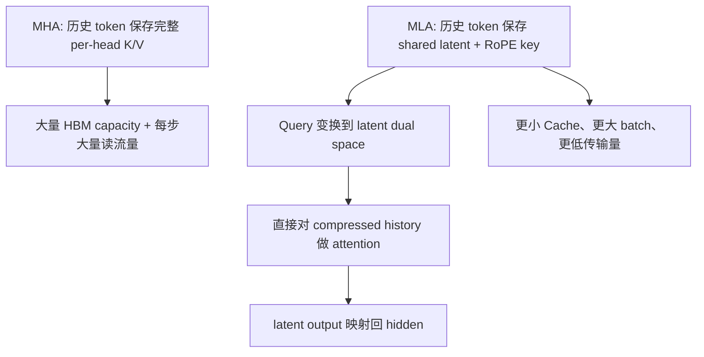

# 边界验证与资料

> 类型：专题详解。所属：[专题总览](README.md)。涉及模型版本、API 和性能数字的旧稿内容尚未逐条重新核验，见[版本与验证范围](../../版本与验证范围.md)。

<a id="read-18"></a>

<a id="17-mla-的收益边界与新瓶颈"></a>

## MLA 的收益边界与新瓶颈

<a id="171-它解决了什么"></a>

### 1 它解决了什么？

| 问题 | MLA 的作用 |
|---|---|
| KV Cache HBM 容量 | 将每 token 多头 K/V 压成固定 latent + 小 RoPE key |
| decode HBM 流量 | 每步读取更窄的历史状态 |
| 可服务 batch | 同样 HBM 容纳更多请求，通常有利于吞吐 |
| PD Cache transfer | 降低 prefill→decode 的状态传输 payload |
| Prefix Cache capacity | 相同空间能保留更多前缀 token |
| 多头质量损失 | 用 head-specific 解码矩阵保留比直接共享 KV 更丰富的表达 |

<a id="172-它没有解决什么"></a>

### 2 它没有解决什么？

| 问题 | 原因 |
|---|---|
| prefill 的 $O(L^2)$ interactions | dense Attention 仍计算 Query 与历史 token 的全连接 |
| decode 的 $O(L)$ 扫描 | 每生成一个 token 仍需扫描全部历史 latent |
| 单请求无限长 | Cache 仍按 $O(L)$ 增长，只是常数更小 |
| exact retrieval 的计算量 | 仍需对所有历史位置打分，除非叠加 Sparse Attention |
| MoE All-to-All | Attention Cache 与 expert dispatch 是两条独立瓶颈 |
| kernel 通用性 | 特殊维度、RoPE 拆分、吸收和 ragged pages 需要专门 backend |

<a id="173-瓶颈如何迁移"></a>

### 3 瓶颈如何迁移？

MLA 之前：

```math
\boxed{KV\ capacity+HBM\ bandwidth}
```

MLA 之后，缓存宽度下降，但：

```math
\boxed{history\ length\ L}
```

仍存在；MQA-mode core attention 甚至可能转向 compute-bound。于是下一代结构继续处理：

- Sparse Attention：只与 Top-K 历史 token 精确交互；
- Linear/Recurrent Attention：把历史压入固定大小 state；
- Hybrid Attention：用 recurrent state 承担长期摘要，用 sparse/full attention 做精确召回；
- KV quantization/offload：继续降低每 token byte 或把冷 Cache 放到更低层存储。

所以正确的演化关系是：

```math
\text{MHA}
\rightarrow
\text{MLA: reduce bytes/token}
\rightarrow
\text{Sparse/Linear: reduce tokens scanned}
```

---


<a id="read-19"></a>

<a id="18-mla-与相邻技术的区别"></a>

## MLA 与相邻技术的区别

| 技术 | 主要压缩哪一维 | 是否保留所有历史 token | 是否改变 attention interaction 数 | 主要收益 |
|---|---|---|---|---|
| GQA/MQA | KV head 数 | 是 | 否 | 更小 KV Cache |
| MLA | 每 token KV 表示宽度 | 是 | 否 | 更小 Cache/带宽，较强多头表达 |
| KV quantization | 每元素 bit 数 | 是 | 否 | 容量与带宽继续下降 |
| Sliding Window | 可见历史范围 | 否 | 是 | 固定局部窗口成本 |
| Sparse Attention | 被选中的历史位置数 | 通常 Cache 仍保留 | 是 | 从 $L$ 降到 $K$ 次精确交互 |
| Linear Attention | 历史表示方式 | 通常不保留全部显式 KV | 是 | sequence state 近似 $O(1)$ |
| PagedAttention | 物理内存分配方式 | 是 | 否 | 降低碎片、支持动态 batching |
| Prefix Caching | 跨请求重复前缀 | 是，共享 pages | 否 | 避免重复 prefill 与重复存储 |

最容易混淆的两组概念：

1. **MLA vs PagedAttention**：前者改变每个 token 存什么，后者改变这些 token records 如何分配物理内存；
2. **MLA vs Sparse Attention**：前者缩窄每个历史 token，后者减少每个 Query 实际访问多少历史 token。

它们是正交、可组合的。

---


<a id="read-20"></a>

<a id="19-常见误区"></a>

## 常见误区

### 误区 1：MLA 就是对 KV Cache 做压缩算法

不准确。它是模型训练时就确定的 attention parameterization；latent 是端到端学习出来的。推理后处理压缩属于另一类技术。

### 误区 2：decode 时要把所有历史 latent 还原成 K/V

naive 路径会这么做，但矩阵吸收正是为了避免它。生产 decode 通常在 latent 空间执行 MQA mode。

### 误区 3：MLA 把 Attention 复杂度从 $O(L^2)$ 变成 $O(L)$

错误。dense prefill 仍是 $O(L^2)$；单 token decode 本来就是 $O(L)$，MLA 主要降低其中的状态宽度和字节常数。

### 误区 4：Cache 只剩 512 维

不完整。DeepSeek-V2/V3 型 MLA 还要缓存 64 维 decoupled RoPE key，因此 BF16 dense MLA 常见逻辑宽度是 576。

### 误区 5：MLA 与 MQA 完全相同

模型表达结构不同；只是矩阵吸收后的 decode physical plan 呈现 MQA shape。

### 误区 6：Query low-rank 能减少 decode KV Cache

不能。Query 不作为历史 KV 保存。它主要影响参数、projection 和训练 activation。

### 误区 7：KV Cache 减少 50×，吞吐就一定增加 50×

端到端速度还受权重读取、MoE、网络、sampling、batch、scheduler、kernel efficiency 和 TTFT/TPOT 目标约束。容量比、带宽比和吞吐比不能互换。

### 误区 8：TP 可以天然把 MLA Cache 均匀切开

常规 head-parallel TP 会切 Query heads，但共享 latent stream 可能复制。要切 Cache 往往需要 sequence/context parallel 或专门布局。

---


<a id="read-21"></a>

<a id="20-profiling如何判断-mla-真的帮到了你的服务"></a>

## Profiling：如何判断 MLA 真的帮到了你的服务？

<a id="201-先分阶段"></a>

### 1 先分阶段

不要只看总 tokens/s。至少分开：

- TTFT（Time To First Token）：主要受排队与 prefill 影响；
- TPOT（Time Per Output Token）：主要受 decode 影响；
- prefill tokens/s；
- decode tokens/s；
- average/max cache length；
- active sequences / batch size。

<a id="202-cache-账本"></a>

### 2 Cache 账本

记录：

- 每 token 每 layer 的实际 bytes；
- page size 与最后一页碎片；
- Cache dtype 与 scale overhead；
- prefix cache hit rate；
- GPU/CPU/offload 各层的 cache occupancy；
- OOM 前最大并发，而不只是最大单序列长度。

<a id="203-kernel-账本"></a>

### 3 Kernel 账本

用 profiler 观察：

- HBM throughput 是否接近硬件可达上限；
- Tensor Core utilization；
- achieved occupancy 与 register usage；
- split-KV 数量；
- combine kernel 占比；
- kernel launch gaps；
- ragged request 尾部是否导致 SM 空闲；
- prefill 是否误走 decode backend，反之亦然。

<a id="204-系统账本"></a>

### 4 系统账本

还要检查：

- TP 后本地 Query heads 是否过少；
- DP instances 之间 cache/request 是否失衡；
- PD transfer 是否真的因 latent cache 缩小；
- MoE All-to-All 是否已经成为主瓶颈；
- batch 增大后 expert token 数是否改善 Grouped GEMM；
- MTP 使 $s_q$ 增大后，MLA kernel 是否从带宽瓶颈跨到计算瓶颈。

一个可靠的结论应该长这样：

> 在固定模型、请求长度分布、精度和 SLO 下，MLA backend 将每请求 Cache 从 X 降至 Y，使稳定 active sequences 从 A 增至 B；decode TPOT 从 C 降至 D。Nsight 指标显示瓶颈由 HBM throughput 转向 Tensor Core/其他模块。

而不是只说：

> MLA 理论 Cache 小，所以一定更快。

---


<a id="read-22"></a>

<a id="21-实现与排障清单"></a>

## 实现与排障清单

### 正确性

- [ ] NoPE 与 RoPE 维度切分顺序一致；
- [ ] $k^R$ 在 heads 间共享，broadcast 方向正确；
- [ ] RoPE position offset 与 paged slot 一致；
- [ ] absorbed 与 naive 路径输出在合理容差内一致；
- [ ] softmax scale 使用完整 QK 打分维度并考虑长上下文 scaling；
- [ ] causal mask、chunked prefill、prefix sharing 边界正确；
- [ ] FP8 scale 分组、存储布局和 dequant 一致。

### 性能

- [ ] prefill/decode 分别选择适合的 physical plan；
- [ ] 没有在 decode 中显式重建全部历史 K/V；
- [ ] 没有落地 $B\times H\times Q\times L$ score matrix；
- [ ] Cache 是 paged/ragged-aware，而不是为最大长度预分配大矩形；
- [ ] split-KV 不过少也不过多；
- [ ] TP 没有把本地 Query heads 切得过碎；
- [ ] absorbed weights 在量化/权重更新后正确刷新；
- [ ] profiler 中不存在 projection 与 core attention 之间的大 launch gap。

### 容量

- [ ] payload 计算包含所有 layers；
- [ ] 计算包含 RoPE cache，不只算 latent rank；
- [ ] 计算包含 quant scales、page padding、metadata 与 workspace；
- [ ] 区分模型 weights、CUDA graph pools、activations 与 KV Cache；
- [ ] 以真实请求长度分布评估，而不只用 max context。

---


<a id="read-23"></a>

<a id="22-faq"></a>

## FAQ

### Q1：为什么 latent rank 512 比单头 128 还大，仍叫“压缩”？

因为 baseline 是所有 heads 的 K/V 总宽度，不是单头。128 heads 的显式 K/V 是数万维，而 512+64 是每 token 全部 heads 共用的缓存宽度。

### Q2：共享一个 latent 会不会像 MQA 一样损失多头能力？

共享 latent 是一个信息瓶颈，确实可能有容量风险；但每个 head 通过不同 $W_i^{UK},W_i^{UV}$ 解码，表达力强于直接共享一组显式 K/V。最终质量取决于 rank、训练预算和模型整体设计。

### Q3：为什么 Value 也能用同一个 latent？

因为 $W^{UV}$ 可以从联合 latent 中学习恢复 Value 所需特征。联合 bottleneck 迫使 Key 匹配信息与 Value 内容信息共享基础表征，但之后仍走不同 up-projection。

### Q4：为什么不把 RoPE key 也压进 latent？

位置相关旋转会阻断 Key-side matrix absorption。把小 RoPE 分支单独缓存，用少量额外 bytes 保住可吸收性，是整体更优的折中。

### Q5：MLA 对短上下文也一定更快吗？

不一定。短序列时 Cache 流量不是主导，专用 kernel 启动、宽 latent compute 和 projection overhead 可能抵消收益，所以 runtime 需要按阶段、硬件和 shape 选择 backend。

### Q6：为什么 FlashMLA decode 能是 compute-bound？decode 不都 memory-bound 吗？

因为共享的 576 维 latent K/V 会被大量 Query heads 重用。每读一份 Cache byte，执行约 $h_q$ 份 head-wise 计算，算术强度随本地 head 数增长。

### Q7：MLA 能和 Sparse Attention 组合吗？

能。MLA 缩小每个历史 token 的 KV record，Sparse Attention 减少每个 Query 实际访问的历史 token 数。DeepSeek-V3.2 的 DSA 正是在 MLA 上继续做 token-level sparse selection。

### Q8：为什么现实引擎有很多 MLA backends？

因为 prefill/decode、Dense/Sparse、BF16/FP8、Hopper/Blackwell/ROCm、page size、head dims、DCP 支持各不相同。算法名字相同，不代表最佳 kernel schedule 相同。

---


<a id="read-24"></a>

<a id="23-最终心智模型"></a>

## 最终心智模型

可以把标准 MHA 理解为：每个历史 token 在 HBM 中保存一大排“已经解码好的多头档案”。

MLA 改成：每个历史 token 只保存一份“压缩档案”和一个小的位置索引。当前 Query 到来后，不是把所有历史档案全部解压，而是把自己的查询算子换一个基底，直接在压缩档案上检索；检索得到的 latent 结果再通过吸收后的输出矩阵回到 hidden space。



最值得记住的四句话：

1. **MLA 压的是每个 token 的 KV 表示宽度，不是 sequence length。**
2. **Decoupled RoPE 的核心目的，是保住矩阵吸收。**
3. **MHA mode 与 MQA mode 是同一 MLA 的两种物理执行计划：前者适合训练/prefill，后者适合 decode。**
4. **MLA 把瓶颈从 HBM data movement 推向 Tensor Core compute、kernel scheduling，以及最终仍未消失的历史长度 $L$。**

---


<a id="read-25"></a>

<a id="24-参考资料与阅读顺序"></a>

## 参考资料与阅读顺序

### 第一层：先读模型结构

1. [DeepSeek-V2 Technical Report](https://arxiv.org/abs/2405.04434)\
   重点：§2.1、Appendix C、Appendix D。MLA 的原始完整公式、Decoupled RoPE、Cache 对比与消融。

2. [DeepSeek-V3 Technical Report](https://arxiv.org/abs/2412.19437)\
   重点：V3 延续 MLA；模型配置、latent 后 RMSNorm/scale 与整体训练/系统背景。

3. [DeepSeek-V3 官方参考推理实现：`inference/model.py`](https://github.com/deepseek-ai/DeepSeek-V3/blob/main/inference/model.py)\
   重点：`attn_impl = "naive" / "absorb"` 两条路径、实际 cache tensor、Query/NoPE/RoPE 切分。

4. [DeepSeek-V3-Base `config.json`](https://huggingface.co/deepseek-ai/DeepSeek-V3-Base/blob/main/config.json)\
   重点：`kv_lora_rank=512`、`q_lora_rank=1536`、`qk_nope_head_dim=128`、`qk_rope_head_dim=64`、`v_head_dim=128`。

### 第二层：再读 kernel

5. [FlashMLA 官方仓库](https://github.com/deepseek-ai/FlashMLA)\
   重点：dense/sparse、prefill/decode 支持矩阵、MHA/MQA mode、paged cache 接口与 FP8 Cache layout。

6. [A Deep-Dive Into the New Flash MLA Kernel](https://github.com/deepseek-ai/FlashMLA/blob/main/docs/20250422-new-kernel-deep-dive.md)\
   重点：Roofline、seesaw scheduling、TMA–GEMM pipeline、split-KV 与 tile scheduler。

7. [DeepSeek-V3.2 Technical Report](https://arxiv.org/abs/2512.02556)\
   重点：Appendix A 的 MLA MHA/MQA modes；Sparse MLA 留到 `Sparse-Attention.md` 展开。

### 第三层：最后读 serving/runtime

8. [DeepSeek-V3/R1 Inference System Overview](https://github.com/deepseek-ai/open-infra-index/blob/main/202502OpenSourceWeek/day_6_one_more_thing_deepseekV3R1_inference_system_overview.md)\
   重点：PD 分离、MLA DP + routed-expert EP、通信计算重叠、KV/request load balance。

9. [vLLM Attention Backend Feature Support](https://docs.vllm.ai/en/stable/design/attention_backends/)\
   重点：MLA 分离选择 prefill/decode backend，以及不同硬件、dtype、page size、Dense/Sparse 能力矩阵。该页面随版本变化，部署前应以当前版本为准。

---


<a id="read-26"></a>

<a id="25-与后续专题的接口"></a>

## 与后续专题的接口

本专题停在：

```math
\text{MLA 降低 bytes/token，但仍扫描 }L\text{ 个 token}
```

下一篇 `Sparse-Attention.md` 应从这里接上，重点回答：

- 如何从 $L$ 个历史位置中选择 Top-K；
- Indexer 自己为什么会成为新瓶颈；
- prefill 与 decode 的 sparse layout 为什么不同；
- token sparse、block sparse、sliding window、sink token 如何组合；
- Sparse MLA 如何与 paged latent cache、FP8、continuous batching 协同；
- 为什么最终又会走向 Sparse + Linear Hybrid。

---

[所属专题](README.md) · [百科总览](../../README.md)
