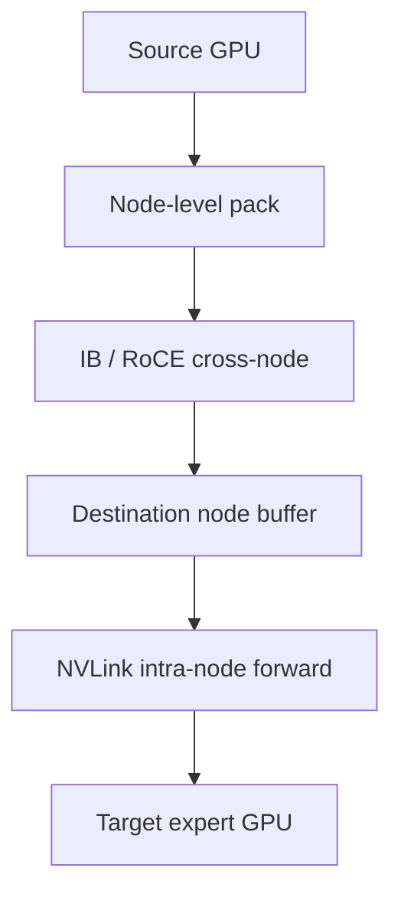

# 专家并行与通信

> 类型：专题详解。所属：[专题总览](README.md)。涉及模型版本、API 和性能数字的旧稿内容尚未逐条重新核验，见[版本与验证范围](../../版本与验证范围.md)。

<a id="read-40"></a>

<a id="19-expert-parallelism为什么-moe-通常不能只用-tensor-parallel"></a>

## Expert Parallelism：为什么 MoE 通常不能只用 Tensor Parallel？

如果总 expert 权重太大，无法在每张 GPU 上复制，就把 experts 分到不同 rank：

```math
\mathcal{E}
=\mathcal{E}_0\cup\mathcal{E}_1\cup\cdots\cup\mathcal{E}_{R-1}.
```

rank $r$ 只保存 $\mathcal{E}_r$。

这就是 EP。

TP 是把一个 expert 的矩阵切开；EP 是把不同 experts 分开：

| 并行方式 | 切分对象 | 典型通信 |
|---|---|---|
| DP | 样本 / batch | gradient All-Reduce / Reduce-Scatter |
| TP | 单层权重和 activation channel | All-Reduce、Reduce-Scatter、All-Gather |
| EP | expert bank | token All-to-All dispatch/combine |
| PP | layer | stage 间 P2P activation |
| CP | sequence | Attention 所需 KV/partial result 通信 |

大模型通常组合：

```math
N_{GPU}
=DP\times PP\times TP\times CP\times EP
```

但这些维度不一定完全独立相乘；实现会复用 rank 维度或形成嵌套 process groups，必须以框架的 group construction 为准。

---


<a id="read-41"></a>

<a id="20-ep-之后为什么出现-all-to-all"></a>

## EP 之后为什么出现 All-to-All？

假设 token 最初位于其 DP/TP rank，但 Router 选中的 expert 可能在任意 EP rank。

每个源 rank 都有一组不同目的地的数据：

```math
X_{r\rightarrow0},X_{r\rightarrow1},\ldots,X_{r\rightarrow R-1}.
```

Dispatch 要完成：

```math
\forall r,j:\quad
X_{r\rightarrow j}
\text{ 从 rank }r
\text{ 发送到 rank }j.
```

这正是 All-to-All/All-to-All-v，而不是 All-Reduce。

Expert 计算完成后，输出还要沿相反关系返回原 token rank，即 Combine。

所以 MoE 前向至少有两个方向：

```math
\text{Dispatch A2A}
\rightarrow
\text{Expert Compute}
\rightarrow
\text{Combine A2A}.
```

反向传播还会重复相应的数据交换。

---


<a id="read-42"></a>

<a id="21-moe-通信量的第一阶成本模型"></a>

## MoE 通信量的第一阶成本模型

设：

- 本 rank 原始 token 数 $T_r$；
- Top-K 为 $K$；
- hidden size 为 $d$；
- activation 每元素 $b$ bytes；
- assignment 远程比例为 $p_{remote}$。

仅计算主 activation，不含 scale、expert id、offset、padding：

```math
B_{\text{dispatch}}
\approx T_rKdbp_{remote}.
```

Combine 同量级：

```math
B_{\text{combine}}
\approx T_rKdbp_{remote}.
```

因此前向主流量近似：

```math
B_{\text{forward}}
\approx2T_rKdbp_{remote}.
```

如果 experts 均匀分布且每 rank 保存 $1/R$ experts，粗略有：

```math
p_{remote}\approx1-\frac1R.
```

这揭示出几个事实：

1. EP 越大，远程比例越接近 1；
2. Top-K 直接线性放大通信；
3. hidden size 决定每 assignment payload；
4. activation FP8 可近似减半 byte，但 scale/metadata 和转化也有成本；
5. 通信量不等于通信时间，消息粒度、拥塞、拓扑和 SM 占用同样重要。

---


<a id="read-43"></a>

<a id="22-all-to-all-为什么比-all-reduce-更难优化"></a>

## All-to-All 为什么比 All-Reduce 更难优化？

All-Reduce 的每个 rank 通常发送相同 shape 的 tensor，通信模式规则。

MoE All-to-All-v 则具有：

- 每个 source-destination pair 数据量不同；
- 每层、每步都可能变化；
- 小消息多；
- 同时跨 NVLink、PCIe、IB/RoCE；
- 最慢 pair 或拥塞路径拖累整体；
- token 顺序和 metadata 必须可逆；
- 通信前需要 count、prefix sum 和 buffer planning。

因此带宽峰值不是充分指标。实际时间近似：

```math
T_{comm}
\approx
T_{setup}
+T_{metadata}
+\max_{links}\frac{B_{link}}{BW_{effective}}
+T_{sync}.
```

小 batch decode 中，$T_{setup}$ 和 RTT 可能比 payload 传输更重要；大 batch prefill/training 中，有效带宽和拥塞更重要。

---


<a id="read-44"></a>

<a id="23-拓扑感知nvlink-很快但跨节点-token-仍要经过网络"></a>

## 拓扑感知：NVLink 很快，但跨节点 token 仍要经过网络

一个典型 8-GPU 节点：

- GPU 间通过 NVLink/NVSwitch；
- 节点间通过 IB 或 RoCE；
- NIC 与 GPU 通过 PCIe、GPUDirect RDMA 等路径连接。

如果逻辑 All-to-All 完全忽略物理拓扑，会产生：

- 同一个 token 多次跨节点；
- NIC rail 不均衡；
- 节点内转发与跨节点流量互相干扰；
- 某些 GPU 到 NIC 的路径更长；
- 多种 collective 争用同一网络。

DeepSeek-V3 的实现将跨节点与节点内转发分层：先利用 IB 完成节点间传输，再利用 NVLink 在节点内送到具体 GPU，并通过 node-limited routing 限制一个 token 涉及的节点数量。



这不是固定协议；不同 NVLink domain、NIC 数量和 backend 会选择不同 hierarchy。

---


<a id="read-45"></a>

<a id="24-node-limited--group-limited-routing"></a>

## Node-Limited / Group-Limited Routing

如果 Top-$K$ experts 分散在很多节点，一个 token 会产生广泛 fan-out。可以先把 experts 分组，例如一组对应一个节点或一个拓扑域：

1. 计算每组的代表分数；
2. 先选少数 groups；
3. 只在这些 groups 内选 Top-$K$ experts。

这样约束：

```math
N_{remote\ nodes\ per\ token}\leq G_{top}.
```

收益：

- 减少跨节点目标数量；
- 聚合更大消息；
- 提高 locality；
- 让通信更容易重叠。

代价：

- Router 搜索空间受拓扑约束；
- 最相关 experts 可能位于未选 group；
- group placement 会影响模型质量与负载；
- 硬件拓扑变更可能要求重新设计 expert mapping。

这体现了典型 Model–System Co-design：路由规则开始感知集群拓扑。

---


<a id="read-46"></a>

<a id="25-token-permutation一个经常被低估的-hbm-成本"></a>

## Token permutation：一个经常被低估的 HBM 成本

在 dispatch 前，需要把原始 token-major layout：

```math
[t_0,t_1,t_2,\ldots]
```

重排为 expert-major layout：

```math
[X_0;X_1;\ldots;X_{E-1}].
```

典型步骤：

1. histogram：统计每 expert count；
2. prefix sum：计算每 expert buffer offset；
3. scatter：把 token copy 到目标位置；
4. 保存 inverse map；
5. combine 后 gather/unpermute。

如果 Top-K 大于 1，同一 token 会被 scatter 多次。

Permutation 常受 HBM bandwidth 和随机访存限制，且中间 tensor 可能包括：

- permuted activation；
- expert ids；
- gate weights；
- source rank；
- local offset；
- send/recv counts；
- inverse permutation index。

因此高性能实现会考虑：

- fused count + prefix metadata；
- fused permute + quantize；
- zero-copy communication buffer；
- combine + dequantize + weighted reduction；
- 预分配 workspace，避免每层 allocator 同步。

---

---

[所属专题](README.md) · [百科总览](../../README.md)
