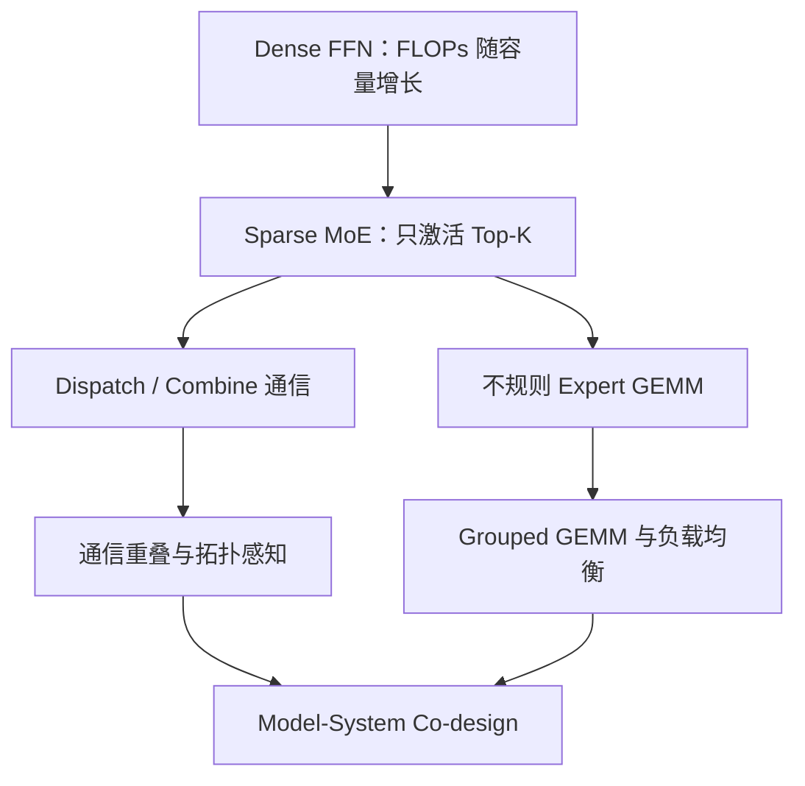
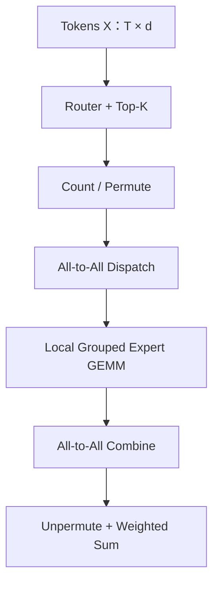

# 条件计算与数据流

> 类型：专题详解。所属：[专题总览](README.md)。涉及模型版本、API 和性能数字的旧稿内容尚未逐条重新核验，见[版本与验证范围](../../版本与验证范围.md)。

<a id="read-01"></a>

## 缩写与术语

| 缩写 | 全称 | 中文解释 |
|---|---|---|
| MoE | Mixture of Experts | 混合专家；由 Router 为输入选择少量 Expert |
| FFN / MLP | Feed-Forward Network / Multi-Layer Perceptron | Transformer 中逐 token 的前馈网络 |
| Router / Gate | Routing Network / Gating Network | 计算 token 与专家匹配分数并选择专家的模块 |
| EP | Expert Parallelism | 专家并行；不同设备保存不同专家 |
| DP | Data Parallelism | 数据并行；不同副本处理不同数据 |
| TP | Tensor Parallelism | 张量并行；把一个算子内部张量切到多设备 |
| PP / VP | Pipeline / Virtual Pipeline Parallelism | 流水线并行 / 虚拟流水段 |
| CP / SP | Context / Sequence Parallelism | 上下文并行 / 序列并行 |
| A2A | All-to-All | 全互换通信；每个 rank 都可能向其他 rank 发送不同数据 |
| P2P | Point-to-Point | 点对点通信 |
| GEMM | General Matrix Multiplication | 通用矩阵乘法 |
| Grouped GEMM | Grouped General Matrix Multiplication | 一次调度一组形状可不同的 GEMM |
| SM | Streaming Multiprocessor | NVIDIA GPU 的流式多处理器 |
| CTA | Cooperative Thread Array | CUDA thread block 在硬件调度语境中的名称 |
| HBM | High Bandwidth Memory | GPU 高带宽显存 |
| RDMA | Remote Direct Memory Access | 远程直接内存访问 |
| IB / RoCE | InfiniBand / RDMA over Converged Ethernet | 常见跨节点高性能网络 |
| NVLink / NVSwitch | NVIDIA GPU 高速互联 / 交换芯片 | 节点内或大 NVLink 域中的 GPU 互联 |
| IBGDA | InfiniBand GPU Direct Async | GPU 发起和推进网络通信的技术路径 |
| EPLB | Expert Parallel Load Balancing | Serving 中通过专家重排或副本均衡 EP rank 负载 |
| SLO | Service-Level Objective | 服务延迟、可用性等目标 |
| TTFT | Time To First Token | 首 token 延迟 |
| TPOT / ITL | Time Per Output Token / Inter-Token Latency | 每输出 token 时间 / token 间延迟 |
| MFU | Model FLOPs Utilization | 模型有效 FLOPs 相对硬件峰值的利用率 |
| FP8 / NVFP4 / MXFP8 | 低精度浮点格式 | 用更少 byte 和更高 Tensor Core 吞吐完成计算 |
| CDF / CV | Cumulative Distribution Function / Coefficient of Variation | 累积分布函数 / 变异系数，用于描述负载分布 |
| MTP | Multi-Token Prediction | 多 token 预测，可辅助模型训练和推测解码 |

---


<a id="read-02"></a>

<a id="0-先给结论moe-不是免费增加参数而是一次瓶颈迁移"></a>

## 先给结论：MoE 不是“免费增加参数”，而是一次瓶颈迁移

Dense FFN 的主要矛盾是：

```math
\text{参数容量增加}
\Rightarrow
\text{每个 token 的 FLOPs 同步增加}.
```

Sparse MoE 将它改成：

```math
\text{Total Parameters}\uparrow
\quad\text{while}\quad
\text{Activated Parameters per Token}\approx\text{constant}.
```

这就是 **Conditional Computation（条件计算）**：不同 token 使用不同参数路径。

但 FLOPs 被压低以后，系统要付出新的代价：

1. Router 必须决定 token 去哪里；
2. token 必须在 GPU 之间重新分发；
3. 每个专家只拿到不规则数量的 token，形成许多小 GEMM；
4. 最慢专家或最慢 rank 决定整层延迟；
5. 总权重仍然必须驻留、分片、加载、保存和恢复；
6. Serving 的真实流量可能与训练时完全不同，热专家会制造尾延迟。

所以 MoE 的核心等式不是：

```math
\text{MoE}=\text{Dense}/N.
```

更接近：

```math
T_{\text{MoE}}
=T_{\text{router}}
+T_{\text{permute}}
+T_{\text{dispatch}}
+T_{\text{expert}}
+T_{\text{combine}}
+T_{\text{unpermute}}
+T_{\text{imbalance}}.
```

在理想重叠下，部分加法可以变成最大值：

```math
T_{\text{layer}}
\approx
\max(T_{\text{compute}},T_{\text{communication}})
+T_{\text{unhidden}}.
```

因此，本篇最重要的心智模型是：

> **MoE 用参数稀疏换取算力效率，又把瓶颈从规则的大 GEMM 迁移到动态路由、All-to-All、负载均衡、权重带宽和不规则小 GEMM。**



---


<a id="read-03"></a>

<a id="1-先从-dense-ffn-开始moe-到底替换了什么"></a>

## 先从 Dense FFN 开始：MoE 到底替换了什么？

一个常见的 SwiGLU FFN 可以写成：

```math
\operatorname{FFN}(x)
=W_{\text{down}}
\left(
\operatorname{SiLU}(xW_{\text{gate}})
\odot
xW_{\text{up}}
\right).
```

设：

- token hidden size 为 $d$；
- FFN intermediate size 为 $d_{ff}$；
- 不考虑 bias。

三个权重矩阵的参数量近似为：

```math
P_{\text{dense-ffn}}
\approx 3d d_{ff}.
```

若一个乘加记作 2 FLOPs，则每 token 前向 FLOPs 近似为：

```math
F_{\text{dense-ffn}}
\approx 6d d_{ff}.
```

这里的关键是：同一层内所有 token 都经过同一套 $W_{\text{gate}},W_{\text{up}},W_{\text{down}}$。

假设一个 batch 展平后有 $T$ 个 token：

```math
X\in\mathbb{R}^{T\times d}.
```

Dense FFN 形成的是几个很规整的大 GEMM：

```math
[T,d]\times[d,d_{ff}].
```

这对 GPU 很友好：

- $M=T$ 较大；
- 权重可被很多 token 复用；
- kernel launch 数量少；
- tile 规则；
- 容易使用 Tensor Core；
- 没有 token 重排和跨设备 dispatch。

MoE 替换的通常就是这个 FFN，而 Attention、Norm、Residual 仍是 dense 路径。

---


<a id="read-04"></a>

<a id="2-sparse-moe-的数学结构"></a>

## Sparse MoE 的数学结构

设一层有 $E$ 个 routed experts，每个 token 选择 $K$ 个专家：

```math
s(x)=xW_r\in\mathbb{R}^{E},
```

其中 $W_r\in\mathbb{R}^{d\times E}$ 是 Router 权重。

取 Top-$K$ 专家集合：

```math
\mathcal{I}(x)=\operatorname{TopK}(s(x),K).
```

MoE 输出为：

```math
y=
\sum_{e\in\mathcal{I}(x)}g_e(x)\operatorname{FFN}_e(x),
```

其中 $g_e(x)$ 是选中专家的 mixture weight。

若还有 $E_s$ 个 shared experts：

```math
y=
\sum_{j=1}^{E_s}\operatorname{FFN}^{(s)}_j(x)
+
\sum_{e\in\mathcal{I}(x)}g_e(x)\operatorname{FFN}^{(r)}_e(x).
```

Shared expert 对所有 token 执行；routed expert 只对选中 token 执行。


<a id="read-05"></a>

<a id="21-total-parameters-与-activated-parameters"></a>

### 1 Total parameters 与 activated parameters

若每个 routed expert 的 intermediate size 是 $d_e$，忽略 Router 和 dense 部分：

```math
P_{\text{routed,total}}
\approx E\cdot 3dd_e,
```

而每 token 激活：

```math
P_{\text{routed,active}}
\approx K\cdot 3dd_e.
```

稀疏度常粗略写成：

```math
S=\frac{E}{K}.
```

但是只比较 $E/K$ 不够，因为模型还可能有：

- shared experts；
- dense attention 与 embedding；
- 前几层 dense FFN；
- 不同的 expert intermediate size；
- latent projection；
- 每层不同的 MoE frequency。

因此“1T 总参数、32B 激活”不能简单理解为每次只读整个模型的 $3.2\%$；必须看权重放置、EP 切分和每层激活路径。

---


<a id="read-06"></a>

<a id="3-一个-moe-层的完整张量数据流"></a>

## 一个 MoE 层的完整张量数据流

输入：

```math
X\in\mathbb{R}^{T\times d}.
```

完整过程是：

1. Router 计算 $[T,E]$ 分数；
2. Top-$K$ 得到 expert id 和 gate weight；
3. 统计每个 expert 的 token 数量；
4. 按 expert 对 token 排序或 permute；
5. 若使用 EP，把 token dispatch 到持有相应 expert 的 rank；
6. 各 rank 对本地 experts 执行 Grouped GEMM；
7. 将 expert 输出 combine 回 token 原属 rank；
8. 按原 token 顺序 unpermute；
9. 按 gate weight 求和并进入 residual。



这张图里，真正的 Expert FFN 只有中间一步。其余步骤都是 Dense FFN 不需要承担的 MoE tax。

---


<a id="read-07"></a>

<a id="4-用具体-shape-看-token-如何被复制"></a>

## 用具体 shape 看 token 如何被复制

假设：

- $T=8192$ tokens；
- hidden size $d=4096$；
- $E=64$ experts；
- Top-$K=2$；
- EP size $R=8$；
- 每个 rank 保存 8 个专家。

Router 输出：

```math
S\in\mathbb{R}^{8192\times64}.
```

Top-2 后共有：

```math
T_{\text{assign}}=T\times K=16384
```

个 token-expert assignments。

注意：物理 token 仍有 8192 个，但 routed activation 被复制为 16384 份。平均每个专家：

```math
\bar m=\frac{TK}{E}=256
```

个 token。

本地第 $e$ 个专家收到：

```math
X_e\in\mathbb{R}^{m_e\times4096},
```

其中 $m_e$ 并不等于 256，而是由真实路由决定。

一个 rank 的专家负载为：

```math
M_r=\sum_{e\in\mathcal{E}_r}m_e.
```

整层同步完成时间近似受：

```math
\max_r M_r
```

而不是平均值控制。这就是为什么 5%～10% 的路由偏斜可能造成更明显的 step-time 恶化。

---


<a id="read-08"></a>

<a id="5-为什么激活-flops-少不等于运行一定快"></a>

## 为什么“激活 FLOPs 少”不等于“运行一定快”

MoE 与 Dense 比较时，至少要分开四个尺度：

| 维度 | Dense | Sparse MoE |
|---|---|---|
| 总参数容量 | 与每 token 计算绑定 | 可远大于每 token 激活量 |
| Active FLOPs | 规则、全部执行 | 只执行 Top-K experts |
| 权重内存 | 相对集中 | 总权重可能极大，需要切分或量化 |
| 数据移动 | 主要是本地 HBM | token permutation + 跨 GPU dispatch/combine |
| GEMM shape | 少量大 GEMM | 多个可变 $M$ 的 expert GEMM |
| 尾延迟 | shape 通常一致 | 由热专家、慢 rank 和网络拥塞放大 |

MoE 的实际收益依赖：

```math
\text{Net Benefit}
=\text{saved dense compute}
-\text{routing tax}
-\text{communication tax}
-\text{fragmentation tax}.
```

当 batch 很小、expert 很多、Top-K 较大或跨节点网络较慢时，MoE 甚至可能比 active FLOPs 相近的 Dense 更慢。

---


<a id="read-09"></a>

<a id="6-moe-的历史演化每一步都在解决上一代的系统问题"></a>

## MoE 的历史演化：每一步都在解决上一代的系统问题

| 时间 | 里程碑 | 关键意义 |
|---|---|---|
| 1991 | Adaptive Mixtures of Local Experts | Gate 与专家竞争学习的早期基础 |
| 2017 | Sparsely-Gated MoE | 将稀疏条件计算扩展到数千专家与大规模集群 |
| 2020 | GShard | 自动分片与 Transformer MoE，扩到 600B 级 |
| 2021 | Switch Transformer | Top-1 routing，简化通信和路由 |
| 2021 | BASE Layers | 将均衡路由写成 balanced assignment |
| 2021–2022 | GLaM / ST-MoE | 万亿参数语言模型与稳定、可迁移训练 |
| 2022 | Expert Choice | 从“token 选专家”改为“专家选 token” |
| 2022 | DeepSpeed-MoE / Tutel | 训练与推理系统、动态并行和通信优化 |
| 2022 | MegaBlocks | block-sparse dropless MoE，摆脱 drop/padding 二选一 |
| 2024 | Mixtral / DBRX / DeepSeekMoE | 开源 decoder-only MoE、细粒度和 shared experts |
| 2024 | OLMoE | 权重、数据、代码和训练日志更完整的开放研究基线 |
| 2024–2025 | DeepSeek-V2/V3 | fine-grained MoE、aux-loss-free、node-limited routing、DeepEP/DualPipe |
| 2025 | Qwen3 / Qwen3-Next | global-batch balance 与 ultra-sparse MoE |
| 2025–2026 | Kimi K2/K3 | sparsity scaling、LatentMoE、Quantile Balancing、MoonEP |
| 2026 | DeepSeek-V4 / Qwen3.8 / GLM-5.x | 更高总容量、更少 active params，并与长上下文 Hybrid 架构协同 |

早期工作主要回答：

> 能否让不同输入选择不同子网络？

现代 MoE 则必须同时回答：

> 如何在数百到上千专家、数千 GPU、FP8/FP4 和在线低延迟环境中，把动态稀疏真正变成系统收益？

---

---

[所属专题](README.md) · [百科总览](../../README.md)
