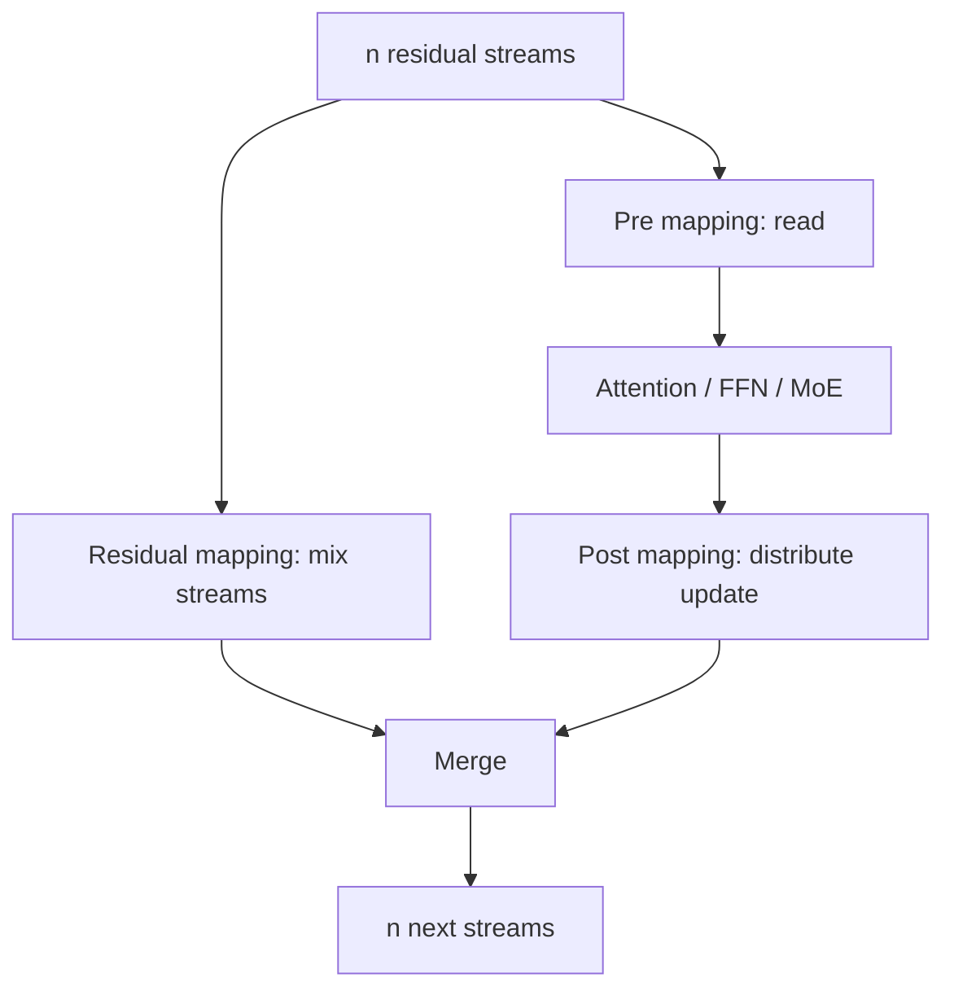

# 多流连接与状态变换

> 类型：专题详解。所属：[专题总览](README.md)。涉及模型版本、API 和性能数字的旧稿内容尚未逐条重新核验，见[版本与验证范围](../../版本与验证范围.md)。

<a id="read-36"></a>

<a id="15-从标量到矩阵residual-设计空间如何统一表示"></a>

## 从标量到矩阵：Residual 设计空间如何统一表示？

把第 $l$ 层读入和写出统一写成：

```math
\mathbf{z}_{l}=\mathcal{R}_{l}(\mathcal{M}_{l}),
```

```math
\mathbf{v}_{l}=\mathcal{F}_{l}(\mathbf{z}_{l}),
```

```math
\mathcal{M}_{l+1}=\mathcal{W}_{l}(\mathcal{M}_{l},\mathbf{v}_{l}).
```

$\mathcal{M}_{l}$ 是深度 memory。不同结构只是对它采用不同数据结构：

| 结构 | $\mathcal{M}_{l}$ | Read | Write |
|---|---|---|---|
| Standard residual | 单个向量 | identity / Norm | unit add |
| ReZero / LayerScale | 单个向量 | identity / Norm | scalar/diagonal add |
| HC/mHC | $n$ 条并行 stream | stream mixture | stream mixing + distributed write |
| GR | $n$ 条并行 stream | elementwise gated mixture | per-branch scalar add |
| AttnRes | 所有历史 sources | depth softmax | append new source |
| Block AttnRes | block summaries | block-depth softmax | block accumulation |

这个统一视角能直接导出系统问题：memory 的大小、每层读写次数、是否跨 PP stage、能否低精度存储、是否可块化。

---


<a id="read-37"></a>

<a id="16-hyper-connections把一条-residual-stream-扩成-n-条"></a>

## Hyper-Connections：把一条 Residual Stream 扩成 $n$ 条

标准 residual state：

```math
\mathbf{x}_{l}\in\mathbb{R}^{d}.
```

HC 将其扩为：

```math
\mathbf{X}_{l}\in\mathbb{R}^{n\times d}.
```

每个 token 不再只有一个 hidden vector，而有 $n$ 条 residual streams。

一个 HC sublayer 可以抽象为：

```math
\mathbf{h}_{l}^{pre}
\mathrel{=}
\mathbf{H}_{l}^{pre}\mathbf{X}_{l},
```

```math
\mathbf{v}_{l}
\mathrel{=}
\mathcal{F}_{l}(\mathbf{h}_{l}^{pre}),
```

```math
\mathbf{X}_{l+1}
\mathrel{=}
\mathbf{H}_{l}^{res}\mathbf{X}_{l}
+
\mathbf{H}_{l}^{post}\mathbf{v}_{l}.
```

其中：

- $\mathbf{H}^{pre}$：从多 stream 读取一个 layer input；
- $\mathbf{H}^{post}$：将 layer output 写回多个 stream；
- $\mathbf{H}^{res}$：在不经过 layer function 的情况下混合旧 streams。



关键点：主 operator $\mathcal{F}$ 的输入输出仍是 $d$，所以昂贵的 Attention/FFN FLOPs 不按 $n$ 倍增加；增加的主要是小投影、elementwise 运算与 residual state I/O。

---


<a id="read-38"></a>

<a id="17-dynamic-hyper-connections每个-token-可以拥有不同拓扑"></a>

## Dynamic Hyper-Connections：每个 Token 可以拥有不同拓扑

DHC 的 mapping 由静态项和输入相关项组成：

```math
\mathbf{H}_{l}^{*}
\mathrel{=}
\mathbf{B}_{l}^{*}
+
\alpha_{l}^{*}
\phi(\boldsymbol{\Theta}_{l}^{*}\widetilde{\mathbf{X}}_{l}),
```

其中 $*\in\{pre,post,res\}$，$\widetilde{\mathbf{X}}_l$ 是 normalized state。

如果 mapping 按 token 预测，则同一层中：

- 代码 token 可以偏向一组 stream；
- 自然语言 token 可以偏向另一组；
- 不同位置可以形成不同深度路径。

这相当于在 depth 方向做 soft routing。

但动态 topology 也带来系统代价：

1. mapping coefficients 成为 activation；
2. backward 需要保留或重算它们；
3. 每个 token 的 mixing 不同，难以提前折叠为静态矩阵；
4. 多 stream state 要反复从 HBM 读取；
5. PP stage boundary 的 activation payload 按 $n$ 扩大。

---


<a id="read-39"></a>

<a id="18-hc-的-sequentialparallel-duality"></a>

## HC 的 Sequential–Parallel Duality

HC 的 connection matrix 可以学成接近串行：

```math
\mathcal{F}_{2}(\mathcal{F}_{1}(\mathbf{x})),
```

也可以学成接近并行：

```math
\mathcal{F}_{1}(\mathbf{x})+\mathcal{F}_{2}(\mathbf{x}),
```

还可以是二者之间的 soft mixture。

这说明残差 topology 不只是“信息保留多少”，它甚至在决定 operator 的有效组合方式。

从系统角度要注意：

- 物理执行顺序通常仍是静态的；
- “动态 rearrange layers”描述的是信息依赖强度，不代表 runtime 自动跳过 kernel；
- 若没有显式 sparse routing，DHC 不会像 MoD 那样直接减少 layer FLOPs；
- 它改善的是表示与优化，而非天然减少计算。

---


<a id="read-40"></a>

<a id="19-为什么原始-hc-在大规模训练中不够稳定"></a>

## 为什么原始 HC 在大规模训练中不够稳定？

跨多层展开 HC：

```math
\mathbf{X}_{L}
\mathrel{=}
\left(
\prod_{i=l}^{L-1}\mathbf{H}_{i}^{res}
\right)\mathbf{X}_{l}
+
\text{all written updates}.
```

即使每个 $\mathbf{H}_{i}^{res}$ 只是略微放大某些方向，连乘后也可能：

- 最大奇异值快速增长；
- 最小奇异值快速衰减；
- 某些 stream 吞噬其他 stream；
- forward signal 与 backward gradient 同时失稳。

小规模实验中，训练可能仍能适应；到了数十亿参数、长训练和低精度条件下，微小偏差会跨深度积累。

这与标准 residual 的 identity path 形成鲜明对比：

```math
\prod_{i=l}^{L-1}\mathbf{I}=\mathbf{I}.
```

mHC 的核心不是“多做一次归一化”，而是恢复这种可组合的稳定性。

---


<a id="read-41"></a>

<a id="20-mhc为什么使用双随机矩阵"></a>

## mHC：为什么使用双随机矩阵？

mHC 将 residual mapping 约束为：

```math
\mathbf{H}^{res}_{l}\ge0,
```

```math
\mathbf{H}^{res}_{l}\mathbf{1}=\mathbf{1},
\qquad
\mathbf{1}^{\top}\mathbf{H}^{res}_{l}=\mathbf{1}^{\top}.
```

即每一行、每一列之和都为 1。

这样的矩阵位于 Birkhoff polytope（双随机矩阵集合）中。


<a id="read-42"></a>

<a id="201-行和为-1"></a>

### 1 行和为 1

每条输出 stream 是输入 streams 的 convex combination，不会无界放大均值。


<a id="read-43"></a>

<a id="202-列和为-1"></a>

### 2 列和为 1

所有输入 stream 的总质量被守恒，避免某条输入被系统性复制或丢弃。


<a id="read-44"></a>

<a id="203-乘法闭包"></a>

### 3 乘法闭包

两个双随机矩阵的乘积仍是双随机矩阵。因此跨很多层：

```math
\prod_i\mathbf{H}^{res}_{i}
```

仍保持同类约束。


<a id="read-45"></a>

<a id="204-n1-的退化"></a>

### 4 $n=1$ 的退化

唯一双随机标量就是 1，因此：

```math
n=1\Rightarrow\mathbf{H}^{res}=1,
```

恢复标准 identity mapping。

---


<a id="read-46"></a>

<a id="21-sinkhornknopp-如何把任意-logits-变成近似双随机矩阵"></a>

## Sinkhorn–Knopp 如何把任意 Logits 变成近似双随机矩阵？

设预测的 residual logits 为：

```math
\widetilde{\mathbf{H}}^{res}\in\mathbb{R}^{n\times n}.
```

先变正：

```math
\mathbf{M}^{(0)}=\exp(\widetilde{\mathbf{H}}^{res}).
```

然后反复执行列归一化和行归一化：

```math
\mathbf{M}^{(t)}
\mathrel{=}
\mathcal{T}_{row}
\left(
\mathcal{T}_{col}(\mathbf{M}^{(t-1)})
\right).
```

最终：

```math
\mathbf{H}^{res}\approx\mathbf{M}^{(t_{max})}.
```

mHC 论文实验采用 $t_{max}=20$。

需要注意：

- 有限次迭代只得到近似双随机；
- exp、除法与迭代 backward 对低精度敏感；
- $n$ 通常很小，例如 4，所以 FLOPs 不大；
- 真正成本常来自 kernel launch、intermediate 和 HBM traversal；
- 自定义 backward 可在片上重算迭代中间量，避免全部保存。

---


<a id="read-47"></a>

<a id="22-mhc-的完整前向张量流"></a>

## mHC 的完整前向张量流

对 batch 中所有 token，可将 state 写成：

```math
\mathbf{X}_{l}\in\mathbb{R}^{N_{tok}\times n\times d}.
```


<a id="read-48"></a>

<a id="221-生成动态-mapping"></a>

### 1 生成动态 mapping

将 streams 展平：

```math
\operatorname{vec}(\mathbf{X}_{l})
\in\mathbb{R}^{N_{tok}\times nd}.
```

经 RMSNorm 和小线性投影得到：

```math
n+n+n^{2}
```

个系数，分别对应 pre、post、res mapping。


<a id="read-49"></a>

<a id="222-约束-mapping"></a>

### 2 约束 mapping

```math
\mathbf{H}^{pre}=\sigma(\widetilde{\mathbf{H}}^{pre}),
```

```math
\mathbf{H}^{post}=2\sigma(\widetilde{\mathbf{H}}^{post}),
```

```math
\mathbf{H}^{res}=\operatorname{SK}(\widetilde{\mathbf{H}}^{res}).
```


<a id="read-50"></a>

<a id="223-read"></a>

### 3 Read

```math
\mathbf{h}^{pre}
\mathrel{=}
\sum_{s=1}^{n}H^{pre}_{s}\mathbf{X}_{l,s}
\in\mathbb{R}^{d}.
```


<a id="read-51"></a>

<a id="224-main-operator"></a>

### 4 Main operator

```math
\mathbf{v}_{l}=\mathcal{F}_{l}(\mathbf{h}^{pre})
\in\mathbb{R}^{d}.
```


<a id="read-52"></a>

<a id="225-residual-mix-与-write"></a>

### 5 Residual mix 与 write

```math
\mathbf{X}_{l+1}
\mathrel{=}
\mathbf{H}^{res}\mathbf{X}_{l}
+
\mathbf{H}^{post}\mathbf{v}_{l}^{\top}.
```

main operator 不变，但 residual wrapper 已经从一次 add 变成一个小型动态 network。

---


<a id="read-53"></a>

<a id="23-mhc-为什么是-memory-bound而不是-compute-bound"></a>

## mHC 为什么是 Memory-Bound，而不是 Compute-Bound？

标准 residual merge 每 token 粗略需要：

- 读旧 state：$d$；
- 读 update：$d$；
- 写新 state：$d$。

约为：

```math
3d\ \text{elements of traffic}.
```

HC/mHC 需要维护 $n$ 条 stream，并多次生成、读取、混合 mapping。论文给出的未融合分析中，I/O 近似按 $n$ 增长。

当 $n=4,d=7168$ 时，每 token residual state 本身为：

```math
4\times7168=28672\ \text{elements}.
```

BF16 大约：

```math
56\ \text{KiB/token}.
```

若一层对它做多次完整 traversal，算术强度很低：只有少量 multiply/add，却搬运大量 byte。因此：

```math
T_{mHC}
\approx
\max\left(
\frac{FLOPs}{P_{compute}},
\frac{Bytes}{BW_{HBM}}
\right)
```

通常由第二项主导。

这也是为什么只报告“额外 FLOPs 很小”会严重误导。

---


<a id="read-54"></a>

<a id="24-mhc-的-kernel-fusion-为什么不是可选优化"></a>

## mHC 的 Kernel Fusion 为什么不是可选优化？

若按 eager operators 实现：

1. RMSNorm 读取 $nd$ state；
2. Linear 再读取 normalized state；
3. sigmoid/tanh 各自 launch；
4. Sinkhorn 每轮多个 launch；
5. pre mix 重新读取 state；
6. residual mix 再次读取 state；
7. merge 和 write 又一次 traversal。

性能会被 launch 与 HBM traffic 吞噬。

mHC 的关键系统优化包括：

- 将 RMS 除法重排到小矩阵投影之后；
- 吸收 RMSNorm weight 到投影参数；
- 合并对 expanded state 的扫描；
- 在一个 kernel 内完成小系数的 sigmoid 与组合；
- 在一个 kernel 内完成全部 Sinkhorn iterations；
- backward 片上重算 SK intermediate；
- mixed precision：state 用 BF16，系数和关键累积用 FP32/TF32。

作者报告在 $n=4$ 的大模型训练中，通过这些设计将额外训练开销控制到约 6.7%。这是作者特定平台结果，不是朴素 PyTorch 实现的预期值。

---


<a id="read-55"></a>

<a id="25-mhc-backward为什么需要分块-recompute"></a>

## mHC Backward：为什么需要分块 Recompute？

训练时需要求：

- main operator input 的梯度；
- $\mathbf{H}^{pre}$、$\mathbf{H}^{post}$、$\mathbf{H}^{res}$ 的梯度；
- mapping projection parameters 的梯度；
- expanded residual state 的梯度。

如果每层保存所有 mapping intermediate，activation memory 会很大。

mHC 采用跨 $L_r$ 个连续 layers 的分块重算。常驻保存 block 首状态：

```math
n d\left\lceil\frac{L}{L_r}\right\rceil,
```

重算 active block 的瞬时 memory 约：

```math
(n+2)dL_r.
```

总量近似：

```math
M(L_r)
\mathrel{=}
nd\left\lceil\frac{L}{L_r}\right\rceil
+
(n+2)dL_r.
```

忽略取整，其最优 block size：

```math
L_r^{*}
\approx
\sqrt{\frac{nL}{n+2}}.
```

这是一种很典型的 memory–compute trade-off：少存 intermediate，多做轻量重算。

---


<a id="read-56"></a>

<a id="26-mhc-与-pipeline-parallelismresidual-state-直接变成通信-payload"></a>

## mHC 与 Pipeline Parallelism：Residual State 直接变成通信 Payload

标准 PP stage boundary 传：

```math
B\times T\times d.
```

$n$-stream mHC 需要传：

```math
B\times T\times n\times d.
```

因此边界 activation byte 近似扩大 $n$ 倍。

对长 sequence、较大 micro-batch 和跨节点 PP，这会造成：

- P2P send/recv latency 上升；
- pipeline bubble 变大；
- 与 MoE All-to-All 竞争 NIC；
- activation buffer 占用增加；
- backward gradient payload 同样扩大。

mHC 的实现将 recompute block boundary 与 PP stage boundary 对齐，并扩展 DualPipe overlap：

- stage 首 state 已缓存，可让 recompute 与通信解耦；
- 部分 post/res kernel 使用高优先级 compute stream；
- 避免长时间 persistent kernel 阻塞需要抢占的通信路径；
- Attention、MoE communication、PP P2P 与 residual recompute 需要共同排程。

这说明模型 topology 已经直接决定 distributed schedule。

---

---

[所属专题](README.md) · [百科总览](../../README.md)
