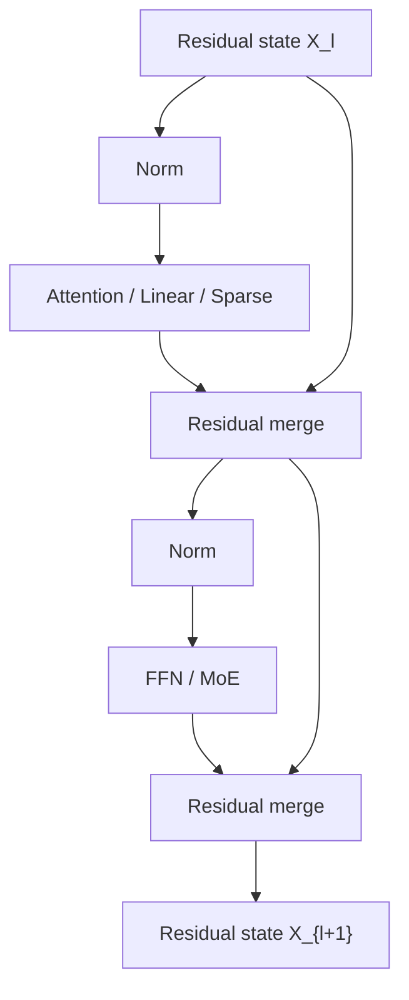

# 残差与归一化基础

> 类型：专题详解。所属：[专题总览](README.md)。涉及模型版本、API 和性能数字的旧稿内容尚未逐条重新核验，见[版本与验证范围](../../版本与验证范围.md)。

<a id="read-01"></a>

## 缩写与术语

| 缩写 | 全称 | 本文含义 |
|---|---|---|
| ResNet | Residual Network | 通过 identity shortcut 学习残差函数的网络 |
| LN | Layer Normalization | 对单个 token 的 hidden channels 做均值与方差归一化 |
| RMSNorm | Root Mean Square Layer Normalization | 只按均方根缩放、不减均值的归一化 |
| Pre-LN / Post-LN | Pre-/Post-Layer Normalization | 归一化位于子层之前 / 残差合并之后 |
| FFN / MLP | Feed-Forward Network / Multi-Layer Perceptron | Transformer 的逐 token channel mixer |
| HC / DHC | Hyper-Connections / Dynamic Hyper-Connections | 多 residual stream 的静态 / 输入相关连接 |
| mHC | Manifold-Constrained Hyper-Connections | 将 residual mixing 约束到特定流形的 HC |
| GR | Gated Residual | Qwen3.8-Next 的多分支门控残差结构 |
| AttnRes | Attention Residuals | 对历史深度表示做 softmax 选择的残差结构 |
| DWA | Depth-Weighted Average | DenseFormer 的深度加权平均 |
| PP | Pipeline Parallelism | 流水线并行；不同设备负责不同层 |
| TP / CP | Tensor / Context Parallelism | 张量并行 / 上下文并行 |
| HBM | High Bandwidth Memory | GPU 高带宽显存 |
| I/O | Input/Output | 本文主要指 HBM 读写流量，而非磁盘 I/O |
| MFU | Model FLOPs Utilization | 有效模型 FLOPs 相对硬件峰值的利用率 |
| TTFT / TPOT | Time To First Token / Time Per Output Token | 首 token 延迟 / 每输出 token 延迟 |
| SK | Sinkhorn–Knopp | 将正矩阵迭代归一化为近似双随机矩阵的算法 |

---


<a id="read-02"></a>

<a id="0-先给结论residual-正在从加法演化为深度方向的-memory-system"></a>

## 先给结论：Residual 正在从“加法”演化为“深度方向的 Memory System”

标准 Pre-Norm Transformer 使用：

```math
\mathbf{x}_{l+1}
\mathrel{=}
\mathbf{x}_{l}
+
\mathcal{F}_{l}(\operatorname{Norm}(\mathbf{x}_{l})).
```

它有两个巨大优点：

1. 存在一条接近恒等映射的前向路径；
2. 梯度存在不穿过复杂子层的直接回传路径。

但它也做了一个极强的结构假设：

> 所有层的输出都以固定权重 1 写入同一条 residual stream；后续层只能读取这个不断累加的总和。

当 Transformer 只是重复堆叠相似的 Attention 和 FFN 时，这个假设足够好。现代模型开始混合：

- full / sparse / linear attention；
- shared / routed MoE；
- multimodal adapter；
- memory lookup；
- MTP 与其他 serving-oriented module。

不同 operator 写出的信息具有不同尺度、寿命和用途。继续把它们全部无条件相加，就会暴露三个瓶颈：

```math
\boxed{
\text{Scale Control}
+
\text{Residual Capacity}
+
\text{Depth-wise Addressability}
}
```

于是出现三条技术路线：

| 路线 | 代表方法 | 核心问题 |
|---|---|---|
| 稳定单流 | Pre-LN、ReZero、LayerScale、Admin、DeepNorm、ResiDual | 怎样让很深的网络可优化 |
| 扩展多流 | AltUp、HC、mHC、Gated Residual、xHC | 一条 $d$ 维 stream 是否成为容量瓶颈 |
| 深度检索 | DenseFormer、AttnRes、Block AttnRes、Delta AttnRes | 后层能否直接选择更早的 representation |

从 Infra 看，瓶颈也随之迁移：

```math
\text{训练不稳定}
\rightarrow
\text{多流 HBM I/O}
\rightarrow
\text{activation memory / PP communication}
\rightarrow
\text{fusion、recompute、low precision、depth cache scheduling}.
```

因此本文的总纲是：

> **Residual stream 不是无成本的数学符号，而是贯穿所有层、需要持续驻留 HBM、跨 PP stage 传输、被每个子层反复读取和写回的模型内部状态。**

---


<a id="read-03"></a>

<a id="1-residual-到底解决了什么"></a>

## Residual 到底解决了什么？


<a id="read-04"></a>

<a id="11-plain-network-学的是完整映射"></a>

### 1 Plain network 学的是完整映射

没有 shortcut 时：

```math
\mathbf{x}_{l+1}=\mathcal{H}_{l}(\mathbf{x}_{l}).
```

如果理想映射接近 identity，网络仍要用多个非线性层重新学出：

```math
\mathcal{H}_{l}(\mathbf{x})\approx\mathbf{x}.
```

深度增加后，Jacobian 连乘：

```math
\frac{\partial \mathbf{x}_{L}}{\partial \mathbf{x}_{l}}
\mathrel{=}
\prod_{i=l}^{L-1}
\frac{\partial\mathcal{H}_{i}}{\partial\mathbf{x}_{i}},
```

容易造成梯度消失、爆炸或极差的 condition number。


<a id="read-05"></a>

<a id="12-residual-block-只学变化量"></a>

### 2 Residual block 只学“变化量”

ResNet 将它改写为：

```math
\mathbf{x}_{l+1}=\mathbf{x}_{l}+\mathcal{F}_{l}(\mathbf{x}_{l}).
```

如果当前层暂时没有有用变换，只需让：

```math
\mathcal{F}_{l}(\mathbf{x}_{l})\approx0.
```

这比重新构造 identity 容易得多。


<a id="read-06"></a>

<a id="13-展开以后identity-path-非常清楚"></a>

### 3 展开以后，identity path 非常清楚

从第 $l$ 层展开到第 $L$ 层：

```math
\mathbf{x}_{L}
\mathrel{=}
\mathbf{x}_{l}
+
\sum_{i=l}^{L-1}\mathcal{F}_{i}(\mathbf{x}_{i}).
```

反向传播为：

```math
\frac{\partial\mathcal{L}}{\partial\mathbf{x}_{l}}
\mathrel{=}
\frac{\partial\mathcal{L}}{\partial\mathbf{x}_{L}}
\left(
\mathbf{I}
+
\frac{\partial}{\partial\mathbf{x}_{l}}
\sum_{i=l}^{L-1}\mathcal{F}_{i}(\mathbf{x}_{i})
\right).
```

关键是第一项 $\mathbf{I}$：即使 residual branches 的 Jacobian 暂时很糟，梯度仍有直接路径。

这也是为什么“加一个 skip connection”不是普通 feature fusion，而是在改变优化问题的几何结构。

---


<a id="read-07"></a>

<a id="2-residual-stream-是一种什么数据结构"></a>

## Residual Stream 是一种什么数据结构？

在 decoder-only Transformer 中，可以把 residual stream 理解为每个 token 携带的工作内存：

```math
\mathbf{X}_{l}\in\mathbb{R}^{B\times T\times d}.
```

其中：

- $B$：micro-batch size；
- $T$：当前序列 token 数；
- $d$：model hidden size。

每个 Attention、FFN 或 MoE 子层：

1. 从 residual state 读取输入；
2. 计算一个 update；
3. 将 update 写回 residual state。



它同时承担四个角色：

| 角色 | 含义 |
|---|---|
| Feature carrier | 把 token representation 从浅层带到深层 |
| Gradient highway | 提供稳定的反向传播捷径 |
| Cross-operator bus | 连接 Attention、MoE、Linear Attention 等不同算子 |
| Persistent activation | 训练时需要保存或重算，PP 时需要跨设备发送 |

最后一个角色常被架构讨论忽略，却是 Infra 最关心的部分。

---


<a id="read-08"></a>

<a id="3-transformer-一层实际上有两次-residual-update"></a>

## Transformer 一层实际上有两次 Residual Update

典型 Pre-RMSNorm decoder block：

```math
\mathbf{H}_{l}
\mathrel{=}
\mathbf{X}_{l}
+
\operatorname{Attn}_{l}(\operatorname{RMSNorm}(\mathbf{X}_{l})),
```

```math
\mathbf{X}_{l+1}
\mathrel{=}
\mathbf{H}_{l}
+
\operatorname{FFN}_{l}(\operatorname{RMSNorm}(\mathbf{H}_{l})).
```

若有 $L$ 个 Transformer blocks，通常有约 $2L$ 个 residual-writing sublayers。

这一点对后面的 AttnRes 很重要：

- “48 层模型”可能意味着 96 个 residual sites；
- Full AttnRes 若按 sublayer 保存历史，source 数是 $O(2L)$；
- Block AttnRes 的 block size 也常按 sublayer 而不是 Transformer block 计数。

在 MoE 模型中，第二个 update 可能来自 routed experts；在 hybrid attention 模型中，第一个 update 可能轮流来自 GDN、Sparse Attention 和 MLA。Residual topology 必须容纳不同分布的 update。

---


<a id="read-09"></a>

<a id="4-post-norm-与-pre-norm区别不只是-norm-放在哪儿"></a>

## Post-Norm 与 Pre-Norm：区别不只是 Norm 放在哪儿


<a id="read-10"></a>

<a id="41-post-norm"></a>

### 1 Post-Norm

原始 Transformer 更接近：

```math
\mathbf{x}_{l+1}
\mathrel{=}
\operatorname{Norm}
\left(
\mathbf{x}_{l}+\mathcal{F}_{l}(\mathbf{x}_{l})
\right).
```

identity path 必须穿过 Norm。优点是每层输出尺度受控，深层 representation 往往更有区分度；缺点是梯度直通路径不再是真正 identity，深层模型初始化和 warmup 更敏感。


<a id="read-11"></a>

<a id="42-pre-norm"></a>

### 2 Pre-Norm

现代 LLM 常用：

```math
\mathbf{x}_{l+1}
\mathrel{=}
\mathbf{x}_{l}
+
\mathcal{F}_{l}(\operatorname{Norm}(\mathbf{x}_{l})).
```

identity path 完全绕过 Norm 与子层，因此显著改善深层训练稳定性。


<a id="read-12"></a>

<a id="43-二者的核心-trade-off"></a>

### 3 二者的核心 trade-off

| 维度 | Post-Norm | Pre-Norm |
|---|---|---|
| 直通梯度 | 需要穿过 Norm | 存在显式 identity path |
| 初始训练稳定性 | 较敏感，常依赖 warmup/初始化 | 通常更稳 |
| hidden magnitude | 每层重新控制 | 可随深度累积增长 |
| 深层表示差异 | 通常较强 | 可能逐渐相似或贡献被稀释 |
| 现代 decoder LLM | 较少直接使用 | 主流默认 |

不能简单说谁绝对更好。Pre-Norm 用更强的优化稳定性换来了 residual accumulation 问题；后续 HC、mHC、AttnRes、GR 很大程度上是在偿还这笔债。

---


<a id="read-13"></a>

<a id="5-layernormrmsnorm-与-residual-是三个不同层级"></a>

## LayerNorm、RMSNorm 与 Residual 是三个不同层级

RMSNorm：

```math
\operatorname{RMSNorm}(\mathbf{x})
\mathrel{=}
\boldsymbol{\gamma}\odot
\frac{\mathbf{x}}
{\sqrt{\frac{1}{d}\sum_{j=1}^{d}x_{j}^{2}+\epsilon}}.
```

它解决的是单个 token 内各 channel 的尺度问题。

Residual connection 解决的是跨 layer 的信息与梯度路径问题。

Initialization / residual scaling 解决的是训练早期每个 update 应该多大。

因此：

- 把 LayerNorm 换成 RMSNorm，不等于解决 residual dilution；
- 把 Post-Norm 换成 Pre-Norm，不等于增加 residual capacity；
- 给 residual branch 乘一个 scalar，不等于获得跨深度检索能力；
- 多 residual streams 也不自动保证数值稳定。

这是阅读 residual 论文时最重要的分类边界。

---


<a id="read-14"></a>

<a id="6-pre-norm-为什么会出现-hidden-state-growth"></a>

## Pre-Norm 为什么会出现 Hidden-State Growth？

展开 Pre-Norm：

```math
\mathbf{x}_{L}
\mathrel{=}
\mathbf{x}_{0}
+
\sum_{i=0}^{L-1}\mathbf{v}_{i},
\qquad
\mathbf{v}_{i}=\mathcal{F}_{i}(\operatorname{Norm}(\mathbf{x}_{i})).
```

如果各层 update 近似独立、方差相近，则粗略有：

```math
\operatorname{Var}(\mathbf{x}_{L})
\approx
\operatorname{Var}(\mathbf{x}_{0})
+
\sum_{i=0}^{L-1}\operatorname{Var}(\mathbf{v}_{i})
=O(L).
```

于是 RMS 大约按：

```math
\operatorname{RMS}(\mathbf{x}_{L})=O(\sqrt{L})
```

增长。若 update 存在强相关，增长还可能更快。

后层在进入子层前会 Norm，所以数值未必立刻爆炸；但一个早期 update 在总和中的相对占比会下降。

假设第 $j$ 层写入的 feature 大小为 $O(1)$，总 stream 大小为 $O(\sqrt{L})$，则其相对贡献粗略下降为：

```math
O\left(\frac{1}{\sqrt{L}}\right).
```

这就是 residual dilution 的直觉：

> 早期信息并非被删除，而是失去独立地址，只能作为巨大总和中的一小部分继续存在。

---


<a id="read-15"></a>

<a id="7-dilutionrepresentation-collapse-与-over-smoothing-不完全相同"></a>

## Dilution、Representation Collapse 与 Over-Smoothing 不完全相同

这三个术语经常被混用。


<a id="read-16"></a>

<a id="71-residual-dilution"></a>

### 1 Residual dilution

某个 layer update 在累计 state 中的相对权重越来越小。关注的是 **contribution magnitude**。


<a id="read-17"></a>

<a id="72-representation-collapse"></a>

### 2 Representation collapse

相邻深度的 hidden states 余弦相似度越来越高，新层对 representation 的方向改变很小。关注的是 **cross-depth similarity**。


<a id="read-18"></a>

<a id="73-over-smoothing"></a>

### 3 Over-smoothing

不同 token、node 或位置的 representation 逐渐趋同，常见于 GNN，也可出现在深层 Transformer。关注的是 **cross-token similarity**。

Pre-Norm 深层网络可能同时出现前两者，但它们不是同一个数学命题。诊断时至少分别记录：

```math
\cos(\mathbf{x}_{l},\mathbf{x}_{l+1}),
```

```math
\frac{\lVert\mathbf{v}_{l}\rVert_{2}}
{\lVert\mathbf{x}_{l}\rVert_{2}},
```

以及不同 token representation 的 pairwise similarity。

---


<a id="read-19"></a>

<a id="8-为什么模型越来越异构后residual-问题突然变重要"></a>

## 为什么模型越来越异构后，Residual 问题突然变重要？

传统 Transformer 的 operator pattern 很规则：

```math
\text{Attention}\rightarrow\text{FFN}
\rightarrow\text{Attention}\rightarrow\text{FFN}.
```

现代 hybrid model 可能是：

```math
\text{GDN}\rightarrow\text{MoE}
\rightarrow\text{GDN}\rightarrow\text{MoE}
\rightarrow\text{Sparse Attention}\rightarrow\text{MoE}.
```

不同 operator 的 update 有不同性质：

| Operator | 写入 residual 的典型信息 |
|---|---|
| Local / recurrent mixer | 局部或压缩历史状态 |
| Full / sparse attention | 精确 token retrieval 和全局重组 |
| Dense FFN | 通用 channel transformation |
| MoE | token-conditional 专家知识 |
| External embedding | 确定性 lookup memory |

如果所有 update 都按单位权重写入一条 stream，模型必须依靠后续层从混合后的总和中重新分离它们。

Residual Evolution 的本质，就是让模型拥有更聪明的内部互联：

- 哪条信息通道应该长期保留；
- 当前 layer 应读取哪种深度特征；
- 新 update 应写入哪些通道；
- 不同 stream 是否需要彼此混合；
- 如何保证整个映射仍接近 identity。

---


<a id="read-20"></a>

<a id="9-历史演化先稳定深度再扩展深度内存"></a>

## 历史演化：先稳定深度，再扩展深度内存

| 时间 | 工作 | 关键变化 | 后续暴露的问题 |
|---|---|---|---|
| 2015 | Highway Networks | 用 gate 控制 transform/carry | gate 成本与优化复杂度 |
| 2015–2016 | ResNet / Identity Mappings | 固定 identity shortcut | 单流、固定单位写入 |
| 2017 | Transformer Post-LN | Residual + LayerNorm | 深层梯度不稳定 |
| 2018–2020 | Pre-LN | Norm 移入 residual branch | hidden growth、深层稀释 |
| 2019 | Fixup / RMSNorm | 初始化与更轻 Norm | 仍是固定 topology |
| 2020 | ReZero / Admin | 零初始化 gate / 控制 residual dependency | 标量调节表达力有限 |
| 2021 | LayerScale | channel-wise residual scale | 仍只连接相邻层 |
| 2022 | DeepNorm | 深度相关 scaling + initialization | 主要解决稳定性 |
| 2023 | ResiDual / AltUp | 双路径或多分支 state | activation 与带宽增加 |
| 2024 | DenseFormer / HC | 跨深度平均 / 多流动态连接 | HC 数值和 I/O 问题 |
| 2025–2026 | mHC | 双随机约束 + Infra 优化 | 多流 HBM、PP 通信 |
| 2026 | AttnRes | 将历史层变成可寻址 memory | depth cache 与历史读取 |
| 2026 | Gated Residual | 4 分支、逐元素读 gate、标量写 gate | 仍需搬运多流 state |
| 2026 | xHC / Delta AttnRes 等 | 扩展 stream 或改进 routed source | 设计空间快速扩大 |

这条线不是旧方法不断被淘汰。很多现代 LLM 仍使用最简单的 Pre-RMSNorm，因为它的软件成熟度、带宽成本和部署兼容性非常好。

---

---

[所属专题](README.md) · [百科总览](../../README.md)
