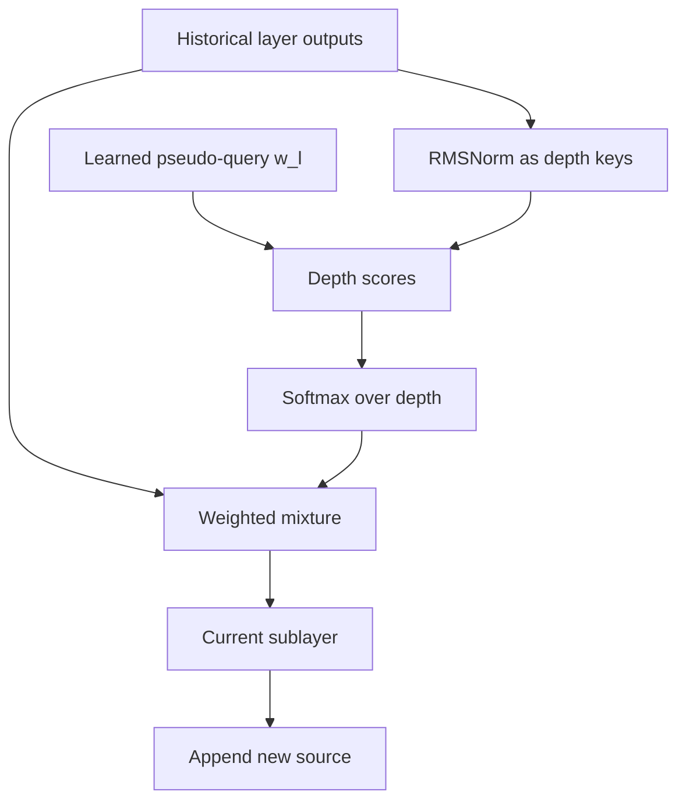

# 深度注意力与分块

> 类型：专题详解。所属：[专题总览](README.md)。涉及模型版本、API 和性能数字的旧稿内容尚未逐条重新核验，见[版本与验证范围](../../版本与验证范围.md)。

<a id="read-57"></a>

<a id="27-attention-residuals把-depth-当成另一条-attention-轴"></a>

## Attention Residuals：把 Depth 当成另一条 Attention 轴

标准 residual：

```math
\mathbf{h}_{l}
\mathrel{=}
\sum_{i=0}^{l-1}\mathbf{v}_{i},
```

所有历史 update 权重固定为 1。

AttnRes 改成：

```math
\mathbf{h}_{l}
\mathrel{=}
\sum_{i=0}^{l-1}
\alpha_{i\rightarrow l}\mathbf{v}_{i},
```

```math
\sum_{i=0}^{l-1}\alpha_{i\rightarrow l}=1.
```

权重由 depth-wise softmax 决定。

这里的 attention 不是 token 对 token：

- sequence attention 的 key/value index 是历史 token；
- AttnRes 的 key/value index 是历史 layer output；
- 每个 token 独立地在 depth 维选择 source。

因此可以把现代模型看成二维 memory：

| 维度 | 被寻址对象 | 代表机制 |
|---|---|---|
| Sequence | 历史 token / compressed state | MLA、Sparse、Linear Attention |
| Depth | 历史 layer representation | AttnRes、DenseFormer、HC-family |

---


<a id="read-58"></a>

<a id="28-full-attnres-的公式与数据流"></a>

## Full AttnRes 的公式与数据流

定义 sources：

```math
\mathbf{v}_{0}=\text{token embedding},
```

```math
\mathbf{v}_{i}=\mathcal{F}_{i}(\mathbf{h}_{i}),\qquad i\ge1.
```

第 $l$ 个 sublayer 有一个 learned pseudo-query：

```math
\mathbf{w}_{l}\in\mathbb{R}^{d}.
```

对每个 token，score 为：

```math
s_{i\rightarrow l}
\mathrel{=}
\mathbf{w}_{l}^{\top}
\operatorname{RMSNorm}(\mathbf{v}_{i}).
```

depth softmax：

```math
\alpha_{i\rightarrow l}
\mathrel{=}
\frac{\exp(s_{i\rightarrow l})}
{\sum_{j<l}\exp(s_{j\rightarrow l})}.
```

read：

```math
\mathbf{h}_{l}
\mathrel{=}
\sum_{i<l}\alpha_{i\rightarrow l}\mathbf{v}_{i}.
```

然后：

```math
\mathbf{v}_{l}=\mathcal{F}_{l}(\mathbf{h}_{l})
```

作为一个新 source 追加到 depth memory。



---


<a id="read-59"></a>

<a id="29-pseudo-query-是静态参数为什么-attention-weight-仍是输入相关的"></a>

## Pseudo-Query 是静态参数，为什么 Attention Weight 仍是输入相关的？

$\mathbf{w}_l$ 对所有样本固定，但 key：

```math
\operatorname{RMSNorm}(\mathbf{v}_{i,b,t})
```

依赖 batch $b$ 和 token $t$ 的实际 representation。

所以：

```math
\alpha_{i\rightarrow l,b,t}
```

仍会随输入内容变化。

这是一种非常便宜的 content-dependent routing：

- 每层只增加一个 $d$ 维 query；
- 不需要再从 input 投影完整 Q；
- score 是 $O(N_{source}d)$；
- softmax 只沿很短的 depth 轴。

RMSNorm 的作用也很关键：如果不归一化，深层 source 可能仅因 magnitude 更大就获得更高 score，而非因为内容更匹配。

---


<a id="read-60"></a>

<a id="30-attnres-是-replacement-routing不是在原-residual-上再加-attention"></a>

## AttnRes 是 Replacement Routing，不是“在原 Residual 上再加 Attention”

标准 residual：

```math
\mathbf{x}_{l+1}=\mathbf{x}_{l}+\mathbf{v}_{l}.
```

Full AttnRes 更接近：

```math
\mathbf{h}_{l}=\operatorname{DepthRead}(\mathbf{v}_{0:l-1}),
```

```math
\mathbf{v}_{l}=\mathcal{F}_{l}(\mathbf{h}_{l}),
```

然后将 $\mathbf{v}_{l}$ 作为独立 source 保存。

如果先把所有 source 累加，再做 depth attention，会重新制造冗余；如果同时保留普通 cumulative residual，又无约束地加 routed result，尺度控制也会更复杂。

因此实现时必须明确：

- routed sources 是 raw sublayer outputs 还是 cumulative states；
- update 是 append、replace 还是 additive write；
- embedding 是否作为 source 0；
- Attention 和 MLP 是否各自拥有 query；
- block boundary 如何形成 summary。

这些选择会改变算法语义，不能只看类名 `ResidualAttention`。

---


<a id="read-61"></a>

<a id="31-full-attnres-的真正问题old-depth-memory"></a>

## Full AttnRes 的真正问题：$O(Ld)$ Depth Memory

对于每个 token，Full AttnRes 保存所有历史 sublayer outputs：

```math
\mathcal{M}_{l}
\mathrel{=}
\{\mathbf{v}_{0},\ldots,\mathbf{v}_{l-1}\}.
```

memory 随深度增长：

```math
M_{depth}=O(Ld).
```

训练时若 batch tokens 为 $N_{tok}$、dtype bytes 为 $b$：

```math
B_{sources}
\approx
N_{tok}\times(2L+1)\times d\times b.
```

例如：

- $N_{tok}=32768$；
- 48 Transformer blocks，即约 96 sublayers；
- $d=4096$；
- BF16 为 2 byte。

仅 raw sources 理论量级约：

```math
32768\times97\times4096\times2
\approx24.25\ \text{GiB}.
```

这还未包括 main operator activations、gradients 和 optimizer state。

因此 Full AttnRes 很适合研究上界，但直接扩到大模型并不现实。

---


<a id="read-62"></a>

<a id="32-block-attnres把深度历史压缩成-block-summaries"></a>

## Block AttnRes：把深度历史压缩成 Block Summaries

将 $2L$ 个 sublayers 分为 $N_b$ 个 blocks。

block 内仍按普通 residual 累积：

```math
\mathbf{p}_{l}
\mathrel{=}
\sum_{i\in\text{current partial block}}\mathbf{v}_{i}.
```

每个已完成 block 形成 summary：

```math
\mathbf{b}_{k}
\mathrel{=}
\sum_{i\in\mathcal{B}_{k}}\mathbf{v}_{i}.
```

当前层只对以下 sources 做 depth attention：

1. token embedding；
2. 已完成 block summaries；
3. 当前 partial-block summary。

于是 source 数从：

```math
O(L)
```

降到：

```math
O(N_b),\qquad N_b\ll L.
```

Kimi 报告中约 8–10 个 sources 即可保留 Full AttnRes 的大部分收益。

这和长上下文中的 sequence compression 非常相似：

- Sparse/Linear Attention 压缩 token history；
- Block AttnRes 压缩 layer history。

---


<a id="read-63"></a>

<a id="33-block-size-的-trade-off"></a>

## Block Size 的 Trade-off

设每个 depth block 含 $S$ 个 sublayers，则：

```math
N_b\approx\frac{2L}{S}.
```


<a id="read-64"></a>

### 小 $S$

- source 多；
- 深度检索粒度细；
- 更接近 Full AttnRes；
- memory、score 和 PP communication 更大。


<a id="read-65"></a>

### 大 $S$

- source 少；
- memory 与 I/O 更低；
- block 内不同 operator 被压成一个 sum；
- 可能丢失 Attention/MLP update 方向信息。

因此 $S$ 不是普通性能 knob，而是模型质量与 Infra 成本共同决定的 architecture hyperparameter。

可类比 sequence memory：

| Depth routing | Sequence routing |
|---|---|
| block size $S$ | token block / page size |
| block summary | compressed KV / recurrent state |
| depth softmax | sparse index / attention |
| partial block | recent local window |

---


<a id="read-66"></a>

<a id="34-block-attnres-的两阶段计算为什么重要"></a>

## Block AttnRes 的两阶段计算为什么重要？

朴素实现中，每个 sublayer 都重新读取所有历史 block summaries：

```math
\text{many small depth reads}
\Rightarrow
\text{repeated HBM traffic}.
```

更高效的实现将计算拆为两部分：


<a id="read-67"></a>

### Phase 1：批量计算历史完整 blocks

同一 depth block 中多个 sublayers 的 pseudo-queries 一次性与历史 summaries 做 batched score / weighted read。

优点：

- 复用历史 summaries；
- 把多个小 GEMV/GEMM 合并；
- 提高 L2 cache reuse；
- 减少 kernel launches。


<a id="read-68"></a>

### Phase 2：顺序处理当前 partial block

当前 block 内 source 会随着 sublayer 执行而变化，必须按顺序更新 partial summary。

使用 online softmax 将：

- 已完成 blocks 的 score statistics；
- 当前 partial source 的 score/value

合并，而不重算全部历史。

这是 FlashAttention 思想在 depth 维的一个小型版本：让 mathematically global 的 softmax 通过分块、在线归并减少 memory traffic。

---


<a id="read-69"></a>

<a id="35-attnres-与-pipeline-parallelism"></a>

## AttnRes 与 Pipeline Parallelism

普通 PP 只需将 stage 输出传给下一个 stage。AttnRes 的后续 stage 还可能读取更早 stage 的 block summaries。

朴素方案有两种，都不理想：

1. 每个 stage 把所有历史 summaries 转发下去；
2. 后续 stage 按需向前面的 stage 请求。

第一种增加 activation payload，第二种制造细粒度依赖与 latency。

Block AttnRes 可采用 cache-based pipeline communication：

- block summary 在经过 stage boundary 时发送并缓存；
- 同一 summary 不为每个后续 sublayer 重复发送；
- stage 内 query 对本地 cache 批量计算；
- backward 对 cache 的 gradient 按依赖反向汇聚；
- depth block boundary 最好与 PP partition 协同设计。

需要监控：

```math
B_{PP}^{AttnRes}
\mathrel{=}
B_{normal\ activation}
+
B_{depth\ summaries}.
```

如果 depth summaries 与 MoE EP traffic 同时跨 NIC，必须将二者放进同一个网络带宽预算。

---


<a id="read-70"></a>

<a id="36-标准-residualmhc-与-attnres-的-io-对比"></a>

## 标准 Residual、mHC 与 AttnRes 的 I/O 对比

以每 token、每 residual sublayer、hidden width $d$ 为单位，论文给出的一组代表性 forward memory I/O：

| 方法 | Depth state | 论文代表性 I/O | 主要成本 |
|---|---|---:|---|
| Standard residual | $d$ | $3d$ | 一次读旧 state、读 update、写新 state |
| Full AttnRes | $O(Ld)$ sources | 约 $24d$（给定配置） | 读取很多历史 sources |
| Block AttnRes | $O(N_bd)$ | 约 $5.5d$ | block summaries + partial state |
| mHC，$n=4$ | $4d$ persistent streams | 约 $34d$ | 多次多流 read/mix/write |

这些数字来自特定论文的 operation accounting，不等价于端到端 latency。真正 runtime 还取决于：

- dtype；
- source/block 数；
- fusion；
- batch tokens；
- cache hit；
- PP topology；
- main operator 是否足够大以隐藏 residual overhead。

但它清楚说明：

> residual module 的 FLOPs 可能很小，memory I/O 却足以成为新瓶颈。

---

---

[所属专题](README.md) · [百科总览](../../README.md)
