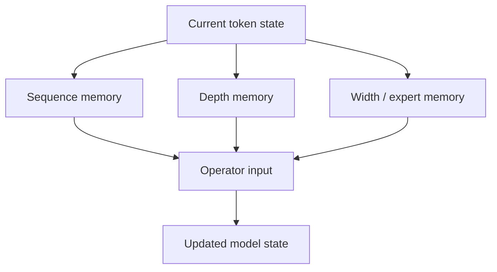

# 系统成本验证与资料

> 类型：专题详解。所属：[专题总览](README.md)。涉及模型版本、API 和性能数字的旧稿内容尚未逐条重新核验，见[版本与验证范围](../../版本与验证范围.md)。

<a id="read-99"></a>

<a id="49-training-activation-memory-成本模型"></a>

## Training Activation Memory 成本模型

设：

- micro-batch token 数 $N$；
- hidden size $d$；
- Transformer block 数 $L$；
- residual streams $n$；
- depth summaries $N_b$；
- activation dtype byte $b$。

标准单流 state：

```math
M_{std}\sim Ndb.
```

多流 state：

```math
M_{multi}\sim Nndb.
```

Full AttnRes raw sources：

```math
M_{full}\sim N(2L+1)db.
```

Block AttnRes summaries：

```math
M_{block}\sim N(N_b+1)db.
```

训练峰值还需要加上：

```math
M_{peak}
\mathrel{=}
M_{persistent\ depth\ state}
+
M_{main\ operator\ saved}
+
M_{recompute\ workspace}
+
M_{comm\ buffers}.
```

因此比较方法时必须统一 activation checkpointing policy；否则一种方法保存全部 intermediate、另一种重算，显存数字没有可比性。

---


<a id="read-100"></a>

<a id="50-pptpcp-与-residual-topology-的交互"></a>

## PP、TP、CP 与 Residual Topology 的交互


<a id="read-101"></a>

<a id="501-tensor-parallel"></a>

### 1 Tensor Parallel

Residual state 通常在 TP ranks 上保持 replicated 或按 sequence/context 方式分片；Attention/MLP output 在 residual merge 前可能需要 All-Reduce / Reduce-Scatter。

多 stream 不一定增加 TP collective 次数，但会增加本地 residual I/O。如果 gate projection 做 TP sharding，还需保证 gate 与 state layout 一致。


<a id="read-102"></a>

<a id="502-context-parallel"></a>

### 2 Context Parallel

若 tokens 已按 CP 分片，residual state 也随 token 分片，多 stream 的 HBM 与 PP payload 可按 CP size 降低。但 depth routing 只在本地 token 上发生，通常不新增跨 CP 的 depth collective。


<a id="read-103"></a>

<a id="503-pipeline-parallel"></a>

### 3 Pipeline Parallel

影响最大：多 stream 与历史 summaries 直接跨 stage 边界。需要联合决定：

- layer partition；
- depth block boundary；
- recompute boundary；
- P2P buffer；
- forward/backward schedule；
- 与 EP traffic 的 overlap。


<a id="read-104"></a>

<a id="504-sequence-parallel"></a>

### 4 Sequence Parallel

Norm 与 elementwise gate 可在 sequence-sharded tensor 上本地执行，有利于降低每 rank residual bytes；但 stage boundary 是否保持 sequence shard 取决于整个并行布局。

---


<a id="read-105"></a>

<a id="51-prefill-与-decoderesidual-成本有什么不同"></a>

## Prefill 与 Decode：Residual 成本有什么不同？

Residual operator 不保存跨 decode step 的 KV-like history。每生成一个新 token，只需处理该 token 当前通过各层时的 residual state。

因此相对 sequence attention：

- residual memory 不随 context length $T_{ctx}$ 线性增长；
- 但每个 decode step 的 batch tokens 很少；
- main GEMM 算术强度下降后，elementwise residual I/O 占比会上升。


<a id="read-106"></a>

### Prefill

- token 数大；
- gate projections 能形成较大 GEMM；
- memory traversal 连续；
- residual overhead 更容易被 Attention/MoE 计算摊薄。


<a id="read-107"></a>

### Decode

- 每 request 每步只有一个或少量 tokens；
- residual kernels 容易变成 launch-bound；
- expanded state 对每层都要读写；
- FP8 state 和 fusion 价值更大；
- CUDA Graph 对固定 branch count 很重要。

所以一个新 residual 结构可能训练开销很小，却显著拖慢低 batch decode。

---


<a id="read-108"></a>

<a id="52-residual-kernel-应该融合到哪里"></a>

## Residual Kernel 应该融合到哪里？

常见 fusion 边界：


<a id="read-109"></a>

<a id="521-norm--input-projection"></a>

### 1 Norm + Input Projection

将 RMSNorm scale 融合进 QKV 或 FFN projection，减少一次 materialization。


<a id="read-110"></a>

<a id="522-biasscale--residual-add"></a>

### 2 Bias/Scale + Residual Add

将 output scale、dropout、bias、residual add 融成一个 epilogue。


<a id="read-111"></a>

<a id="523-multi-stream-read"></a>

### 3 Multi-stream Read

融合：

- dequant；
- branch RMS reduction；
- gate generation；
- weighted branch reduce；
- 输出 cast。


<a id="read-112"></a>

<a id="524-multi-stream-write"></a>

### 4 Multi-stream Write

融合：

- write gate；
- branch add；
- amax/scale update；
- FP8 quant；
- store。


<a id="read-113"></a>

<a id="525-depth-attention"></a>

### 5 Depth Attention

融合：

- source normalization；
- query dot product；
- online softmax；
- weighted value reduce。

理想目标不是 kernel 数最少，而是：

```math
\text{每份长期 residual/depth state 尽量只从 HBM 读取一次}.
```

---


<a id="read-114"></a>

<a id="53-为什么不能盲目使用-persistent-kernel"></a>

## 为什么不能盲目使用 Persistent Kernel？

Persistent kernel 可以：

- 减少 launch；
- 把小 coefficient 留在 registers/shared memory；
- 提高 decode 小 batch 效率。

但大规模训练中，它也可能：

- 长时间占用 SM；
- 阻塞 PP communication kernel；
- 干扰 MoE dispatch/combine；
- 降低高优先级 stream 的抢占能力；
- 使 DualPipe overlap 变差。

mHC 的系统设计明确对部分 attention path 避免长时间 persistent execution，并让关键 post/res kernel 使用高优先级 stream。

所以 residual kernel 选择必须放到整条 timeline 中判断，而不是单独 microbenchmark 最快就采用。

---


<a id="read-115"></a>

<a id="54-怎样正确-benchmark-residual-architecture"></a>

## 怎样正确 Benchmark Residual Architecture？

至少分四层测量。


<a id="read-116"></a>

<a id="541-算法层"></a>

### 1 算法层

- train/validation loss；
- downstream accuracy；
- scaling law slope；
- token-equivalent compute；
- post-training 后收益是否保留。


<a id="read-117"></a>

<a id="542-数值稳定层"></a>

### 2 数值稳定层

- loss spike；
- gradient norm by depth；
- residual RMS / amax by branch；
- mapping row/column sum error；
- depth softmax entropy；
- branch utilization / collapse。


<a id="read-118"></a>

<a id="543-kernel-层"></a>

### 3 Kernel 层

- read/write latency；
- HBM bytes；
- L2 hit；
- kernel launches；
- achieved bandwidth；
- register/shared-memory pressure；
- forward/backward/recompute 分开测。


<a id="read-119"></a>

<a id="544-end-to-end-层"></a>

### 4 End-to-end 层

- tokens/s/GPU；
- MFU；
- peak memory；
- PP bubble；
- network utilization；
- prefill latency；
- TPOT 与 P99；
- cost per training token / generated token。

必须至少覆盖：

1. 训练长 sequence；
2. prefill 大 token batch；
3. decode batch 1；
4. continuous batching；
5. 多节点 PP + EP；
6. BF16 与目标低精度 state。

---


<a id="read-120"></a>

<a id="55-关键诊断指标"></a>

## 关键诊断指标


<a id="read-121"></a>

<a id="551-单流-pre-norm"></a>

### 1 单流 Pre-Norm

```math
r_l=\frac{\lVert\mathbf{v}_{l}\rVert_2}
{\lVert\mathbf{x}_{l}\rVert_2}.
```

若深层 $r_l$ 持续趋近 0，可能存在 dilution 或 ineffective depth。


<a id="read-122"></a>

<a id="552-hcmhc"></a>

### 2 HC/mHC

- $\max$ row/column sum deviation；
- composite mapping spectral norm；
- 每 stream RMS 与 gradient norm；
- stream-to-stream cosine similarity；
- mapping entropy；
- Sinkhorn finite-iteration error。


<a id="read-123"></a>

<a id="553-attnres"></a>

### 3 AttnRes

- depth softmax entropy；
- top-1 depth distance；
- source load distribution；
- historical vs partial-block mass；
- query norm；
- block summary RMS；
- 不同 token/domain 的 depth path。


<a id="read-124"></a>

<a id="554-gated-residual"></a>

### 4 Gated Residual

- read gate mean/P1/P99 by branch/channel；
- write scalar distribution；
- branch RMS/amax；
- long-lived branch 更新频率；
- FP8 saturation/underflow；
- branch ablation sensitivity。

监控不能只看所有 layers 的平均值。Residual instability 往往先出现在少数深层、少数 stream 或特定 token domain。

---


<a id="read-125"></a>

<a id="56-常见故障排查"></a>

## 常见故障排查


<a id="read-126"></a>

<a id="561-loss-正常但加深模型几乎无收益"></a>

### 1 Loss 正常，但加深模型几乎无收益

检查：

- 相邻层 cosine similarity 是否接近 1；
- $\lVert v_l\rVert/\lVert x_l\rVert$ 是否过小；
- LayerScale/ReZero gate 是否长期接近 0；
- AttnRes 是否只读最近 source；
- GR 是否只有一个 branch 被使用。


<a id="read-127"></a>

<a id="562-mhc-训练到中后期出现-loss-spike"></a>

### 2 mHC 训练到中后期出现 loss spike

检查：

- residual mapping 是否满足双随机误差阈值；
- SK exp 是否溢出；
- coefficient accumulation 是否使用足够精度；
- custom backward 与 reference 是否一致；
- composite Amax gain 是否随深度上升；
- gradient clipping 是否掩盖早期异常。


<a id="read-128"></a>

<a id="563-启用多流后-mfu-显著下降但-flops-变化很小"></a>

### 3 启用多流后 MFU 显著下降，但 FLOPs 变化很小

通常是 memory wall：

- 查看 DRAM throughput；
- 统计 expanded state traversal 次数；
- 检查 eager Norm/sigmoid/add 是否碎成多个 kernels；
- 检查 tensor layout 是否导致非合并访问；
- 检查 read/write 是否真的 fused；
- decode 是否 launch-bound。


<a id="read-129"></a>

<a id="564-pp-bubble-突然变大"></a>

### 4 PP bubble 突然变大

检查：

- stage boundary payload 是否按 stream 数扩大；
- depth summary 是否被重复发送；
- recompute block 是否跨 PP boundary；
- residual communication 是否与 EP A2A 同时拥塞；
- persistent kernel 是否阻塞 comm stream。


<a id="read-130"></a>

<a id="565-attnres-quality-下降"></a>

### 5 AttnRes quality 下降

检查：

- source 是 raw delta 还是 cumulative hidden；
- RMSNorm 是否遗漏；
- mask 是否只允许读取已完成 sources；
- block boundary 是否错位；
- online softmax merge 是否数值等价；
- embedding source 是否存在；
- pseudo-query 初始化是否正确。


<a id="read-131"></a>

<a id="566-fp8-gr-推理出现逐层漂移"></a>

### 6 FP8 GR 推理出现逐层漂移

检查：

- scale granularity；
- saturation rate；
- branch-specific amax；
- read dequant 与 write requant 顺序；
- train/infer scale 更新规则；
- fused kernel 与 BF16 reference 的逐层误差。

---


<a id="read-132"></a>

<a id="57-一个最小正确性验证流程"></a>

## 一个最小正确性验证流程

实现任何新 residual module，建议按以下顺序：

1. 用 FP32 eager reference 实现公式；
2. 在 2–4 层小模型比较 forward；
3. 使用 autograd reference 做 gradient check；
4. 验证 identity / baseline initialization；
5. 验证 causal/depth source mask；
6. 验证 activation checkpointing 前后等价；
7. 验证 PP stage split 前后 logits/gradients；
8. 再加入 BF16；
9. 再加入 fused kernel；
10. 最后加入 FP8 state 与 CUDA Graph。

建议阈值按模块分层设置：

- mapping coefficients 用更严格 FP32 tolerance；
- main activation 按 BF16/FP8 合理放宽；
- 比较逐层 error growth，不只比较最终 logits；
- backward 至少检查 input grad、operator weight grad 和 residual-routing parameter grad。

---


<a id="read-133"></a>

<a id="58-常见误区"></a>

## 常见误区


<a id="read-134"></a>

### 误区一：Residual 没有参数，所以没有性能成本

标准 residual add 也需要读写 HBM。多流 residual 更可能是 memory-bound。


<a id="read-135"></a>

### 误区二：Pre-Norm 完全解决了深层训练

它主要改善梯度直通路径，同时可能带来 hidden growth、dilution 与 representation similarity。


<a id="read-136"></a>

### 误区三：HC 的额外 FLOPs 很小，所以运行开销也小

FLOPs 不代表 HBM traffic、PP communication、activation memory 和 kernel launch。


<a id="read-137"></a>

### 误区四：mHC 就是给 HC 加 Sinkhorn

完整贡献还包括 manifold parameterization、mixed precision、fusion、custom backward、recompute 与 DualPipe overlap。


<a id="read-138"></a>

### 误区五：AttnRes 是在 token 维再做一次大 Attention

它沿 depth sources 做 attention；source 数远小于 context tokens，但 Full variant 仍有 $O(Ld)$ memory。


<a id="read-139"></a>

### 误区六：Block AttnRes block 越大越省，越值得

过度压缩会丢失细粒度 depth information，需要通过 scaling 和 downstream eval 决定。


<a id="read-140"></a>

### 误区七：多 residual branches 等于 ensemble

branches 共享同一组 main operators，并通过读写 gate 协同，是单模型内部 state，不是独立模型投票。


<a id="read-141"></a>

### 误区八：低精度 residual state 与普通 activation quantization 一样

Residual state 跨很多层持续存在，量化误差会递归累积，稳定要求更高。


<a id="read-142"></a>

### 误区九：训练 loss 更低就说明 residual 结构更好

还需看 downstream、post-training、training throughput、decode latency、PP 扩展与部署复杂度。

---


<a id="read-143"></a>

<a id="59-如何选择-residual-方案"></a>

## 如何选择 Residual 方案？

| 场景 | 优先考虑 | 原因 |
|---|---|---|
| 成熟通用 LLM、部署兼容优先 | Pre-RMSNorm residual | 最简单、kernel/runtime 最成熟 |
| 主要问题是极深训练稳定 | DeepNorm、LayerScale、初始化方案 | 不扩大 state，系统成本低 |
| 希望扩 residual capacity，训练集群强 | mHC / constrained multi-stream | 表达力强，但需要完整 Infra 支持 |
| Hybrid operator 需要直接读历史深度 | Block AttnRes | depth 可寻址且比 Full 更可扩展 |
| Serving latency敏感、愿做定制 kernel | GR + low-precision state | 用 gate/fusion 控制多分支成本 |
| 目标是减少部分 token 的 layer FLOPs | Mixture-of-Depths | 这是 conditional compute，不是普通 residual replacement |
| 小团队复现或 finetune | 先保持原 topology | 改 residual 会破坏 checkpoint layout 和训练假设 |

实际选择前先回答：

1. 当前瓶颈是 loss scaling、数值稳定还是硬件吞吐？
2. 是否从头预训练？
3. Runtime 是否有对应 fused kernel？
4. 是否使用 PP，跨节点边界有多大？
5. Serving 主要是高 batch prefill 还是低 batch decode？
6. residual state 能否使用 FP8？
7. 收益是否覆盖模型生态与部署适配成本？

---


<a id="read-144"></a>

<a id="60-训练系统检查清单"></a>

## 训练系统检查清单


<a id="read-145"></a>

### Architecture

- [ ] 明确每个 residual site，而不只统计 Transformer blocks；
- [ ] 明确 read/write source 语义；
- [ ] identity/baseline initialization 可验证；
- [ ] Norm 与 gate 顺序固定；
- [ ] block/stream 数写入 config 和 checkpoint metadata。


<a id="read-146"></a>

### Precision

- [ ] coefficient、norm reduction、SK 使用合适 accumulator；
- [ ] residual state dtype 与 main activation dtype 分开配置；
- [ ] 保存每 branch/source 的 amax；
- [ ] FP8 scale strategy 有 BF16 audit。


<a id="read-147"></a>

### Memory

- [ ] 统计 persistent state、saved activation、workspace；
- [ ] checkpoint/recompute policy 对所有 baseline 一致；
- [ ] block recompute 不跨 PP boundary；
- [ ] communication buffer 纳入 peak memory。


<a id="read-148"></a>

### Parallelism

- [ ] TP/CP layout 与 branch/source layout 一致；
- [ ] PP payload 按多流和 depth summaries 重算；
- [ ] 与 EP All-to-All 做 timeline overlap；
- [ ] high-priority stream 不被 persistent kernel 长时间阻塞。


<a id="read-149"></a>

### Validation

- [ ] eager FP32 reference；
- [ ] fused forward/backward equivalence；
- [ ] checkpoint resume；
- [ ] PP repartition；
- [ ] pretraining、post-training、inference 全链路验证。

---


<a id="read-150"></a>

<a id="61-serving-系统检查清单"></a>

## Serving 系统检查清单

- [ ] Runtime 识别 checkpoint 中的 residual topology；
- [ ] CUDA Graph shape 包含固定 stream/source dimension；
- [ ] continuous batch 中 residual workspace 不按历史 context 错误扩张；
- [ ] fused read/write 支持目标 dtype；
- [ ] decode batch 1 有独立 benchmark；
- [ ] tensor/pipeline parallel 的 residual communication 正确；
- [ ] speculative/MTP 多步执行不会重复分配 residual buffers；
- [ ] prefix cache 只缓存 sequence states，不误把单步 residual state 当跨请求缓存；
- [ ] quantized state 的 scale 生命周期与 request 隔离；
- [ ] P99 latency 中单独标注 residual kernels 占比。

---


<a id="read-151"></a>

<a id="62-我对下一阶段的判断"></a>

## 我对下一阶段的判断

Residual Evolution 很可能沿四个方向继续：


<a id="read-152"></a>

<a id="621-hierarchical-depth-memory"></a>

### 1 Hierarchical Depth Memory

像 CPU cache 一样同时保存：

- 最近 sublayers；
- block summaries；
- 少量长期 anchors。

不同粒度通过同一 depth router 读取。


<a id="read-153"></a>

<a id="622-sparse-multi-stream-update"></a>

### 2 Sparse Multi-Stream Update

stream 数继续增加，但每层只写少量 streams；这与 Ultra-Sparse MoE 类似，会把瓶颈迁移到 router、load balance 和 scatter/gather。


<a id="read-154"></a>

<a id="623-role-decoupled-depth-routing"></a>

### 3 Role-Decoupled Depth Routing

Attention 的 Q/K/V、MoE、memory layer 可能读取不同 depth mixture，而不是所有 operator 共用一个 residual input。


<a id="read-155"></a>

<a id="624-trainserve-co-designed-residual"></a>

### 4 Train–Serve Co-designed Residual

训练时就约束：

- state dynamic range；
- stream sparsity；
- block size；
- low-rank gate；
- PP/cache layout。

目标不再只是最低 training loss，而是：

```math
\boxed{
\text{quality}
\times
\text{stability}
\times
\text{tokens/s}
\times
\text{serving efficiency}
}
```

共同最优。

---


<a id="read-156"></a>

<a id="63-最终心智模型transformer-内部也有一张深度网络"></a>

## 最终心智模型：Transformer 内部也有一张“深度网络”

可以把一个现代 LLM 看成三张互相耦合的网络：



- Sequence memory 决定从哪些历史 token 取信息；
- Width memory 决定激活哪些参数或专家；
- Depth memory 决定复用哪些层级 representation。

三条路线分别出现类似演化：

| 轴 | 朴素方案 | 压缩/稀疏方案 | 新瓶颈 |
|---|---|---|---|
| Sequence | Full Attention | MLA、Sparse、Linear | Indexer、state quality |
| Width | Dense FFN | MoE | All-to-All、小 GEMM |
| Depth | Unit residual sum | mHC、AttnRes、GR | HBM I/O、PP、depth cache |

所以 Residual 不再只是 Transformer block 图里的一根细线。它正在成为：

> **模型内部沿深度方向传输、保存、隔离与检索信息的 network fabric。**

---


<a id="read-157"></a>

<a id="64-推荐阅读顺序与资料索引"></a>

## 推荐阅读顺序与资料索引


<a id="read-158"></a>

### A. Residual 与稳定性基础

1. [Highway Networks](https://arxiv.org/abs/1505.00387)\
   输入相关 transform/carry gate 的早期代表。

2. [Deep Residual Learning for Image Recognition](https://arxiv.org/abs/1512.03385)\
   Residual Learning 与 identity shortcut 的起点。

3. [Identity Mappings in Deep Residual Networks](https://arxiv.org/abs/1603.05027)\
   解释无阻碍 identity path 的前向与反向意义。

4. [Attention Is All You Need](https://arxiv.org/abs/1706.03762)\
   原始 Transformer 的 residual + Post-LN。

5. [On Layer Normalization in the Transformer Architecture](https://arxiv.org/abs/2002.04745)\
   Pre-LN 与 Post-LN 初始化梯度分析。

6. [Root Mean Square Layer Normalization](https://arxiv.org/abs/1910.07467)\
   RMSNorm 的定义、效率与 invariance。


<a id="read-159"></a>

### B. Initialization、Scaling 与 Norm 位置

7. [Fixup Initialization](https://arxiv.org/abs/1901.09321)\
   无 normalization 的 residual initialization。

8. [ReZero is All You Need](https://proceedings.mlr.press/v161/bachlechner21a.html)\
   zero-initialized residual gate。

9. [Understanding the Difficulty of Training Transformers](https://arxiv.org/abs/2004.08249)\
   residual dependency amplification 与 Admin。

10. [Going Deeper with Image Transformers](https://arxiv.org/abs/2103.17239)\
    LayerScale 与深层 ViT。

11. [DeepNet: Scaling Transformers to 1,000 Layers](https://arxiv.org/abs/2203.00555)\
    DeepNorm 与深度相关初始化。

12. [ResiDual](https://arxiv.org/abs/2304.14802)\
    Pre/Post 双 residual 路径。


<a id="read-160"></a>

### C. Depth Aggregation 与 Conditional Depth

13. [DenseFormer](https://arxiv.org/abs/2402.02622)\
    Depth-Weighted Average。

14. [Mixture-of-Depths](https://arxiv.org/abs/2404.02258)\
    token-level dynamic layer compute allocation。


<a id="read-161"></a>

### D. Hyper-Connections 路线

15. [Hyper-Connections](https://arxiv.org/abs/2409.19606)\
    多 residual streams、动态 depth/width connections。

16. [mHC: Manifold-Constrained Hyper-Connections](https://arxiv.org/abs/2512.24880)\
    双随机 manifold、Sinkhorn、fusion、recompute 与 DualPipe。

17. [mHC-lite](https://arxiv.org/abs/2601.05732)\
    通过 permutation mixture 简化双随机参数化。

18. [xHC: Expanded Hyper-Connections](https://arxiv.org/abs/2607.14530)\
    大 stream 数、sparse write 与 xHC-Flash。


<a id="read-162"></a>

### E. Attention Residuals 路线

19. [Attention Residuals](https://arxiv.org/abs/2603.15031) 与 [官方仓库](https://github.com/MoonshotAI/Attention-Residuals)\
    Full / Block AttnRes、depth softmax 与系统实现。

20. [Delta Attention Residuals](https://arxiv.org/abs/2605.18855)\
    对 residual deltas 而非 cumulative states 做 routing。

21. [Multi-Head Attention Residuals](https://arxiv.org/abs/2607.27230)\
    不同 feature subspaces 使用不同 depth distribution。

22. [Role-Decoupled Attention Residuals](https://arxiv.org/abs/2608.01075)\
    分离 Q/K matching depth 与 V retrieval depth。


<a id="read-163"></a>

### F. 现代模型采用

23. [DeepSeek-V4](https://arxiv.org/abs/2606.19348)\
    将 mHC 用于主模型并与压缩式长上下文架构结合。

24. [Kimi K3](https://arxiv.org/abs/2607.24653)\
    Block AttnRes + Hybrid Attention + Stable LatentMoE。

25. [Qwen3.8-Flash-Next Architecture Report](https://arxiv.org/abs/2608.30320)\
    四分支 Gated Residual、FP8 state、fused read/write 与系统化 ablation。

26. [GLM-5](https://arxiv.org/abs/2602.15763)\
    用于核对 GLM 当前公开结构边界，避免把其他团队 residual 方法误归于 GLM。

---


<a id="read-164"></a>

<a id="65-与整套-ai-infra-笔记的接口"></a>

## 与整套 AI Infra 笔记的接口

到这里，五个专题可以连成一条完整主线：

```math
\text{MLA}
\rightarrow
\text{压缩每个历史 token 的 KV bytes},
```

```math
\text{Sparse Attention}
\rightarrow
\text{只选择少量历史 token},
```

```math
\text{Linear Attention}
\rightarrow
\text{将 sequence history 压入有限 state},
```

```math
\text{MoE}
\rightarrow
\text{只激活少量 width parameters},
```

```math
\text{Residual Evolution}
\rightarrow
\text{选择、扩展或压缩 depth history}.
```

它们最终都在回答同一个 Infra 问题：

> 什么信息需要一直保留？什么计算必须执行？什么状态值得占用 HBM？什么 byte 值得跨网络传输？

下一步可以继续拆出三个更底层的实现专题：

1. `Residual-Kernels.md`：RMSNorm、fused add、multi-stream read/write、online depth softmax；
2. `Activation-Memory-and-Recompute.md`：checkpointing、selective recompute、PP boundary；
3. `Low-Precision-State.md`：FP8 residual、linear state、KV Cache 与误差累积。

---

[所属专题](README.md) · [百科总览](../../README.md)
