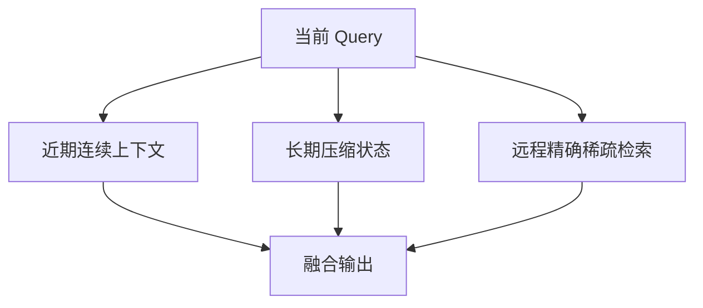

# 参考实现验证与资料

> 类型：专题详解。所属：[专题总览](README.md)。涉及模型版本、API 和性能数字的旧稿内容尚未逐条重新核验，见[版本与验证范围](../../版本与验证范围.md)。

<a id="read-23"></a>

<a id="22-一个可实现的-reference-pipeline"></a>

## 一个可实现的 Reference Pipeline

下面的伪代码强调接口与正确性，不代表高性能生产实现。

```python
def sparse_decode_step(
    hidden,                 # [B, d_model]
    index_k_pages,          # paged index K cache
    index_scale_pages,
    latent_kv_pages,        # paged MLA KV cache
    latent_scale_pages,
    block_tables,
    context_lens,
    topk,
):
    # 1. 当前 token 产生主 Query 与 Indexer Query
    q_main = project_mla_query(hidden)
    q_index, head_weight = project_index_query(hidden)

    # 2. 扫描每个 request 的合法历史；高性能实现应融合 mask 和 Top-K
    scores = paged_index_logits(
        q_index,
        index_k_pages,
        index_scale_pages,
        block_tables,
        context_lens,
        head_weight,
    )

    # 3. 历史不足 topk 时使用明确 invalid sentinel
    logical_indices = masked_topk(scores, topk, invalid_value=-1)

    # 4. Sparse kernel 内部直接解析 page，不先 materialize gathered KV
    out = sparse_mla_attention(
        q_main,
        latent_kv_pages,
        latent_scale_pages,
        block_tables,
        logical_indices,
        context_lens,
    )
    return out
```

生产版通常进一步：

- score + Top-K 融合；
- Query projection 与 cache append 融合；
- 按 context length/K bucket；
- indices 按 page 重排；
- 使用 CUDA Graph 固定 workspace；
- 根据 break-even threshold 动态选择 dense/sparse；
- 与 scheduler 交换 cost estimate。

---


<a id="read-24"></a>

<a id="23-kernel-设计检查表"></a>

## Kernel 设计检查表

<a id="231-indexer-logits-kernel"></a>

### 1 Indexer logits kernel

- Q/K 精度和 scale 粒度是什么？
- Indexer K 是 contiguous 还是 paged？
- packed requests 如何提供合法区间？
- invalid logits 是否真正为 $-\infty$，还是依赖 clean buffer？
- ReLU 与 head weighting 的顺序是否与 reference 一致？
- accumulation 是 FP32 还是低精度？
- RoPE layout 是否正确？

<a id="232-top-k-kernel"></a>

### 2 Top-K kernel

- 是否物化 $[Q,L]$ logits？
- tie-break 是否确定？
- 历史少于 K 时如何 padding？
- indices 是 score order、time order 还是 page order？
- 多 CTA 合并的 workspace 多大？
- Graph capture 下 workspace 地址是否稳定？

<a id="233-sparse-attention-kernel"></a>

### 3 Sparse Attention kernel

- index 表示逻辑 token 还是编码后的 page/offset？
- `-1` 和越界 index 如何 mask？
- 相同 index 是否允许重复？
- causal validity 是上层保证还是 kernel 再检查？
- MQA/GQA 的 KV reuse 是否实现？
- FP8 scale 是否与 vector 一起 coalesce？
- online softmax 跨 split 如何合并？
- selected K 非 tile 倍数时如何处理？

<a id="234-runtime"></a>

### 4 Runtime

- cache append 同时写主 KV 和 index K 吗？
- 两类 cache 的 page size 可否不同？
- request swap/preemption 是否原子更新两类 cache？
- prefix cache 是否包含 index K？
- P/D transfer 是否携带 scale 与 layout version？
- backend fallback 是否保证 numerical/semantic parity？

---


<a id="read-25"></a>

<a id="24-profiling把端到端耗时拆对"></a>

## Profiling：把端到端耗时拆对

建议将每层/每 step 拆为：

```math
T=
T_{proj}
+T_{index-logits}
+T_{topk}
+T_{mapping}
+T_{sparse-attn}
+T_{other}.
```

<a id="241-必看指标"></a>

### 1 必看指标

| 层次 | 指标 |
|---|---|
| Model | LM loss、long-context retrieval、exact match、selector recall/mass coverage |
| Indexer | candidates/s、effective bandwidth、Top-K recall、score entropy |
| Top-K | GB/s、comparison count、workspace、p95 latency |
| Memory | 主 KV bytes、index cache bytes、unique pages、overfetch factor、L2 hit rate |
| Kernel | occupancy、registers、SM utilization、Tensor Core utilization |
| Runtime | TTFT、ITL、throughput、batch size、queue time、fallback ratio |
| Scheduler | step skew、超长请求占比、preemption、bucket occupancy |

<a id="242-nsight-中常见现象"></a>

### 2 Nsight 中常见现象

- Indexer GEMM 很快，但 logits 写 HBM 很大：需要 fused/streaming Top-K；
- Sparse Attention DRAM throughput 不高、stall memory dependency 高：随机 gather 和低 transaction 利用率；
- occupancy 低：寄存器中维护太多 Top-K 或 softmax state；
- kernel 数量暴增：prefill/decode、request、head 被过度拆分；
- Top-K 成为长尾：不同 context length 未 bucket；
- L2 hit 低：indices 未按 page/locality 排列或 batch working set 过大。

<a id="243-正确的对照组"></a>

### 3 正确的对照组

至少比较：

1. Dense baseline（相同 MLA/GQA、相同量化）；
2. Sparse Attention only（indices 预生成）；
3. Indexer + Top-K + Sparse 完整链路；
4. 加入 runtime/continuous batching 的端到端链路。

否则很容易把“核心 kernel 快”误认为“服务快”。

---


<a id="read-26"></a>

<a id="25-troubleshooting按症状找根因"></a>

## Troubleshooting：按症状找根因

<a id="251-输出从第一-token-就明显错误"></a>

### 1 输出从第一 token 就明显错误

优先检查：

1. Indexer/MLA RoPE layout；
2. logical index 到 physical page 映射；
3. scale stride 与 dtype；
4. MQA/GQA head mapping；
5. invalid index mask；
6. causal/request boundary。

先用很短序列令 $K\ge L$，Sparse 路径应接近 Dense 路径。若此时仍不一致，问题多半不是 selector quality，而是 kernel/layout correctness。

<a id="252-短序列正常长序列逐渐错误"></a>

### 2 短序列正常，长序列逐渐错误

检查：

- position scaling / RoPE extrapolation；
- block table 越界或整型宽度；
- page 回收后的 stale index；
- Top-K 多 CTA merge；
- very negative mask 在低精度下是否有效；
- online softmax 数值稳定性。

<a id="253-离线正确continuous-batching-错"></a>

### 3 离线正确，continuous batching 错

检查：

- packed `k_start/k_end`；
- request 重排后的 metadata；
- prefix-shared page；
- preemption/swap；
- mixed prefill+decode 的 shape dispatch；
- CUDA Graph replay 使用了旧 context length。

<a id="254-kernel-很快端到端没收益"></a>

### 4 Kernel 很快，端到端没收益

检查：

- Indexer 与 Top-K 是否计时；
- logits 是否物化；
- 是否先 gather 再 attention；
- CPU 构建 indices/page mapping 是否阻塞；
- 同步点与 launch 数；
- 其他模型部分已成为瓶颈；
- $L$ 尚未超过 break-even threshold。

<a id="255-hbm-明明少读latency-仍很高"></a>

### 5 HBM 明明少读，latency 仍很高

可能原因：

- 读取太随机，memory-level parallelism 不足；
- 单次 transaction 只用少量 byte；
- page-table dependency 串行；
- batch 太小，SM 不满；
- Top-K/softmax 状态导致 occupancy 低；
- split-K reduction 抵消收益。

---


<a id="read-27"></a>

<a id="26-常见误区"></a>

## 常见误区

### 误区 1：Sparse Attention 把 KV Cache 容量降到 $O(K)$

不一定。若为了未来 Query 的动态检索而保留所有历史 KV，容量仍是 $O(L)$；只是单步读取约为 $O(K)$。只有 eviction、window、compression 或分层 offload 才改变容量曲线。

### 误区 2：Top-K 后复杂度就是 $O(K)$

只看主 Attention 是；完整路径还包括找 Top-K。全扫描 Indexer 的 decode 仍是 $O(L)$，prefill 仍可能是 $O(L^2)$，只是维度和常数更小。

### 误区 3：越稀疏越快

当 K 太小，质量下降；当工作量太小，launch、addressing、underutilization 占比上升。最优 K 是模型质量与硬件效率的联合结果。

### 误区 4：Token-level 一定优于 block-level

Token-level 选择更精细，但 block-level 常能用连续读取、Tensor Core tiles 与 KV reuse 获得更高实际速度。

### 误区 5：有 FlashAttention 就不需要 Sparse Attention

FlashAttention 主要避免中间矩阵 HBM IO，仍计算 dense pattern；Sparse Attention 减少有效 pairs。二者可以组合。

### 误区 6：只要 Attention 权重本身稀疏，就能免费利用

Softmax 后许多权重很小，不代表在计算 logits 前就知道哪些位置小。可执行的 sparsity 需要可预测 pattern 或低成本 selector。

### 误区 7：Indexer 与主 Attention 应共享完全相同表示

共享可省参数，但可能让选择本身太贵。Indexer 的职责是高 recall 候选生成，不必复制主 Attention 的全部表达能力。

### 误区 8：Kernel 支持 sparse decode 就等于模型支持长上下文

还需要训练适配、position encoding、cache capacity、prefill、scheduler、P/D transfer、正确性与任务评测共同成立。

---


<a id="read-28"></a>

<a id="27-sparse-attention-与-linear-attention最终为什么常走向-hybrid"></a>

## Sparse Attention 与 Linear Attention：最终为什么常走向 Hybrid

Sparse Attention 与 Linear Attention 解决的是不同 memory requirement。

| 维度 | Sparse Attention | Linear/Recurrent Attention |
|---|---|---|
| 历史表示 | 保留原 token KV 或其精确表示 | 压缩进固定/有限 state |
| 单步访问 | Top-K / Top-block | 固定 state |
| 序列容量 | 常仍为 $O(L)$ | 相对序列长度近似 $O(1)$ |
| 精确 retrieval | 强 | 通常较弱 |
| Indexer | 通常需要 | 不需要全历史 Indexer |
| 信息损失 | 主要来自 selection miss | 来自 state compression |

单纯 Sparse 的问题：Indexer 仍扫长历史，Cache 仍增长。

单纯 Linear 的问题：百万 token 被压入有限 state，难以恢复某个精确 UUID 或代码行。

Hybrid 的分工是：



- Sliding window：低延迟 recent memory；
- Linear/compressed state：低成本 global summary；
- Sparse exact attention：按需读取原始远程细节。

从系统角度，它越来越像 memory hierarchy：不是所有信息都在每一步走最昂贵的路径。

---


<a id="read-29"></a>

<a id="28-一个数值算例从-dense-mla-到-sparse-mla"></a>

## 一个数值算例：从 Dense MLA 到 Sparse MLA

这里只做示意，不绑定具体硬件峰值。

设：

- context $L=1,048,576$；
- $K=2048$；
- 主 latent KV record 为 656 byte/token（某公开 vLLM DSA 实现对其 FP8 MLA cache layout 的说明值）；
- Indexer record 假设为 $128$ byte FP8 vector 加 scale/alignment，这里仅用 $132$ byte 粗估；
- batch $B=1$。

<a id="281-dense-mla-主-cache-单层单步读取"></a>

### 1 Dense MLA 主 Cache 单层单步读取

```math
1,048,576\times656
\approx656\text{ MiB}.
```

<a id="282-sparse-主-attention-读取"></a>

### 2 Sparse 主 Attention 读取

```math
2048\times656
\approx1.28\text{ MiB}.
```

<a id="283-indexer-扫描读取"></a>

### 3 Indexer 扫描读取

```math
1,048,576\times132
\approx132\text{ MiB}.
```

理想化合计约：

```math
132+1.28\approx133.3\text{ MiB},
```

相比仅主 Cache dense 读取下降约：

```math
\frac{656}{133.3}\approx4.9\times.
```

注意：

- 这不是端到端速度比；
- 未计 Q、weights、indices、page table、scale 实际布局和 transaction overfetch；
- Indexer 还有 dot products 与 Top-K；
- 主 Cache record 值来自特定公开实现说明；
- 不同模型/layout 会得到完全不同数字。

这个算例最重要的结论反而是：当主 Attention 从 656 MiB 降到 1.28 MiB 后，132 MiB 的 Indexer 扫描立刻成为主角。

---


<a id="read-30"></a>

<a id="29-如何选择方案一个工程决策表"></a>

## 如何选择方案：一个工程决策表

| 目标场景 | 优先考虑 | 原因 |
|---|---|---|
| 固定内存无限流式输入 | window + sink / eviction | 容量真正固定 |
| 现有 dense 模型的长 prefill | MInference 类 retrofit | 无需重新训练，针对 prefill |
| 原生长上下文训练 | block/native sparse，如 NSA 路线 | forward/backward 与硬件共同设计 |
| 长上下文 decode + 精确 recall | learned dynamic sparse，如 DSA 路线 | 按 Query 选远程原 token |
| 极长 context、Indexer 扫描也贵 | hierarchical compressed index | 先缩候选空间 |
| 对精确 recall 和长期摘要都强需求 | Linear/Compressed + Sparse hybrid | 两种记忆互补 |
| 短 context / 小模型 | Dense FlashAttention | 固定 overhead 低、连续计算高效 |

工程上不要先问“哪种 Sparse Attention 最先进”，而应先问：

1. 要优化 prefill、decode 还是 training？
2. 要降低 FLOPs、HBM traffic 还是 Cache capacity？
3. 是否允许重新训练？
4. 是否必须精确召回任意历史 token？
5. 目标 GPU、page allocator 和 scheduler 支持什么 layout？
6. Indexer 的成本是否进入端到端测量？

---


<a id="read-31"></a>

<a id="30-学习与实现路线"></a>

## 学习与实现路线

### 第一阶段：先写对

1. 用 dense reference 生成 full logits；
2. 离线 Top-K 得到 indices；
3. 写 `gather + dense attention` reference；
4. 校验 $K\ge L$ 时与 dense 等价；
5. 加入 causal、packed requests 与 `-1` padding。

### 第二阶段：直接消费 paged indices

1. 统一 logical index contract；
2. kernel 内做 page mapping；
3. online softmax，不物化 selected logits；
4. 支持 MQA/GQA group sharing；
5. 支持 FP8 KV 与 scale。

### 第三阶段：优化 Indexer + Top-K

1. paged index-K cache；
2. score tile + streaming Top-K；
3. 融合 mask；
4. bucket context lengths；
5. 测试 logits-materialized 与 fused 的 break-even。

### 第四阶段：接入 Serving runtime

1. continuous batching metadata；
2. chunked prefill；
3. prefix cache；
4. preemption/swap；
5. CUDA Graph；
6. scheduler cost model；
7. P/D disaggregation transfer。

### 第五阶段：再谈模型质量

1. selector recall / mass coverage；
2. passkey、needle、code retrieval 与真实 agent trace；
3. 距离分桶与 rare critical cases；
4. K、window、global/compression branch ablation；
5. dense fallback 或 confidence-based dynamic K。

---


<a id="read-32"></a>

<a id="31-最终心智模型"></a>

## 最终心智模型

Sparse Attention 不是“把 Attention matrix 里的零跳过去”。真正可部署的系统必须提前、低成本地知道哪些 pair 值得计算，并让这些 pair 映射到 GPU 友好的数据布局。

它的完整因果链是：

```math
\text{Long context}
\rightarrow
\text{Dense Attention scans all history}
\rightarrow
\text{Learned/fixed sparse access}
\rightarrow
\text{Main Attention drops to Top-K}
\rightarrow
\text{Indexer + Top-K + gather become bottlenecks}
\rightarrow
\text{block/compression/share/fusion}
\rightarrow
\text{Hierarchical memory + Hybrid Attention}.
```

如果只记住五句话：

1. MLA 缩窄每个历史 token；Sparse Attention 减少实际访问的历史 token。
2. Sparse compute 不等于 Sparse Cache capacity，全量历史往往仍要保存。
3. 主 Attention 变便宜后，Indexer 与 Top-K 会成为新的 Amdahl bottleneck。
4. Token-level 选择更精确，block-level 选择通常更硬件友好。
5. 最终的架构很可能不是纯 Sparse，而是 recent window、compressed/linear state 与 sparse exact retrieval 的多级记忆系统。

---


<a id="read-33"></a>

<a id="32-参考资料与阅读顺序"></a>

## 参考资料与阅读顺序

以下优先列论文、官方仓库和官方工程文章。版本相关实现细节应以实际部署版本为准。

1. **DeepSeek-V3.2: Pushing the Frontier of Open Large Language Models**\
   https://arxiv.org/abs/2512.02556\
   重点：DSA Indexer 公式、dense warm-up、sparse continued training、Top-K=2048 与 MLA MQA-mode 稀疏执行。

2. **DeepSeek-V3.2-Exp official repository**\
   https://github.com/deepseek-ai/DeepSeek-V3.2-Exp\
   重点：公开模型/算子入口，以及 Indexer RoPE layout 修复说明。

3. **DeepGEMM**\
   https://github.com/deepseek-ai/DeepGEMM\
   重点：V3.2 MQA Indexer logits kernel，包括 paged 与 non-paged 形态、FP8 输入和 head-weighted ReLU score。

4. **FlashMLA**\
   https://github.com/deepseek-ai/FlashMLA\
   重点：token-level sparse prefill/decode、indices contract、FP8 KV cache decode。

5. **vLLM: DeepSeek-V3.2-Exp / DSA engineering blog**\
   https://vllm.ai/blog/2025-09-29-deepseek-v3-2\
   重点：continuous batching、separate index K cache、Top-K、FP8 MLA cache layout 与 paged integration。

6. **SGLang: Running DeepSeek-V3.2-Exp**\
   https://www.lmsys.org/blog/2025-09-29-deepseek-V32/\
   重点：Native Sparse Attention backend、Indexer cache、FlashMLA/FA3 集成与当时版本的混合 page-size 约束。

7. **Native Sparse Attention: Hardware-Aligned and Natively Trainable Sparse Attention**\
   https://arxiv.org/abs/2502.11089\
   重点：compression + block selection + sliding window 三分支、GQA group-shared block selection 与训练期稀疏 kernel。

8. **MInference 1.0: Accelerating Pre-filling for Long-Context LLMs via Dynamic Sparse Attention**\
   https://arxiv.org/abs/2407.02490\
   官方实现：https://github.com/microsoft/minference\
   重点：无需重训的 prefill retrofit，以及 A-shape、vertical-slash、block-sparse pattern。

9. **Big Bird: Transformers for Longer Sequences**\
   https://arxiv.org/abs/2007.14062\
   重点：local + random + global 稀疏图结构及理论性质。

10. **StreamingLLM: Efficient Streaming Language Models with Attention Sinks**\
    https://arxiv.org/abs/2309.17453\
    重点：为什么单纯 recent window 会崩，以及 attention sink 对固定内存流式推理的作用。

11. **FlashAttention: Fast and Memory-Efficient Exact Attention with IO-Awareness**\
    https://arxiv.org/abs/2205.14135\
    重点：区分“精确 dense Attention 的 IO 优化”和“减少有效 pair 的 sparsity”。

---


<a id="read-34"></a>

<a id="33-与下一专题的接口"></a>

## 与下一专题的接口

本文停在一个尚未解决的问题：即使主 Attention 只读 Top-K，动态 Indexer 仍可能扫描全部历史，主 KV Cache 也可能继续按 $O(L)$ 增长。

下一篇 `Linear-Attention.md` 应从这里接上，重点回答：

- 如何把历史递推压缩为固定大小 state；
- kernelized linear attention、state-space recurrence 与 gated delta rule 有何关系；
- prefill 如何并行 scan，decode 如何常数状态更新；
- 为什么 sequence memory 能从 $O(L)$ 变为相对长度的 $O(1)$；
- fixed state 为什么损害 exact retrieval；
- GLA、DeltaNet、Gated DeltaNet、KDA 等结构怎样落到 fused recurrent/chunk kernels；
- 为什么最终仍需要 Sparse/MLA 层补充精确远程记忆。

---

[所属专题](README.md) · [百科总览](../../README.md)
