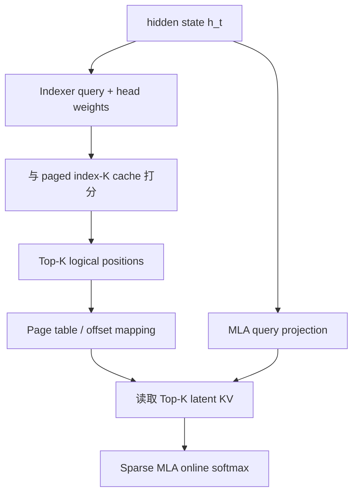

# 索引器与Kernel数据流

> 类型：专题详解。所属：[专题总览](README.md)。涉及模型版本、API 和性能数字的旧稿内容尚未逐条重新核验，见[版本与验证范围](../../版本与验证范围.md)。

<a id="read-07"></a>

<a id="6-deepseek-sparse-attentiondsa结构与张量流"></a>

## DeepSeek Sparse Attention（DSA）：结构与张量流

DSA 指 DeepSeek Sparse Attention。DeepSeek-V3.2 论文把它描述为在 MLA 上加入 lightning indexer 与 fine-grained token selection，并通过 continued training 从 dense 模型过渡到稀疏模型。

<a id="61-index-score"></a>

### 1 Index score

论文给出的 Indexer 分数是：

```math
I_{t,s}
=\sum_{j=1}^{H^I}
w^I_{t,j}
\operatorname{ReLU}
\left(q^I_{t,j}\cdot k^I_s\right).
```

关键点：

- 一个历史位置只存轻量 $k^I_s$；
- 当前 Query 产生多个 $q^I_{t,j}$ 与权重 $w^I_{t,j}$；
- ReLU 后跨 index heads 加权汇总为每个历史 token 一个 scalar score；
- 再对历史位置做 Top-K；
- 主 Sparse MLA 只读取被选中的 latent KV。

官方公开推理配置中可见一组实例值：

| 参数 | 公开配置值 | 含义 |
|---|---:|---|
| `index_n_heads` | 64 | Indexer query heads |
| `index_head_dim` | 128 | Index head dimension |
| `index_topk` | 2048 | 每个 Query 选取的历史位置数 |

这些是该公开 checkpoint/实现的配置，不应被理解为所有 Sparse Attention 的固定常数。

<a id="62-为什么-dsa-在-mla-的-mqa-mode-上执行稀疏访问"></a>

### 2 为什么 DSA 在 MLA 的 MQA mode 上执行稀疏访问

MLA 的 latent KV 可在 kernel 层面被所有 Query heads 共享。若每个 Query head 独立选 token，真正需要从 HBM 读取的是各 head 选择集合的并集：

```math
\mathcal U_t
=\bigcup_{h=1}^{H_q}\mathcal S_{t,h}.
```

即使每个 head 只选 $K$，$|\mathcal U_t|$ 也可能远大于 $K$。因此共享选择集合能让同一份 KV 载入后被多个 Query heads 复用，提高 arithmetic intensity。

这也是为什么“per-head sparsity 很高”未必意味着“KV traffic 很低”。真正要统计的是：

```math
\text{unique KV records loaded per GQA/MQA group}.
```

<a id="63-dsa-的单个-decode-token-数据流"></a>

### 3 DSA 的单个 decode token 数据流



这里至少有两套历史 Cache：

1. MLA latent KV cache：供精确主 Attention 使用；
2. Indexer K cache：供轻量候选打分使用。

“Sparse Attention 省 Cache”不是无条件成立。DSA 新增了 Indexer cache，但它希望通过一个明显更小、更便宜的索引表示，换取少读大量主 KV。

---


<a id="read-08"></a>

<a id="7-dsa-如何训练不能把离散-top-k-直接扔给模型自己摸索"></a>

## DSA 如何训练：不能把离散 Top-K 直接扔给模型自己摸索

离散 Top-K 对 index 不可导，而且随机初始化的 Indexer 一开始会漏掉重要 token。DSA 的公开训练路线分为两个阶段。

<a id="71-dense-warm-up冻结主模型只教-indexer-模仿-attention"></a>

### 1 Dense warm-up：冻结主模型，只教 Indexer 模仿 Attention

这一阶段仍执行 full/dense Attention。把主 Attention 跨 heads 聚合并在序列维归一化，得到 teacher distribution：

```math
p_{t,:}.
```

Indexer 的分布为：

```math
\widehat p_{t,:}
=\operatorname{Softmax}(I_{t,:}).
```

训练目标使用 KL divergence：

```math
\mathcal L^I
=\sum_t D_{KL}
\left(p_{t,:}\,\|\,\widehat p_{t,:}\right).
```

公开论文中的阶段配置为：

- 仅更新 Indexer，其余参数冻结；
- learning rate $10^{-3}$；
- 1000 steps；
- 每 step 为 $16\times128\text{K}$ tokens；
- 总量约 2.1B tokens。

这些数字用于理解训练规模，不能脱离 checkpoint 与 recipe 机械照搬。

<a id="72-sparse-stage主模型适应只能看到被选集合"></a>

### 2 Sparse stage：主模型适应“只能看到被选集合”

第二阶段真正启用 Top-K Sparse Attention：

- 主模型由 language modeling loss 更新；
- Indexer 仍由 $\mathcal L^I$ 更新；
- Indexer 输入从主干 detach，避免 Indexer loss 反向改变 backbone representation；
- teacher alignment 只在被选集合等相应定义域上处理；
- 公开配置使用 $K=2048$。

论文报告的该阶段配置为：

- learning rate $7.3\times10^{-6}$；
- 15,000 steps；
- 每 step 为 $480\times128\text{K}$ tokens；
- 总量约 943.7B tokens。

这个阶段的核心意义是：

> Indexer 学会召回，主模型同时学会在召回不完美的情况下重组信息。

只训练 Indexer 而不让 backbone 适应稀疏可见性，通常不能等价于原生或 continued-trained 稀疏模型。

<a id="73-为什么-detach-很重要"></a>

### 3 为什么 detach 很重要

若 $\mathcal L^I$ 直接回传到 hidden states，主模型可能为了让 Indexer 更容易模仿而扭曲表示；与此同时 LM loss 希望表示服务于生成目标。detach 把优化职责分开：

```math
\nabla_{\theta_{\text{backbone}}}\mathcal L^I=0,
\qquad
\nabla_{\theta_{\text{indexer}}}\mathcal L_{LM}=0
\quad\text{（按该训练解耦理解）}.
```

这不是唯一可能的训练策略，但它体现了选择器与主干之间需要明确的 gradient contract。

---


<a id="read-09"></a>

<a id="8-indexer-为什么会成为新瓶颈"></a>

## Indexer 为什么会成为新瓶颈

<a id="81-复杂度只是把昂贵算子换成便宜算子"></a>

### 1 复杂度只是把昂贵算子换成便宜算子

对长度 $L$ 的 prefill，主 Sparse Attention 约为：

```math
O(LKd_{\text{main}}).
```

但若 Indexer 为每个 Query 对全部历史打分，仍是：

```math
O(L^2d_I).
```

Decode 单步：

```math
T_{\text{index}}=O(Ld_I),
\qquad
T_{\text{main}}=O(Kd_{\text{main}}).
```

Indexer 的常数可以很小、可以 FP8、可共享 KV、可避免 Value 路径，因此仍能带来巨大收益；但随着主 Attention 被压到很小，Indexer 占比自然上升。

<a id="82-数量级示例"></a>

### 2 数量级示例

设：

- $L=1,048,576$；
- $K=2048$；
- Indexer dimension $d_I=128$；
- 主 Attention 有效 dimension 远大于 $d_I$ 且还需 Value 聚合。

候选数缩减比是：

```math
\frac{L}{K}=512.
```

但 Indexer 仍需为每个 decode Query 看约 100 万个候选。即便每个候选只做较小点积和少量 reduction，它也不是 $O(1)$。

<a id="83-进一步优化-indexer-的方向"></a>

### 3 进一步优化 Indexer 的方向

| 方向 | 核心思想 | 新 trade-off |
|---|---|---|
| 降低 $d_I$ / 低精度 | 每个候选更便宜 | 选择 recall 下降风险 |
| Block index | 从 $L$ 个 token 降到 $L/b$ 个块 | 块内 overfetch |
| Compressed hierarchy | 先粗排 region，再细排 token | 多级状态与训练复杂度 |
| 跨层共享 index | 多层复用选择结果 | 各层需求不一致 |
| 跨相邻 Query 复用 | 利用选择集合时间局部性 | Query 变化时 stale |
| 近似 ANN / hashing | 减少全量扫描 | 可训练性、GPU irregularity |
| Fused score + Top-K | 不物化全部 logits | kernel 复杂、寄存器/共享内存压力 |

所以 Sparse Attention 的下一阶段常常不是“更稀疏”，而是：

```math
\boxed{\text{让找出稀疏集合的过程也分层、可复用、可融合}}
```

---


<a id="read-10"></a>

<a id="9-top-k-不是一个小算子为什么-logits-物化会爆"></a>

## Top-K 不是一个小算子：为什么 logits 物化会爆

<a id="91-朴素实现"></a>

### 1 朴素实现

对 $Q$ 个 Query、$N$ 个候选：

```text
scores = indexer(q, k_index)   # [Q, N]
indices = topk(scores, K)      # [Q, K]
output = sparse_attention(q_main, kv_main, indices)
```

仅 `scores` 临时张量就需要：

```math
Q\cdot N\cdot b_{score}\ \text{bytes}.
```

例如 $Q=4096$、$N=128\text{K}$、score 为 FP16：

```math
4096\times131072\times2
=1\text{ GiB}.
```

这还只是一个 batch 中的一个 Indexer 输出，不含 Q/K、Top-K workspace 与主 Attention。

<a id="92-streaming-top-k"></a>

### 2 Streaming Top-K

更合理的实现把候选按 tile 扫描：

1. 计算一个 $N_{tile}$ 的 score tile；
2. 与当前局部 Top-K 合并；
3. 丢弃非候选 score；
4. 扫完后只写 $[Q,K]$ indices。

临时状态从 $O(QN)$ 降到近似：

```math
O(QK+QN_{tile}).
```

但 Top-K 并不是简单 associative reduction。实现需要在：

- 每 thread 局部候选；
- warp-level merge；
- CTA-level merge；
- 多 tile / 多 CTA 全局合并

之间权衡。$K=2048$ 时，候选状态本身已经很大，无法全部常驻寄存器。

<a id="93-fused-indexer--top-k-的收益与代价"></a>

### 3 Fused Indexer + Top-K 的收益与代价

收益：

- 不写完整 score matrix 到 HBM；
- 少一次 kernel launch；
- score 可在寄存器/共享内存中立即筛选；
- 可同时应用 causal/request mask。

代价：

- kernel 更难调优；
- selection 逻辑会降低纯 GEMM 吞吐；
- $K$、head 数、dtype、page layout 改变时可能需要不同特化；
- 多 CTA 合并需要额外 workspace 或第二阶段 reduction。

<a id="94-top-k-结果需要排序吗"></a>

### 4 Top-K 结果需要排序吗

主 Attention 数学上不要求 indices 按时间排序，只要每个 Key/Value 与位置编码、mask 一致。但排序可能带来：

- 更好的 page locality；
- 更容易合并同 page token；
- 更规则的 prefetch；
- 更确定的 kernel 执行顺序。

另一方面，按 score 排序有利于 early pruning 或分层读取。选择何种顺序是 kernel contract，不应由上层随意假设。

---


<a id="read-11"></a>

<a id="10-从逻辑-token-到物理-kv-page"></a>

## 从逻辑 token 到物理 KV page

Serving 中 KV Cache 通常是 paged 的。Indexer 输出的是逻辑位置 $s$，Sparse Attention 需要定位物理 page 与 page offset。

设主 KV page size 为 $P$：

```math
\text{logical\_block}=\left\lfloor\frac{s}{P}\right\rfloor,
\qquad
\text{offset}=s\bmod P.
```

再由请求的 block table 得到物理 page：

```math
\text{physical\_page}
=\text{block\_table}[request,\text{logical\_block}].
```

最终地址近似为：

```math
\text{addr}
=\text{base}
+\text{physical\_page}\cdot\text{page\_stride}
+\text{offset}\cdot\text{token\_stride}.
```

<a id="101-为什么不要先-gather-成连续临时-kv"></a>

### 1 为什么不要先 gather 成连续临时 KV

最直观的两阶段实现：

```text
selected_kv = gather(paged_kv, indices)
out = dense_attention(q, selected_kv)
```

它容易验证，但多出：

1. 从 paged KV 读；
2. 向临时 buffer 写；
3. Dense Attention 再读临时 buffer。

更优的 Sparse Attention kernel 通常直接消费 indices，在 tile 循环中从 paged KV 载入被选位置并执行 online softmax，避免 materialized gather buffer。

<a id="102-但直接-indexed-load-也不是免费"></a>

### 2 但直接 indexed load 也不是免费

- 同一个 warp 的 threads 可能访问不同 pages；
- coalescing 变差；
- TLB/cache locality 变差；
- page table 读取和整数地址计算增加；
- 同 page 的重复位置若未去重会浪费带宽；
- 不同 Query 的 Top-K pages 几乎不重合时，batch reuse 很差。

因此需要统计的不只是 $K$，还包括：

```math
\text{unique pages},\quad
\text{tokens per selected page},\quad
\text{cross-query page reuse}.
```

<a id="103-page-size-是算法与-allocator-的共同参数"></a>

### 3 Page size 是算法与 allocator 的共同参数

大 page：

- block table 小；
- 地址翻译少；
- 更容易连续预取；
- 但动态稀疏可能只用 page 中少量 token，overfetch 大。

小 page：

- 精细分配与选择；
- 但 metadata、fragmentation、page-table traffic 增加。

因此 index block、KV page、kernel tile 三个粒度最好协同设计，而不是各自独立选择。

---


<a id="read-12"></a>

<a id="11-prefill-sparse-attention二维-ragged-问题"></a>

## Prefill Sparse Attention：二维 ragged 问题

Decode 常可简化为“每个请求一个 Query”。Prefill 中却有 $Q$ 个 Query，每个 Query 的 causal 可见范围和 Top-K 都不同：

```math
\text{indices}\in\mathbb Z^{Q\times K}.
```

对第 $i$ 个 Query，其合法 Key 范围可表示为：

```math
[k^{start}_i,k^{end}_i).
```

在 packed batching 中，不同请求的 Query 和历史可能拼接在一起，`k_start/k_end` 防止跨请求读取。

<a id="111-prefill-的三种典型形态"></a>

### 1 Prefill 的三种典型形态

| 场景 | Query 数 | 历史长度 | 特点 |
|---|---:|---:|---|
| 初次长 prompt | 大 | 从短到长 | 因果三角、选择矩阵大 |
| Chunked prefill | 中等 | 已有 prefix + chunk | 每个 Query 看到 prefix 与 chunk 前缀 |
| Prefix cache hit | 中等 | 共享 prefix 很长 | page 共享、copy-on-write 与稀疏索引交叉 |

<a id="112-为什么短-prefill-可能回退-dense"></a>

### 2 为什么短 prefill 可能回退 dense

在短序列下：

- Dense FlashAttention 的 tile 很规整；
- Indexer + Top-K overhead 占比高；
- $L\le K$ 时根本无稀疏空间；
- 稀疏 kernel 的 indirect load 可能比 dense 连续读更慢。

合理 runtime 应按 $L$、$Q$、$K$、dtype、GPU 与 cache layout 选择 dense 或 sparse backend，而不是所有长度强制走同一路径。

<a id="113-prefill-forward-只是训练支持的一半"></a>

### 3 Prefill forward 只是训练支持的一半

原生 sparse training 还需要 backward：

- $dQ$ 对应多个 selected blocks 的累加；
- $dK/dV$ 会被许多 Query 稀疏写入；
- 同一历史 block 被多个 Query 选择时需要规约；
- selection 本身通常离散，梯度策略需另行定义；
- activation checkpointing 要重新执行 Indexer/Top-K，需保证确定性。

一个只有 decode kernel 的项目不能因此宣称“支持 Sparse Attention 训练”。

---


<a id="read-13"></a>

<a id="12-decode-sparse-attention低算术强度与大量小任务"></a>

## Decode Sparse Attention：低算术强度与大量小任务

Decode 的 Query 维通常很小。Sparse kernel 的基本循环近似：

```text
for each request/query:
    load q heads
    for each selected KV tile:
        resolve page addresses
        load/dequantize K
        update online-softmax max/sum
        load/dequantize V
        accumulate output
```

<a id="121-mqagqa-group-centric-调度"></a>

### 1 MQA/GQA group-centric 调度

如果多个 Query heads 共享同一 KV group 和同一 selected set，可以：

1. 把该组 Query heads 放入 SRAM/寄存器；
2. 每个 selected KV tile 只从 HBM 读取一次；
3. 对多个 Query heads 复用；
4. 在一个 fused loop 中完成 score、softmax 与 Value accumulation。

这比 per-head 独立 kernel 更能降低主 KV traffic。

<a id="122-为什么-batch-变大不一定线性变好"></a>

### 2 为什么 batch 变大不一定线性变好

Dense decode 的不同请求虽读不同 KV，但每个请求内部连续。Sparse decode 下，每个请求的 page 列表不规则，batch 增大后：

- SM 并行度提升；
- 但 page working set 变大；
- L2 reuse 可能下降；
- 每个请求不同 $K_{valid}$ 导致负载不均；
- Top-K 与 Attention 两个阶段之间产生 pipeline bubble。

需要通过真实 continuous batching trace 测量，而不是只测固定 batch 的随机 indices。

---


<a id="read-14"></a>

<a id="13-continuous-batching每个-query-都有自己的稀疏世界"></a>

## Continuous Batching：每个 Query 都有自己的稀疏世界

在线服务的一个 batch 可能同时包含：

- 正在 decode 的长请求；
- 刚进入的短 prompt；
- chunked prefill；
- prefix cache 命中请求；
- 即将结束或被抢占的请求。

因此 runtime 需要维护 ragged metadata：

| 元数据 | 作用 |
|---|---|
| query-to-request mapping | Query 属于哪个请求 |
| sequence/context length | causal 上界 |
| `k_start/k_end` | packed tensor 中合法候选区间 |
| block table | 逻辑 block 到物理 page |
| selected indices | 每个 Query 的 Top-K |
| valid count / `-1` padding | 历史不足 K 或对齐 |
| cache dtype/scale layout | FP8/量化解码 |

<a id="131-常见-correctness-bug"></a>

### 1 常见 correctness bug

1. Query 误读到相邻 request 的 KV；
2. chunked prefill Query 读到未来 token；
3. `-1` padding 被当作最后一个位置；
4. prefix-shared page 的逻辑位置与 RoPE position 混淆；
5. request 重排后 index 与 block table 未同步；
6. 被抢占请求的 page 已释放但异步 kernel 仍引用；
7. CUDA Graph replay 时 metadata 地址或 shape 不满足捕获假设。

<a id="132-调度器必须知道-sparse-backend-的成本模型"></a>

### 2 调度器必须知道 Sparse backend 的成本模型

仅按 token 数做 batch packing 不够。两个请求都有一个 Query，但一个 context 为 8K，另一个为 1M：Indexer 工作量差 125 倍。更合理的调度成本可包含：

```math
C_i
=\alpha L_i
+\beta K_i
+\gamma U_i,
```

其中 $U_i$ 是预计 unique pages。这样调度器才能避免少数超长请求拖慢整个 decode step。

---


<a id="read-15"></a>

<a id="14-fp8-indexer-与-fp8-kv省带宽但-scale-也属于-layout"></a>

## FP8 Indexer 与 FP8 KV：省带宽，但 scale 也属于 layout

低精度可同时作用于：

- Indexer query/key；
- Indexer score GEMM；
- 主 latent KV cache；
- 主 Sparse Attention load/dequant 路径。

<a id="141-一个-fp8-indexer-logits-kernel-在做什么"></a>

### 1 一个 FP8 Indexer logits kernel 在做什么

DeepGEMM 公开的 V3.2 MQA indexer kernel 族可抽象为：

```text
q:       [num_query, H_I, d_I]    FP8
k_index: [num_kv, d_I]            FP8
k_scale: [num_kv]                 float scale
w:       [num_query, H_I]         float weights

for query i, candidate j:
    k_j = dequant(k_index[j], k_scale[j])
    per_head = q[i, :, :] @ k_j
    score[i, j] = sum(relu(per_head) * w[i, :])
```

生产实现还要处理 packed sequence 的合法区间、paged layout 与是否清理无效 logits。

<a id="142-scale-overhead-不能漏算"></a>

### 2 Scale overhead 不能漏算

如果每 token 的 FP8 vector 需要 scale，实际 byte 不只是“元素数 × 1 byte”：

```math
B_{record}
=d_I\cdot1\text{B}
+B_{scale}
+B_{alignment/padding}.
```

主 MLA Cache 也可能把 NoPE latent 部分与 RoPE 部分使用不同精度和布局。所有 byte ledger 都应以实际 cache record 结构为准。

<a id="143-写-cache-时量化比每次读时量化更合理"></a>

### 3 写 Cache 时量化比每次读时量化更合理

新 token 的 K/latent KV 在 append 到 page 时量化一次；之后多个 decode step 只读取 FP8 并在 kernel 内反量化。如果每一步都先把整个 Cache 转成 FP8，反而会增加一次完整历史扫描。

<a id="144-rope-layout-是-correctness-contract"></a>

### 4 RoPE layout 是 correctness contract

DeepSeek 官方仓库曾修复 Indexer RoPE 实现中的布局差异：Indexer 需要的 RoPE layout 与 MLA RoPE 的 interleaving 约定不能混用。教训是：

> “维度相同”不代表 tensor semantic layout 相同。

核对实现时要明确：

- rotary pair 是 interleaved 还是 split-half；
- position id 是绝对、相对还是经过 scaling；
- cached K 是否已应用 RoPE；
- Indexer 与主 MLA 是否复用同一 rotary helper；
- reference implementation 与 fused kernel 的 layout 是否一致。

---


<a id="read-16"></a>

<a id="15-sparse-mla-kernel不只是把-dense-mla-的-l-改成-k"></a>

## Sparse MLA kernel：不只是把 Dense MLA 的 L 改成 K

Dense MLA decode 常假设 KV 沿 sequence 连续或按 page 顺序遍历。Sparse MLA 接收：

```math
\text{indices}\in\mathbb Z^{B\times Q\times K},
```

每个 index 指向逻辑或编码后的 page/offset。kernel 还要完成：

1. invalid index mask；
2. page decode；
3. FP8 latent KV 与 scale 读取；
4. RoPE component 处理；
5. 多 Query heads 共享 latent KV；
6. online softmax；
7. Value/latent accumulation 与 up-projection contract。

FlashMLA 的公开仓库提供了 token-level sparse prefill/decode kernel 接口，并包含 FP8 KV cache 的 decode 路径。接口中 invalid index 使用 `-1`，这再次说明 padding 语义必须在上层和 kernel 间统一。

<a id="151-为什么需要不同的-prefilldecode-kernel"></a>

### 1 为什么需要不同的 prefill/decode kernel

| 维度 | Prefill | Decode |
|---|---|---|
| Query 数 | 大 | 小 |
| 主要瓶颈 | compute / scheduling | HBM bandwidth / latency |
| 稀疏结构 | 每行不同、二维 causal | 每请求少量行 |
| Query reuse | block 内可能有 | 较少 |
| 合适并行化 | Q tiles × heads × selected blocks | batch × groups × split-K |
| backward | 可能需要 | 不需要 |

试图用一个万能 kernel 覆盖两者，往往会牺牲其中一边。

<a id="152-split-k--split-selected-range"></a>

### 2 Split-K / split selected range

当单个 Query 的 $K$ 仍较大而 batch 较小时，可把 selected range 分给多个 CTA：

- 每个 CTA 计算局部 max、sum、output；
- 第二阶段按 online softmax 合并；
- 增加并行度，但多一轮 partial buffer 和 reduction。

是否值得取决于 $B$、$K$、head dims 与 GPU SM 数。

---

---

[所属专题](README.md) · [百科总览](../../README.md)
