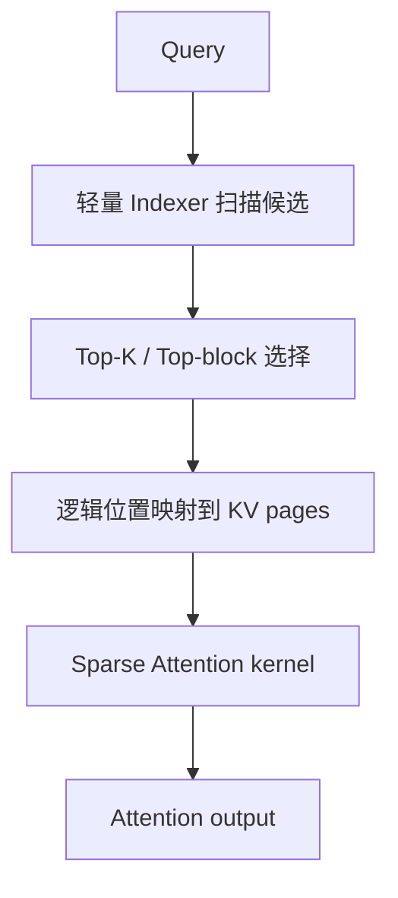

# 访问集合与稀疏模式

> 类型：专题详解。所属：[专题总览](README.md)。涉及模型版本、API 和性能数字的旧稿内容尚未逐条重新核验，见[版本与验证范围](../../版本与验证范围.md)。

<a id="read-01"></a>

<a id="0-先给结论sparse-attention-优化的不是-cache-宽度而是访问集合"></a>

## 先给结论：Sparse Attention 优化的不是 Cache 宽度，而是访问集合

标准因果 Attention 在位置 $t$ 生成 Query 后，要与所有历史位置交互：

```math
\mathcal H_t=\{1,2,\ldots,t\}.
```

Sparse Attention 为当前 Query 构造一个小得多的集合：

```math
\mathcal S_t\subseteq\mathcal H_t,
\qquad
|\mathcal S_t|=K\ll t,
```

再只对 $\mathcal S_t$ 中的 Key/Value 计算精确 Attention：

```math
o_t=
\sum_{s\in\mathcal S_t}
\operatorname{Softmax}_{s\in\mathcal S_t}
\left(\frac{q_tk_s^\top}{\sqrt{d_h}}+m_{t,s}\right)v_s.
```

它与 MLA 的分工可以压缩成两句话：

- MLA：减少 **每个历史位置有多少 byte**；
- Sparse Attention：减少 **每个 Query 访问多少历史位置**。

因此二者不是替代关系，而是乘法关系。若每个历史位置的 Cache 从 $B_{\text{dense}}$ byte 压到 $B_{\text{latent}}$ byte，同时读取位置从 $L$ 个降到 $K$ 个，那么理想化的 decode KV 读流量从：

```math
L\cdot B_{\text{dense}}
```

降为：

```math
K\cdot B_{\text{latent}}.
```

但“如何从 $L$ 个候选中找到 $K$ 个位置”不会凭空免费。完整路径是：



所以真正的系统公式不是“Attention 从 $L$ 变成 $K$”这么简单，而是：

```math
T_{\text{sparse}}
=T_{\text{index}}
+T_{\text{select}}
+T_{\text{address}}
+T_{\text{sparse-attn}}
+T_{\text{launch/sync}}.
```

Sparse Attention 把主 Attention 优化后，新的瓶颈往往会变成：

1. Indexer 仍需扫描长历史；
2. Top-K 选择和 logits 临时张量；
3. 稀疏位置导致不连续的 HBM 访问；
4. Paged KV 的逻辑到物理地址翻译；
5. prefill、decode 和 continuous batching 下完全不同的 kernel 形态；
6. 选择错误造成的精确记忆丢失。

这正是本文的主线：

```math
\boxed{
\text{Dense scan}
\rightarrow
\text{Sparse selection}
\rightarrow
\text{Indexer + irregular memory access}
}
```

---


<a id="read-02"></a>

<a id="1-dense-attention-的真实成本prefill-和-decode-不是同一个问题"></a>

## Dense Attention 的真实成本：Prefill 和 Decode 不是同一个问题

设：

- 序列长度为 $L$；
- Query head 数为 $H_q$；
- KV head 数为 $H_{kv}$；
- 每个 head 的 Key/Query 维度为 $d_k$；
- Value 维度为 $d_v$；
- batch size 为 $B$。

<a id="11-prefill主要问题是二次方计算与中间状态"></a>

### 1 Prefill：主要问题是二次方计算与中间状态

训练或 prefill 中，所有 Query 同时出现。忽略常数项时，$QK^\top$ 与 $PV$ 的核心计算量都是：

```math
O(BH_qL^2d).
```

FlashAttention 可以通过 online softmax 和 tiling 避免把完整 $L\times L$ attention matrix 写回 HBM，但它没有改变需要计算的有效 Query-Key pair 数：

```math
\frac{L(L+1)}{2}\approx O(L^2).
```

因此：

> FlashAttention 解决的是 IO complexity 和中间张量物化；Sparse Attention 解决的是有多少 pair 根本不必计算。

二者仍然可以组合：稀疏方法定义需要访问的 blocks，Flash 风格 kernel 在每个被选 block 内做 fused tiled attention。

<a id="12-decode主要问题是反复读取长历史"></a>

### 2 Decode：主要问题是反复读取长历史

Decode 每一步通常只有一个或少量 Query token。单步计算量是：

```math
O(BH_qLd),
```

但更关键的是：每一步都要从 HBM 读取历史 Cache。若每层每 token 的 KV record 为 $B_{KV}$ byte，则生成一个 token 的 KV 读取下界近似为：

```math
\text{Bytes}_{\text{dense-decode}}
\approx B\cdot L\cdot B_{KV}.
```

生成 $G$ 个新 token，忽略上下文增长的小项：

```math
\text{Bytes}\approx GBLB_{KV}.
```

当 $L$ 很大、decode batch 不够大时，这个阶段往往 memory-bound。Sparse Attention 如果只读 $K$ 个位置，理想化下界变为：

```math
\text{Bytes}_{\text{sparse-decode}}
\approx B\cdot K\cdot B_{KV}.
```

不过实际还要加上 Indexer cache 的读取、index 数组、page table 与不连续 gather 的代价：

```math
\text{Bytes}_{\text{actual}}
\approx
BLB_{\text{index}}
+BKB_{KV}
+\text{metadata}
+\text{wasted transactions}.
```

<a id="13-为什么同一个-sparsity-ratio-不代表同一个速度"></a>

### 3 为什么同一个 sparsity ratio 不代表同一个速度

假设 $L=128\text{K}$，$K=2\text{K}$，核心 Attention pair 数下降约 $64\times$。这不等于端到端快 $64\times$，因为：

- Indexer 可能仍扫描 $128\text{K}$；
- Top-K 需要 reduction / selection；
- 选中的 token 可能散落在数千个 page；
- 小工作量下 kernel launch 和同步占比上升；
- 一些 Query 的有效历史不足 $K$，需要 padding 与 mask；
- 多请求 batch 的每个 Query 有不同的合法区间；
- 其他层、MoE、通信与采样没有被这项优化。

Amdahl's Law 的端到端形式是：

```math
S_{\text{e2e}}
\mathrel{=}
\frac{1}
{(1-f)+\frac{f}{S_{\text{attn}}}+f_{\text{new-overhead}}},
```

其中 $f$ 是原本 Attention 的时间占比，$S_{\text{attn}}$ 是核心 Attention 加速比，$f_{\text{new-overhead}}$ 是 Indexer、Top-K、gather 等新增时间占比。

---


<a id="read-03"></a>

<a id="2-sparse-attention不是一种结构而是一组设计轴"></a>

## “Sparse Attention”不是一种结构，而是一组设计轴

讨论 Sparse Attention 时，至少要同时说明下面六个维度。否则“用了稀疏注意力”几乎没有可操作的信息。

| 设计轴 | 常见选项 | 直接影响 |
|---|---|---|
| 稀疏模式 | 固定 / 动态 / 混合 | 是否依赖当前 Query；是否需要 Indexer |
| 选择粒度 | token / block / page / segment | 精度、访存连续性、Tensor Core 利用率 |
| 覆盖来源 | local / global / random / content-based / compressed | 召回能力与归纳偏置 |
| 生命周期 | 原生训练 / continued training / 推理后处理 | 质量、训练成本、kernel backward 支持 |
| Cache 策略 | 全量保留 / 淘汰 / 压缩 / 分层 | HBM 容量是否随 $L$ 增长 |
| Head 策略 | per-head / per-GQA-group / layer-shared | 选择质量与 KV 读取并集大小 |

<a id="21-固定模式与动态模式"></a>

### 1 固定模式与动态模式

固定模式不依赖内容。例如滑动窗口：

```math
\mathcal S_t^{\text{local}}
=\{\max(1,t-w+1),\ldots,t\}.
```

它的优点是无需 Indexer、地址规则、易于做 block tiling；缺点是无法直接访问窗口外任意 token。

动态模式依赖当前 Query：

```math
\mathcal S_t
=\operatorname{TopK}_{s<t}\;I(q_t,z_s),
```

其中 $I$ 是轻量相关性函数，$z_s$ 是历史位置的索引表示。动态模式更像检索系统，但必须为打分、选择与地址映射付费。

<a id="22-token-sparse-与-block-sparse"></a>

### 2 Token sparse 与 block sparse

Token-level 选择理论上最精确：

```math
\mathcal S_t=\{s_1,s_2,\ldots,s_K\}.
```

但相邻 index 可能完全不连续，导致：

- HBM transaction 利用率低；
- page table 查找更多；
- 无法自然形成规整的矩阵 tile；
- backward 中 scatter/reduction 更复杂。

Block-level 先把历史划成长度 $b$ 的块，再选 $n$ 个块：

```math
K=nb.
```

即使块内只有少数 token 真正重要，也把整个 block 读入和计算。这会产生 overfetch，却换来连续加载、Tensor Core tile 与更简单的调度。

因此它是一个典型的系统 trade-off：

```math
\boxed{
\text{少算几个 token}
\quad\text{vs}\quad
\text{让每次读取和 GEMM 更规整}
}
```

<a id="23-稀疏计算与-cache-淘汰不是一回事"></a>

### 3 稀疏计算与 Cache 淘汰不是一回事

两种方案都可能“只访问一小部分历史”，但语义不同：

| 方案 | 未选 token 是否仍在 Cache | 后续 Query 能否重新选中 | 主要优化 |
|---|---:|---:|---|
| 动态 Sparse Attention | 通常在 | 能 | 每步计算与读取 |
| KV eviction | 已删除 | 不能 | Cache 容量与后续读取 |
| Sliding-window cache | 窗口外删除 | 不能 | 容量固定、流式服务 |
| Compressed memory | 原 token 可能删除或分层 | 取决于架构 | 用有损状态代替原历史 |

动态稀疏保留全量 Cache 时，**HBM 容量仍可能是 $O(L)$**；它只把单次读取与精确交互降为 $O(K)$。这是非常常见的误区。

<a id="24-原生稀疏与推理-retrofit"></a>

### 4 原生稀疏与推理 retrofit

- 原生稀疏：训练时就按稀疏结构前向/反向，模型学会把信息放到可被结构访问的位置；
- continued training：从 dense checkpoint 出发，先训练选择器，再切到稀疏主干继续训练；
- retrofit：不改模型权重或只做轻量校准，在推理时推断稀疏 pattern。

三者解决的工程场景不同，不能只比较 kernel microbenchmark。

---


<a id="read-04"></a>

<a id="3-稀疏模式的工具箱"></a>

## 稀疏模式的“工具箱”

<a id="31-sliding-window最硬件友好的局部稀疏"></a>

### 1 Sliding Window：最硬件友好的局部稀疏

每个 Query 只看最近 $w$ 个位置：

```math
|\mathcal S_t|\le w.
```

Prefill 的 pair 数从 $O(L^2)$ 变为 $O(Lw)$；decode 单步从 $O(L)$ 变为 $O(w)$。如果窗口外 Cache 直接淘汰，序列方向容量也可成为 $O(w)$。

优点：

- 无 Indexer；
- 连续地址访问；
- causal mask 规则；
- 容易与 ring buffer、paged cache、FlashAttention 的 window 参数组合。

缺点：

- 对窗口外精确引用无能为力；
- 多层局部 Attention 虽能逐层扩大 receptive field，但路径变长；
- 需要 global、sink、summary 或周期性 full/sparse 层补足远程信息。

<a id="32-global-token给远程通信建立枢纽"></a>

### 2 Global token：给远程通信建立枢纽

固定少量 global token 可与所有位置互相交互。BigBird 类模式常把 local、random 与 global 边组合起来：

```math
\mathcal S_t
=\mathcal S_t^{\text{local}}
\cup\mathcal S_t^{\text{global}}
\cup\mathcal S_t^{\text{random}}.
```

Global token 类似图中的 hub，可以缩短远程 token 之间的信息路径；但它不是免费的：global token 自身仍需看全序列，也可能成为信息拥塞点。

<a id="33-attention-sink流式窗口为什么常保留开头几个-token"></a>

### 3 Attention Sink：流式窗口为什么常保留开头几个 token

StreamingLLM 观察到，仅保留最近窗口会使模型质量快速崩坏；同时保留序列开头少量“attention sink” token 可恢复稳定流式行为。重要区别是：

- sink token 主要接收“无处安放”的注意力质量并稳定 softmax 行为；
- 它不是面向任意历史内容的精确检索索引；
- 它适合固定内存 streaming，不等价于长上下文完整 recall。

常见集合是：

```math
\mathcal S_t
=\{1,\ldots,s\}
\cup\{t-w+1,\ldots,t\}.
```

<a id="34-strided--dilated--random规则或随机的远程捷径"></a>

### 4 Strided / Dilated / Random：规则或随机的远程捷径

这些方法通过固定间隔或随机连接扩大覆盖面，不需要内容索引。它们的优势是 pattern 可预计算，缺点是选中的位置未必与当前 Query 相关。

<a id="35-content-based-selection把-attention-变成检索"></a>

### 5 Content-based selection：把 Attention 变成检索

动态选择一般分两步：

1. 用便宜的代理分数 $I(q_t,z_s)$ 扫描候选；
2. 对 Top-K 候选计算昂贵、精确的主 Attention。

它类似 learned retrieval：Indexer 追求高 recall，主 Attention 负责高精度重排与聚合。

<a id="36-compressed--selected--local多级记忆"></a>

### 6 Compressed + Selected + Local：多级记忆

NSA（Native Sparse Attention）给出了很清晰的三分支结构：

| 分支 | 作用 | 粒度 | 典型成本 |
|---|---|---|---|
| Compression | 粗粒度全局理解与选择信号 | 压缩块 | 随 $L/d$ 增长 |
| Selection | 精确读取重要远程块 | 原始 token block | Top-$n$ blocks |
| Sliding window | 最近上下文 | 连续 token | 固定 $w$ |

最终输出由门控组合：

```math
o_t^*
=\sum_{c\in\{cmp,slc,win\}}
g_t^c\operatorname{Attn}
(q_t,\widetilde K_t^c,\widetilde V_t^c).
```

这个结构的重要意义不是某一组超参数，而是把三类 memory requirement 拆开：

- 全局概貌；
- 远程精确内容；
- 近期连续语境。

---


<a id="read-05"></a>

<a id="4-从图算法理解-sparse-attention"></a>

## 从图算法理解 Sparse Attention

把每个 token 当作节点，允许的 Attention pair 当作有向边。Dense causal Attention 有约 $L(L+1)/2$ 条边；Sparse Attention 只保留一部分边。

评估一种 pattern 时至少看四个图性质：

1. **Degree**：每个 Query 访问多少历史节点；
2. **Diameter / path length**：远程信息传到当前 token 需要经过多少层；
3. **Content adaptivity**：边是否随 Query 内容变化；
4. **Hardware locality**：相邻边是否映射到连续 KV 地址。

| Pattern | Degree | 远程路径 | 内容自适应 | 地址规则性 |
|---|---:|---:|---:|---:|
| Full | $O(L)$ | 1 | 是，由 softmax 决定权重 | 高 |
| Window | $O(w)$ | 约 $O(L/w)$ 层 | 否 | 很高 |
| Local+Global | $O(w+g)$ | 通常较短 | 部分 | 高 |
| Random/strided | 固定 | 概率性缩短 | 否 | 中等 |
| Token Top-K | $O(K)$ | 1 | 是 | 低 |
| Block Top-K | $O(nb)$ | 1 | 是 | 较高 |
| Compressed+Selected+Local | 分层 | 1 或短路径 | 是 | 中高 |

这张表解释了为什么没有单一 pattern 在质量和硬件上同时支配所有方案。

---


<a id="read-06"></a>

<a id="5-动态-sparse-attention-的通用数学"></a>

## 动态 Sparse Attention 的通用数学

设主 Attention 的 Query 为 $q_{t,h}\in\mathbb R^{d_h}$，历史主 Key/Value 为 $k_{s,g},v_{s,g}$。Indexer 不必复用主 Attention 的高维表示，它可以使用低成本索引向量：

```math
q^I_{t,j}\in\mathbb R^{d_I},
\qquad
k^I_s\in\mathbb R^{d_I},
\qquad
j=1,\ldots,H_I.
```

一个通用的打分形式是：

```math
I_{t,s}
=\sum_{j=1}^{H_I}
w^I_{t,j}\,\phi
\left(q^I_{t,j}\cdot k^I_s\right),
```

其中：

- $H_I$ 是索引头数；
- $d_I$ 是索引 head 维度；
- $w^I_{t,j}$ 是 Query 相关的 head 权重；
- $\phi$ 可以是 ReLU 等便于高吞吐实现的函数。

选择集合：

```math
\mathcal S_t
=\operatorname{TopK}_{s\in\mathcal V_t} I_{t,s},
```

其中 $\mathcal V_t$ 是满足 causal、request boundary、window 等约束的合法候选集合。

主 Attention 再使用原本的高质量表示：

```math
p_{t,s}
=\operatorname{Softmax}_{s\in\mathcal S_t}
\left(\frac{q_{t}k_s^\top}{\sqrt{d_h}}+m_{t,s}\right),
\qquad
o_t=\sum_{s\in\mathcal S_t}p_{t,s}v_s.
```

这是一种典型的 coarse-to-fine 架构：

```math
\text{cheap recall over }L
\quad+\quad
\text{exact attention over }K.
```

<a id="51-indexer-的目标不是复现全部-logits而是保住重要集合"></a>

### 1 Indexer 的目标不是复现全部 logits，而是保住重要集合

若主 Attention 在 full context 上的高权重位置集合为 $\mathcal T_t$，Indexer 更关心：

```math
\operatorname{Recall@K}
=\frac{|\mathcal T_t\cap\mathcal S_t|}{|\mathcal T_t|},
```

而不是每个低权重位置的分数都精确匹配。

但训练时使用 soft target distribution 往往更稳定，因为它能提供比离散 Top-K 更稠密的监督。

<a id="52-为什么不能直接用主-attention-logits-选-top-k"></a>

### 2 为什么不能直接用主 Attention logits 选 Top-K

若先完整计算：

```math
QK^\top\in\mathbb R^{L\times L},
```

再做 Top-K，最昂贵的 $O(L^2)$ 部分已经发生。有效的稀疏结构必须让**用于选择的表示和算子明显比主 Attention 便宜**，或者先在块/压缩层面缩小候选数。

---

---

[所属专题](README.md) · [百科总览](../../README.md)
