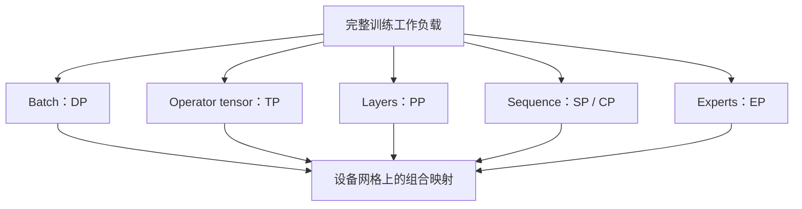

# Parallelism｜专题总览

<!-- learning-position -->
> **学习定位**：A3 · 导航。
> **前置**：[通信与 tensor 基础](<../00_Foundations/06_两卡通信与torchrun.md>)。
> **首读/二读**：先看 DP/TP 的小例子，再用统一布局语言总结。
> **进度与实验**：[学习清单](<../学习清单.md>) · [总入口](<../README.md>)。
<!-- /learning-position -->

> 资料核对：2026-09-05。版本锚点为 PyTorch 2.14、Megatron Core 0.19/current、TorchTitan current、vLLM current 与 verl current；稳定的数学原理不依赖这些版本。

## 并行的本质：把“状态与工作”映射到设备网格

Data Parallelism（DP，数据并行）、Tensor Parallelism（TP，张量并行）、Pipeline Parallelism（PP，流水线并行）、Sequence Parallelism（SP，序列并行）、Context Parallelism（CP，上下文并行）与 Expert Parallelism（EP，专家并行）不是六个互斥选项，而是沿不同维度切分状态和计算。

判断任何并行方案都应回答六个问题：

1. 切分对象是什么：batch、参数维、layer、sequence 还是 expert？
2. 每个 rank 保存哪些参数、gradient、optimizer state 和 activation？
3. forward/backward 分别需要什么 collective 或 Point-to-Point（P2P，点对点）通信？
4. 通信是否落在适合的 NVLink、NVSwitch 或 InfiniBand domain？
5. 它解决的是模型放不下、activation 放不下、吞吐不足还是延迟过高？
6. 增大 degree 后，计算颗粒度是否小到无法吃满 GPU？

## 一张总表

| 并行维度 | 切什么 | 典型通信 | 主要收益 | 主要代价 |
|---|---|---|---|---|
| DP/DDP | batch/sample | gradient AllReduce | 吞吐、简单扩展 | 完整模型副本 |
| ZeRO/FSDP | DP 组内模型状态 | parameter AllGather、gradient ReduceScatter | 减少状态显存 | layer 级通信与峰值展开 |
| TP | linear/attention tensor 维度 | AllReduce、ReduceScatter、AllGather | 单层参数/计算分摊 | 高频同步、算子变小 |
| PP | 连续或自定义 layer stage | activation/gradient P2P | 按深度分摊模型 | bubble、负载均衡、调度复杂 |
| Megatron SP | 非 TP 区域的 sequence 维 | TP group 内 gather/scatter | 降 activation 显存 | 与 TP 强绑定 |
| CP | attention context/sequence | KV P2P、AllGather 或 All-to-All | 长上下文 activation 分摊 | attention 通信与 causal imbalance |
| EP | experts | token All-to-All/AllToAllV | MoE 参数和 expert compute 分摊 | 动态负载不均 |

## 章节结构

本专题采用“总览 + 16 个分章”，共 17 篇 Markdown。

| 顺序 | 文档 | 核心问题 |
|---|---|---|
| 1 | [统一切分语言](01_统一切分语言.md) | shard、replicate、partial 与 device mesh 如何表达所有方案？ |
| 2 | [DP 与 DDP](02_DP与DDP.md) | 为什么梯度平均等价，bucket 如何重叠？ |
| 3 | [ZeRO 与 FSDP](03_ZeRO与FSDP.md) | 分片状态后 forward/backward 具体发生什么？ |
| 4 | [Tensor Parallelism](04_TensorParallelism.md) | column/row parallel linear 怎样消除不必要通信？ |
| 5 | [Sequence Parallelism](05_SequenceParallelism.md) | Megatron SP 与长上下文 SP 为什么不是同一件事？ |
| 6 | [Pipeline Parallelism](06_PipelineParallelism.md) | GPipe、1F1B、Interleaved、Zero Bubble 如何取舍？ |
| 7 | [Context Parallelism](07_ContextParallelism.md) | Ring Attention、Ulysses 与 Dynamic CP 怎么工作？ |
| 8 | [Expert Parallelism](08_ExpertParallelism.md) | expert、token、router 和 parallel folding 如何组合？ |
| 9 | [Embedding 与词表并行](09_Embedding与词表并行.md) | 大词表如何切，cross entropy 为什么无需完整 logits？ |
| 10 | [多维并行与 DeviceMesh](10_多维并行与DeviceMesh.md) | TP×PP×CP×EP×DP 如何组成互不冲突的 process group？ |
| 11 | [训练并行方案设计](11_训练并行方案设计.md) | 从模型、序列和集群约束推出配置，而不是抄模板 |
| 12 | [推理并行方案设计](12_推理并行方案设计.md) | latency、throughput、KV 和 MoE 怎样改变 TP/DP/PP/EP 选择？ |
| 13 | [RL 角色级并行](13_RL角色级并行.md) | trainer、rollout、reference、reward 如何放置与同步？ |
| 14 | [自动并行与代价模型](14_自动并行与代价模型.md) | 编译器和搜索系统能自动决定到什么程度？ |
| 15 | [案例：DeepSeek 与 DualPipe](15_案例_DeepSeek与DualPipe.md) | 训练配置为何选择 EP64、TP1 与双向流水？ |
| 16 | [实验与配置工作表](16_实验与配置工作表.md) | 如何核算、实验、排错并记录配置？ |

## 建议阅读路径

- 基础主线：00 → 01 → 02 → 04 → 06 → 10 → 11。
- 长上下文：01 → 05 → 07 → 10。
- MoE：04 → 08 → 10 → 15。
- 推理/RL：10 → 12 → 13。

## 2026 年的几个明显趋势

- “并行策略”从手写 communicator group 走向 DeviceMesh/DTensor 等显式布局：PyTorch 将 shard/replicate 变成 tensor 语义，TorchTitan 展示 FSDP2、TP、PP、CP 的可组合实现。
- 并行度不再必须全局固定：Megatron Dynamic Context Parallelism（Dynamic CP，动态上下文并行）会根据变长 micro-batch 调整 CP degree；fine-grained TP/heterogeneous mapping 也在增长。
- MoE 与 Attention 使用不同并行布局成为主流：attention 可 DP，experts 可 EP；这要求在 layer 边界重分布 tensor，并让拓扑感知进入 router 与 rank mapping。
- Reinforcement Learning（RL，强化学习）把“模型内并行”扩展为“角色与阶段并行”：同步 colocate、分离式、one-step-off-policy 和 fully asynchronous 都在吞吐与 stale policy 间权衡。

## 核心资料

- [Megatron Core Parallelism Strategies Guide](https://docs.nvidia.com/megatron-core/developer-guide/latest/user-guide/parallelism-guide.html)
- [PyTorch Distributed Overview](https://docs.pytorch.org/tutorials/beginner/dist_overview.html)
- [TorchTitan](https://github.com/pytorch/torchtitan)
- [vLLM Parallelism and Scaling](https://docs.vllm.ai/en/stable/serving/parallelism_scaling/)
- [verl HybridFlow](https://verl.readthedocs.io/en/latest/hybrid_flow.html)
