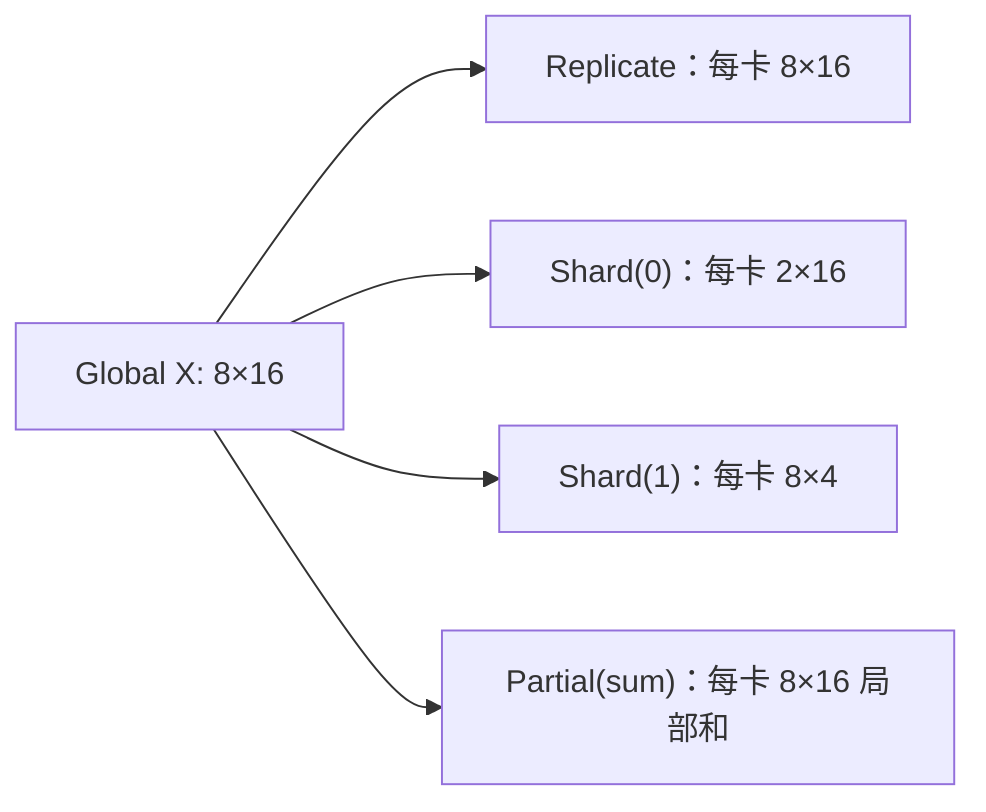

# 统一切分语言：DeviceMesh、DTensor 与布局变换

<!-- learning-position -->
> **学习定位**：A3 · 必修。
> **前置**：[通信与 tensor 基础](<../00_Foundations/06_两卡通信与torchrun.md>)。
> **首读/二读**：先用两个矩阵解释 shard/replicate/partial，再进入 DeviceMesh API。
> **进度与实验**：[学习清单](<../学习清单.md>) · [总入口](<../README.md>)。
<!-- /learning-position -->

<a id="beginner-example"></a>

## 入门例子：先用两个数区分 shard 与 partial

设最终结果 Y=[10,20]。一种布局是 rank 0 存 [10]、rank 1 存 [20]：这是不同位置的 shard。另一种布局是 rank 0 存 [3,8]、rank 1 存 [7,12]：这是完整形状上的局部贡献，需要求和才得到 Y。

前一种恢复完整结果用 gather，后一种用 reduction。仅比较每卡 tensor 的 shape，无法确定它的数学含义。

练习：给一个 2×2 设备网格标出 dp 和 tp 坐标，然后固定 dp 坐标形成 TP group。先画数据再看 DeviceMesh API；不要把具体 API 当成理解并行的前置。

## 机制与实现

## 先把“某张卡上的 tensor”改成“全局 tensor 的一个布局”

讨论并行时最容易迷失在 rank 编号和 collective 名称里。更稳定的语言是：先定义一个 global tensor，再说明它在设备网格上的 placement。

PyTorch Distributed Tensor（DTensor，分布式张量）常用三类 placement：

- `Replicate()`：每个 mesh rank 都有完整副本；
- `Shard(dim)`：沿某个 tensor dimension 切分；
- `Partial(reduce_op)`：每个 rank 保存局部贡献，经过 reduction 才得到完整语义。



## DeviceMesh 是逻辑坐标，不等于物理拓扑

DeviceMesh（设备网格）把 rank 组织为命名维度，例如：

```python
mesh = init_device_mesh(
    "cuda",
    mesh_shape=(2, 4, 8),
    mesh_dim_names=("pp", "dp", "tp"),
)
```

总 world size 为 $2\times4\times8=64$。固定 pp/dp 坐标、只在 tp 维变化的一组 rank 构成一个 TP process group。DeviceMesh 帮助正确构造 group，但 mesh 维顺序是否匹配节点/NVLink/NIC topology 仍由用户或 planner 决定。

## Redistribute 就是通信

布局变化对应 collective：

| 源布局 → 目标布局 | 常见实现 |
|---|---|
| Shard → Replicate | AllGather |
| Partial(sum) → Replicate | AllReduce |
| Partial(sum) → Shard | ReduceScatter |
| Shard(dim 0) → Shard(dim 1) | All-to-All 或 gather+slice |
| Replicate → Shard | local chunk，可能无需通信 |

因此并行图可以看成：operator 根据输入布局产生输出布局；当相邻 operator 的布局不兼容时插入 redistribute。优化的核心是让相邻算子布局“接得上”。

## 用 Linear 解释 Partial

设 $Y=XW$，把 $W$ 沿输入维分为 $W=[W_0;W_1]$，同时 $X=[X_0,X_1]$：

$$
Y=X_0W_0+X_1W_1
$$

每张卡算出的 $Y_i=X_iW_i$ 不是 Y 的 shard，而是 `Partial(sum)`。若下一步需要完整 Y，就 AllReduce；若下一步可继续消费 partial/sharded layout，可推迟或改为 ReduceScatter。这正是理解 row-parallel linear 的关键。

## Layout、Ownership 与 Lifetime

placement 只说明“逻辑如何分布”，还需补充：

- ownership：谁负责 optimizer update、checkpoint 和释放？
- lifetime：full parameter 是常驻还是 layer 前临时 AllGather？
- autograd rule：backward 输出是什么布局，是否自动插 collective？
- uneven shard：dimension 不能整除 mesh size 时 padding 或 ragged 语义是什么？

DTensor 可以传播布局，但不消除这些工程约束。很多自定义算子仍需显式注册 sharding rule。

## 一张并行配置的最小表示

```text
mesh: pp=2, dp=4, tp=8
W_qkv: [Replicate(pp), Replicate(dp), Shard(tp, output_dim)]
activation: [stage-local, Shard(dp, batch), Replicate(tp)]
optimizer: [stage-local, Shard(dp), Shard(tp-consistent)]
```

如果一个方案无法写出类似布局，就很难严格判断通信与显存。

## 易混淆点

- rank group 是运行时参与者集合；tensor layout 是数据语义。二者相关但不等价。
- “模型并行”不是一种具体算法，TP/PP/EP 都属于 model parallel 的不同切法。
- shard 不是简单 `torch.chunk`：完整语义还包括 collective、autograd 与 checkpoint metadata。
- replica 不代表无通信：DP replica 在 backward 仍需同步 gradient。

## 资料

- [PyTorch Distributed Overview：DTensor 与 DeviceMesh](https://docs.pytorch.org/tutorials/beginner/dist_overview.html)
- [Getting Started with DeviceMesh](https://docs.pytorch.org/tutorials/recipes/distributed_device_mesh.html)
- [PyTorch DTensor](https://docs.pytorch.org/docs/stable/distributed.tensor.html)
