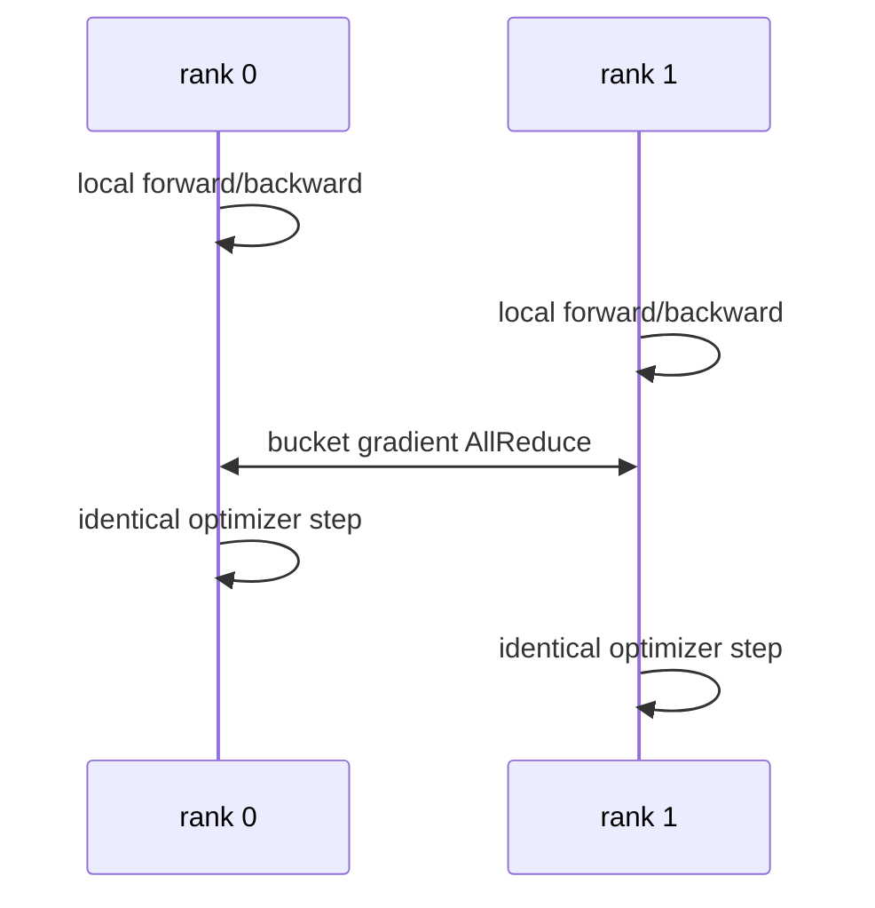

# Data Parallelism 与 DistributedDataParallel

<!-- learning-position -->
> **学习定位**：A3 · 必修。
> **前置**：[通信与 tensor 基础](<../00_Foundations/06_两卡通信与torchrun.md>)。
> **首读/二读**：梯度平均、bucket、累积/no_sync、不同 token 数的归一化。
> **进度与实验**：[学习清单](<../学习清单.md>) · [总入口](<../README.md>)。
<!-- /learning-position -->

<a id="beginner-example"></a>

## 入门例子：两卡梯度平均的成立条件

单个参数 w=1，样本目标 a=[0,2,8]，每 token loss 为 (w−a)^2/2。全局 token mean 的梯度是 ((1−0)+(1−2)+(1−8))/3=−7/3。若前两枚给 rank 0、后一枚给 rank 1，平均两个 local mean 梯度会得到 (0−7)/2=−3.5，目标已经改变。

这不是 DDP 通信错误，而是 local loss 的缩放与目标不一致。日志的全局 sum/count 和 backward 的梯度缩放要分别处理。完整推导和 CPU 算例见[RL 数据正确性](../00_Foundations/08_RL数据与数值正确性.md)。

验收：分别用等长和不等长 local batch 手算；再加入两个 microbatch，指出累积前后除以了哪个量。下面的 no_sync 片段是执行结构示意，使用时需导入 contextlib.nullcontext 并定义实际 model/loss。

## 机制与实现

Data Parallelism（DP，数据并行）复制模型，把 global batch 切给不同 rank。DistributedDataParallel（DDP，分布式数据并行）是 PyTorch 的多进程实现：每个 rank 独立 forward/backward，再同步 gradient。

## 为什么梯度平均等价

设 global batch $B$ 被均匀切给 $D$ 个 rank，每 rank local batch $B/D$。若 loss 使用 local mean，第 $r$ 个 rank 得到：

$$
g_r=\frac{D}{B}\sum_{x\in\mathcal{B}_r}\nabla\ell(x)
$$

对 rank 梯度再取平均：

$$
\frac{1}{D}\sum_{r=1}^{D}g_r
=\frac{1}{B}\sum_{x\in\mathcal{B}}\nabla\ell(x)
$$

与单卡 global-batch mean 等价。若 local batch 不等长、loss 用 sum、存在 token mask 或 gradient accumulation，缩放必须重新推导；不能盲目除以 world size。

## DDP 一步发生什么



参数初始一致、梯度同步一致、optimizer deterministic 时，各 replica 保持一致。通常没有必要每 step 广播参数。

## Bucket 为什么能重叠

Autograd（自动微分）按反向依赖逐步产生 gradient。DDP 将 parameter gradient 放入 bucket；一个 bucket 全部 ready 后立即发起 AllReduce，与更前层的 backward compute 重叠。

- bucket 太大：启动晚，exposed communication tail 增大；
- bucket 太小：collective latency 与 kernel launch 过多；
- 参数注册顺序若与 backward ready 顺序相反，可能长期等最后一个 gradient。

`gradient_as_bucket_view` 可减少 gradient 与 bucket 间复制，但会改变 gradient storage 语义。

## Gradient accumulation 与 `no_sync`

若累积 $A$ 个 micro-batch，只在最后一次同步：

```python
for i, batch in enumerate(micro_batches):
    ctx = model.no_sync() if i < A - 1 else nullcontext()
    with ctx:
        loss(batch).backward()
optimizer.step()
```

这样把 $A$ 次 AllReduce 降为 1 次，但 gradient 在本地累积。loss scaling 要与 global batch 定义一致；automatic mixed precision 的 overflow 也需要跨 rank 一致处理。

## Uneven input 与数据语义

某些 rank 提前耗尽数据会导致其他 rank 等待 collective。PyTorch Join context 能处理部分 uneven-input 场景，但语言模型训练更常通过 DistributedSampler、drop_last、packing 或 dummy batch 保持 step 对齐。

Token-level loss 下，即使每 rank sequence 数相同，有效 token 数也可能不同。正确 global token mean 可先求 local loss sum 与 token count，再分别 AllReduce，最后相除；不能平均“每 rank 的平均 loss”。

## DP 的扩展边界

DP degree 增加时：

- 每卡模型状态不下降，模型必须先能放入单个 replica；
- global batch 若增长，可能改变优化和收敛；
- global batch 固定时 local batch 变小，GEMM 利用率下降；
- gradient bytes 基本不因 local batch 减少，通信/计算比恶化。

因此 DP 主要解决吞吐，ZeRO/FSDP 才解决 replica 状态冗余。

## 排查

- loss 随 world size 改变：检查 reduction 与 token count normalization；
- rank 间 parameter drift：检查漏同步、自定义 parameter、conditional branch；
- backward 尾部长：检查 bucket ready order、大小和网络；
- 某 rank hang：检查 uneven data、collective 顺序与 rank failure；
- scaling 差：分别测 local batch kernel efficiency 与 AllReduce exposed time。

## 资料

- [PyTorch DDP Tutorial](https://docs.pytorch.org/tutorials/intermediate/ddp_tutorial.html)
- [PyTorch DDP Notes](https://docs.pytorch.org/docs/stable/notes/ddp.html)
- [DDP Join Context](https://docs.pytorch.org/tutorials/advanced/generic_join.html)
