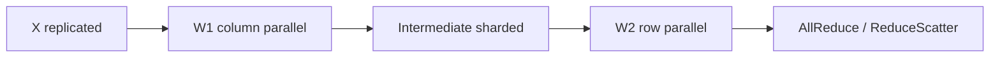

# Tensor Parallelism：在算子内部切矩阵

Tensor Parallelism（TP，张量并行）把一个 layer 的参数和计算分到多张 GPU。它解决“单层太大/单卡算不下”，但每层通常都要通信，因此优先放在 NVLink/NVSwitch 高速域内。

## Column Parallel Linear

设 $Y=XW$，$W\in\mathbb{R}^{H_{in}\times H_{out}}$。沿输出维切列：

$$
W=[W_0,W_1,\ldots,W_{p-1}],\qquad Y_i=XW_i
$$

每张卡需要完整 X，得到 Y 的 feature shard。若下一个算子能直接消费这个 shard，无需立即 AllGather。

## Row Parallel Linear

沿输入维切行，并把输入按 feature 对应切分：

$$
W=\begin{bmatrix}W_0\\W_1\\\vdots\\W_{p-1}\end{bmatrix},\quad
X=[X_0,X_1,\ldots,X_{p-1}]
$$

每卡计算 partial output $Z_i=X_iW_i$，完整输出为：

$$
Y=\sum_i Z_i
$$

所以 row parallel 的输出是 `Partial(sum)`，通常需要 AllReduce，或用 ReduceScatter 直接产生 sequence shard。

## MLP 为什么天然一列一行

Multi-Layer Perceptron（MLP，多层感知机）可写成：

$$
Y=\phi(XW_1)W_2
$$

把扩张层 $W_1$ 做 column parallel，激活后保持 hidden shard；把回投影 $W_2$ 做 row parallel，最后只需一次 reduction。

如果两层之间先 AllGather，就浪费了布局可组合性。

## Attention 的 TP

Multi-Head Attention（MHA，多头注意力）通常沿 attention heads 切分 Query/Key/Value（Q/K/V）投影；每 rank 计算一部分 heads，再由 output projection 的 row parallel reduction 合并。Grouped-Query Attention（GQA，分组查询注意力）会带来限制：KV heads 数必须能被 TP degree 合理切分，或采用复制 KV heads/fine-grained mapping。

Multi-head Latent Attention（MLA，多头潜在注意力）与 DeepSeek Sparse Attention（DSA，DeepSeek 稀疏注意力）等结构改变可切 tensor 与 kernel 支持，不能套用 MHA 的 head-shard 假设。

## Forward 与 backward 的通信对偶

Column parallel forward 产生 output shard；其 backward 对 input gradient 通常需 reduction。Row parallel forward 需 reduction；其 backward 对 input naturally sharded。Megatron 通过相邻 column/row layer 配对，让一个 Transformer block 中大 collective 数量受控。

## TP degree 的边界

增大 TP：

- 参数/activation shard 更小；
- collective group 更大且每 layer 同步；
- local GEMM 的 M/N/K 维度变小，Tensor Core 利用率可能下降；
- divisibility、head 数、expert hidden size 和 vocab size 限制增多。

所以“模型能放下后继续加 TP”不一定加速。推理低延迟常用 TP 缩短单请求 compute，但跨节点 TP 往往付出较大同步代价。

## PyTorch 的表达

PyTorch `torch.distributed.tensor.parallel` 用 `ColwiseParallel`、`RowwiseParallel`、`SequenceParallel` 等 ParallelStyle 描述 module plan，并基于 DeviceMesh/DTensor 传播 layout。API 仍标注 experimental，复杂自定义 module 要验证 input/output layout。

## 资料

- [Megatron-LM 原始 TP 论文](https://arxiv.org/abs/1909.08053)
- [PyTorch Tensor Parallel API](https://docs.pytorch.org/docs/stable/distributed.tensor.parallel.html)
- [PyTorch Large-Scale TP Tutorial](https://docs.pytorch.org/tutorials/intermediate/TP_tutorial.html)
- [Megatron Core Tensor Parallel API](https://docs.nvidia.com/megatron-core/developer-guide/latest/apidocs/core/core.tensor_parallel.html)

