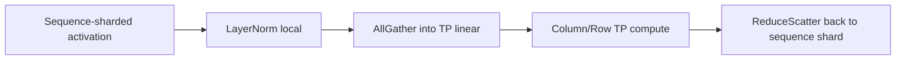

# Sequence Parallelism：两个同名概念必须分开

<!-- learning-position -->
> **学习定位**：A3 · 必修。
> **前置**：[通信与 tensor 基础](<../00_Foundations/06_两卡通信与torchrun.md>)。
> **首读/二读**：Megatron SP 与其他 sequence 切分的区别；先跟 TP 相邻层。
> **进度与实验**：[学习清单](<../学习清单.md>) · [总入口](<../README.md>)。
<!-- /learning-position -->

## 入门例子：从 TP 两侧的激活看 Sequence Parallel

设 activation 为 [S=8,H=4]，TP=2。某些逐 token 操作不需要把所有序列位置常驻在两张卡上：每卡可持有 [4,4]，独立做对应 token 的 normalization，再在需要完整序列的边界做布局转换。

这并没有让每枚 token 的 attention 只看半段上下文。Megatron SP 主要关联 TP 区间的 activation 布局，其他论文中的 sequence parallel 可能直接切 attention 的序列计算，必须辨明定义。

练习：在 LayerNorm→ColumnLinear→RowLinear 的链上标注每处 shape、谁需要完整输入，以及 gather/reduce-scatter 在哪里。不能只把配置 sp=True 就当作完成理解。

## 机制与实现

“Sequence Parallelism（SP，序列并行）”在业界至少指两类不同方法：

1. Megatron SP：与 Tensor Parallelism（TP，张量并行）配合，把 LayerNorm、Dropout、Residual 等非 TP 区域沿 sequence 切分；
2. long-context sequence parallel：把 attention context 切分，代表方法包括 DeepSpeed-Ulysses 和 Ring Attention。Megatron 常把第二类称 Context Parallelism（CP，上下文并行）。

混用两者会直接算错通信和显存。

## Megatron SP 解决什么

传统 TP 只切 linear/attention heads；某些 activation 在 TP ranks 上仍复制，例如 residual stream 和 LayerNorm 输入。Megatron SP 让这些区域保持 sequence shard：

这样可把部分 activation memory 约按 TP size 降低，并把原本 AllReduce 改写为 ReduceScatter + 后续 AllGather，使通信更容易与计算组织。

## 为什么 LayerNorm 能局部做

Layer Normalization（LayerNorm，层归一化）通常沿 hidden dimension 求均值/方差。如果 activation 是沿 sequence 切分，每个 token 的完整 hidden vector 仍在本 rank，因此 LayerNorm 不需要跨 rank reduction。

如果沿 hidden 维切分，统计量才需要 AllReduce。关键永远是“归一化维度是否被切”。

## Megatron SP 不会降低 attention 的 $S^2$

进入 TP attention 前通常会 AllGather 所需 sequence layout，或 attention 本身按 heads 切分；它没有把完整 context interaction 分散给多个 rank。因此长上下文 attention activation/compute 的核心问题仍需 CP、Ulysses、Ring Attention 或稀疏 attention 解决。

## Ulysses 与 Ring Attention 简述

- DeepSpeed-Ulysses：输入初始按 sequence 切；在 attention 前通过 All-to-All 转为 head shard，使每 rank 有完整 sequence 的部分 heads；attention 后再 All-to-All 还原 sequence shard。
- Ring Attention：每 rank 保留 query chunk，让 Key/Value（KV，键值）block 沿 ring 轮转，逐块累积 online softmax 结果。

两者详细比较见[Context Parallelism](07_ContextParallelism.md)。

## Packed sequence 的额外困难

将多个变长样本 pack 到同一 sequence 可减少 padding，但 SP/CP 必须携带每个样本边界、position、causal mask metadata。简单按 token 等长切分可能：

- 把一个样本切跨 rank，需要跨边界 attention；
- 让不同 rank 的有效 attention FLOPs 不平衡；
- 对 linear attention、state-space model 或稀疏 attention 缺少对应 sharding rule。

截至 2026 年，Megatron 的 Qwen3.5/Gated DeltaNet 等新结构与 CP/packed-sequence 组合仍有持续开发和兼容性讨论，不能因为 dense GPT path 可用就推断所有 architecture 可用。

## 选择规则

- 已使用 Megatron TP 且 activation 高：通常打开 Megatron SP；
- sequence 极长、attention 放不下：需要 CP/Ulysses/Ring，而不只是 Megatron SP；
- 小 hidden、大 sequence：增加 TP 可能使 GEMM 变小，CP 更符合问题维度；
- 变长 post-training：关注 dynamic CP/packing/load balance，而不是固定最大长度配置。

## 资料

- [Megatron Core Parallelism Guide](https://docs.nvidia.com/megatron-core/developer-guide/latest/user-guide/parallelism-guide.html)
- [DeepSpeed-Ulysses](https://arxiv.org/abs/2309.14509)
- [Ring Attention](https://arxiv.org/abs/2310.01889)
- [USP：Unified Sequence Parallelism](https://arxiv.org/abs/2405.07719)
