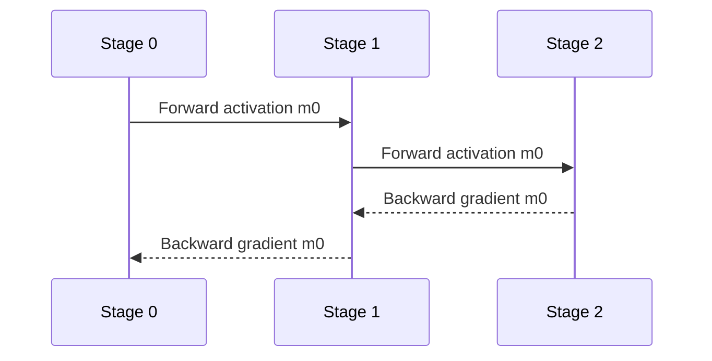

# Pipeline Parallelism：切 Layer、排 Micro-batch

Pipeline Parallelism（PP，流水线并行）把模型的 layer/graph 切成 stage，各 stage 处理不同 micro-batch。它减少每卡常驻 layer 参数，但引入 activation/gradient P2P、pipeline bubble 和 stage imbalance。

## 基本数据流

P2P payload 主要与 boundary activation shape 相关，而不是整个模型参数量。切分位置若产生大 activation 或跨越 residual/branch，会增加通信和实现复杂度。

## GPipe：All Forward Then All Backward

GPipe 把 mini-batch 分成 $m$ 个 micro-batch，先完成所有 forward，再完成所有 backward。若有 $p$ 个均衡 stage，忽略通信，bubble fraction 近似：

$$
\text{bubble}_{GPipe}\approx\frac{p-1}{m+p-1}
$$

增大 $m$ 可摊薄 bubble，但要同时保存更多未 backward 的 activation，显存上升。

## 1F1B

One Forward One Backward（1F1B，一前向一反向）经过 warmup 后交替执行 forward/backward，更早释放 activation，峰值通常低于 GPipe。同步 flush 版本保持同一 mini-batch 的一致 weight version；异步 PipeDream 类 schedule 可能引入 weight staleness，需要额外语义。

### Interleaved 1F1B

每个物理 rank 持有多个 Virtual Pipeline（VP，虚拟流水段）chunk，例如 rank 0 持 layer 0–3 与 16–19。细粒度 interleave 可减少 bubble、改善 stage balance，但增加 P2P 次数、调度与 activation 管理复杂度。

## Zero Bubble 的关键：拆 backward

Backward 可分成：

- B：计算对输入 activation 的 gradient，必须尽快发给前一 stage；
- W：计算 parameter gradient，只影响本 stage optimizer，可在关键路径空隙执行。

Zero Bubble schedule 将 B 与 W 解耦，把 W 填入 bubble。PyTorch 2.14 `torch.distributed.pipelining` 已公开 ScheduleInterleavedZeroBubble 等 schedule；支持条件与数值语义需按文档核对。

## Stage partition 不能只按 layer 数

MoE、embedding、output head、Multi-Token Prediction（MTP，多 token 预测）和异构 layer 的成本不同。应按实测 forward/backward time、activation bytes 和 memory peak 做 partition。

Megatron Core 支持 custom pipeline layout，可表达不均匀 layer 分配和空 stage；这反映现代模型已不再是每层同成本的整齐链。

## Bubble 的四种来源

1. fill/drain：流水线固有 warmup/cooldown；
2. stage imbalance：最慢 stage 决定节拍；
3. communication exposed：P2P 未被 compute 遮挡；
4. dynamic workload：MoE token imbalance、变长 sequence 或 conditional branch。

只增加 micro-batch 数主要改善第一种，对后三种可能无效。

## 选择建议

- 模型深、单层能在一张/一个 TP group 高效运行：PP 很自然；
- micro-batch 必须极小且 global batch 也小：bubble 难以摊薄；
- 推理低延迟：PP 增加 stage 串行 latency，通常不如 TP；吞吐批处理可用 pipeline；
- 长上下文：activation 生命周期可能让 1F1B 也过高，需要 recompute、Seq1F1B 或 sequence slicing。

## 资料

- [GPipe](https://arxiv.org/abs/1811.06965)
- [PipeDream](https://arxiv.org/abs/1806.03377)
- [PyTorch Pipeline Parallelism 2.14](https://docs.pytorch.org/docs/stable/distributed.pipelining.html)
- [Megatron Core Custom Pipeline Layout](https://docs.nvidia.com/megatron-core/developer-guide/latest/user-guide/pipeline_model_parallel_layout.html)

