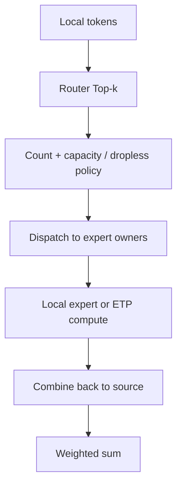

# Expert Parallelism：模型稀疏，系统不一定轻松

Expert Parallelism（EP，专家并行）把 Mixture of Experts（MoE，混合专家模型）的不同 expert 放到不同 rank。每个 token 只激活 top-k expert，但 token 必须被动态路由到 expert owner，再把结果送回。

通信 kernel 与 DeepEP 细节见上一专题的[MoE All-to-All 案例](../02_Distributed_Communication_Memory/13_案例_MoE-AllToAll.md)。本章关注并行布局。

## 三种常见布局

设 64 个 routed experts、EP=8：每个 EP rank 持有 8 个 experts。

- EP-only：attention/共享层在 EP ranks 上复制，MoE layer 按 experts 切；
- TP + EP：每个 expert 的矩阵还沿 Expert Tensor Parallelism（ETP，专家张量并行）切分；
- DP Attention + EP MoE：attention 走 Data Parallelism（DP，数据并行），MoE token 在更大的 EP group 中交换，适合 MLA 等 attention 参数较小但 experts 巨大的模型。

## Token 流程

输出布局通常回到原 token owner，便于 residual connection；因此一次 MoE block 至少有 dispatch 和 combine 两个方向。

## Load balance 是并行正确性之外的第二目标

设 rank $r$ 收到 token 数为 $T_r$，MoE compute time 近似由 $\max_r T_r$ 决定，而网络拥塞也与热点相关。可用：

$$
\text{imbalance}=\frac{\max_r T_r}{\frac{1}{P}\sum_r T_r}
$$

辅助负载均衡 loss、capacity factor、token drop、expert bias、expert replication 和 Expert Parallelism Load Balancer（EPLB，专家并行负载均衡器）都在处理这个问题，但可能改变模型质量或增加状态迁移。

## Token drop 与 dropless

- capacity-based：每个 expert 设容量，超出 token drop/route elsewhere；吞吐可预测，但可能损伤学习；
- dropless：保留所有 token，语义更直接，但最热 expert 决定 step tail；
- padded：填到统一 capacity，collective/GEMM 规则，却浪费 bandwidth/compute；
- variable-size：AllToAllV + ragged grouped GEMM，系统复杂但减少 padding。

## EP 与 ETP 不要混淆

EP 切 experts：一个完整 expert 归某 rank；ETP 切单个 expert 的 hidden/intermediate tensor。若 expert 较小，ETP 会让 Grouped GEMM 更碎且增加 TP reduction；通常先扩大 EP，再在单 expert 放不下或计算过大时使用 ETP。

## Parallel Folding

传统做法要求 `world_size = DP × TP × PP × CP × EP`，会让不同 layer 的并行维度机械相乘。Parallel folding/heterogeneous mapping 允许 dense attention 和 MoE layer 使用不同逻辑 mesh，再在边界 redistribute：例如 attention DP=64，MoE EP=64，而不是同时乘成 4,096。

收益是避免浪费 world size；代价是跨布局通信、group 管理和 checkpoint metadata 更复杂。Megatron Core 近年的 MoE 路线已把 full parallelism combo 与 parallel folding 纳入重点。

## 推理中的 WideEP

Wide Expert Parallelism（WideEP，宽专家并行）让一个 replica 的 experts 跨很多 GPU，而 attention 可采用 DP。它能扩大 token batch、提升 expert GEMM，但请求级 tail、KV locality 与 expert hot spot 共同决定效果。vLLM 当前支持 DP attention 与 EP/TP MoE 组合，并提供 EPLB 与 redundant expert 相关能力；具体支持随版本变化。

## 资料

- [Megatron Core MoE Guide](https://github.com/NVIDIA/Megatron-LM/blob/main/megatron/core/transformer/moe/README.md)
- [Megatron Core MoE Roadmap 2026 Q3](https://github.com/NVIDIA/Megatron-LM/issues/6757)
- [vLLM Expert Parallel Deployment](https://docs.vllm.ai/en/latest/serving/expert_parallel_deployment/)
- [DeepEP](https://github.com/deepseek-ai/DeepEP)

