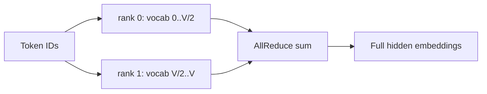

# Embedding 与词表并行

Large Language Model（LLM，大语言模型）的 token embedding 与 Language Model head（LM head，语言模型输出头）形状通常为 $V\times H$，其中 $V$ 是 vocabulary size，$H$ 是 hidden size。大词表或 weight tying 下，它们可能是显存和通信的重要部分。

## Vocabulary Parallel Embedding

Vocabulary Parallelism（词表并行）沿 vocab dimension 切 embedding table。rank $r$ 只持有 token ID 区间 $[v_r,v_{r+1})$：

1. 每个 rank 对不属于本区间的 token 输出零；
2. 属于本区间的 token 做 local lookup；
3. 对 local outputs 做 AllReduce(sum)，得到完整 embedding。

也可把输出保持为 sequence/hidden shard，具体取决于下游 layout。

## Parallel LM Head

将 output weight 沿 vocab 切列后，每 rank 只产生 local vocab logits：

$$
Z_r=XW_r^T,\qquad Z_r\in\mathbb{R}^{T\times V/p}
$$

朴素做法 AllGather 完整 logits，会产生巨量 activation。Megatron 的 vocab-parallel cross entropy 直接在 sharded logits 上计算准确 softmax loss。

## 不 Gather 完整 Logits 如何算 Cross Entropy

对某 token 的 logits $z_j$：

$$
\ell=-z_y+\log\sum_j e^{z_j}
$$

分布式稳定计算分三步：

1. 每 rank 求 local max，经 AllReduce(max) 得 global max $m$；
2. 每 rank 求 $\sum_{j\in shard}e^{z_j-m}$，经 AllReduce(sum) 得 global denominator；
3. target ID 所属 rank 取出 $z_y$，其他 rank 置零，再 AllReduce(sum)。

最终不需要 materialize $T\times V$ 完整 logits。Backward 也可在 local vocab shard 上生成 gradient。

## Weight Tying 的分片约束

若 input embedding 与 LM head tied，二者必须共享一致的 vocab shard、dtype 与 optimizer ownership。Pipeline Parallelism（PP，流水线并行）把 embedding 放首 stage、head 放末 stage 时，weight tying 可能需要首尾 stage 同步或共享逻辑参数，不能当作两个独立 tensor 更新。

## 大词表为何会影响并行选择

以 $V=150K,H=1024$、BF16 为例，tied embedding 参数约 $150000\times1024\times2\approx293$ MiB；对 0.1B–0.2B 小模型，它占比可能远高于大模型。此时：

- 裁 vocab 可把预算转给 depth/width，但改变 tokenizer compatibility；
- vocab TP 可省单卡状态，却增加 embedding/cross-entropy collective；
- sequence 较长时 logits activation $T\times V$ 可能比权重更危险；
- sampled/adaptive softmax 改变训练目标，不是纯 infra 优化。

## Packed sequence 与 loss normalization

不同 rank 的有效 target token 数可能不同。Vocab-parallel cross entropy 解决 vocab shard，不自动解决 data/context shard 的 token count normalization。应对 global valid-token count 做 reduction，再定义 loss scale。

## 资料

- [Megatron Core Vocab Parallel Cross Entropy](https://docs.nvidia.com/megatron-core/developer-guide/latest/apidocs/core/core.tensor_parallel.cross_entropy.html)
- [Megatron Core Tensor Parallel](https://docs.nvidia.com/megatron-core/developer-guide/latest/apidocs/core/core.tensor_parallel.html)
- [Megatron-LM](https://arxiv.org/abs/1909.08053)

