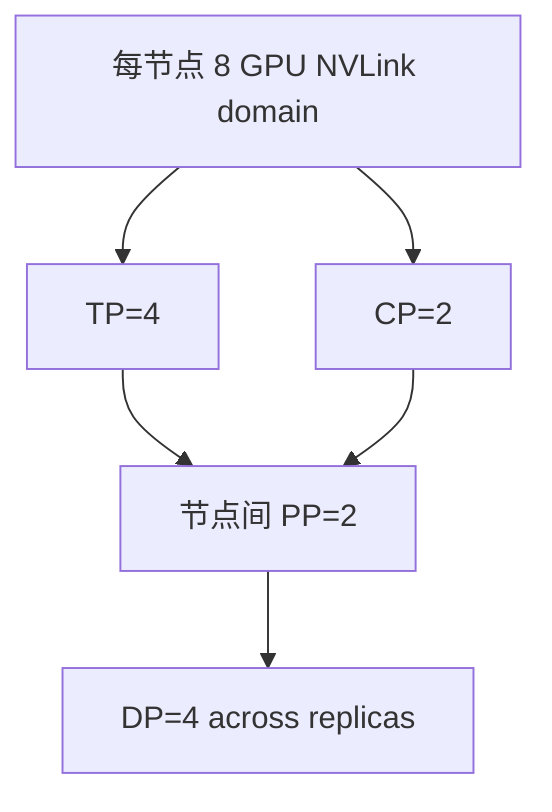

# 多维并行与 DeviceMesh

<!-- learning-position -->
> **学习定位**：A3 · 必修。
> **前置**：[通信与 tensor 基础](<../00_Foundations/06_两卡通信与torchrun.md>)。
> **首读/二读**：先画 2×2 rank group，再看大配置；勿以缩写乘积替代布局。
> **进度与实验**：[学习清单](<../学习清单.md>) · [总入口](<../README.md>)。
<!-- /learning-position -->

<a id="beginner-example"></a>

## 入门例子：先画 2×2，再画大集群

令 tp 为低位坐标，dp 为高位，rank=tp_rank+2*dp_rank。四个 rank 的 TP 组为 [0,1]、[2,3]，DP 组为 [0,2]、[1,3]。这是明确指定 order 后的算例，其他 order 得到不同编号。

随后把 rank 放到实际机器：同一 TP 组是否位于预期高速互联域？若物理设备映射被容器重新排序，连续 rank 不保证物理相邻。逻辑 mesh 与硬件拓扑要画两张图再连线。

验收：列出每个 rank 的坐标、设备、参数 shape 和通信组。模型参数 owner、梯度 owner、checkpoint shard owner 也可能不同，不用一个 rank0 概括全部。

## 机制与实现

## 不是把缩写相乘就结束了

假设 `TP=8, PP=4, CP=2, EP=8, DP=16`，直接相乘需要 8,192 GPU。但 EP 与 TP/DP 可能只作用于特定 layer，DP 还可能拆为 shard/replicate 维；现代系统需要表达**不同 operator 使用不同 mesh view**。

DeviceMesh（设备网格）把物理 ranks 组织成命名坐标：

```text
mesh dimensions: pp × dp_replicate × dp_shard × cp × tp
MoE submesh:     pp × ep × etp
```

其中 Expert Tensor Parallelism（ETP，专家张量并行）可与 dense Tensor Parallelism（TP，张量并行）不同。

## 一个 64 GPU 的例子

8 节点×8 GPU，可选：`TP=4, CP=2, PP=2, DP=4`，乘积 64。一个初始 topology mapping：

- 节点内 8 GPU：TP×CP = 4×2，承载每层高频 collective/P2P；
- 跨节点：PP=2 与 DP=4；
- 同一个 DP group 的相同 stage/tp/cp 坐标跨 4 个 replica。



这只是启发式：如果跨节点 NVLink domain、多个 NIC rail 或 model layer 极不均衡，最佳映射会不同。

## Process group 必须按坐标构造

一个 rank 同时属于多个 communicator：TP group、CP group、DP group、PP 邻接关系、EP group。任何 group 的成员或顺序错误，都可能：

- 直接 hang；
- tensor shape mismatch；
- 更危险地，collective 能完成但对错误成员做 reduction，训练悄悄错误。

因此建议用命名 mesh slice，而不是手写 `range()` 公式散落在代码中。

## Layout transition 是组合的真实成本

attention output 可能是 `[sequence shard, hidden replicated]`，MoE 输入需要 `[tokens partitioned by expert destination]`，FSDP 又要求 parameter shard。组合代价来自这些边界的 redistribute，而不仅是各方案独立通信量相加。

应为每个主要边界记录：

| 边界 | 源 layout | 目标 layout | collective | bytes | 是否可融合/重叠 |
|---|---|---|---|---:|---|
| Norm→QKV | sequence shard | TP input layout | AllGather | … | 可与上游 RS 配对 |
| Attention→MoE | CP token layout | EP owner layout | All-to-All | … | 可融合 permute |
| FSDP→TP Linear | DP param shard | TP-local full shard | AllGather | … | layer prefetch |

## Rank order 与物理拓扑

逻辑连续 rank 不保证物理相邻。必须映射到 PCI bus ID、NVLink domain、NIC affinity 与 rack。一般把最频繁、同步最敏感的 TP 放最快域；CP/EP 的选择取决于消息模式；DP 可用分层 collective 跨较慢域；PP 主要是邻居 P2P，但 stage boundary activation 也可能很大。

## 重新配置与 Checkpoint

并行配置变化需要 checkpoint 表达 global tensor shape 与 shard metadata，而非只保存“rank 7 文件”。Megatron distributed checkpoint 和 PyTorch Distributed Checkpoint（DCP，分布式检查点）都支持一定程度 load-time reshard；自定义 expert/vocab/tied weight 仍需验证。

## 2026 年的演进

- TorchTitan 用 PyTorch-native FSDP2、TP、PP、CP 展示 composable multidimensional parallelism；
- Megatron Core 增强 Generalized Tensor Parallelism（GTP，广义张量并行）、parallel folding 与 heterogeneous mappings；
- vLLM/Dynamo 在推理中允许 attention DP 与 MoE EP，说明 mesh 已从训练扩展到 serving runtime；
- fine-grained TP 允许不同 module 使用不同 TP degree，但会增加 layout transition。

## 资料

- [PyTorch DeviceMesh](https://docs.pytorch.org/tutorials/recipes/distributed_device_mesh.html)
- [TorchTitan](https://github.com/pytorch/torchtitan)
- [Megatron Core Parallelism Guide](https://docs.nvidia.com/megatron-core/developer-guide/latest/user-guide/parallelism-guide.html)
- [Megatron Distributed Checkpoint](https://docs.nvidia.com/megatron-core/developer-guide/latest/api-guide/dist_checkpointing.html)
