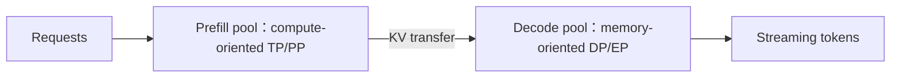

# 推理并行方案设计：延迟、吞吐与 KV 的三角形

<!-- learning-position -->
> **学习定位**：A4 · 必修。
> **前置**：[Transformer 与 KV](<../00_Foundations/05_Transformer执行与KV基础.md>)。
> **首读/二读**：并行对容量、吞吐、延迟与 KV 的不同影响。
> **进度与实验**：[学习清单](<../学习清单.md>) · [总入口](<../README.md>)。
<!-- /learning-position -->

## 入门例子：TP 与多个副本优化的是不同目标

假设模型单卡已能容纳。两个单卡副本可以服务不同请求；两卡 TP 则协作完成同一模型执行，同时付出层间 collective。前者主要扩展独立请求容量，后者可能改变单请求延迟与模型容量，不能只比较一个 tokens/s。

按相同总卡数扫描并发和输入/输出长度，分别看 TTFT、ITL、吞吐、队列和 KV。短 prompt/长 decode 与长 prompt/短 decode 可能得到不同选择。

验收：为一个明确 workload 画容量曲线，并解释何时进入排队区。在线服务的延迟目标与离线 RL rollout 的有效样本目标也要分开。

## 机制与实现

训练希望缩短 step/time-to-train；推理必须同时满足 Time to First Token（TTFT，首 token 延迟）、Time Per Output Token（TPOT，每输出 token 时间）、吞吐、并发和成本。相同模型在 prefill 与 decode 也可能需要不同并行方式。

## Data Parallelism：多个独立 replica

Data Parallelism（DP，数据并行）在推理中通常指多个完整 model replica，各自处理独立请求。它几乎不引入模型内 collective，适合模型已能放下时扩吞吐和隔离 tail；但不会帮助单个 replica 容纳模型。

负载均衡器还要考虑 prefix/KV cache locality。把请求送到“最空闲但无 cache”的 replica，可能比稍忙但命中的 replica 更慢。

## Tensor Parallelism：降低单请求计算时间，但每层同步

Tensor Parallelism（TP，张量并行）分摊每层权重/compute/KV heads，使模型能放下并降低单次 forward latency；代价是每层 collective。节点内 NVLink/NVSwitch TP 通常可行，跨节点 TP 对 decode 小 batch 尤其敏感。

TP 过大时 local GEMM 很小，collective latency 占比上升。低并发低延迟与高并发 throughput 的最佳 TP degree 可能不同。

## Pipeline Parallelism：容量与吞吐工具

Pipeline Parallelism（PP，流水线并行）沿 layer 切模型，通信频率低于 TP，但单请求必须依次通过所有 stage，端到端 latency 叠加。多请求/micro-batch 可 pipeline 化获得吞吐；低延迟在线场景一般谨慎使用。

## MoE：Attention DP + Expert Parallel

Mixture of Experts（MoE，混合专家模型）推理中，可以让 attention 各 rank 独立处理不同 requests/tokens，而 experts 在更大 Expert Parallelism（EP，专家并行）group 上分布。这种 Attention DP + EP 避免 dense attention 每层 TP collective，同时用跨 rank token dispatch 扩大 expert batch。

vLLM 当前文档明确支持 DP attention 与 EP/TP MoE 组合，并提供 expert load-balancing 路径。NVIDIA Dynamo 使用 Wide Expert Parallelism（WideEP，宽专家并行）描述把 experts 展开到大量 GPU 的部署。

## Prefill 与 Decode 为什么可能拆开

Prefill–Decode disaggregation（预填充—解码分离）允许两个 pool 独立选择 parallelism 和规模，但 KV transfer、routing 与 queue 成为新成本，详见[上一专题案例](../02_Distributed_Communication_Memory/14_案例_Prefill-Decode分离.md)。

## 一个实用选择树

1. 单卡是否能容纳 weights + KV + workspace？能：先单卡 replica + DP；
2. 不能：节点内 TP 增到刚好可放，保留 KV headroom；
3. TP 已过大/跨节点：比较 PP 或 quantization；
4. MoE：比较 TP-MoE 与 attention-DP + EP，测真实 token distribution；
5. 长 prompt 与长 generation 比例差异大：评估 P/D 分离；
6. 最后用目标 traffic distribution 和 SLO，不用离线固定 batch，决定配置。

## 容量近似与陷阱

$$
M_{replica}\approx\frac{M_{weights}}{TP\times PP}+M_{KV\ shard}+M_{workspace}
$$

这个式子忽略 layer 不均匀、embedding/head、replicated norm、CUDA graph pool 和 allocator fragmentation。PP 只把 layer KV 分到 stage；TP 是否切 KV 取决于 head layout。必须用引擎的 memory profile 验证。

## 基准矩阵

至少覆盖：短/长 prompt × 短/长 output、低/高并发、cold/warm prefix、均匀/突发 arrival；报告 TTFT p50/p99、TPOT/Inter-Token Latency（ITL，token 间延迟）、goodput、GPU cost per million tokens、KV occupancy 和 collective time。

## 资料

- [vLLM Parallelism and Scaling](https://docs.vllm.ai/en/stable/serving/parallelism_scaling/)
- [vLLM Data Parallel Deployment](https://docs.vllm.ai/en/latest/serving/data_parallel_deployment/)
- [vLLM Expert Parallel Deployment](https://docs.vllm.ai/en/latest/serving/expert_parallel_deployment/)
- [NVIDIA Dynamo Deployment Guide](https://docs.nvidia.com/dynamo/kubernetes/model-deployment/deploy-with-dgd)
- [Dense LLM Deployment Parallelization Study 2026](https://arxiv.org/abs/2603.05692)
