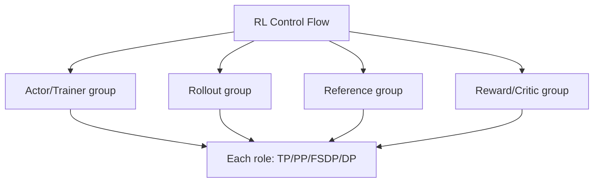

# RL 角色级并行：模型内部之外还有数据流

<!-- learning-position -->
> **学习定位**：A0→A5 · 分层必修。
> **前置**：[系统概览](<../00_Foundations/00_课程与系统地图.md>)。
> **首读/二读**：A0 看角色与两层并行；A5 深读共置、分离、异步与 freshness。
> **进度与实验**：[学习清单](<../学习清单.md>) · [总入口](<../README.md>)。
<!-- /learning-position -->

## 入门例子：一轮 RL 的三条时间线

同步示例：rollout 60 s、reward 10 s、训练 20 s、换权 5 s，未重叠时一轮至少 95 s。单独把训练缩短到 10 s，总时长只降为 85 s；这就是必须先量角色关键路径的原因。数字仅为教学算例。

分离资源后，有些阶段可并发，但样本版本和换权依赖不会自动消失。理想吞吐受最慢阶段约束；缓冲大小决定可吸收多大波动，不能消除长期生产消费差。

练习：分别画同步、一次流水和持续异步三张图，为每条样本标生成版本与训练时版本。设计性能对比时同时记录有效样本率、queue depth 和 lag；不要只提高原始生成 token 数。

## 机制与实现

Reinforcement Learning（RL，强化学习）的大模型训练通常包含 actor/trainer、rollout engine、reference policy、critic 和 reward model。每个角色内部可有 DP/TP/PP/FSDP；角色之间还要传 sample、log probability、reward 与 weights。

## 两层并行

第一层是 role/stage parallelism；第二层是每个模型内部 parallelism。只分析 Megatron 的 TP×PP，不足以解释 RL end-to-end utilization。

## Colocate 与 Separated

### Colocate / Hybrid Engine

同一组 GPU 分时承担 rollout 与 training：rollout 时使用 vLLM/SGLang 等 inference layout，训练时切换 FSDP/Megatron layout。优点是少量 GPU 也能容纳多个角色、减少长期闲置；代价是权重格式转换、显存释放/重建、CUDA graph/cache 管理和阶段串行。

### Separated

rollout 与 trainer 使用独立 GPU pool，可并发和独立扩缩，也能选择不同 parallelism；代价是更多资源和跨 pool weight synchronization。若 rollout 生成长尾明显，分离能避免 trainer 全部空等。

## On-policy、One-step-off-policy 与 Async

- synchronous on-policy：使用当前 policy 生成全部 rollout，再统一训练；语义清晰但 stage bubble 大；
- one-step-off-policy：rollout 与下一轮 training 部分流水，样本落后约一个 policy version；
- fully asynchronous：producer/consumer 持续运行，吞吐高，但 policy staleness、importance correction 和 buffer freshness 成为算法问题。

verl 0.7 文档将同步 colocate、one-step-off-policy 与 fully async 明确区分；2026 年的 fully async recipe 强调 separated rollout/train 可缓解 generation long tail。并行优化在这里会改变数据分布与算法假设，不能只看硬件利用率。

## 权重同步本身是一个并行重分片问题

trainer 可能使用 FSDP/TP/PP，rollout engine 可能使用不同 TP/PP/EP。同步不能简单把 rank 0 checkpoint 发给所有人：

1. 从 training sharded layout 收集或流式导出权重；
2. 转换命名、dtype、quantization 与 tensor layout；
3. 按 rollout layout 分发；
4. 在一致 policy version 边界原子切换；
5. 处理 prefix/KV cache 是否失效。

verl 的 HybridEngine 会按训练 backend（Megatron、DTensor/FSDP 等）选择 weight loader；配置接口随版本快速变化，必须锁定 commit/版本。

## Rollout 的并行不是普通 DP

请求长度、工具调用与 reward 环境会产生长尾；固定每 rank 相同 prompt 数不代表负载相等。需要 dynamic batching、sequence balancing、work stealing 或 partial rollout。Agentic RL 还可能等待外部 environment，GPU 与 CPU/network pipeline 应分离观测。

## 资源配比

令 rollout 生产速率为 $\lambda_r$ samples/s，trainer 消费速率为 $\lambda_t$。长期稳定要求平均生产与消费匹配；否则 buffer 为空导致 trainer idle，或 buffer 堆积导致样本 stale：

$$
\rho=\frac{\lambda_r}{\lambda_t}\approx1
$$

目标不是每个角色都 100% 利用，而是端到端 sample-to-update latency、policy freshness 与训练吞吐的平衡。

## 资料

- [verl HybridFlow Programming Guide](https://verl.readthedocs.io/en/latest/hybrid_flow.html)
- [HybridFlow Paper](https://arxiv.org/abs/2409.19256)
- [verl Fully Async Recipe](https://verl.readthedocs.io/en/latest/advance/fully_async.html)
- [verl 0.7 Release](https://verl.readthedocs.io/en/latest/blog/v0.7.html)
- [OpenRLHF Paper](https://arxiv.org/abs/2405.11143)
