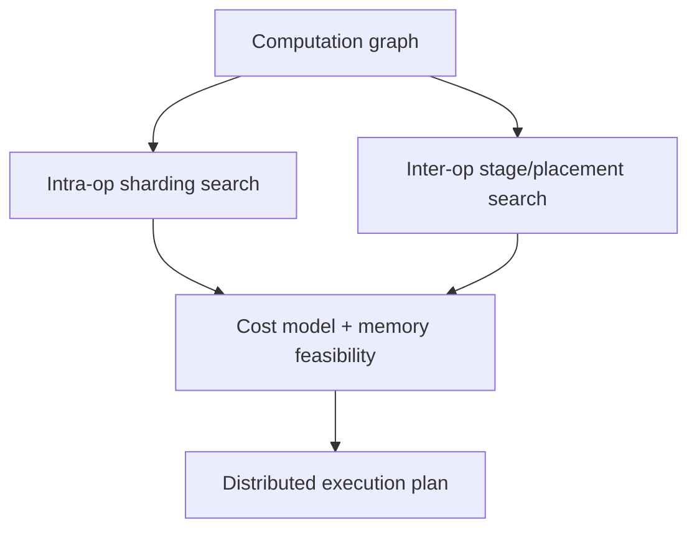

# 自动并行与代价模型：为什么仍不能“一键最优”

Auto-parallelism（自动并行）希望从单设备 computation graph、设备拓扑与内存约束，自动产生 tensor sharding、operator placement、pipeline partition 和 schedule。

## 两层搜索空间

Alpa 的经典划分是：

- intra-operator parallelism：单个 operator 内如何 shard，类似 TP/DP；
- inter-operator parallelism：不同 operator/stage 放在哪些设备，类似 PP。

只分别求两层局部最优未必得到全局最优，因为 sharding 决定 stage 边界的 reshard cost，stage 又决定可用 device mesh。

## 代价模型需要估什么

$$
T_{step}\approx T_{compute}+T_{collective}+T_{p2p}+T_{bubble}-T_{overlap}
$$

还需约束 peak memory、divisibility、kernel availability 与 network contention。简单 FLOPs/peak TFLOPS 会忽略 GEMM shape；简单 bytes/bandwidth 会忽略 collective latency、并发 traffic 和拓扑。

常见方法：

- analytical model：快、可解释，但近似粗；
- profile-based lookup：贴近硬件，但测量组合多、迁移性差；
- simulator：可表达 schedule/topology，构建成本高；
- Integer Linear Programming（ILP，整数线性规划）/dynamic programming：有优化保证或结构化搜索，但大图组合爆炸；
- learned cost model：可拟合复杂硬件，训练数据与分布外泛化是问题。

## Sharding propagation 与 search 不同

GSPMD/DTensor-style propagation 根据用户给定或已知 operator rule 推导下游布局，解决“布局如何传递”；strategy search 决定“最初应选哪个布局”。前者可减少手写 collective，却不自动找到最佳 TP×PP×DP。

## 为什么 LLM 模板仍常由人调

Transformer 重复结构缩小了搜索空间，人可以用少数 degree 枚举；同时真实约束很难建模：

- kernel 对特定 shape 的性能断点；
- NCCL algorithm/runtime 选择；
- MoE 动态 token distribution；
- packed variable-length sequence；
- failure/straggler 与 multi-tenant congestion；
- convergence 对 global batch 和 async staleness 的影响。

因此主流实践多是“人定义结构化搜索空间 + profile/cost model 筛选 + 小规模/全规模验证”。

## 2026 年值得关注的方向

- topology-aware planner 把 NVLink domain、NIC rail、rack 与动态网络状态纳入映射；
- fine-grained/heterogeneous parallelism 允许不同 layer/module 使用不同 TP/EP degree；
- runtime adaptive parallelism 根据 sequence length、traffic 或 failure 动态改 degree；
- goodput optimization 联合 batch size、parallel strategy 和 convergence，而非只最大化 step throughput；
- unified training/inference model 同时评估两类 runtime，服务于 RL weight reshard 与弹性系统。

这些方向大量来自研究系统或 roadmap，离“任意模型生产一键最优”仍有距离。

## 使用自动 planner 的验证协议

1. 检查 numerical equivalence 与 layout metadata；
2. 检查 peak memory 是否包含 transient gather/workspace；
3. 对预测最优前 N 个方案实测，而非只跑第一名；
4. 在目标规模验证 congestion/straggler；
5. 对软件升级、shape 分布变化做重新 profile；
6. 保存 planner 输入、cost table 与最终理由，避免不可解释配置。

## 资料

- [Alpa Paper](https://arxiv.org/abs/2201.12023)
- [TorchTitan](https://github.com/pytorch/torchtitan)
- [TAPAS](https://arxiv.org/abs/2302.00247)
- [UniAP](https://arxiv.org/abs/2307.16375)
- [AoiZora 2026](https://arxiv.org/abs/2606.17566)
- [COPUS 2026](https://arxiv.org/abs/2604.26687)

