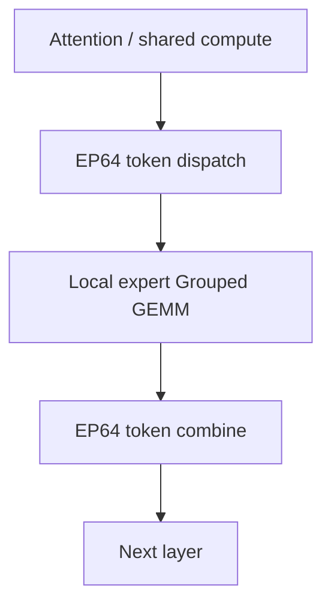

# 案例：DeepSeek-V3 的并行选择与 DualPipe

<!-- learning-position -->
> **学习定位**：A8 · 专项。
> **前置**：[GPU、tensor 与通信基础](<../00_Foundations/README.md>)。
> **首读/二读**：PP/EP 基础完成后对照 DualPipe；不直接照抄配置。
> **进度与实验**：[学习清单](<../学习清单.md>) · [总入口](<../README.md>)。
<!-- /learning-position -->

## 入门例子：读复杂流水线前先验证依赖

DualPipe 等复杂流水设计同时安排计算与通信重叠。先在已有 PP/EP 知识上标出：token dispatch 完成前哪个 expert 不能开算，backward 的哪部分依赖输入梯度，哪些权重梯度工作可以稍后做。

论文报告的收益依赖模型、路由、网络、microbatch 和资源配置。照搬 stage 数或 EP degree，不等于复制其性能条件。先把本机基线的空洞定位清楚，才知道这种 schedule 是否解决你的问题。

练习：从报告中选一张时序图，列出每个彩色块的输入、输出、通信组和资源。无法解释依赖的块先回到 PP/AllToAll 主章，不需要一开始复现全规模。

## 机制与实现

本案例不把 DeepSeek 配置当作通用答案，而是推导“模型结构、硬件约束与并行方案为何相互塑造”。

## 已公开的关键配置

DeepSeek-V3 技术报告描述 671B total parameters、37B activated parameters per token；训练使用 2,048 张 H800 GPU，并采用 16-way Pipeline Parallelism（PP，流水线并行）、64-way Expert Parallelism（EP，专家并行），ZeRO-1-style Data Parallelism（DP，数据并行），且不使用 Tensor Parallelism（TP，张量并行）。

官方 DualPipe repository 将其描述为双向 pipeline algorithm，可重叠 forward/backward 的 computation-communication 并减少 bubble。DeepSeek profile-data 公开的训练剖析使用 EP64、TP1、4K sequence，每个 chunk 包含 4 个 MoE layers。

## 为什么 TP=1 值得注意

传统 dense 大模型常用 TP=8，因为每层矩阵巨大且需要节点内分摊；DeepSeek-V3 选择 TP1，可能带来：

- 避免每层 TP AllReduce，减少高频同步；
- 保持 expert GEMM 更大，提升计算效率；
- 把通信重点集中到 MoE token dispatch/combine；
- 用 EP64 分摊大量 expert 参数。

这是基于公开结构的工程解释，不表示 TP 对所有 MoE 都无用。若单 expert/attention layer 放不下或硬件不同，仍可能需要 TP/ETP。

## EP64 为什么改变网络问题

EP64 意味着 token 路由跨大 group，All-to-All 成为核心。DeepSeek 使用 DeepEP 路线优化节点内 NVLink 与跨节点 RDMA 的不对称通信，并控制 communication kernel 的 Streaming Multiprocessor（SM，流式多处理器）占用。

只看 MoE active FLOPs 会低估网络、router imbalance 和 expert state 的系统成本。

## DualPipe 的核心直觉

普通 pipeline 从一端送 forward，再从末端送 backward，fill/drain 产生 bubble。DualPipe 从 pipeline 两端注入两个方向的 micro-batch flow，并细分 computation/communication，使一个方向等待 EP communication 时，尽量用另一个方向的 compute 填充。

真实 schedule 比此图复杂；应结合官方 schedule diagram 与 profile timeline 阅读。DualPipe 的收益依赖：forward/backward chunk 时长接近、EP communication 可切分并重叠、stage balance 良好，以及足够 micro-batch。

## DualPipe 不只是“PP bubble 更小”

DeepSeek 的目标是联合隐藏：

- attention/MLP compute；
- MoE dispatch/combine communication；
- pipeline activation P2P；
- backward input/weight gradient compute。

因此它与 DeepEP、expert placement、chunk 中 MoE layer 数是一套协同设计。只复制 schedule 而没有相同 communication kernel 和 workload ratio，不一定复现收益。

## 需要付出的代价

- 双向 flow 与 stage/chunk mapping 更复杂；
- 参数/activation 生命周期和 peak memory 更难推导；
- 首尾 stage 可能需要额外 embedding/head 处理；
- 错误/hang 的 timeline 更难读；
- 模型结构改变后，原来的 compute/communication balance 可能失效。

## 如何客观复现

1. 先用相同 layer/shape 测 F/B、dispatch、combine、P2P 独立时间；
2. 对比 1F1B、interleaved 1F1B 与 DualPipe 的理论 schedule；
3. 用真实 profiler 验证隐藏时间，而非只看 colored bars；
4. 记录 peak activation 与 communicator buffer；
5. 改 EP degree、micro-batch 与 network topology 做敏感性分析；
6. 报告端到端 tokens/s、Model FLOPs Utilization（MFU，模型浮点运算利用率）和 scaling efficiency。

## 资料

- [DeepSeek-V3 Technical Report](https://arxiv.org/abs/2412.19437)
- [DeepSeek DualPipe](https://github.com/deepseek-ai/DualPipe)
- [DeepSeek Profile Data](https://github.com/deepseek-ai/profile-data)
- [DeepEP](https://github.com/deepseek-ai/DeepEP)
