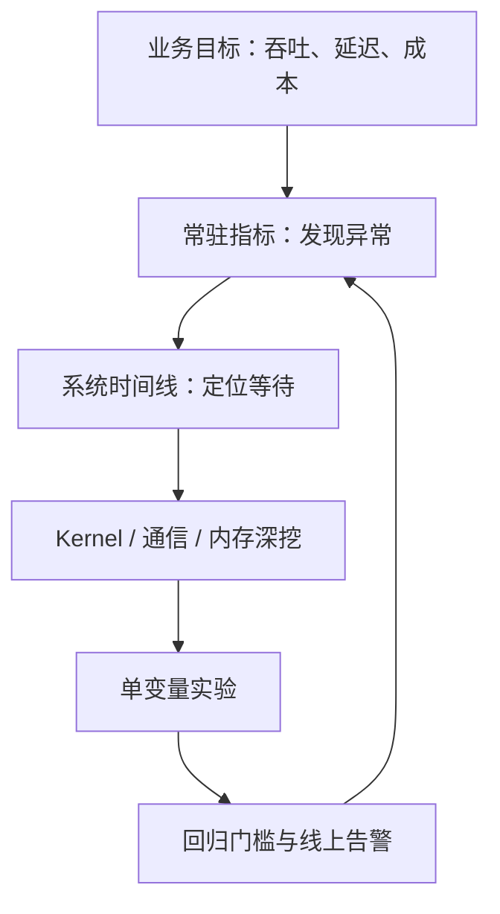

# Profiling / Performance Analysis｜专题总览

> 资料核对：2026-09-05。版本锚点为 PyTorch 2.14、NVIDIA Nsight Systems/Compute 2026 系列、NVIDIA Data Center GPU Manager（DCGM，数据中心 GPU 管理器）与 NVIDIA Collective Communications Library（NCCL，英伟达集合通信库）2.31；稳定方法论不依赖具体版本。

## 目标：解释“时间去哪了”，而不只是看 GPU-Util

Profiling（性能剖析）回答一次运行内部发生了什么；Observability（可观测性）回答系统长期处于什么状态；Benchmarking（基准测试）回答在固定规则下能做到多快。三者需要联动：监控发现异常，trace 缩小到阶段，kernel profiler 找到微观原因，受控 benchmark 验证改动。

最常见的误判是把 `nvidia-smi` 的 GPU 利用率当成“算力利用率”。它通常表达采样窗口内 GPU 是否有 kernel 活跃，而不是 Tensor Core 达到了多少峰值 FLOPS（Floating-Point Operations per Second，每秒浮点运算数）。一个由大量低效率小 kernel 填满时间线的程序也可以显示 100%。

## 统一观测层级

| 层级 | 先问什么 | 主要证据 | 典型工具 |
|---|---|---|---|
| 用户/任务 | SLO、吞吐、成本是否达标？ | TTFT、TPOT、tokens/s、step time | 服务指标、训练日志 |
| 阶段 | 时间花在 data、forward、backward、通信还是 optimizer？ | phase duration、关键路径 | NVTX、PyTorch Profiler |
| 系统 | CPU 和 GPU 谁在等谁？多 stream 是否重叠？ | CPU/GPU timeline | Nsight Systems |
| 算子 | 哪些 operator/kernel 支配时间？ | self time、调用次数、shape | PyTorch Profiler、`nsys stats` |
| Kernel | 为什么这个 kernel 慢？ | occupancy、stall、memory throughput、roofline | Nsight Compute |
| 集群 | 哪个 rank、链路或节点是长尾？ | collective duration、straggler、fabric counter | Flight Recorder、NCCL profiler、DCGM |

原则是自上而下，不是一上来就收集所有硬件计数器。越深的 profiler 通常开销越高，也越容易扰动原工作负载。

## 章节结构

本专题采用“总览 + 16 个分章”，共 17 篇 Markdown。

| 顺序 | 文档 | 核心问题 |
|---|---|---|
| 1 | [方法论与测量陷阱](01_方法论与测量陷阱.md) | 怎样建立可复现、低扰动、有因果证据的性能实验？ |
| 2 | [GPU 指标与遥测](02_GPU指标与遥测.md) | GPU-Util、SM、显存、功耗和时钟分别说明什么？ |
| 3 | [Nsight Systems 时间线](03_NsightSystems时间线.md) | 如何从 CPU/GPU 时间线看 launch、同步、空洞与重叠？ |
| 4 | [Nsight Compute Kernel 分析](04_NsightCompute_Kernel分析.md) | 如何用 roofline、occupancy 与 stall reason 解释单个 kernel？ |
| 5 | [PyTorch Profiler](05_PyTorchProfiler.md) | 如何把 module、operator、kernel、shape 与 memory 串起来？ |
| 6 | [Roofline 与瓶颈分类](06_Roofline与瓶颈分类.md) | compute-bound、memory-bound、latency-bound 怎样区分？ |
| 7 | [CPU 与数据加载](07_CPU与数据加载.md) | GPU 空洞是否来自 Python、DataLoader、tokenizer 或 H2D？ |
| 8 | [显存与 OOM](08_显存与OOM.md) | allocated、reserved、峰值、碎片和非 PyTorch 分配如何定位？ |
| 9 | [分布式通信 Profiling](09_分布式通信Profiling.md) | collective 慢、rank hang 和网络长尾如何区分？ |
| 10 | [并行策略与 Bubble](10_并行策略与Bubble.md) | TP/PP/CP/EP/FSDP 的等待在 timeline 上长什么样？ |
| 11 | [训练性能指标](11_训练性能指标.md) | tokens/s、MFU、HFU 与 scaling efficiency 如何正确计算？ |
| 12 | [推理性能分析](12_推理性能分析.md) | TTFT、TPOT、ITL、goodput 与 KV 压力如何联动？ |
| 13 | [专项负载：MoE、长上下文与 RL](13_专项负载_MoE_长上下文_RL.md) | 动态 shape、路由不均与多角色流水如何分析？ |
| 14 | [线上可观测性](14_线上可观测性.md) | DCGM、Prometheus、Grafana 如何组成低开销证据链？ |
| 15 | [案例：GPU 利用率低](15_案例_GPU利用率低.md) | 一个模糊现象怎样逐层收敛到根因？ |
| 16 | [实验与排查工作表](16_实验与排查工作表.md) | 如何记录环境、证据、假设、改动和回归阈值？ |

## 阅读路径

- 第一次系统学习：00 → 01 → 02 → 03 → 05 → 06。
- Kernel 优化：03 → 04 → 06 → [Kernel 专题](../01_Kernel_GPU_Programming_Compiler/00_专题总览.md)。
- 多机训练：03 → 09 → 10 → 11。
- 推理服务：02 → 08 → 12 → 14。
- 故障现场：先看 15，再按症状跳到对应章节。

## 2026 年值得关注的变化

- PyTorch Profiler 继续向 accelerator-agnostic（加速器无关）演进，并把 CPU dispatcher、设备 collector 与 Python stack 统一到同一条时间线。
- PyTorch Mosaic 可以对多 worker memory snapshot 做离线拼接，用于超大规模模型的 Out of Memory（OOM，内存不足）诊断。
- NCCL 的 Reliability, Availability, Serviceability（RAS，可靠性、可用性、可维护性）诊断和 profiler plugin 正在把通信排障从文本日志推进到结构化、常驻式监测。
- AIPerf 把生成式推理 benchmark 从单点吞吐推进到 workload shape、Pareto curve（帕累托曲线）和 Service Level Objective（SLO，服务等级目标）约束下的 goodput。
- Nsight Compute 2026.2 支持 CUDA 13.3，并继续增加更细的 SASS（Streaming Assembler，GPU 机器指令）统计；但计数器采集重放会显著扰动 kernel，仍应在缩小目标后使用。

## 业界常见的四种视角

这些并不是互斥阵营，而是职位与问题不同造成的优先级差异：

| 视角 | 常见主张 | 优点 | 盲区 |
|---|---|---|---|
| Kernel-first | 先把热点 kernel 的 roofline、occupancy、memory access 做到极致 | 能找到微观硬件损失 | 热点可能不在端到端关键路径 |
| Timeline-first | 先看 CPU、GPU、通信与 stream 的依赖和空洞 | 最擅长定位等待与 overlap | 不解释 kernel 内部细节 |
| SLO-first | 先固定真实流量和尾延迟目标，再优化 goodput | 直接对应用户价值 | 需要高质量 workload/telemetry |
| Always-on | 常驻低开销 metric/event，异常时触发 trace | 适合偶发长尾与大规模集群 | 必须治理开销、基数、隐私和保留期 |

本专题的取舍是：SLO/训练进度定义目标，常驻观测发现问题，timeline 找关键路径，最后才对确定的 kernel 或通信环节深挖。

## 核心资料

- [Nsight Systems User Guide](https://docs.nvidia.com/nsight-systems/UserGuide/index.html)
- [Nsight Compute Profiling Guide](https://docs.nvidia.com/nsight-compute/ProfilingGuide/index.html)
- [PyTorch Profiler](https://docs.pytorch.org/docs/stable/profiler.html)
- [PyTorch CUDA Memory](https://docs.pytorch.org/docs/stable/torch_cuda_memory.html)
- [NVIDIA DCGM](https://docs.nvidia.com/datacenter/dcgm/latest/)
- [NCCL RAS](https://docs.nvidia.com/deeplearning/nccl/user-guide/docs/troubleshooting/ras.html)
- [NVIDIA AIPerf](https://docs.nvidia.com/aiperf/)
