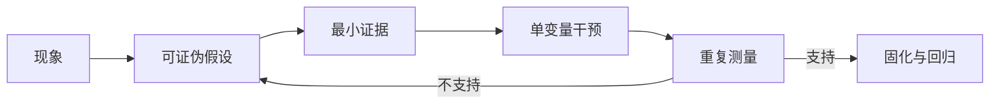

# 性能分析方法论与测量陷阱

## 1. 先定义“快”

性能不是单一数字。训练常优化 time-to-train、tokens/s/GPU 或成本；离线推理可能优化总吞吐；在线推理则要在 Time to First Token（TTFT，首 token 时间）、Time per Output Token（TPOT，每输出 token 时间）、尾延迟与错误率约束下优化 goodput。

先写目标函数与约束：

```text
目标：最大化每 GPU 每秒有效输出 token
约束：TTFT p99 < 800 ms，TPOT p99 < 40 ms，错误率 < 0.1%
固定：模型 commit、dtype、输入/输出长度分布、硬件与精度门槛
```

没有这些条件，“吞吐提高 20%”可能只是把输入缩短、降低输出长度、改变精度或牺牲 tail latency。

## 2. 建立可复现实验

| 要素 | 必须记录的内容 |
|---|---|
| 软件 | framework/runtime、CUDA、driver、NCCL、kernel library、commit |
| 硬件 | GPU 型号、数量、互联、NIC、CPU、NUMA、功耗/时钟策略 |
| 负载 | batch、sequence distribution、prompt/output length、并发或到达率 |
| 数值 | dtype、quantization、TF32、determinism、accuracy/loss |
| 运行 | warm-up、测量窗口、重复次数、checkpoint/logging 是否在窗口内 |
| 环境 | 其他租户、温度、降频、CPU affinity、container limits |

NUMA = Non-Uniform Memory Access（非统一内存访问）；NIC = Network Interface Card（网络接口卡）。CPU 线程在错误 NUMA node 上准备 GPU 所需数据，可能让 Host-to-Device（H2D，主机到设备）链路看似异常。

## 3. 用“假设—证据—干预”闭环



例：GPU 每 80 ms 出现 12 ms 空洞。

- 假设 A：DataLoader 供给不足。证据应是 CPU data range 延长、队列为空，且预生成 batch 后空洞消失。
- 假设 B：每步同步日志。证据应是空洞前出现 `cudaDeviceSynchronize` 或 `.item()` 对应 CPU stack，关闭同步日志后消失。
- 假设 C：gradient AllReduce 暴露。证据应是 NCCL kernel 占据该区间，而不是 GPU 完全空闲。

只根据一个截图猜原因，不构成闭环。

## 4. 测量异步 GPU 的正确方式

CUDA kernel launch 通常异步。下面的 CPU 计时只测到提交开销：

```python
start = time.perf_counter()
y = model(x)
elapsed = time.perf_counter() - start  # GPU 可能还没完成
```

微基准可在计时边界显式同步，或使用 CUDA event：

```python
torch.cuda.synchronize()
start = torch.cuda.Event(enable_timing=True)
end = torch.cuda.Event(enable_timing=True)
start.record()
y = model(x)
end.record()
end.synchronize()
print(start.elapsed_time(end), "ms")
```

但不要把每次迭代同步的写法带回生产路径；它会消灭本来可重叠的工作。

## 5. Warm-up 不是随便丢掉前几步

首轮可能包含：CUDA context 初始化、lazy module 初始化、memory pool 扩张、JIT（Just-In-Time，即时）编译、`torch.compile` tracing/compilation、autotuning、CUDA Graph capture、通信器建立与文件缓存升温。

正确做法是画出逐步时间，确认进入稳态后再选窗口。动态 shape 可能触发多次 recompilation；此时“第 10 步以后都是稳态”并不成立。

## 6. Profiler 会改变被测对象

- trace 事件越多，CPU 写缓冲和输出文件越大；Python stack、shape、memory 记录都有额外开销。
- Nsight Compute 采集硬件 counter 时可能多次 replay 同一个 kernel。
- Nsight Systems 和 DCGM 都可能竞争有限的 GPU performance counter；必要时暂停 DCGM profiling metrics，完成后恢复。
- profiler 本身消耗 GPU memory；接近显存上限的任务可能只在 profiling 时 OOM。
- 多 rank 同时写 trace 会放大共享文件系统抖动。

因此采用三级策略：常驻低开销 metric → 少量 rank 的短窗口 trace → 只对少量 kernel 做 counter replay。

## 7. 平均值会藏住最重要的问题

报告至少包含：median（中位数）、p90/p95/p99、min/max、变异系数和样本数。分布式 step 由最慢 rank 决定；在线服务由 tail latency 决定。平均 20 ms 的 collective 若每 200 步出现一次 300 ms 长尾，平均数仍可能很好看。

不要对不同输入长度直接聚合。Attention 复杂度、KV cache 占用和 batching 效率都随输入形状变化。应按 input sequence length（ISL，输入序列长度）、output sequence length（OSL，输出序列长度）、batch/concurrency 分桶。

## 8. 相关性不等于因果

GPU 功耗下降与网络通信变长同时发生，不代表降频导致通信慢：更可能是 GPU 在等网络，所以功耗下降。可用干预区分：固定时钟/功耗后是否仍慢；对通信做独立 microbenchmark；替换成 synthetic data；临时禁用某段 overlap。

## 9. 性能改动的完成定义

一个改动只有同时满足以下条件才算完成：

1. 目标指标在多次独立运行中稳定改善；
2. correctness/accuracy 不退化；
3. p99、峰值显存、功耗或错误率没有不可接受恶化；
4. 在至少两个代表性 shape 上成立；
5. 证据能解释为什么快，而非偶然波动；
6. 有自动化回归阈值和回退方案。

## 资料

- [PyTorch Benchmark Recipe](https://docs.pytorch.org/tutorials/recipes/recipes/benchmark.html)
- [Nsight Systems Release Notes](https://docs.nvidia.com/nsight-systems/ReleaseNotes/index.html)
- [Nsight Compute Profiling Guide](https://docs.nvidia.com/nsight-compute/ProfilingGuide/index.html)
