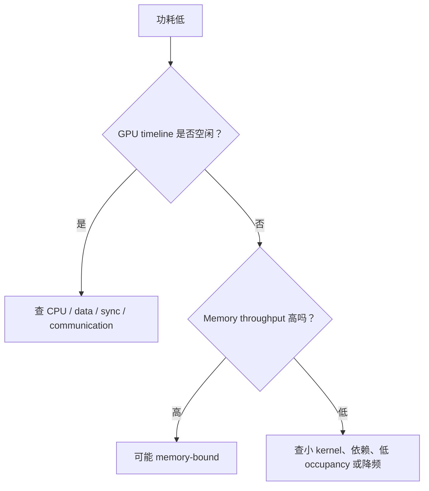

# GPU 指标与遥测

## 1. 三种常被混淆的“利用率”

| 名称 | 大致含义 | 能说明什么 | 不能说明什么 |
|---|---|---|---|
| GPU utilization | 采样窗口内是否有 kernel 在执行 | GPU 是否经常完全空闲 | kernel 是否高效、Tensor Core 是否吃满 |
| SM activity/throughput | Streaming Multiprocessor（SM，流式多处理器）的活跃/吞吐 | 执行单元忙碌程度 | 单独不能区分有用工作与低效指令 |
| MFU | 有效模型 FLOPs / 理论峰值 FLOPs | 端到端模型计算效率 | 依赖 FLOPs 口径，跨报告未必可比 |

因此出现 `GPU-Util=100%`、Model FLOPs Utilization（MFU，模型浮点运算利用率）仅 25% 并不矛盾：GPU 一直在执行，但可能在运行小 kernel、访存等待、低效 layout conversion 或通信 kernel。

## 2. `nvidia-smi` 适合快速体检

```bash
nvidia-smi --query-gpu=timestamp,index,utilization.gpu,utilization.memory,memory.used,power.draw,clocks.sm,temperature.gpu --format=csv -l 1
```

它适合发现“某卡明显闲置、显存异常、功耗/时钟下降、错误进程占卡”，不适合回答 2 ms 级 bubble 或单个 kernel 的瓶颈。

注意：`utilization.memory` 常表示采样窗口内 device memory 读写活跃度，不是“显存容量占比”；容量应看 `memory.used / memory.total`。不同 GPU/虚拟化模式支持的字段也不同。

## 3. DCGM：集群级 GPU 遥测

DCGM（Data Center GPU Manager，数据中心 GPU 管理器）提供 health、diagnostics、statistics 与 profiling metrics。`dcgm-exporter` 把指标暴露给 Prometheus。Exporter 从 hostengine 已 watch 的缓存样本读取，所以 Prometheus scrape interval 不是硬件 counter 的真实采样周期。

推荐四组指标：

| 组 | 例子 | 用途 |
|---|---|---|
| 资源 | GPU/显存利用率、framebuffer used | 容量与空闲检测 |
| 计算/内存 | SM active、Tensor active、DRAM active、PCIe/NVLink throughput | 判断工作类型和链路压力 |
| 热与功耗 | clocks、power、temperature、throttle reason | 发现降频和散热问题 |
| 可靠性 | Xid、ECC、NVLink error、row remap | 发现硬件/driver 异常 |

ECC = Error-Correcting Code（纠错码）。Xid 是 NVIDIA driver 报告的 GPU 错误事件编号；它是定位入口，不应脱离具体编号和上下文笼统解释。

## 4. 从“低功耗”推断时要谨慎

可能路径：



Memory-bound kernel 可能占满时间线但功耗低于大型 Tensor Core GEMM。反过来，高功耗也不证明模型有效吞吐高。

## 5. 时钟与降频

记录 SM clock、memory clock、power limit、temperature 与 throttle reason。性能突然出现平台期时：

- power cap：功耗达到上限，时钟被限制；
- thermal throttle：温度导致降频；
- application clock/locked clock 配置不一致；
- 不同节点 GPU firmware 或 power policy 不一致。

锁定时钟适合可控 benchmark，但会改变能效和生产策略，必须记录并在实验后恢复。新 GPU 上具体命令与支持状态应以对应 `nvidia-smi` 手册为准。

## 6. 采样粒度与 aliasing

若每 100 ms 有一次 5 ms 空洞，而遥测每 1 秒采一个均值，它可能完全不可见。这叫 aliasing（混叠）：采样频率不足导致真实周期被误表示。

长期监控用秒级 metric；短时 bubble 用微秒级 timeline。不要试图用 Prometheus 替代 profiler，也不要把 30 秒 trace 当线上容量趋势。

## 7. Counter 资源冲突

DCGM profiling metrics、Nsight Systems GPU metrics 与 Nsight Compute 可能使用同一组硬件性能计数器。若 profiler 提示 counter unavailable，可用：

```bash
dcgmi profile --pause
# 运行短时 profiler
dcgmi profile --resume
```

暂停会影响集群遥测，必须在维护窗口执行并确保恢复。不同 GPU 支持的 field group 不同，可先用 `dcgmi profile --list` 查询。

## 8. 一个最小 dashboard

每 GPU 至少同时画：

1. job/rank identity 与 GPU UUID；
2. GPU、SM、Tensor、DRAM activity；
3. framebuffer used 与 allocator-reported memory；
4. PCIe、NVLink、NIC throughput；
5. power、clock、temperature、throttle；
6. Xid/ECC/NVLink error；
7. 应用 step/TTFT/queue/KV-cache 指标。

只有硬件图没有应用 phase，常常只能看到“慢了”，看不到“哪一步慢了”。

## 资料

- [NVIDIA System Management Interface](https://docs.nvidia.com/deploy/nvidia-smi/index.html)
- [DCGM Feature Overview](https://docs.nvidia.com/datacenter/dcgm/latest/user-guide/feature-overview.html)
- [DCGM Exporter Metrics](https://docs.nvidia.com/datacenter/dcgm/latest/reference/dcgm-exporter-metrics.html)
- [dcgmi profile](https://docs.nvidia.com/datacenter/dcgm/latest/reference/command-line-reference/dcgmi/dcgmi-profile.html)
