# Nsight Systems 时间线

Nsight Systems 是系统级 profiler：它把 CPU thread、Operating System Runtime（OSRT，操作系统运行时）、CUDA API、GPU kernel、memory copy、NVTX range 与通信事件放在统一时间轴。它回答“谁在等谁”，而不是解释一个 kernel 内部每条指令为什么慢。

## 1. 最小采集

```bash
nsys profile \
  --trace=cuda,nvtx,osrt \
  --sample=cpu \
  --stats=true \
  --capture-range=cudaProfilerApi \
  --capture-range-end=stop \
  -o report \
  python train.py
```

在程序中只包住稳态窗口：

```python
torch.cuda.cudart().cudaProfilerStart()
for _ in range(profile_steps):
    train_step()
torch.cuda.cudart().cudaProfilerStop()
```

也可用 NVTX（NVIDIA Tools Extension，NVIDIA 工具扩展）标注语义：

```python
with torch.cuda.nvtx.range("forward/attention"):
    y = attention(q, k, v)
```

## 2. 一条健康时间线

```mermaid
gantt
    title 单个训练 step 的理想重叠示意
    dateFormat X
    axisFormat %L
    section CPU
    prepare next batch :0, 25
    launch compute      :25, 75
    section Compute stream
    forward             :10, 35
    backward            :35, 75
    section Comm stream
    gradient RS         :50, 78
```



真实目标不是“没有通信”，而是通信尽量落在 backward compute 下方；也不是“CPU 一直忙”，而是 CPU 能在 GPU 需要前提交足够工作。

RS = ReduceScatter（归约散射）。

## 3. 五种常见图形

| 时间线形态 | 首要怀疑 | 下一步 |
|---|---|---|
| GPU 长空洞，CPU 同时忙于 Python | launch-bound、data、GC、序列化 | 看 CPU stack/NVTX，合并 kernel 或异步预取 |
| GPU 长空洞，CPU 卡在 CUDA API | 显式/隐式同步 | 找 `cudaDeviceSynchronize`、blocking copy、`.item()` |
| 大量极短 kernel 紧密排列 | launch overhead、未融合 pointwise | PyTorch op table、`torch.compile`/fusion 实验 |
| NCCL kernel 与 compute 完全串行 | dependency 或 stream overlap 失败 | 查 event、bucket ready time、优先级 |
| 某一 rank 尾部延伸，其他 rank 等待 | straggler、负载不均、链路异常 | 对齐多 rank trace 与输入/token count |

## 4. CPU 提交与 GPU 执行的区别

CUDA API row 上的 kernel launch 是 CPU 提交时间；GPU row 是实际执行时间。两者相距很远说明 queue 很深，不一定坏。若 CPU launch 紧贴 GPU 执行且中间频繁空洞，则 CPU 可能供给不足。

一个长 `cudaMemcpyAsync` 也未必异步：host memory 若不可 page-lock、copy direction/stream 条件不满足，CPU 或 GPU 仍可能阻塞。结合 copy engine、stream 和 API duration 判断。

## 5. 分析关键路径，而非相加所有 duration

多 stream 事件会重叠。把所有 kernel duration 相加可能超过 wall time；`nsys stats` 中某个 category 的 Time% 也是相对该报告所列事件总时长，不等于 step wall-clock 百分比。

关键路径是决定 step 完成时间的依赖链。例如通信 kernel 运行 20 ms，但 18 ms 被计算覆盖，exposed communication 只有 2 ms。优化总通信 10% 只节省至多 0.2 ms，而不是 2 ms。

## 6. 命令行快速摘要

```bash
nsys stats report.nsys-rep
nsys stats --report cuda_api_sum,cuda_gpu_kern_sum,nvtx_sum report.nsys-rep
```

先看：

- CUDA API 是否被同步调用主导；
- GPU kernel top-N 与调用次数；
- NVTX phase 的 p50/p99；
- memory copy 方向、体积和是否与 compute 重叠；
- NCCL kernel 是否构成 exposed tail。

## 7. 多 rank 采集策略

不要默认所有 rank 全程采集。先取一个代表 rank；发现 straggler 后，选择同一节点内快/慢 rank 与跨节点对应 rank；用共同 step ID、NVTX range 和 wall-clock 对齐。全 rank trace 应短、写本地盘并在结束后聚合，避免 trace I/O 本身污染共享存储。

## 8. 从 Systems 转到 Compute 的边界

当时间线已经证明某个 kernel 稳定支配关键路径，而且输入 shape 可复现时，才用 Nsight Compute。若问题是 GPU 空洞、CPU 等待或 rank 不齐，单 kernel counter 几乎不会回答根因。

## 资料

- [Nsight Systems User Guide](https://docs.nvidia.com/nsight-systems/UserGuide/index.html)
- [Nsight Systems Analysis Guide](https://docs.nvidia.com/nsight-systems/AnalysisGuide/index.html)
- [NVTX Documentation](https://nvidia.github.io/NVTX/)
