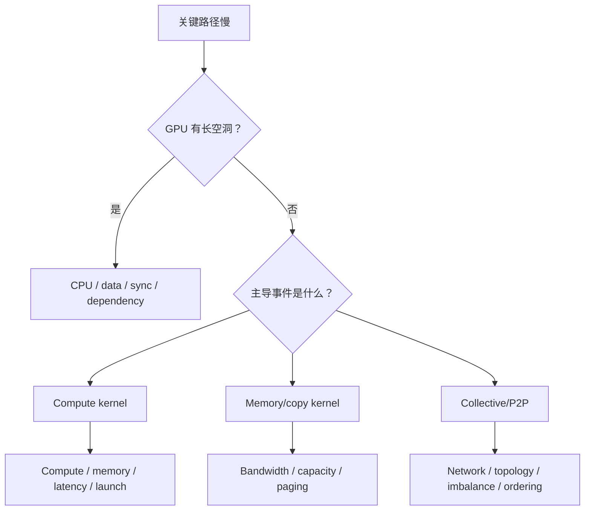

# Roofline 与瓶颈分类

“Compute-bound 还是 memory-bound”只是第一层分类。AI Infra 中至少还要识别 launch-bound、latency-bound、communication-bound、capacity-bound 与 synchronization-bound。

## 1. Roofline 基础

Arithmetic Intensity（AI，算术强度）：

$$AI = \frac{F}{Q}$$

其中 $F$ 是浮点运算量，$Q$ 是从某一级 memory hierarchy 搬运的字节。若峰值算力为 $P_{peak}$，带宽为 $BW$：

$$P_{attainable} = \min(P_{peak}, AI \cdot BW)$$

ridge point 为：

$$AI_{ridge}=\frac{P_{peak}}{BW}$$

例如某设备目标 dtype 峰值 1 PFLOP/s、HBM 带宽 4 TB/s，则 ridge point 约 250 FLOPs/byte。AI 低于该值的工作若数据主要来自 HBM，更可能受 HBM 带宽上限约束。

## 2. Roofline 的口径陷阱

- 峰值必须匹配 dtype、dense/sparse、Tensor Core 模式与实际 clock；
- bytes 可以针对 HBM、L2、L1/shared，不同层给出不同 roofline；
- FLOPs 可能按 algorithmic、model、executed instruction 三种口径计算；
- cache hit 会让“按 tensor 大小估算的 bytes”与硬件 counter 不同；
- 小 kernel 即使 AI 高，也可能因启动和 wave 数不足远离 compute roof。

## 3. 更完整的瓶颈树

## 4. 七类瓶颈的证据

| 类别 | 关键证据 | 常见误诊 |
|---|---|---|
| compute-bound | Tensor/FP pipeline 高，AI 在 ridge 右侧 | 看到 GPU-Util 高就认定 |
| bandwidth-bound | DRAM/L2 throughput 接近实测上限，AI 低 | 只看显存容量 |
| latency-bound | bandwidth 不高但 scoreboard stall 高、并行请求少 | 误以为“带宽还有余量就不该慢” |
| launch-bound | 大量微小 kernel，CPU launch 紧追 GPU | 对每个 kernel 做指令优化 |
| communication-bound | collective 在关键路径上有 exposed time | 用 collective 总时长代替 exposed time |
| synchronization-bound | stream/rank/host barrier 前出现等待 | 把等待归因给 barrier 本身 |
| capacity-bound | OOM、paging、频繁 eviction/recompute | 与 bandwidth-bound 混淆 |

## 5. 三个 LLM 例子

### Decode GEMV

单请求 autoregressive decode 中，Matrix-Vector Multiplication（GEMV，矩阵向量乘）每步读取大量权重却只服务少量 token，权重复用低，常受 HBM bandwidth 限制。增加 continuous batch 可提高每次权重加载服务的 token 数，逐渐转向 GEMM 并提高 AI，但也会增加单请求排队与 TPOT。

### Prefill attention

长 prompt 的 prefill 有大矩阵计算，也会产生庞大 attention intermediate。FlashAttention 通过 tiling 减少 HBM 往返，不是减少核心数学 FLOPs，而是提高相对于 HBM 的算术强度。

### MoE expert

Mixture of Experts（MoE，混合专家）token 被分散到多个 expert 后，每个 GEMM 可能太小；此时既有 All-to-All 通信，又有小 GEMM 低效率。只优化网络或只优化 GEMM 都可能把瓶颈推给另一方。

## 6. Optimization ladder

按照“少做 → 少搬 → 并行/重叠 → 做得更快”的顺序：

1. 删除无用计算、重复 materialization 与同步；
2. fusion、layout、cache reuse，减少 bytes；
3. batching、persistent kernel、CUDA Graph，减少 launch；
4. overlap data/communication/compute；
5. 选择更合适的 kernel、tile、dtype 与并行度；
6. 最后才靠更多硬件扩容。

## 7. 何时不用 Roofline

若 wall time 主要是 CPU、I/O、queue、network tail 或 synchronization，单 kernel roofline 不是正确模型。Roofline 是吞吐上界模型，不直接解释尾延迟、依赖链、资源竞争和负载不均。

## 资料

- [Nsight Compute Roofline Analysis](https://docs.nvidia.com/nsight-compute/ProfilingGuide/index.html#roofline-charts)
- [Kernel 专题：内存编程与数据搬运](../01_Kernel_GPU_Programming_Compiler/02_GPU内存编程与数据搬运.md)
