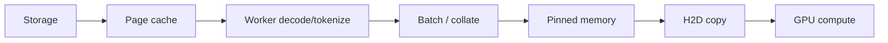

# CPU、数据加载与 Host-to-Device 路径

GPU 空闲不等于 GPU 有问题。训练数据的典型路径是 storage → page cache → DataLoader worker → collate/tokenize → pinned host memory → H2D copy → compute stream。

## 1. 供应链视图



任意环节低于消费速率，GPU 就会出现周期性空洞。均值带宽够也不代表 tail 能跟上。

## 2. DataLoader 参数不是越大越好

| 参数 | 作用 | 过大风险 |
|---|---|---|
| `num_workers` | 并行读取与预处理 | CPU oversubscription、上下文切换、内存放大 |
| `prefetch_factor` | 每 worker 预取 batch 数 | host memory 增长、陈旧数据、启动慢 |
| `persistent_workers` | epoch 间保留 worker | 常驻内存、dataset state 需正确重置 |
| `pin_memory` | page-lock host tensor，利于异步 H2D | pinned memory 过多压迫 OS |
| batch size | amortize Python/launch | 显存峰值、padding waste、latency |

官方建议通过 workload-specific tuning 选择 `num_workers`；不存在通用的“CPU 核数倍数”。

## 3. `pin_memory` 与 `non_blocking`

`pin_memory=True` 让 DataLoader 输出 page-locked（页锁定）host memory。配合：

```python
batch = batch.to("cuda", non_blocking=True)
```

可以让 H2D copy 异步，并在独立 stream/双缓冲设计下与计算重叠。但 `non_blocking=True` 不是魔法：源内存、设备能力、stream dependency 和后续使用顺序都必须允许重叠。

## 4. 用控制实验定位

按下列替换逐层切断变量：

1. 使用 GPU 上预生成 synthetic batch：若空洞消失，问题在 GPU 之前；
2. 数据预读到 host memory：区分 storage 与 CPU transform；
3. 关闭昂贵 augmentation/tokenization：确认 CPU compute；
4. 固定长度、关闭动态 packing：确认 shape/排序开销；
5. `num_workers` 做 0/1/2/4/8 sweep，同时看 CPU、RSS、queue wait；
6. 比较 pageable/pinned、blocking/non-blocking H2D；
7. 绑定 CPU 与 NUMA，检查 GPU–NIC/CPU affinity。

RSS = Resident Set Size（常驻内存集）。

## 5. 时间线上的典型证据

- 下一步开始前，CPU `enumerate(DataLoader)` range 很长：供应不足；
- CPU worker 满核但 GPU 空：decode/tokenize/augmentation 计算瓶颈；
- worker 多但大量 futex wait：锁/队列/共享内存竞争；
- H2D 与 compute 完全串行：缺少双缓冲或 dependency 阻塞；
- 每个 batch 大量小 copy：batch 在 Python 容器中碎片化；
- 只在 epoch 边界停顿：worker 重建、shuffle/index 生成或 cache cold。

## 6. Python 与隐式同步

这些写法常把 GPU 结果拉回 CPU：

```python
loss_value = loss.item()
flag = bool(cuda_tensor.any())
cpu_tensor = cuda_tensor.cpu()
print(cuda_tensor)
```

它们并非不能用，而是应降低频率、批量异步汇总，且在 profiler 中明确标注。Python logging、JSON 序列化、垃圾回收与 callback 也会阻塞 launch thread。

## 7. 编译与小 kernel

若 CPU launch thread 忙于提交大量 pointwise op，增加 DataLoader worker 不会解决。可尝试 `torch.compile` fusion、手写 fused kernel 或 CUDA Graph。判断依据是：GPU 空洞紧随 CPU launch、operator count 很高，且 synthetic data 也不改善。

## 8. 分布式放大效应

一个 rank 数据慢会使所有 rank 在下一次 collective 等待。于是时间线上“大家都在 NCCL 等”，根因可能只是某个 rank storage shard 或 tokenizer 慢。必须比较各 rank 进入 forward/collective 的时间，而不是只看 collective duration。

## 资料

- [PyTorch Data Loading Optimization](https://docs.pytorch.org/tutorials/intermediate/intermediate_data_loading_tutorial.html)
- [PyTorch Performance Tuning Guide](https://docs.pytorch.org/tutorials/recipes/recipes/tuning_guide.html)
- [Nsight Systems User Guide](https://docs.nvidia.com/nsight-systems/UserGuide/index.html)
