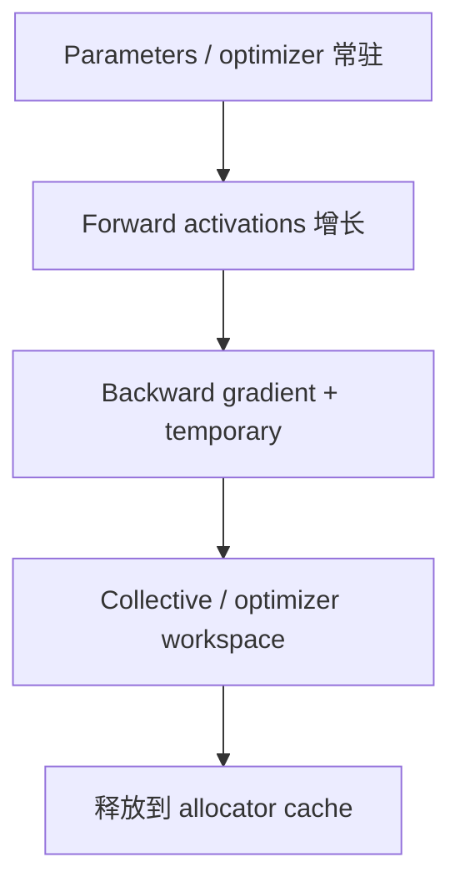

# 显存分析与 Out of Memory（OOM，内存不足）

OOM 不是只有“模型太大”一种原因。要区分 steady-state capacity、瞬时峰值、allocator fragmentation、leak、外部分配与多进程重复占用。

## 1. 三个数字

- allocated：PyTorch 活跃 tensor 实际占用；
- reserved：caching allocator 从 CUDA 保留的 segment，包括空闲 block；
- device used：driver 看到的总显存，包含 PyTorch、CUDA context、NCCL、自定义库和其他进程。

若 `nvidia-smi used` 明显大于 PyTorch reserved，优先调查 non-PyTorch allocation，而不是盲目调 allocator。

## 2. 一步训练为何出现多个峰值



FSDP（Fully Sharded Data Parallel，全分片数据并行）的 full-parameter AllGather、activation checkpoint 重计算、attention workspace、MoE dispatch buffer 与 checkpoint staging 都可能产生短暂峰值。

## 3. 建立显存账本

$$M_{peak} \neq M_{param}+M_{grad}+M_{optim}+M_{activation}$$

还需加入：

$$M_{peak}=M_{state}+M_{activation}+M_{temp}+M_{comm}+M_{graph}+M_{context}+M_{fragment}+M_{headroom}$$

分别记录 steady 与 peak；不要直接用 `总参数 / world size` 推断 FSDP 峰值。

## 4. Snapshot 工作流

```python
torch.cuda.memory._record_memory_history(
    enabled="all", context="all", stacks="all", max_entries=200000
)

for step in range(n):
    train_step()

torch.cuda.memory._dump_snapshot("rank0_snapshot.pickle")
```

查看：

1. OOM event 前哪个 allocation stack 请求了多大 block；
2. segment 内是否有大量不能合并的小空洞；
3. tensor 是否跨 step 持续存活；
4. peak 与 phase/NVTX 是否对齐；
5. 不同 rank 的 peak 是否与 token/expert load 相关。

这是私有前缀 API，版本可能变化，代码应放诊断开关后。

## 5. 碎片与真正容量不足

例：allocator 有 8 GiB 空闲，但分成很多不连续 block；新算子需要连续 4 GiB，仍可能失败。证据是 reserved 很高、allocated 较低、segment map 有碎片。

但很多“碎片”其实是活跃 tensor lifetime 交错。先缩短 lifetime、避免把 tensor 存进 list、调整 shape 稳定性，再考虑 allocator 参数。频繁调用 `empty_cache()` 通常不能释放活跃 tensor，还可能破坏复用并降低性能。

## 6. 泄漏常见来源

- 保存含 computation graph 的 `loss`/output，而非 `.detach()` 后的标量；
- hook/closure/callback 持有 tensor；
- evaluation/rollout 误开 gradient；
- variable shape 导致编译/cache artifact 增长；
- KV cache/request state 未在取消或异常路径回收；
- CUDA Graph 为多个 shape 建立独立 pool；
- 多 rank trace/diagnostic buffer 长期不清理。

## 7. 非 PyTorch 显存

PyTorch memory snapshot 看不到所有直接 CUDA allocation。NCCL buffer、custom CUDA extension、TensorRT、CUDA context 等需结合：

- `torch.cuda.device_memory_used()` 与 allocator statistics 的差；
- `nvidia-smi`/DCGM process accounting；
- 逐个禁用 library feature 的对照实验；
- library 自身 memory metric/log；
- Nsight Systems CUDA memory usage trace。

## 8. 推理中的 capacity 与性能耦合

KV（Key-Value，键值）cache 使用率接近上限时，运行时可能 preempt、recompute、swap 或拒绝请求。此时不一定立刻 OOM，却会表现为 TTFT/TPOT tail 突增。因此线上 dashboard 要把 KV block usage、preemption count 与 latency histogram 放在一起。

## 9. 修复优先级

1. 删除 leak 与意外持有；
2. 解释并削平 phase peak；
3. 减少 temporary/layout materialization；
4. activation checkpoint、FSDP/ZeRO、offload、KV paging；
5. 调 batch/sequence/concurrency；
6. 最后再调 allocator 或加卡。

每种换显存方案都会用计算、通信或 I/O 交换容量，必须同时验证吞吐与 tail。

## 资料

- [Understanding CUDA Memory Usage](https://docs.pytorch.org/docs/stable/torch_cuda_memory.html)
- [PyTorch Mosaic Memory Profiling](https://docs.pytorch.org/tutorials/beginner/mosaic_memory_profiling_tutorial.html)
- [通信与内存专题：GPU 内存组成](../02_Distributed_Communication_Memory/02_GPU内存组成与显存核算.md)
