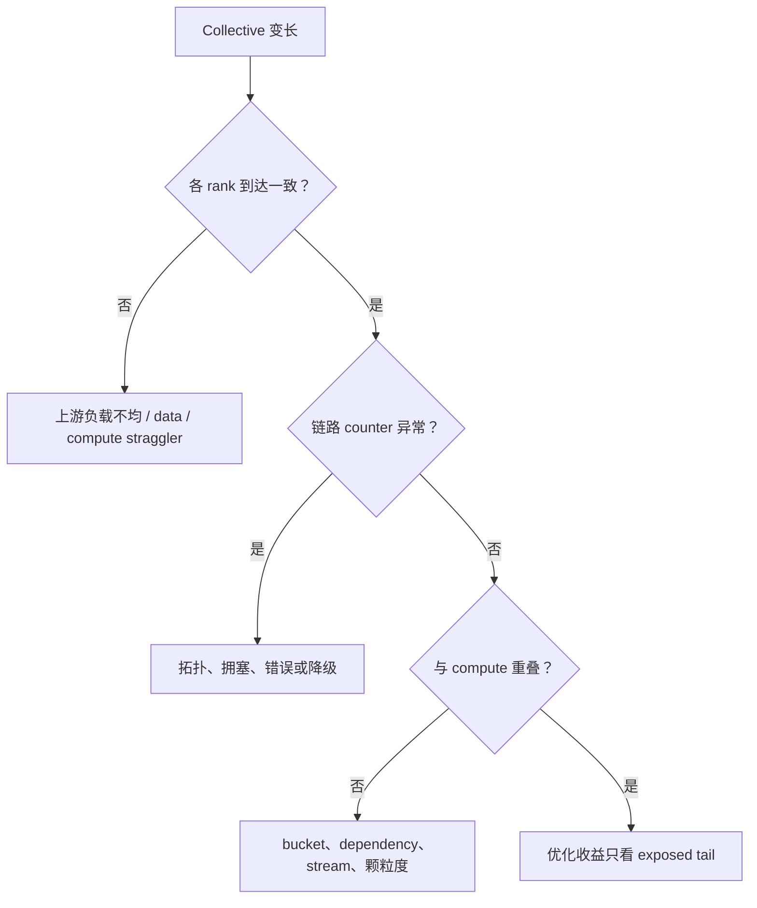

# 分布式通信 Profiling

通信分析的核心不是“某次 AllReduce 花了多久”，而是：谁先到、谁后到、走了哪条拓扑、传了多少数据、与什么计算重叠、最终暴露在关键路径上多少。

## 1. 三段时间必须分开

对一个 collective：

$$T_{observed}=T_{arrival\ skew}+T_{communication}+T_{queue/dependency}$$

- arrival skew：各 rank 进入 collective 的时间差；
- communication：数据实际经 GPU/link/network 传输和归约；
- queue/dependency：stream、event、前序 kernel 或 runtime 排队。

只从最快 rank 看，它可能在 NCCL kernel 中等了很久；从慢 rank 看 collective 很短。若据此判断网络坏了，会修错对象。

## 2. 证据栈

| 层级 | 工具/信息 | 适合回答 |
|---|---|---|
| Framework | phase/rank timestamp、PyTorch Profiler | 哪个 module 发起什么 collective |
| Process group | Flight Recorder | collective order、start/end、timeout 前事件 |
| NCCL | debug log、RAS、profiler plugin | communicator、algorithm/channel、健康与事件 |
| Timeline | Nsight Systems | NCCL kernel 与 compute overlap、rank arrival |
| Fabric | DCGM/NIC/switch telemetry | NVLink/PCIe/IB/RoCE 吞吐、错误、拥塞 |
| Microbench | `nccl-tests` | 给定 topology/message size 的基线 |

IB = InfiniBand；RoCE = RDMA over Converged Ethernet（融合以太网上的远程直接内存访问）。

## 3. PyTorch Flight Recorder

ProcessGroupNCCL 的 Flight Recorder（飞行记录器）用 ring buffer 保存 collective start/end 等事件。常见诊断设置以当前 PyTorch 文档为准，例如：

```bash
export TORCH_NCCL_TRACE_BUFFER_SIZE=200000
export TORCH_NCCL_DUMP_ON_TIMEOUT=1
export TORCH_NCCL_TRACE_CPP_STACK=1
```

较新版本也提供协调 dump/timeout 与 desync debug 相关开关。不要机械复制变量：先核对 PyTorch 版本、输出路径与 buffer 内存成本。Flight Recorder 的价值是 hang 后回看，而不是用海量 `NCCL_DEBUG=TRACE` 永久淹没日志。

## 4. NCCL RAS 与 profiler 方向

NCCL 2.31 的 RAS（Reliability, Availability, Serviceability，可靠性、可用性、可维护性）诊断可检查跨 rank 的 GPU inventory、driver compatibility、ECC、NVLink 状态与 `NCCL_*` 环境一致性。它是 readiness/diagnostic 工具，不会全面压测数据路径。

NCCL profiler plugin 已支持 collective、Point-to-Point（P2P，点对点）及 kernel launch 事件，并出现 Inspector 等常驻式示例。趋势是把一次性 debug log 变成结构化 event stream；生产启用前仍需测量事件量和开销。

## 5. Timeline 的四种模式



## 6. `nccl-tests` 怎么用才有意义

至少 sweep：

- collective 类型；
- message size，从 KB 到 GB；
- 单节点、跨两节点、目标规模；
- 目标 rank mapping 与 GPU–NIC affinity；
- 并发 communicator/traffic；
- 多轮分布，而非单次最大值。

`algbw` 与 `busbw` 口径不同；应用有效带宽也不同于 microbenchmark。对比必须保持 collective、dtype、rank count、in-place/out-of-place 一致。

## 7. Hang 的分类

- collective order mismatch：不同 rank 调用次序或 shape 不同；
- rank 未进入：上游异常、数据不等长、某 rank OOM/crash；
- network path failure：链路、NIC、switch 或 RDMA error；
- stream dependency cycle：event/stream 等待环；
- timeout 太紧：正常长尾被错误杀死；
- async error 未及时传播：其他 rank 继续等待。

先保存最后成功 collective、每 rank sequence number、tensor shape、process group 与 stack，再重启；只看最后的 watchdog timeout 通常信息不足。

## 8. 量化 exposed communication

定义：

$$T_{exposed}=T_{step,new\ without\ overlap\ loss}-T_{compute\ critical\ path}$$

实践中可从 timeline 标记 communication 与 compute 的 union/intersection，或做受控实验：关闭 overlap 获取上界、缩小/替换通信验证敏感性。不要简单用 NCCL kernel duration 求和，因为 channel 与多个 collective 可重叠。

## 资料

- [PyTorch ProcessGroupNCCL Environment Variables](https://docs.pytorch.org/docs/stable/torch_nccl_environment_variables.html)
- [NCCL RAS](https://docs.nvidia.com/deeplearning/nccl/user-guide/docs/troubleshooting/ras.html)
- [NCCL Release Notes](https://docs.nvidia.com/deeplearning/nccl/user-guide/docs/release-notes.html)
- [通信专题：NCCL 软件栈](../02_Distributed_Communication_Memory/07_NCCL软件栈.md)
