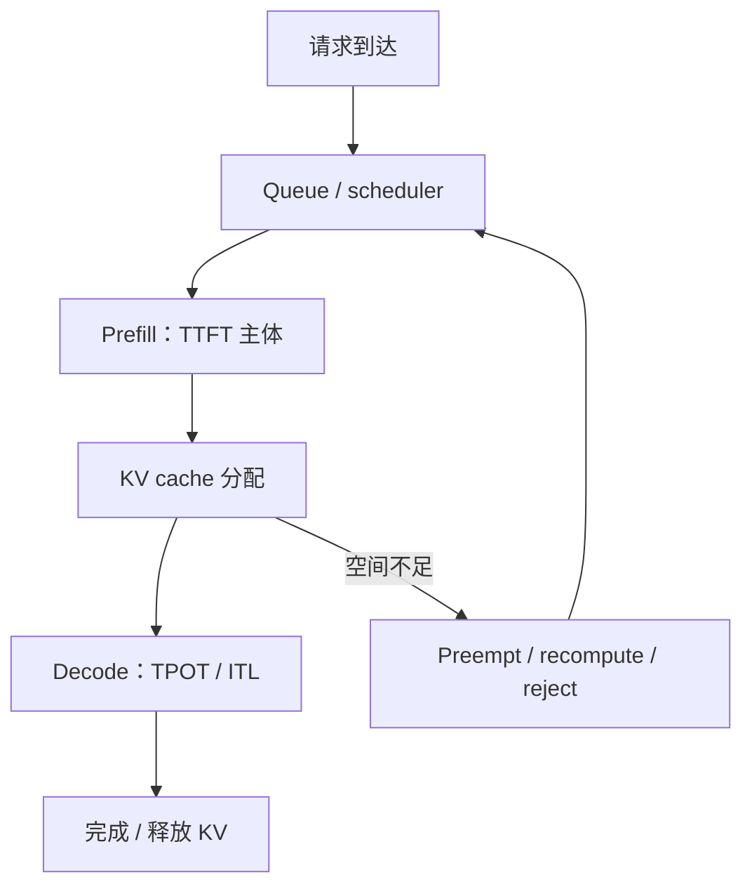

# 推理性能分析

生成式推理不能用一个“latency”概括。Prefill（处理输入 prompt）与 Decode（逐 token 生成）具有不同 shape、算术强度和用户体验指标。

## 1. 指标定义

| 指标 | 全称 | 定义 | 主要影响 |
|---|---|---|---|
| TTFT | Time to First Token | 请求到达至首 token 返回 | queue + prefill + 首次调度 |
| TPOT | Time per Output Token | 首 token 后平均每 token 时间 | decode batching、KV、通信 |
| ITL | Inter-Token Latency | 相邻 token/chunk 间隔分布 | 流式平滑度、调度抖动 |
| E2EL | End-to-End Latency | 请求到完成的总时间 | TTFT + generation |
| throughput | token/s 或 req/s | 单位时间完成量 | batch、并发、shape mix |
| goodput | 满足全部 SLO 的完成请求率 | 可用产能 | throughput 与 tail 的结合 |

对输出 token 数 $O>1$：

$$TPOT_{avg}\approx\frac{E2EL-TTFT}{O-1}$$

平均 TPOT 不等于每个相邻 token 的 ITL 分布；server 可能把多个 token 合成一个 streaming chunk。

## 2. 开环与闭环压测

- closed-loop（闭环）：固定并发，请求完成后才发下一个；服务变慢时到达率也下降，容易掩盖 overload。
- open-loop（开环）：按目标 request rate 独立到达；更接近真实流量，可观察 queue 爆炸与拒绝。

至少 sweep concurrency/request rate，画 throughput–latency Pareto curve，而不是只报“最大吞吐”和“最低延迟”两个不在同一工作点的数字。

## 3. 固定 workload shape

记录 Input Sequence Length（ISL，输入序列长度）、Output Sequence Length（OSL，输出序列长度）、分布/相关性、prefix reuse、sampling 参数、stop condition、流式与否。`128/128` 的结果不能代表 `8K/1K`；合成数据若 token 重复，还可能意外提高 prefix cache 命中。

## 4. Prefill 与 Decode 的证据链

TTFT 突增可能是长 prompt，也可能是 queue 或 chunked prefill 调度；TPOT 突增可能是 batch 变大、KV memory pressure、tensor-parallel communication 或 CPU detokenization。

## 5. Goodput 为什么重要

吞吐 100 req/s，但只有 70 req/s 同时满足 TTFT、TPOT/E2EL 和错误率 SLO，则 goodput 是 70 req/s。AIPerf 的最新文档强调多 SLO 同时过滤和最大 goodput 搜索；这避免通过过载提高总吞吐，却让用户体验崩溃。

应明确 goodput 是：

- `满足 SLO 的请求数 / 秒`，还是
- `满足 SLO 的请求比例`。

二者都常被使用，不能混称。

## 6. Continuous batching 的权衡

更大 running batch 通常提高 decode GEMM 效率和总吞吐，但会：

- 增加每轮 decode duration，推高 ITL；
- 占用更多 KV blocks；
- 让新请求等待调度；
- 在混合长短请求时引入 head-of-line blocking。

所以调度参数必须在固定 SLO 下 sweep，而不是只最大化 batch。

## 7. 线上应该关联的运行时指标

| 用户指标 | 同图关联 |
|---|---|
| TTFT | waiting requests、queue time、prefill tokens、prefix hit |
| TPOT/ITL | running requests、decode batch、KV usage、preemption |
| E2EL | ISL/OSL、termination reason、retry/error |
| throughput | GPU SM/DRAM、request rate、batch/token budget |
| tail spike | compile/cache miss、GC、network、straggler、replica imbalance |

## 8. 工具

- NVIDIA GenAI-Perf：生成式模型 throughput/latency，支持 synthetic 或 dataset 与 concurrency/request-rate load；
- NVIDIA AIPerf：进一步支持多 shape、SLO search、Pareto 与 goodput；
- vLLM/SGLang 内置 benchmark 与 Prometheus metrics：贴近各自 scheduler/KV 内部状态；
- Nsight Systems/PyTorch Profiler：在代表流量窗口定位 runtime 内部关键路径。

结果必须注明 client 与 server 是否同机、network RTT、tokenizer 在 client 还是 server、stream chunking 方式。

RTT = Round-Trip Time（往返时间）。

## 资料

- [NVIDIA GenAI-Perf](https://docs.nvidia.com/deeplearning/triton-inference-server/user-guide/docs/perf_analyzer/genai-perf/README.html)
- [NVIDIA AIPerf Metrics](https://docs.nvidia.com/aiperf/reference/ai-perf-metrics-reference)
- [MLCommons Inference](https://mlcommons.org/benchmarks/inference-datacenter/)
- [并行专题：推理方案设计](../03_Parallelism/12_推理并行方案设计.md)
