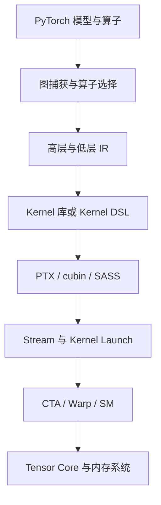
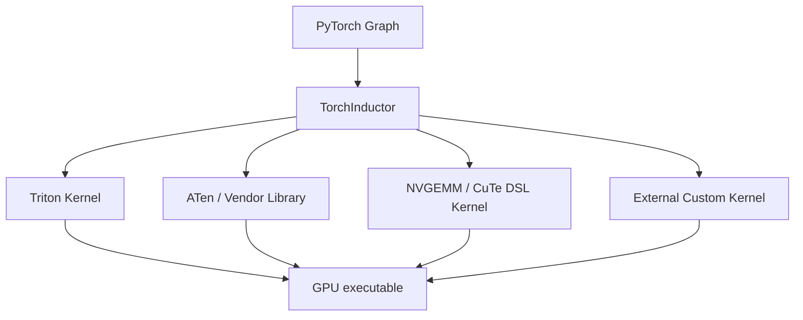

# Kernel 与算子实现

把数学操作映射到执行资源、存储层次和调度，保留可验证的算例及实验。

## 主题地图

| 条目 | 定位 |
|---|---|
| [算子优化的问题演进](算子优化的问题演进.md) | 算子优化：从数学操作到资源调度 |
| [GEMM与高性能Kernel模式](GEMM与高性能Kernel模式.md) | GEMM、Tensor Core 与高性能 Kernel 设计模式 |
| [GPU内存编程与数据搬运](GPU内存编程与数据搬运.md) | GPU 内存编程与数据搬运 |
| [CUDA算子库_CUTLASS与CuTe](CUDA算子库_CUTLASS与CuTe.md) | CUDA 算子库、CUTLASS 与 CuTe |
| [案例_FlashAttention与GroupedGEMM](案例_FlashAttention与GroupedGEMM.md) | 案例：FlashAttention 与 MoE Grouped GEMM |
| [第一个TritonKernel](第一个TritonKernel.md) | 第一个 Triton Kernel：把线程工作与数据地址连起来 |
| [实验与排查手册](实验与排查手册.md) | Kernel 与编译器实验、Benchmark 和排查手册 |

## 问题与演进

分块增加复用，流水隐藏等待，融合减少中间读写，专用调度处理不规则任务；每一步都需重新核算资源占用。

历史与方法的跨领域关系见[技术演进索引](../技术演进索引.md)。

## 查阅与关联

[百科总览](../README.md) · [概念关系](../概念关系与正文归属.md) · [术语索引](../术语索引.md) · [问题索引](../问题索引.md)

## 专题框架与原有资料

> 以下保留原专题的解释与版本快照，具体软件支持以所用版本为准。

<a id="1-这个专题要解决什么问题"></a>

## 这个专题要解决什么问题？

训练或推理速度慢时，仅知道“GPU 利用率低”远远不够。我们需要沿着下面这条链追问：



IR = **Intermediate Representation（中间表示）**；DSL = **Domain-Specific Language（领域专用语言）**；PTX = **Parallel Thread Execution（NVIDIA 虚拟指令集）**；SASS 是 NVIDIA GPU 实际执行的机器指令表示；CTA = **Cooperative Thread Array（协作线程阵列，通常对应 CUDA Thread Block）**；SM = **Streaming Multiprocessor（流式多处理器）**。

这个专题最终希望建立三种能力：

1. 看到一个算子，能判断它大致怎样映射到 GPU。
2. 看到一个性能问题，能区分计算、显存、调度、同步还是编译器选择造成的瓶颈。
3. 面对 CUDA C++、CUTLASS、Triton、TileLang、CuTe DSL、cuTile、Helion 等方案，知道各自在什么抽象层解决什么问题。


<a id="2-2026-年需要更新的旧心智模型"></a>

## 2026 年需要更新的旧心智模型

过去常画成：

```text
PyTorch → Inductor → Triton → PTX → GPU
```

这张图在 2026 年已经过于简单。更准确的理解是：同一个 PyTorch 图中的不同子图，可以选择不同实现。



PyTorch 2.14 已把由 CuTe DSL 生成的 NVGEMM 纳入 TorchInductor 的候选，并与 Triton、ATen 实现共同自动调优。与此同时，CUDA 13.3 引入 CUDA Tile C++；NVIDIA 的 CUDA Tile Python 与 CUDA Tile C++ 共用 CUDA Tile IR。说明行业正在从“每个线程做什么”的 Thread-centric 编程，进一步走向“一个 Tile 要完成什么”的 Tile-centric 编程。

这不意味着 CUDA C++ 或 Triton 会消失，而是说明抽象层正在重新分工：

| 层级 | 开发者主要表达 | 编译器主要决定 |
|---|---|---|
| CUDA SIMT | Thread、Warp、地址、同步 | 指令选择、寄存器分配、部分调度 |
| CUTLASS / CuTe | Layout、Tile、Copy/MMA Atom、Pipeline | 模板实例化、指令生成 |
| Triton | Program Instance、Block Tensor、Tile 运算 | Thread/Warp 映射、Layout、流水与代码生成 |
| TileLang | Tile、Buffer、Pipeline 原语 | 基于 TVM 的 Lowering、目标相关代码生成 |
| CUDA Tile / cuTile | Block-local Tile、Tile 运算 | Tile 到硬件 Thread 和专用单元的映射 |
| PyTorch Compiler | Tensor 图与算子语义 | Fusion、Kernel/库选择、代码生成、Autotune |


<a id="4-一条贯穿全专题的例子为什么-softmaxx--y-值得融合"></a>

## 一条贯穿全专题的例子：为什么 `softmax(x) * y` 值得融合？

如果分成两个 Kernel：

1. Kernel A 从 HBM 读取 `x`，计算 softmax，把中间结果写回 HBM。
2. Kernel B 再从 HBM 读中间结果和 `y`，做乘法并写回。

如果融合：中间结果可以留在 Register 或 Shared Memory 中，省掉一次完整的写回与重读。HBM = **High Bandwidth Memory（高带宽内存，GPU 主显存）**。所以 Fusion（融合）不一定减少数学运算，却能减少数据移动和 Kernel Launch。

但融合不是越多越好：过度融合可能让寄存器使用量暴涨，降低 Occupancy（占用率，即一个 SM 同时容纳活跃 Warp/Block 的能力），或者让一个通用 Kernel 无法使用高度优化的 GEMM 库。后续各章会反复讨论这种“减少边界”与“增加单 Kernel 复杂度”的取舍。


<a id="5-截至-2026-09-的路线判断"></a>

## 截至 2026-09 的路线判断

以下是根据官方路线做出的工程判断，而不是某一家项目给出的统一结论：

- **库不会被编译器完全替代。** 高度规则、规模大的 GEMM 仍适合 cuBLAS/CUTLASS 一类深度优化实现。
- **编译器的价值正在从生成代码扩大到选择实现。** PyTorch Inductor 已经需要在 Triton、ATen、CuTe DSL/NVGEMM 等候选间调优。
- **Tile 成为共同语言，但 Tile 的控制权不同。** Triton 更倾向让编译器完成底层映射；CuTe DSL 更强调显式 Layout 和硬件 Atom；TileLang位于二者之间并追求多后端；CUDA Tile 则由 NVIDIA 统一 Tile IR 与硬件能力。
- **复杂异步硬件迫使编译器承担更多调度工作。** Hopper/Blackwell 的 TMA、Warp Specialization、TMEM 和多 CTA 协作，很难要求所有开发者手写正确且高效的底层编排。
- **自动化仍然不是“免费性能”。** Shape、数据类型、对齐、动态性和目标架构变化后，仍需重新测量；新后端也可能存在功能缺口或回归。


<a id="6-主要资料"></a>

## 主要资料

- [NVIDIA CUDA Programming Guide](https://docs.nvidia.com/cuda/cuda-programming-guide/index.html)
- [CUDA Tile Kernels](https://docs.nvidia.com/cuda/cuda-programming-guide/02-basics/writing-tile-kernels.html)
- [NVIDIA CUTLASS 4.x Overview](https://docs.nvidia.com/cutlass/latest/overview.html)
- [PyTorch 2.14 Release](https://pytorch.org/blog/pytorch-2-14-release-blog/)
- [Triton repository and documentation](https://github.com/triton-lang/triton)
- [TileLang documentation](https://tilelang.com/)
- [Triton Warp Specialization design](https://pytorch.org/blog/warp-specialization-in-triton-design-and-roadmap/)

<a id="3-推荐阅读顺序"></a>
<a id="kernelgpu-programming-与-compiler-stack专题总览"></a>
