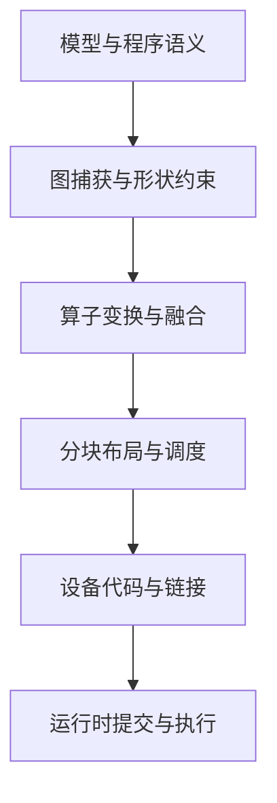

# 编译器分层：从模型表达式到设备执行

> 类型：基础概念与演进。前置：[计算图](../01_Math_Numerics/计算图与自动微分.md)、[处理器](../00_Physical_Foundations/计算电路与处理器.md)。

## 每一层保留不同信息

高层图表达算子、形状、依赖和部分语义；较低层表示循环、数据布局和内存访问；指令层面决定具体硬件操作与寄存器使用。IR 是用于分析和变换的中间表示，不是一种固定格式，也不等于某个唯一编译器。

真实路径可能调用已有库，也可能生成新 Kernel，并不要求所有算子经过同一后端。

## Fusion 改变边界

若程序先算 $u=x+y$ 再算 $z=\operatorname{relu}(u)$，融合可以避免中间 u 的独立写回和再次读取，也减少提交。代价可能是更复杂的 Kernel、更多寄存器或失去某个高度优化的库实现。

融合必须保持需要的语义。别名、副作用、随机数、跨设备依赖和数值舍入都可能影响合法变换。数学上可合并不等于每个后端都有高性能实现。

## 动态性为何带来重编译

编译器可以对某些形状和条件生成专门代码，并建立 guard。条件不满足时可能重编译、回退或报错，具体取决于系统。更多 specialization 有利于局部性能，但带来编译时间、缓存和维护成本。

评估应区分首次捕获/编译、预热和稳态执行。如果服务请求形状变化频繁，编译缓存命中率本身就是工作负载属性。

## 图编译与 CUDA Graph 的区别

算子编译改变如何计算；CUDA Graph 等提交机制记录或表达设备操作依赖，以降低重复提交的控制开销。两者可以组合，但减少 launch overhead 不等于减少模型 FLOP 或 HBM 流量。

图捕获对地址、控制路径和形状有实现约束。动态 batch 常通过分桶、padding 或不同图实例处理，收益与额外计算/存储之间存在取舍。

## 演进与选型

Eager 执行便于动态程序和调试；图优化暴露跨算子机会；Kernel DSL 提供布局和分块控制；硬件专用表达进一步暴露异步搬运与矩阵单元。抽象层越接近硬件，通常越需要管理具体目标的资源与可移植性。

比较后端时先固定数学语义、shape、stride、dtype、硬件和计时范围，再考虑开发与编译成本。

相关：[PyTorch 编译栈](PyTorch编译栈.md)、[IR/PTX/SASS](IR_PTX_SASS与编译模式.md)、[Kernel DSL](Triton_TileLang_CUDA-Tile与Helion.md)。

参考：[PyTorch Compiler](https://docs.pytorch.org/docs/stable/torch.compiler.html)、[CUDA Graphs](https://docs.nvidia.com/cuda/cuda-programming-guide/04-special-topics/cuda-graphs.html)。

---

[所属专题](README.md) · [百科总览](../README.md)
