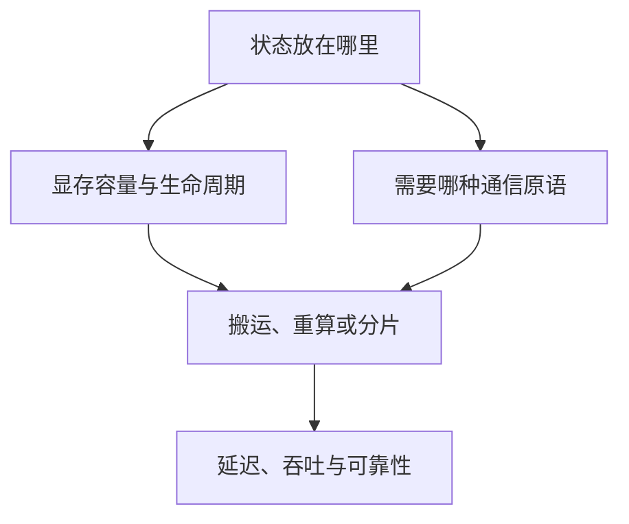

# 分布式通信

从 buffer、参与者和完成语义出发，连接通信原语、算法、物理拓扑与库实现。

## 主题地图

| 条目 | 定位 |
|---|---|
| [DMA与RDMA完成语义](DMA与RDMA完成语义.md) | DMA、RDMA 与通信完成语义 |
| [两卡通信与torchrun](两卡通信与torchrun.md) | 从两个进程、两张卡学通信 |
| [通信原语与Collective](通信原语与Collective.md) | 通信原语与 Collective |
| [Collective通信算法](Collective通信算法.md) | Collective 通信算法 |
| [节点内GPU互联](节点内GPU互联.md) | 节点内 GPU 互联：PCIe、NVLink 与 NVSwitch |
| [跨节点网络](跨节点网络.md) | 跨节点网络：InfiniBand、RoCE、RDMA 与 GPUDirect |
| [NCCL软件栈](NCCL软件栈.md) | NCCL 软件栈：从 API 到传输路径 |
| [通信性能模型](通信性能模型.md) | 通信性能模型：从 $\alpha$–$\beta$ 到有效带宽 |
| [通信计算重叠](通信计算重叠.md) | 通信计算重叠：从“两个 Stream”到真实隐藏时间 |
| [案例_MoE-AllToAll](案例_MoE-AllToAll.md) | 案例：MoE 的 All-to-All 为什么难 |
| [实验与排查手册](实验与排查手册.md) | 实验与排查手册 |

## 问题与演进

传输路径优化减少搬运或控制开销，算法优化改变轮数与流量，重叠改变等待位置；瓶颈可能迁移到到达偏斜和共享资源。

历史与方法的跨领域关系见[技术演进索引](../技术演进索引.md)。

## 查阅与关联

[百科总览](../README.md) · [概念关系](../概念关系与正文归属.md) · [术语索引](../术语索引.md) · [问题索引](../问题索引.md)

## 专题框架与原有资料

> 以下保留原专题的解释与版本快照，具体软件支持以所用版本为准。

## 为什么把通信与内存放在同一个专题

分布式系统表面上在“传数据”，本质上在决定：**哪份状态在何处保存、何时搬运、搬多少、经过哪条路径、搬运期间谁在等待**。ZeRO 把模型状态从复制改成分片，于是节省显存但增加 AllGather/ReduceScatter；专家并行把专家权重留在不同 GPU，于是 token 必须 All-to-All；Prefill–Decode 分离把两种推理负载拆到不同 GPU，于是必须搬运 Key–Value Cache（KV Cache，键值缓存）。

因此本专题不把 NCCL 当作一组 API 背诵，也不把显存优化当作若干开关罗列，而用一条统一主线：

$$
T_{step}=T_{compute}+T_{communication}+T_{memory\ movement}-T_{overlap}+T_{bubble}
$$

这里的 overlap 是真正被隐藏的时间，不能把两个 stream 上“时间重叠”直接当作有效重叠。

## 三个贯穿专题的判断框架

### 先画状态，再谈通信

对每个 tensor 写出五件事：`shape × dtype × owner × lifetime × consumers`。例如一个 token 的 KV Cache 不是抽象的“缓存”，而是每层的 K、V 两份张量；采用 Grouped-Query Attention（GQA，分组查询注意力）时，KV 头数小于 query 头数，容量公式也随之改变。

### 先看拓扑，再看峰值带宽

同样是 8 张 GPU，可能是经 NVSwitch 全连接，也可能跨 PCI Express（PCIe，高速串行总线）root complex。标称 400 Gb/s 网卡也不等于应用获得 50 GB/s：协议、编码、PCIe、GPU/NIC 亲和性、消息大小和并发都会扣减。

### 优化目标是端到端，而非单一带宽

低延迟算法不一定适合大 tensor；占用 Streaming Multiprocessor（SM，流式多处理器）的高带宽通信 kernel 可能挤压计算；零 SM 的 Copy Engine 路径又可能受复制引擎或链路限制。选择应由消息大小、拓扑、并发负载与 Service-Level Objective（SLO，服务级目标）共同决定。

## 2026 年值得关注的变化

- NCCL 2.28 起公开 device-side API 与 GPU-Initiated Networking（GIN，GPU 发起网络通信），并提供可减少 SM 占用的 Copy Engine collectives；到 2.31 系列继续推进 device API、Parallel Aggregated Tree（PAT，并行聚合树）、Tensor Memory Accelerator（TMA，张量内存加速器）与运行时诊断。
- PyTorch 2.14 增加实验性的 `nccl2` backend、可重配置的容错 c10d、one-sided Remote Memory Access（RMA，远程内存访问）窗口，以及面向 Mixture of Experts（MoE，混合专家模型）的 TokenSwitch 接口。
- 推理系统从单机 paged KV Cache 走向跨节点 KV fabric：Prefill–Decode 分离、KV-aware routing、远端缓存与非阻塞 GPU-to-GPU 传输成为系统问题，而不只是 attention kernel 问题。

这些是“截至日期的工程前沿”，不是稳定 API 契约；落地时必须按实际版本复核。

## 核心资料

- [NCCL 2.31.2 User Guide](https://docs.nvidia.com/deeplearning/nccl/user-guide/docs/overview.html)
- [NCCL 2.28 device API 与 Copy Engine collectives](https://developer.nvidia.com/blog/fusing-communication-and-compute-with-new-device-api-and-copy-engine-collectives-in-nvidia-nccl-2-28/)
- [PyTorch 2.14 Release Blog](https://pytorch.org/blog/pytorch-2-14-release-blog/)
- [CUDA GPUDirect RDMA 13.3](https://docs.nvidia.com/cuda/gpudirect-rdma/)
- [PagedAttention 论文](https://arxiv.org/abs/2309.06180)

