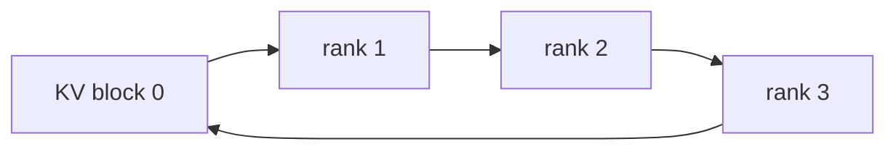
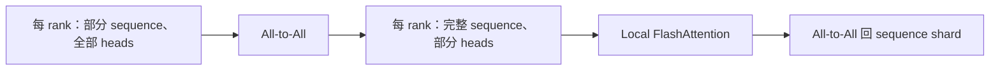

# Context Parallelism：长上下文 Attention 如何跨 GPU

## 入门例子：切分序列后，attention 还需要远端历史

序列有 8 枚 token，CP=2，两卡各保存 4 枚 query。对于 causal attention，后半段 query 仍需要前半段的 key/value；不能简单让每卡独立做长度 4 的 attention，否则模型变了。

环式交换、AllGather 或布局转置是不同的通信组织方式。causal mask 使早期 query 与后期 query 的可见 pair 数不同，等 token 数不必然等计算量。实现还可能采用交错或分块分配来均衡。

练习：列第 0–7 个 query 各能看到多少 key，再计算两个连续分块的工作量。说明重分配 query、交换 KV 与改 attention mask 是三种不同操作。

## 机制与实现

Context Parallelism（CP，上下文并行）沿 sequence/context 维切 activation，让每个 rank 只常驻部分 token。困难在于 self-attention：每个 query 必须看到允许范围内的全部 Key/Value（KV，键值）。

## Ring Attention

设 CP degree 为 $p$。每 rank 保留本地 query block，KV block 在 ring 上轮转；每轮计算本地 Q 对当前 KV 的局部 attention，再通过 online softmax 合并局部最大值、归一化和 output。

计算与下一块 KV P2P 可以流水重叠。每 rank 最终处理完整 context 的交互，因此总 attention FLOPs 没消失，只被分摊；通信量随 KV block 和轮数增长。

## Causal mask 的负载不均

若按连续 token 块分配，序列前部 query 只能看较少 KV，后部 query 看更多，rank 工作量不同。Megatron 常用双端/zig-zag 重排：把前段与后段 token 配到同一 rank，使 causal triangle 面积更均衡。

## Ulysses：Sequence shard ↔ Head shard

DeepSpeed-Ulysses 在 attention 前执行 All-to-All：

优势是可直接运行完整 sequence 的高效 attention kernel；限制是并行度受 attention head/KV head 数与 All-to-All topology 影响。Grouped-Query Attention（GQA，分组查询注意力）的 KV heads 少时，Ulysses degree 可能受限。

## Megatron CP 的通信类型

Megatron Core 支持多种 CP communication style，包括 P2P、AllGather、All-to-All 以及 hierarchical 组合。它们在 latency、memory、拓扑利用和 kernel integration 上不同。不要把 `context_parallel_size` 当成唯一决策；应结合 `cp_comm_type` 与 attention backend。

## Dynamic Context Parallelism

固定 CP degree 按最大 sequence 配置时，短样本也承担多 rank 通信，变长 batch 还会不均衡。Dynamic Context Parallelism（Dynamic CP，动态上下文并行）按 micro-batch 的实际长度选择 CP degree/分组。

Megatron 团队在 2026 年公开的结果显示，针对真实变长数据可获得最高约 1.48× speedup；这是特定 workload 报告，不是普遍保证。它揭示了重要方向：并行配置可以成为 runtime schedule，而非 job 启动时的常数。

## CP 与 TP/EP 的冲突

- TP 和 Ulysses 都可能切 attention heads，组合时 degree 受 head 数乘积约束；
- CP 的 sequence layout 进入 MoE 前，token All-to-All 需要保留 global token metadata；
- Ring P2P 与 EP All-to-All 若共享 NIC，会产生 traffic contention；
- packed sequence 的 causal boundary、position 与 loss mask 必须在重排后保持正确。

## 何时选择哪类方法

| 条件 | 初始倾向 |
|---|---|
| head 数充足、All-to-All fabric 强 | Ulysses |
| head 数少/GQA、可良好 overlap P2P | Ring-style CP |
| 跨节点与节点内带宽差异大 | hierarchical CP / USP |
| sequence 长度高度变化 | Dynamic CP / fine-grained block assignment |
| attention 本身稀疏或线性 | 需要架构专用 sharding rule，不能默认 dense CP |

## 资料

- [Ring Attention](https://arxiv.org/abs/2310.01889)
- [DeepSpeed-Ulysses](https://arxiv.org/abs/2309.14509)
- [USP](https://arxiv.org/abs/2405.07719)
- [PyTorch Context Parallel Tutorial](https://docs.pytorch.org/tutorials/unstable/context_parallel.html)
- [Megatron Dynamic CP](https://forums.developer.nvidia.com/t/speeding-up-variable-length-training-with-dynamic-context-parallelism-and-nvidia-megatron-core/358971)

## 从本地序列到远端上下文：保存量与访问量分开算

把序列分给多个设备减少每卡保存的某些 token 状态，但查询仍可能需要其他设备上的历史信息。Ring 路线逐步交换状态并累积结果，All-to-All 路线改变序列与 head 的布局；两者对 head 数、拓扑和中间缓冲有不同要求。

Causal attention 中不同位置的可见历史长度不同，等长切分不保证等工作量。负载平衡映射又会改变索引和通信复杂度。比较时应固定可见性、位置编码、数值容差与序列边界，不能只检查输出 shape。

基础参见[Attention 计算](../02_Model_Architecture/Transformer与Attention基础.md)，整体关系见[并行设计空间](并行设计空间与演进.md)。

## 完整推演

[SP与CP完整推演](推演_SP与CP布局和梯度.md)：在线softmax、远端梯度与因果负载。

---

[所属专题](README.md) · [百科总览](../README.md)
