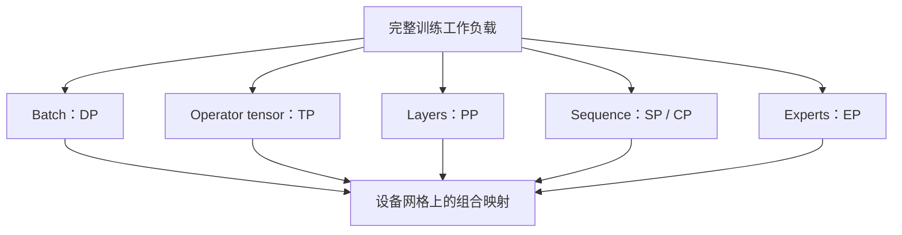

# 并行计算与状态分片

用全局张量、局部布局、所有权和生命周期解释各种并行方式。

## 主题地图

| 条目 | 定位 |
|---|---|
| [并行设计空间与演进](并行设计空间与演进.md) | 并行设计空间：从完整副本到多维布局 |
| [统一切分语言](统一切分语言.md) | 统一切分语言：DeviceMesh、DTensor 与布局变换 |
| [DP与DDP](DP与DDP.md) | Data Parallelism 与 DistributedDataParallel |
| [ZeRO与FSDP](ZeRO与FSDP.md) | ZeRO 与 FSDP：分片数据并行的执行语义 |
| [TensorParallelism](TensorParallelism.md) | Tensor Parallelism：在算子内部切矩阵 |
| [SequenceParallelism](SequenceParallelism.md) | Sequence Parallelism：两个同名概念必须分开 |
| [ContextParallelism](ContextParallelism.md) | Context Parallelism：长上下文 Attention 如何跨 GPU |
| [PipelineParallelism](PipelineParallelism.md) | Pipeline Parallelism：切 Layer、排 Micro-batch |
| [ExpertParallelism](ExpertParallelism.md) | Expert Parallelism：模型稀疏，系统不一定轻松 |
| [Embedding与词表并行](Embedding与词表并行.md) | Embedding 与词表并行 |
| [多维并行与DeviceMesh](多维并行与DeviceMesh.md) | 多维并行与 DeviceMesh |
| [自动并行与代价模型](自动并行与代价模型.md) | 自动并行与代价模型：为什么仍不能“一键最优” |
| [案例_DeepSeek与DualPipe](案例_DeepSeek与DualPipe.md) | 案例：DeepSeek-V3 的并行选择与 DualPipe |
| [实验与配置工作表](实验与配置工作表.md) | 实验与配置工作表 |

## 完整推演与历史主线

| 条目 | 可以逐项核对的内容 |
|---|---|
| [手工推演 DDP：不等长数据、梯度累积与 Bucket 时间线](推演_DDP梯度与通信时间线.md) | 4个样本、2个rank；目标分母、累积、bucket时间线 |
| [手工推演 FSDP：参数展开、梯度归属与峰值内存](推演_FSDP参数生命周期.md) | 8个参数、2个owner；gather、reduce-scatter、更新和峰值 |
| [手工推演 TP：两层 MLP 的前向、反向与 Attention 布局](推演_TP前向反向与Attention.md) | 两层MLP完整前后向数值；Attention head布局 |
| [手工推演 PP：GPipe 与同步 1F1B 的逐时隙调度](推演_PP调度与激活峰值.md) | 2个stage、4个microbatch；逐时槽依赖与激活账本 |
| [手工推演 SP 与 CP：布局转换、在线 Softmax 与远端梯度](推演_SP与CP布局和梯度.md) | SP布局、CP在线softmax、远端梯度与causal负载 |
| [手工推演 EP 与多维通信组：token 去哪里，梯度由谁更新](推演_EP路由与多维通信组.md) | 4个token、2个expert；dispatch/combine与8-rank网格 |
| [训练并行演进史：瓶颈如何从副本转移到布局与调度](训练并行演进史.md) | 副本、流水线、张量切分、分片、长上下文与专家 |

全局入口：[手工推演索引](../手工推演索引.md) · [技术演进索引](../技术演进索引.md)。

## 问题与演进

容量、单次延迟和吞吐推动不同切分方向；多维组合把问题转为布局转换、拓扑映射与动态负载。

历史与方法的跨领域关系见[技术演进索引](../技术演进索引.md)。

## 查阅与关联

[百科总览](../README.md) · [概念关系](../概念关系与正文归属.md) · [术语索引](../术语索引.md) · [问题索引](../问题索引.md)

## 专题框架与原有资料

> 以下保留原专题的解释与版本快照，具体软件支持以所用版本为准。

## 并行的本质：把“状态与工作”映射到设备网格

Data Parallelism（DP，数据并行）、Tensor Parallelism（TP，张量并行）、Pipeline Parallelism（PP，流水线并行）、Sequence Parallelism（SP，序列并行）、Context Parallelism（CP，上下文并行）与 Expert Parallelism（EP，专家并行）不是六个互斥选项，而是沿不同维度切分状态和计算。

判断任何并行方案都应回答六个问题：

1. 切分对象是什么：batch、参数维、layer、sequence 还是 expert？
2. 每个 rank 保存哪些参数、gradient、optimizer state 和 activation？
3. forward/backward 分别需要什么 collective 或 Point-to-Point（P2P，点对点）通信？
4. 通信是否落在适合的 NVLink、NVSwitch 或 InfiniBand domain？
5. 它解决的是模型放不下、activation 放不下、吞吐不足还是延迟过高？
6. 增大 degree 后，计算颗粒度是否小到无法吃满 GPU？

## 一张总表

| 并行维度 | 切什么 | 典型通信 | 主要收益 | 主要代价 |
|---|---|---|---|---|
| DP/DDP | batch/sample | gradient AllReduce | 吞吐、简单扩展 | 完整模型副本 |
| ZeRO/FSDP | DP 组内模型状态 | parameter AllGather、gradient ReduceScatter | 减少状态显存 | layer 级通信与峰值展开 |
| TP | linear/attention tensor 维度 | AllReduce、ReduceScatter、AllGather | 单层参数/计算分摊 | 高频同步、算子变小 |
| PP | 连续或自定义 layer stage | activation/gradient P2P | 按深度分摊模型 | bubble、负载均衡、调度复杂 |
| Megatron SP | 非 TP 区域的 sequence 维 | TP group 内 gather/scatter | 降 activation 显存 | 与 TP 强绑定 |
| CP | attention context/sequence | KV P2P、AllGather 或 All-to-All | 长上下文 activation 分摊 | attention 通信与 causal imbalance |
| EP | experts | token All-to-All/AllToAllV | MoE 参数和 expert compute 分摊 | 动态负载不均 |

## 2026 年的几个明显趋势

- “并行策略”从手写 communicator group 走向 DeviceMesh/DTensor 等显式布局：PyTorch 将 shard/replicate 变成 tensor 语义，TorchTitan 展示 FSDP2、TP、PP、CP 的可组合实现。
- 并行度不再必须全局固定：Megatron Dynamic Context Parallelism（Dynamic CP，动态上下文并行）会根据变长 micro-batch 调整 CP degree；fine-grained TP/heterogeneous mapping 也在增长。
- MoE 与 Attention 使用不同并行布局成为主流：attention 可 DP，experts 可 EP；这要求在 layer 边界重分布 tensor，并让拓扑感知进入 router 与 rank mapping。
- Reinforcement Learning（RL，强化学习）把“模型内并行”扩展为“角色与阶段并行”：同步 colocate、分离式、one-step-off-policy 和 fully asynchronous 都在吞吐与 stale policy 间权衡。

## 核心资料

- [Megatron Core Parallelism Strategies Guide](https://docs.nvidia.com/megatron-core/developer-guide/latest/user-guide/parallelism-guide.html)
- [PyTorch Distributed Overview](https://docs.pytorch.org/tutorials/beginner/dist_overview.html)
- [TorchTitan](https://github.com/pytorch/torchtitan)
- [vLLM Parallelism and Scaling](https://docs.vllm.ai/en/stable/serving/parallelism_scaling/)
- [verl HybridFlow](https://verl.readthedocs.io/en/latest/hybrid_flow.html)

## 贯穿到当前实现

[通信等待与重叠的真实观测](../12_Performance_Reliability/贯穿案例_分布式训练等待与通信重叠.md)。
