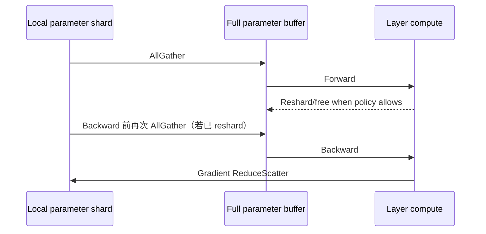

# ZeRO 与 FSDP：分片数据并行的执行语义

> 类型：状态分片机制。前置：[基础概念](../09_Training_Systems/训练步与优化器.md)。关联：[机制与演进](并行设计空间与演进.md)。

<a id="beginner-example"></a>

## 入门例子：用八个参数画出全分片生命周期

两个 rank 各持有四个参数 shard。某层 forward 前，按需 AllGather 得到该层完整参数；算完后可释放临时完整副本。backward 可能再次需要完整参数，梯度规约后仅由 owner 消费对应 shard。

| 方案 | 主要分片对象 | 新引入的责任 |
|---|---|---|
| ZeRO-1 思路 | 优化器状态 | 本地更新与参数一致性 |
| ZeRO-2 思路 | 再分片梯度 | 梯度规约/owner 与存储 |
| ZeRO-3/FSDP 思路 | 再分片参数 | 按层 materialize、释放与预取 |

这些是概念层分法，不能直接推出某框架的完整 grad buffer 已按 DP 缩小。查看真实 buffer 分配与峰值时间。验收：标注“逻辑归属”和“物理 allocation”两列，解释为何节省常驻状态后仍可能在 all-gather 峰值 OOM。

## 机制与实现

Zero Redundancy Optimizer（ZeRO，零冗余优化器）和 Fully Sharded Data Parallel（FSDP，全分片数据并行）仍属于数据并行：不同 rank 处理不同 batch shard；变化在于参数、gradient 和 optimizer state 不再永久复制。

显存核算与 offload 见上一专题的[训练显存优化](../09_Training_Systems/训练显存优化.md)。本章只解释并行执行。

## 三个状态维度

| 方案 | 参数 | Gradient | Optimizer state |
|---|---|---|---|
| DDP | replicated | replicated | replicated |
| ZeRO-1 | replicated | replicated | sharded |
| ZeRO-2 | replicated | sharded | sharded |
| ZeRO-3 / full FSDP | sharded | sharded | sharded |

这里是稳态语义；计算某层时 ZeRO-3/FSDP 会临时 materialize full parameter。

## 一层的 forward/backward



若 forward 后不 reshard，可避免 backward 前第二次 AllGather，却延长 full parameter 生命周期；这是通信—显存交换。Prefetch 下一层能隐藏 AllGather，但同时展开太多层会抬高峰值。

## 为什么 ReduceScatter 比 AllReduce 更自然

每个 rank 最终只拥有 gradient shard 和对应 optimizer state shard，因此无需让完整 gradient 出现在每张卡：直接 ReduceScatter 将全局规约结果切给 owner。owner 更新自己的 parameter shard；下一次计算前再 AllGather。

## FSDP wrapping unit 很关键

若整个模型只包一个 FSDP unit，可能在 forward 前一次性 gather 全模型，失去 layer-wise 峰值优势；若每个很小 module 都独立 unit，collective 过碎。Transformer 通常按 block wrap，再对 root embedding/head 做专门处理。

FSDP2 不再依赖 FSDP1 的 `FlatParameter` 中心设计，而让 sharded parameter 以 DTensor（分布式张量）表达，更容易与 Tensor Parallelism 和 DeviceMesh 组合。FSDP1/FSDP2 API、state dict 与 hook 行为不同，升级必须按框架版本验证。

## Hybrid Sharding

Hybrid Sharded Data Parallel（HSDP，混合分片数据并行）只在节点内或一个高速 subgroup 分片，再跨 subgroup 复制并同步。它在以下矛盾间折中：

- 全局 FSDP：最省状态显存，但每层 AllGather/ReduceScatter 走跨节点网络；
- DDP：通信相对规则，但完整状态复制；
- HSDP：高速域内分片，慢速域间 replica。

例如 8 节点×8 GPU，可建 shard group=8（节点内），replicate group=8（同 local rank 跨节点）。具体 collective 与 overlap 取决于实现。

## TP + FSDP 的二维布局

设权重 $W$ 先沿输出维做 TP shard，再沿 DP/FSDP mesh 对“该 TP shard”分片。每张卡持有约 $1/(TP\times FSDP)$ 的参数，但 forward 时 FSDP 只在同一 TP 坐标的 DP group 内 gather，不应跨错 group。

```text
world_size = tp_size × dp_shard_size × dp_replicate_size × pp_size × ...
```

group 构造错误可能程序仍能运行，却得到重复/缺失 reduction。

## 什么时候不值得 full shard

- 模型轻松放下，网络慢，DDP 吞吐更好；
- module 太小，AllGather latency 无法隐藏；
- gradient accumulation 很大，DDP 可摊薄同步，而 FSDP parameter gather 仍每 micro-batch 发生；
- 频繁动态 control flow 破坏 prefetch；
- CPU offload 把 PCIe 变成主瓶颈。

## 资料

- [PyTorch FSDP2 Tutorial](https://docs.pytorch.org/tutorials/intermediate/FSDP_tutorial.html)
- [TorchTitan FSDP2 Design](https://github.com/pytorch/torchtitan/blob/main/docs/fsdp.md)
- [DeepSpeed ZeRO](https://www.deepspeed.ai/tutorials/zero/)
- [PyTorch `fully_shard`](https://docs.pytorch.org/docs/stable/distributed.fsdp.fully_shard.html)

## 从复制状态到按需展开：问题与新瓶颈

完整数据并行的每个 rank 都保存参数、梯度和优化器状态。增加设备可以增加数据吞吐，却没有按比例降低每卡状态。状态分片利用“更新某一片参数只需要该片梯度和优化器状态”的结构，减少冗余。

分片越深入，计算时需要的完整状态与常驻状态差异越大。参数按层 gather 后才能被本地算子消费；提前 gather 降低等待，却拉长完整参数的生命周期。性能与显存因此由一条时间线共同决定。

假设某层完整参数为 800 MiB，8 路分片后常驻 shard 为 100 MiB。执行时若需要完整层参数，还会存在实现相关的展开缓冲；不能把该层峰值简单写成 100 MiB。若同时预取下一层，峰值可能进一步增大。

Hybrid sharding 限制高频分片通信的范围，换取更多副本。它不是全局分片的无条件升级，而是拓扑与容量间的折中。复核配置时应画出参数、梯度和优化器状态各自的 owner、展开时刻与释放时刻。

历史来源：[ZeRO 原始论文](https://arxiv.org/abs/1910.02054)。比较方法见[并行演进](并行设计空间与演进.md)。

## 完整推演与演进资料

- [手工推演 FSDP：参数展开、梯度归属与峰值内存](推演_FSDP参数生命周期.md)：8个参数、2个owner；gather、reduce-scatter、更新和峰值。


---

[所属专题](README.md) · [百科总览](../README.md)
