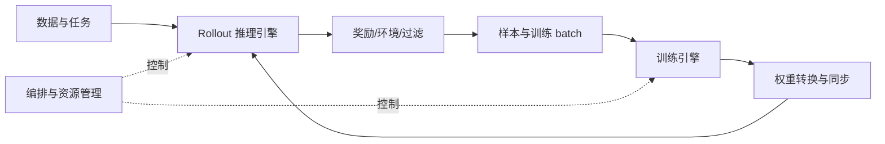

# RL 系统全景：角色、状态与执行阶段

> 前置：了解 rollout、reward、policy update。目标：把算法步骤对应到进程、张量、状态和等待。

## 同一份策略，两套执行环境

训练侧计算 loss、backward 和 optimizer update；推理侧持续生成 token、管理请求与 KV。两侧可能使用不同模型布局和并行度，因此参数需要转换并发布到生成引擎。

这张图表达依赖，不表示所有部署都严格串行。同步、共置、分离、partial rollout 和持续异步会改变资源与时序，需要在基础完成后分别分析。

## 每次读代码回答四个问题

| 问题 | 在 RL 中看什么 |
|---|---|
| 谁执行 | driver、Ray actor、HTTP server、GPU worker、rank |
| 状态在哪里 | 权重、优化器、activation、KV、sample buffer |
| 谁等谁 | 生成长尾、reward、通信、换权、CPU 数据准备 |
| 什么不能改变 | mask、logprob、样本版本、梯度归一化、释放顺序 |

算法经验帮助你判断最后一行，前三行需要新的系统知识。基础没补齐时先识别边界，不要求第一次就读懂所有源码。

## 局部加速的上限

假设一轮 rollout/reward/训练/换权依次为 60/10/20/5 秒，总计 95 秒。若训练快一倍，一轮变为 85 秒，收益约 10.5%。当阶段可并发时，又不能简单相加。先画真实时间线和关键路径，资源分离还要比较 GPU 成本与样本版本。

## 原理与实现的边界

百科的物理、数值与系统条目解释通用机制；Megatron/SGLang 走读解释具体执行引擎；slime 走读解释 RL 协同。论文详解与模型专题保留特定设计的推导和证据。

实现参见 [slime 编排中的角色与主循环](../../docs/code_walkthrough/01_architecture_and_ray_orchestration.md)，画一轮同步 RL 图，给箭头标上控制请求、样本、权重或统计量。需要底层解释时，可按[物理基础目录](../00_Physical_Foundations/README.md)补齐。

相关条目：[运行环境](../03_Hardware_Systems/Linux与运行环境.md)。可选实验安排见[实践路线](../guides/16周实践路线.md)，所有专题见[总目录](../README.md)。

## 学习复盘：八个系统问题

### 总复盘｜看到一个 CUDA / AI Infra 问题时，按这 8 个问题定位

1. 这是 **workload / 算子抽象** 问题，还是具体 Kernel 实现问题？例如 GEMM / Grouped GEMM 是“要算什么”，cuBLASLt / CUTLASS / Triton 是“怎么实现”。

2. 这是 **代码/编译** 问题，还是 **运行时/调度** 问题？例如 nvcc / Triton compiler / TileLang codegen 与 CUDA Runtime / Driver 不属于同一层。

3. 当前看到的是哪种编译产物？CUDA C++ / Triton DSL 最终可能经历 PTX → cubin/SASS；不要把 CUDA Runtime 当成 GPU ISA。

4. 当前工作粒度是什么？Operation / Kernel / Grid / Block(CTA) / Warp / Thread / Tile 中的哪一层？

5. “谁在调度谁”？Stream 管 operation 的顺序与并发机会；GPU CTA scheduler 管 Block→SM；Warp Scheduler 管 SM 内 Warp→instruction issue。

6. 资源属于谁？Register 属于线程执行状态但物理驻留于 SM；Shared Memory 属于 Block 协作；L2 属于整 GPU；HBM 是设备全局显存；Hopper/Blackwell 还引入 TMA/TMEM 等新数据通路与存储层级。

7. 当前瓶颈是 Tensor Core compute、HBM/片上数据搬运、launch/scheduling、expert load imbalance，还是 GPU 间通信？Grouped GEMM 要特别看每个 Expert 的 `M_i` 分布，而不是只看总 FLOPs。

8. 如果已经跨 GPU / 节点：数据沿 PCIe / NVLink / NVSwitch / HCA / InfiniBand 中的哪条路径走？Collective 的 latency 与 bandwidth 成本分别是什么，能否与 GEMM/Attention overlap？

> **最终心智模型：**先看“模型产生了什么 workload”，再看“由哪个 library / DSL / compiler 实现”，然后看“Kernel 如何进入 Stream、Block 如何进入 SM、Warp 如何被 issue”，最后沿着 Register/Shared Memory/HBM/NVLink/IB 追踪数据流。绝大多数 CUDA、FlashAttention、MoE、Megatron、NCCL 与推理 Runtime 问题，都可以挂到 **Workload → Compilation → Scheduling → Resource → Data Movement → Communication** 这六个维度上。

## 完整推演与演进资料

- [RL系统演进史：从同步算法循环到分布式角色与版本管理](RL系统演进史.md)：同步循环、actor/learner、RLHF多角色、混合引擎与异步。

---

[所属专题](README.md) · [百科总览](../README.md)
