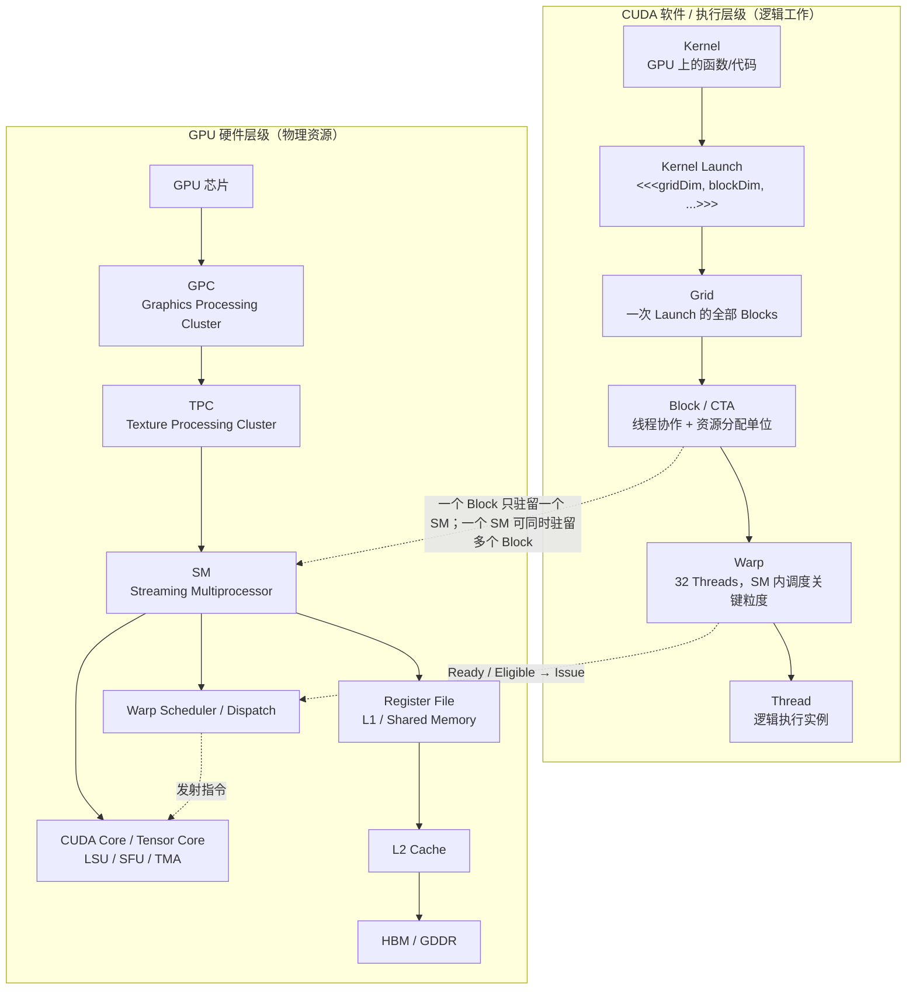

# AI Infra 学习笔记

> 从 GPU 硬件与 CUDA 执行模型，到多 GPU 通信与分布式训练性能：持续记录学习过程中的问答、术语与重要 Insight  
> 创建日期：2026-08-11 | 最近更新：2026-09-05 | 本版：知识库分层重构 + Kernel / Compiler + Communication / Memory + Parallelism + Profiling / Performance Analysis 专题（资料核对截至 2026-09-05）


> **使用方式**
>
> 以后学习 AI Infra 时，遇到值得保留的问题、概念辨析或经验性结论，可以继续追加到本笔记。记录时优先保留“问题 → 结论 → 为什么 → 易混淆点 → 相关术语”的结构。

## 知识库导航｜基础主文档与大专题如何分工

这份主文档负责两件事：第一，解释进入 AI Infra 所需的共同基础；第二，作为各大专题的索引。篇幅较大的主题不再全部堆进一个 Markdown，而采用“专题目录 → 总览 → 分章 → 案例”的结构。

| 层级 | 内容 | 状态 |
|---|---|---|
| 基础主文档 | GPU / Accelerator Architecture、Cluster / Resource Scheduling、Benchmark、量化压缩、可靠性基础 | GPU 部分已有正文，其余逐步扩展 |
| 模型结构 | Attention、MLA、Sparse/Linear Attention、MoE、Residual Evolution | 已有独立专题 |
| Kernel / 编译器 | CUDA 执行模型、内存编程、GEMM、CUTLASS、Triton、TileLang、PyTorch Compiler | [进入专题总览](AI_Infra_知识库/01_Kernel_GPU_Programming_Compiler/00_专题总览.md) |
| 通信与内存 | NCCL、Collective、NVLink/InfiniBand、显存核算、Offload、KV Cache | [进入专题总览](AI_Infra_知识库/02_Distributed_Communication_Memory/00_专题总览.md) |
| 并行策略 | DP、TP、PP、SP、CP、EP、ZeRO/FSDP、多维并行 | [进入专题总览](AI_Infra_知识库/03_Parallelism/00_专题总览.md) |
| Profiling | Nsight、PyTorch Profiler、MFU、Roofline、端到端瓶颈定位 | [进入专题总览](AI_Infra_知识库/04_Profiling_Performance_Analysis/00_专题总览.md) |
| 系统框架 | 训练引擎、推理引擎、强化学习框架 | 沿用现有专题体系 |

### 当前最重要的边界

- **GPU Architecture** 回答硬件有什么能力，以及为什么 A100 → H100 → B200/B300 → Rubin 会这样演化。
- **GPU Programming** 回答程序怎样组织 Thread、Warp、CTA、Tile、Stream 和数据搬运。
- **Kernel Library / DSL** 回答什么时候调用现成 Kernel，什么时候使用 CUTLASS、Triton、TileLang、CuTe DSL 等工具编写 Kernel。
- **Compiler Stack** 回答 PyTorch 图如何捕获、优化、Lower，并最终生成 GPU 可执行代码。
- **Profiling** 回答这些层中到底是哪一层拖慢了端到端任务。

> 迁移原则：本文件当前保留此前完整章节，避免知识丢失；新专题完成并校验后，再把重复正文缩成摘要与链接。

### 第二专题说明｜通信与内存为什么合并

通信不是脱离内存存在的“网络 API”：ZeRO/FSDP 通过分片状态节省显存，因此引入 AllGather/ReduceScatter；MoE 把 expert 放到不同 GPU，因此 token 需要 All-to-All；Prefill–Decode 分离改变 KV Cache 的 owner，因此引入跨 GPU KV 传输。新的 [Distributed Communication 与 Memory System 专题](AI_Infra_知识库/02_Distributed_Communication_Memory/00_专题总览.md) 用“状态在哪里、何时搬、搬多少、走哪条路径、能否被计算隐藏”统一解释这些问题。

专题当前包含 16 篇分章，版本锚点为 NCCL 2.31.2、CUDA 13.3 与 PyTorch 2.14，并单独整理 MoE All-to-All、Prefill–Decode 分离、分布式 Checkpoint 与逐层实验排查手册。下文原有 Part II / III 暂时保留作为历史学习记录；权威解释以新专题为准。

### 第三专题说明｜Parallelism 是布局而不是缩写列表

新的 [Parallelism 专题](AI_Infra_知识库/03_Parallelism/00_专题总览.md) 以“global tensor 如何映射到 DeviceMesh”为统一语言：每种方案都必须说明切分维度、per-rank 状态、forward/backward 通信、显存变化和 topology placement。它系统覆盖 DP/DDP、ZeRO/FSDP、TP、PP、两类 SP、CP、EP、Embedding/Vocab Parallelism 与多维组合，并扩展到推理和 RL 的角色级并行。

专题采用总览加 16 个分章，共 17 篇 Markdown；版本锚点为 PyTorch 2.14、Megatron Core 当前文档、TorchTitan、vLLM 与 verl 当前版本。下文已有 TP/PP/Hockney 内容继续保留为历史记录，概念边界和最新实现以新专题为准。

### 第四专题说明｜Profiling 是从现象走到因果证据

新的 [Profiling / Performance Analysis 专题](AI_Infra_知识库/04_Profiling_Performance_Analysis/00_专题总览.md) 不把 `GPU-Util` 当成最终答案，而是建立六层观测：业务 SLO/训练进度、阶段耗时、CPU/GPU 系统时间线、operator、kernel 硬件计数器、集群 rank 与 fabric。它把 Nsight Systems、Nsight Compute、PyTorch Profiler、CUDA memory snapshot、DCGM、Flight Recorder 和 Prometheus 放在各自正确的层级。

专题采用总览加 16 个分章，共 17 篇 Markdown；既解释 Roofline、MFU/HFU、TTFT/TPOT/ITL/goodput 等指标，也覆盖 CPU/DataLoader、OOM、distributed collective、parallel bubble、MoE/长上下文/RL 与线上触发式 tracing。最后用“GPU 利用率低”端到端案例和实验工作表把观察、假设、证据、干预与回归固化成可执行流程。


## 学习主线｜先把“代码 → GPU → 多 GPU”串成一条链

这版笔记不再按“问题出现的时间”简单堆叠，而是按理解依赖重新组织。先理解一张 GPU 内部如何执行 CUDA 工作，再上升到进程、GPU 间通信、集群网络，最后进入 TP / PP 与性能模型。


```text
模型 / Framework
PyTorch / Transformer Engine
↓ dispatch / compile
CUDA C++ / cuBLAS(Lt) / CUTLASS / Triton / TileLang
↓ compiler / library backend
PTX → cubin / SASS
↓ CUDA Runtime / Driver
CUDA Stream
↓ Kernel Launch
Grid
↓
Block / CTA
↓ 分配到某个 SM
SM
↓
Warp (32 threads) / Warp Group
↓ Warp Scheduler
Issue instruction
↓
CUDA Core / Tensor Core / LSU / TMA / ...
↓
Register / Shared Memory / TMEM / L2 / HBM
↓
NVLink / NVSwitch / InfiniBand
↓
多 GPU / 多节点训练
```

这条主线现在同时包含两个方向：**纵向**理解一个 Kernel 如何从软件一路落到 SM/Warp/执行单元；**横向**理解像 GEMM、Grouped GEMM 这样的 workload，如何由 cuBLASLt、CUTLASS、Triton、TileLang 等不同 backend 实现，再被 PyTorch/Transformer Engine 调度。


| **部分**                     | **核心问题**                                          | **对应章节** |
|------------------------------|-------------------------------------------------------|--------------|
| Part I｜GPU 与 CUDA 执行基础 | GPU 如何演化？代码/Kernel/GEMM 又如何编译、调度并落到 SM？ | 01–07        |
| Part II｜进程与 GPU 通信     | 进程、GPU、IPC、NCCL、NVLink/IB 是怎么串起来的？      | 08–10        |
| Part III｜分布式训练性能     | TP/PP 通信、activation、Hockney、利用率如何统一理解？ | 11–14        |

## Part I｜GPU 硬件与 CUDA 执行模型

目标：先理解 GPU 为什么从 A100/H100/B200 一路演化到 Rubin，再把一段 AI workload 从软件一路追到硬件：**Framework 如何选择 library / Kernel DSL → PTX/SASS 如何生成 → CUDA Stream 如何表达并发 → Block 如何进入 SM → Warp 如何被 issue → GEMM / Grouped GEMM 如何真正喂给 Tensor Core。**

### 01｜现代 GPU 的硬件层级：GPU → GPC → TPC → SM，SM 里面到底有什么？

问题：现代 GPU 一般有多少个 SM？SM 和 CUDA Core 是什么关系？GPC / TPC / SM / Warp Scheduler / Tensor Core / Shared Memory 应该放在同一张图的什么位置？

#### 核心结论

- SM（Streaming Multiprocessor，流式多处理器）是 NVIDIA GPU 最核心的计算与调度单元之一。现代高端 GPU 通常有几十到一百多个 SM；例如 A100 有 108 个 SM，H100 SXM 有 132 个 SM，完整 GH100 设计为 144 个 SM。

- SM ≠ CUDA Core。一个 SM 内部包含多个执行管线与片上资源，例如 CUDA Core、Tensor Core、Load/Store Unit（LSU）、Special Function Unit（SFU）、Warp Scheduler、Register File、L1 / Shared Memory；Hopper 还引入了 TMA（Tensor Memory Accelerator）等能力。

- 更接近物理组织的抽象是 GPU → GPC → TPC → SM；但 GPC/TPC 的精确组织属于架构实现细节，不应把它当成 CUDA 编程时可直接指定的调度层级。

- Warp Group、Producer Warp、Consumer Warp 不是与 CUDA Core/LSU 同级的固定硬件模块。Warp Group 是线程协作/指令粒度概念；Producer/Consumer 是程序对 Warp/Warp Group 的角色分工。

| **概念**                      | **属于哪一层**    | **直觉**                                                               |
|-------------------------------|-------------------|------------------------------------------------------------------------|
| GPU                           | 整颗加速器        | 包含多个 GPC/SM、L2、内存控制器、互联接口等                            |
| GPC                           | 芯片内部物理分区  | Graphics Processing Cluster，组织若干 TPC/SM                           |
| TPC                           | 芯片内部物理分区  | Texture Processing Cluster，通常再包含若干 SM                          |
| SM                            | 计算/调度核心单元 | Block 驻留在这里；Warp 在这里被调度；片上寄存器/Shared Memory 也在这里 |
| CUDA Core / Tensor Core       | 执行单元          | 分别承担标量/向量式算术与矩阵乘加等执行                                |
| Warp Scheduler                | 调度单元          | 从可执行 Warp 中选择并发射下一条指令                                   |
| Register File / Shared Memory | SM 片上存储       | 保存线程状态、Block 共享数据，延迟远低于 HBM                           |

#### 为什么“一百多个 SM”却能有上万个 CUDA Core？

因为 CUDA Core 是 SM 内部的执行资源，不是 SM 本身。以 H100 SXM 为例，132 个 SM，每个 SM 中包含大量标量执行单元以及 Tensor Core 等资源，因此整卡会呈现上万级别的 CUDA Core 数量。真正做 CUDA 性能分析时，比“总 CUDA Core 数”更重要的是：有多少 SM、有多少 Warp 能持续处于可发射状态、执行管线是否被喂饱。

#### 硬件层级与软件层级不要画成同一棵“父子树”



图 1｜硬件是“资源”，Grid/Block/Warp/Thread 是“工作与调度组织”；关键映射是 Block → SM、Warp → Warp Scheduler。

> **最重要的纠正：**不要记成“Thread → CUDA Core 一一绑定”。Thread 是逻辑执行实例；32 个 Thread 组成 Warp，Warp 的指令由调度器发射到合适的执行管线。


### 02｜从 A100 → H100 → B200 → Rubin：NVIDIA GPU 架构为什么不断这样变化？

问题：前面已经认识了 SM、Tensor Core、Warp Scheduler、Register、Shared Memory、TMA、NVLink 等组件，但这些组件不是一开始就同时以今天的形态存在。沿着 A100 → H100 → B200 → Blackwell Ultra → Rubin 看，它们为什么不断变化？每一代到底是在解决上一代的什么瓶颈？

#### 先给结论：NVIDIA GPU 的主线不是“单纯堆更多 CUDA Core”

如果只看 SM 数量，会得到一个很不完整的故事：

```text
A100 (Ampere)       108 SM
        ↓
H100 (Hopper)       132 SM
        ↓
B200 (Blackwell)    148 SM
        ↓
B300 / Blackwell Ultra 约 160 SM
        ↓
Rubin               224 SM
```

SM 确实越来越多，但真正推动 AI 性能跨代增长的更重要因素是下面五条线同时演化：

1. **计算粒度越来越“大”**：CUDA Core → Tensor Core → Warp-level MMA → Warp-group MMA → CTA-pair / 更大协作域。
2. **数值精度越来越“低而聪明”**：FP32/FP16 → TF32/BF16 → FP8 → FP4 / microscaling → 更灵活的低比特与压缩表示。
3. **数据搬运越来越“异步、专用化”**：普通 LD/ST → Ampere async copy → Hopper TMA → Blackwell TMEM + 更强 TMA → Rubin enhanced TMA。
4. **存储层级越来越靠近计算**：Register / Shared Memory / L2 / HBM 之外，又出现专门服务 Tensor Core 的 Tensor Memory 等结构，减少中间结果反复进出 Register/HBM。
5. **“一张 GPU”不再是性能优化的终点**：NVLink / NVSwitch 带宽持续翻倍，优化单位从单 SM、单 GPU，扩展到多 GPU、整机、整 rack。

因此更准确的历史主线是：

```text
更多算力
   ↓
算力越来越难喂饱
   ↓
强化 HBM / L2 / Shared Memory / async copy
   ↓
Tensor Core 又更快
   ↓
数据搬运、同步、Kernel 边界成为瓶颈
   ↓
TMA / Warp Specialization / Thread Block Cluster
   ↓
单 die 到达 reticle / 功耗边界
   ↓
双 die 组成一个逻辑 GPU + 更低精度 + TMEM
   ↓
单卡继续变快后，多卡通信与 decode memory wall 更突出
   ↓
HBM4 + NVLink 6 + 更细粒度 kernel 协作 + rack-scale co-design
```

#### 一张表先看懂跨代变化

| 代际 | 代表 GPU | SM | 关键 Tensor 计算 | HBM / 带宽（代表配置） | 片上/搬运关键变化 | GPU-GPU 互联 | 这一代主要在解决什么 |
|---|---:|---:|---|---|---|---|---|
| Ampere | A100 | 108 | 3rd-gen Tensor Core；TF32/BF16；结构化稀疏 | 80 GB HBM2e，约 2 TB/s | async global→shared copy、async barrier、L2 residency control | NVLink 3，约 600 GB/s/GPU | 让 DL/HPC 大规模进入 Tensor Core + mixed precision，同时开始认真解决“算得快、搬不动” |
| Hopper | H100 SXM | 132 | 4th-gen Tensor Core；FP8；Transformer Engine；WGMMA | 80 GB HBM3，约 3.35 TB/s | TMA、Thread Block Cluster、Distributed Shared Memory、更大 Shared Memory | NVLink 4，约 900 GB/s/GPU | Transformer 成为核心 workload；需要把计算和数据搬运流水化，并扩大线程块协作粒度 |
| Hopper memory refresh | H200 | 与 H100 同属 Hopper | 计算架构基本延续 H100 | 141 GB HBM3e，约 4.8 TB/s | 重点不是改 SM，而是加容量/带宽 | NVLink 4 | 非常重要的“证据”：很多 LLM 已经不是缺 Tensor FLOPS，而是缺容量和带宽 |
| Blackwell | B200 | 148 | 5th-gen Tensor Core；`tcgen05.mma`；FP4/microscaling | 180 GB HBM3e，最高约 8 TB/s | 双 reticle die 统一成一颗 GPU；Tensor Memory (TMEM)；CTA-pair MMA；更大的 cluster 能力 | NVLink 5，约 1.8 TB/s/GPU | 单 die 尺寸、低精度推理、MoE、多卡扩展同时成为瓶颈；“一颗 GPU”开始本身就是多 die 系统 |
| Blackwell Ultra | B300 | 160（full implementation） | 5th-gen Tensor Core 强化；NVFP4；attention 加速 | 288 GB HBM3e，约 8 TB/s | 每 SM 256 KB TMEM；dual-thread-block MMA；更偏向大 batch / RL / inference | NVLink 5 | Blackwell 的方向继续加强：容量、attention、低精度与中间结果驻留 |
| Rubin | Rubin GPU | 224 | 3rd-gen Transformer Engine；更宽 K 维 Tensor Core；NVFP4；3-bit LUT 等 | 288 GB HBM4，最高约 22 TB/s | enhanced TMA、activation sparsity/adaptive compression、更细粒度 dependent-kernel triggering | NVLink 6，约 3.6 TB/s/GPU | agentic inference、长上下文、MoE、decode memory wall、kernel-to-kernel latency 和 rack-scale 通信 |

> 注：不同板卡/SXM/PCIe SKU 会有不同 SM、频率、显存和带宽，表里选的是数据中心主线中最具代表性的配置。理解架构时不要把某个 SKU 的数字误当成整代架构的硬上限。

---

#### 第一阶段｜A100：Tensor Core 已经很快，于是开始认真解决“数据怎么喂进去”

A100（Ampere）可以看成现代 AI GPU 的一个重要起点。它有 108 个 SM，第三代 Tensor Core，每个 SM 4 个 Tensor Core；同时加入 TF32、BF16、FP64 Tensor Core 与结构化稀疏支持。

如果只理解成“Tensor Core 比上一代快”会漏掉一个非常关键的变化：**A100 开始把数据搬运本身当成一等公民。**

Ampere 引入了从 global memory 直接异步复制到 shared memory 的指令路径，可以不再让数据先经过普通寄存器中转；同时配合异步 barrier，把“搬下一块 tile”和“算当前 tile”重叠起来。

```text
更早的直觉：
HBM → Register → Shared Memory → Compute

Ampere 开始强调：
HBM ── async copy ──→ Shared Memory
             │
             └── 与当前 tile 的计算 overlap
```

为什么要这样？因为 Tensor Core 吞吐越来越高后，计算单元真正怕的不是“没有乘法器”，而是：

```text
Tensor Core ready
↓
下一块 A/B tile 还没到
↓
等待
↓
昂贵的计算单元空转
```

所以从 A100 开始，一个非常重要的 GPU 优化思想越来越明显：

> **不是只提高 compute throughput，而是让数据移动、同步和计算形成 pipeline。**

A100 的另一条重要线是 **TF32 / BF16 / structured sparsity**。其本质是：AI 并不总需要 FP32 的每一位精度，如果允许使用更低精度或稀疏结构，就能用更少带宽、更少存储和更高 Tensor Core throughput 完成同样的训练/推理任务。

这为后面的 FP8、FP4 埋下了路线。

---

#### 第二阶段｜H100：Transformer 变成中心 workload，GPU 开始围绕“异步流水线”重新设计

到了 Hopper/H100，变化就不再只是“更快 Tensor Core”。H100 SXM 有 132 个 SM；第四代 Tensor Core 在相同数据类型下每 SM 的 MMA throughput 相比 A100 进一步提升，并引入 FP8 和 Transformer Engine。

但是 Hopper 最值得理解的并不是 FP8，而是三件互相关联的东西：

```text
TMA
+
Warp Specialization / WGMMA
+
Thread Block Cluster / Distributed Shared Memory
```

##### 1. TMA：把“搬 tensor”从普通线程指令里剥离出来

A100 的 async copy 已经能异步搬数据，但地址计算、tile 组织等仍然需要较多软件工作。Hopper 的 TMA（Tensor Memory Accelerator）进一步把多维 tensor 的搬运变成专用硬件能力。

它可以让很少的线程发起大块 1D～5D tensor transfer：

```text
HBM
 │
 │ TMA
 ↓
Shared Memory
 │
 ↓
Tensor Core
```

数据在飞的时候，其他 Warp 可以继续算。

于是一个 SM 内部非常自然地出现：

```text
Producer Warp
   │
   │ TMA：负责下一块数据
   ↓
Shared Memory
   │
   ↓
Consumer Warp Group
   │
   │ WGMMA
   ↓
Tensor Core
```

这就是前面讨论的 Warp Specialization 为什么在 Hopper/FlashAttention-3 里变得重要。

##### 2. WGMMA：矩阵计算的协作粒度从 Warp 扩大到 Warp Group

普通 CUDA 心智模型里：

```text
32 Threads = 1 Warp
```

但大矩阵 MMA 越来越适合让更多线程一起完成。Hopper 的 Warp-Group MMA（WGMMA）把典型协作粒度提升到 4 Warps = 128 Threads。

这反映出一个趋势：

> **GPU 的“高性能编程粒度”正在从 Thread/Warp，逐渐向 Warp Group / CTA / Cluster 变大。**

Thread 仍然存在，CUDA 也没有消失，但真正决定 Tensor Core 是否吃满的，越来越是更大的 tile 和协作单元。

##### 3. Thread Block Cluster：Block 不再完全是“孤岛”

传统 CUDA 最强的边界是：

```text
一个 Block 内：
Shared Memory + __syncthreads()

不同 Block：
通常通过 Global Memory / Kernel boundary 协作
```

Hopper 增加 Thread Block Cluster，使多个 Block 可以被安排成一个 cluster，并通过 Distributed Shared Memory 访问同 cluster 中其他 Block 的 Shared Memory。

于是硬件层级出现了一个新的“中间协作域”：

```text
单 Block Shared Memory
        ↓
Thread Block Cluster / Distributed Shared Memory
        ↓
L2
        ↓
HBM
```

为什么需要它？因为有些 tile/工作集已经大到一个 SM 的 Shared Memory 装不下，但如果每次都落到 HBM/L2，又太贵。

---

#### 一个值得单独记住的过渡：H200 为什么几乎没改 SM，却仍然很重要？

H200 仍然属于 Hopper，核心计算架构并不是全新一代；但显存提升到 141 GB HBM3e，带宽进一步提升到约 4.8 TB/s。

这件事本身非常说明问题：

> **如果 AI 性能只由 Tensor FLOPS 决定，那么 NVIDIA 没必要做这样一个“主要升级显存容量和带宽”的产品。**

LLM 尤其是 inference/decode 会反复读取权重和 KV Cache，往往是 memory-bound。模型越大、context 越长，capacity 也变成硬约束。

因此从 H100 → H200 可以把 GPU 的一个根本矛盾看得非常清楚：

```text
Tensor Core throughput 增长很快
            ↓
HBM bandwidth / capacity 增长跟不上
            ↓
Memory Wall 越来越突出
```

---

#### 第三阶段｜B200：单 die 也碰到物理极限，于是“一颗 GPU”本身开始变成多 die 系统

Blackwell/B200 的第一个巨大变化，甚至不在 SM 内部，而是在芯片封装层。

Blackwell GPU 由两个接近光刻 reticle 上限的 compute die 组成，并通过约 10 TB/s 的 die-to-die link 连接，对 CUDA 软件呈现为一个统一 GPU。

```text
以前：
┌───────────────┐
│  单个大 GPU die │
└───────────────┘

Blackwell：
┌──────────┐   10 TB/s   ┌──────────┐
│ GPU Die A│ ═══════════ │ GPU Die B│
└──────────┘             └──────────┘
          \               /
           \             /
             一个逻辑 GPU
```

为什么这么做？因为单 die 已经越来越接近：

- 光刻 reticle size 上限；
- 良率与成本压力；
- 晶体管数量增长；
- 功耗与布线压力。

所以 GPU 从“单 monolithic die”逐渐走向 package-level system。

这个变化非常关键，因为未来“GPU”这个词会越来越像：

> **一个封装内的计算系统，而不一定等于一块完整单 die。**

##### Blackwell 的第二个关键变化：Tensor Memory（TMEM）

在 Hopper 里，Tensor Core 的 accumulator 等中间状态会大量占用 Register File。Tensor Core 越来越快、tile 越来越大后，Register pressure 会反过来限制 occupancy 和数据复用。

Blackwell SM100 的 `tcgen05.mma` 引入 Tensor Memory（TMEM），专门服务 Tensor Core accumulator 等数据。

可以把数据路径粗略理解为：

```text
             TMA
HBM ─────────────────→ Shared Memory
                          │
                          │ A/B operands
                          ↓
                     Tensor Core
                          │
                          │ accumulator
                          ↓
                       TMEM
                          │
                          ↓
                       output
```

这解决的是一个很具体的问题：

> **Tensor Core 变得太快以后，Register File 既要保存线程状态又要承受巨大的矩阵 accumulator 压力。**

把一部分 Tensor 专用状态搬到 TMEM，可以释放 Register File、提高数据复用，也让 Tensor Core 的编程模型进一步专用化。

##### Blackwell 的第三个变化：CTA-pair cooperation

`tcgen05.mma` 可以让两个相邻 CTA/Block 协同执行一个 MMA。

注意这个趋势：

```text
早期：Thread / Warp
       ↓
Ampere：Warp-level MMA
       ↓
Hopper：Warp Group (4 warps)
       ↓
Blackwell：CTA pair / Cluster cooperation
```

**高性能矩阵计算正在不断扩大“协作粒度”。**

##### Blackwell 的第四个变化：FP4 / microscaling

Hopper 把 FP8 推进主流 AI；Blackwell 进一步推动 4-bit floating point 与 fine-grained scaling。

为什么不是一直用 FP16？因为低精度同时改善三件事：

```text
更少 bits
  ├─→ Tensor Core 每周期可算更多元素
  ├─→ HBM 需要搬的数据更少
  └─→ 同样显存能装更大模型 / KV cache
```

所以低精度并不只是“算力技巧”，它同时缓解 **compute wall + memory bandwidth wall + memory capacity wall**。

代价是：scale factor、dynamic range、quantization error 的管理越来越复杂，因此 Transformer Engine 也从一个简单“数据类型支持”逐渐演化成数值精度管理系统。

---

#### Blackwell Ultra / B300：为什么继续加 TMEM、容量和 Attention 能力，而不是只加 CUDA Core？

Blackwell Ultra 的 full GPU implementation 提升到 160 个 SM，并进一步强化第五代 Tensor Core；每个 SM 配置 256 KB Tensor Memory，同时把显存容量提高到 288 GB HBM3e。

NVIDIA 特别强调 attention-layer acceleration、NVFP4、dual-thread-block MMA 等，而不是单纯宣传 FP32 CUDA Core 数量。

这说明现代 AI workload 已经把 GPU 的瓶颈从“有没有足够多 ALU”推向：

```text
长上下文 Attention
MoE
RL / post-training
大 KV cache
低 batch / latency-sensitive inference
中间 tensor 的驻留与搬运
```

换句话说，**SM 内的“数据路径设计”开始和“算术单元数量”同等重要。**

---

#### 第四阶段｜Rubin：瓶颈进一步从单 Kernel 转向“Kernel 之间、GPU 之间、整 rack”

到 2026 年公布的 Rubin，方向更加明显。Rubin GPU 有 224 个 SM、896 个 Tensor Core、288 GB HBM4，峰值 HBM 带宽达到约 22 TB/s；NVLink 6 的 scale-up 带宽达到约 3.6 TB/s/GPU。

如果只把它看成“B200 的更大号版本”，会错过真正有意思的变化。

##### 1. HBM3e → HBM4：decode 已经明确成为 memory subsystem 问题

NVIDIA 对 Rubin 的描述非常直接：token-by-token decode fundamentally memory-system bound。

为什么？

训练中的大 GEMM 往往 arithmetic intensity 很高，Tensor Core 很容易成为主角；而 autoregressive decode 中，每生成一个 token，都需要不断读取：

- 模型权重；
- KV Cache；
- activation / intermediate state；
- MoE expert state。

batch 小时，每次搬来的权重不能被足够多 token 复用，于是：

```text
Tensor Core 峰值很高
        ↓
但大部分时间在等数据
        ↓
实际 tokens/s 由 memory bandwidth 主导
```

所以 Rubin 把 HBM bandwidth 从 Blackwell 的约 8 TB/s 推到最高约 22 TB/s，不是“附属升级”，而是在修正整个系统的 compute : memory balance。

##### 2. enhanced TMA：MoE 让“tensor descriptor 管理”本身都成为成本

MoE 会把 token 动态路由到不同 expert。不同 expert 的 tensor layout 可能相似，但地址不同。如果每次都重新构造/更新 descriptor，会出现 metadata 与控制开销。

Rubin 的 enhanced TMA 支持 inline descriptor update，使 kernel 能复用 tensor layout 描述，只在指令中动态覆盖 pointer/stride 等字段。

这说明 GPU 优化已经进入非常细的层次：

> **不只是“搬数据很贵”，连“告诉搬运引擎数据在哪里、长什么样”的 metadata 管理都值得做硬件优化。**

##### 3. activation sparsity + adaptive compression：不再只稀疏权重，也开始稀疏中间激活

A100 已经支持 structured sparsity，但 Rubin 把稀疏/压缩更深地推进到 attention / activation 路径。

例如 attention 中间结果可以在 Tensor Memory 中被压缩成结构化 sparse representation，使后续 softmax 和第二次 attention GEMM 处理更少数据。

这条线的本质是：

```text
如果搬数据很贵，
最好的数据搬运优化之一就是——根本不要搬那么多数据。
```

##### 4. 更细粒度 dependent-kernel triggering：Kernel boundary 本身开始成为瓶颈

传统同 stream 依赖：

```text
Kernel A 完整结束
        ↓
Kernel B 才开始
```

但 A 的某些 tile 可能早已计算完成，B 实际已经可以消费这些结果。Hopper/Blackwell 有 Programmatic Dependent Launch，可以提前 overlap 一部分 producer / consumer kernel；Rubin 又进一步强调更细粒度、数据驱动的 dependent work triggering。

于是优化粒度再次扩大：

```text
以前：优化 Kernel 内部
现在：Kernel A 和 Kernel B 之间也要 pipeline
```

这对 agentic inference 尤其重要，因为每个 token 由大量小 kernel / dependent stage 串起来，kernel 间的 bubble 会直接伤害 per-user latency。

##### 5. NVLink 6：GPU-GPU communication 越来越像“GPU 内部数据通路”的延伸

Rubin NVLink 6 达到约 3.6 TB/s/GPU，并强化 device-initiated NVLink、counted writes 等机制。

这背后的趋势不是“网卡更快”这么简单，而是：

```text
单 GPU
↓
多 GPU Tensor Parallel / Expert Parallel
↓
通信进入每层、每个 token 的 critical path
↓
GPU-GPU communication 必须被 kernel 直接驱动、直接 overlap
↓
整 rack 越来越像一个巨型 accelerator
```

---

#### 把四代放在一起：真正的“瓶颈迁移”

可以把 A100 → H100 → B200 → Rubin 看成瓶颈不断转移的过程：

```text
A100
问题：Tensor 计算需要更高 throughput，数据搬运开始跟不上
解法：Tensor Core + TF32/BF16 + async copy + sparsity

        ↓ Tensor Core 更快

H100
问题：Transformer pipeline 中 data movement / synchronization 开销突出
解法：FP8 + Transformer Engine + TMA + WGMMA + Block Cluster

        ↓ 单 SM/单 GPU 更快

B200
问题：single-die scaling、Register pressure、显存/通信、超大模型
解法：dual-die unified GPU + TMEM + CTA-pair + FP4 + HBM3e + NVLink 5

        ↓ GPU 已非常强，模型和 inference 又继续放大

Rubin
问题：decode memory wall、MoE routing、长 context、kernel bubbles、rack communication、tokens/watt
解法：HBM4 + enhanced TMA + activation sparsity/compression + finer kernel dependency + NVLink 6
```

最值得记住的是：

> **每当某一层被加速，瓶颈就会向下一层移动。**
>
> Tensor Core 快了 → Memory 成为瓶颈；Memory 快了 → synchronization / scheduling 成为瓶颈；单卡快了 → GPU-GPU communication 成为瓶颈；rack 快了 → power / cooling / reliability 又成为瓶颈。

这就是现代 GPU 架构为什么看起来越来越复杂。

---

#### 软件执行模型也在悄悄变化：从 Thread-centric 到 Tile / Pipeline-centric

CUDA 为兼容性一直保留：

```text
Grid → Block → Warp → Thread
```

但如果观察真正高性能 kernel 的编程方式，会看到另一条演进：

```text
早期 CUDA：
“每个 Thread 算哪个元素？”

        ↓
Tensor Core 时代：
“每个 Warp 算哪个 matrix tile？”

        ↓
Hopper：
“哪个 Warp 是 Producer？哪个 Warp Group 做 WGMMA？”

        ↓
Blackwell：
“CTA pair / Cluster 如何共同处理更大的 tile？
Accumulator 放 TMEM 还是 Register？”

        ↓
Rubin：
“多个 Kernel / GPU / rack 如何围绕 tensor flow 形成持续 pipeline？”
```

所以未来学习 FlashAttention、CUTLASS、Triton、cuTile 时，不要只盯着 `threadIdx.x`。现代 AI Kernel 的核心对象越来越是：

**Tile、Pipeline、Producer/Consumer、Data Movement、Collective、Dependency。**

---

#### 现在还存在哪些问题？

##### 问题 1｜Memory Wall 没有消失，而且 inference 时代更严重

HBM 从 A100 约 2 TB/s → H100 3.35 TB/s → B200 约 8 TB/s → Rubin 最高约 22 TB/s，已经增长巨大，但 Tensor Core throughput 与模型规模也同时增长。

尤其 decode：

```text
小 batch
+
每 token 反复读 weights / KV cache
+
长 context
=
低 arithmetic intensity
```

所以未来不可能只靠“再加 Tensor Core”。

##### 问题 2｜通信墙（Communication Wall）

TP、EP/MoE、长 context parallelism 都让 collective 和 point-to-point communication 进入 critical path。NVLink 从 600 GB/s → 900 GB/s → 1.8 TB/s → 3.6 TB/s 持续翻倍，本身就说明问题没有消失。

当模型扩展到 rack / pod 后：

```text
GPU compute latency
≈
memory latency/bandwidth
+
NVLink collective
+
scale-out network
```

不能再把网络看成“GPU 外面的附属设施”。

##### 问题 3｜Power Wall / Cooling Wall

HGX B200 已允许单 GPU 配置到约 1 kW 级别。随着 GPU 数量和 HBM/NVLink 功耗一起上升，rack 的供电、液冷、功率波动管理正在变成体系结构约束。

未来提升性能时真正要优化的是：

```text
tokens / joule
training progress / joule
useful FLOPs / watt
```

而不只是 peak TFLOPS。

##### 问题 4｜硬件越来越强，但软件越来越难把它用满

A100 时会写好 async copy 就已经很高级；Hopper 要理解 TMA、barrier、WGMMA、Warp Specialization；Blackwell 又增加 TMEM、`tcgen05.mma`、CTA-pair、block scaling；Rubin 再加入更细依赖和压缩机制。

这意味着：

> **Peak performance 与 programmable performance 之间的距离可能越来越大。**

这也是 CUTLASS、Triton、cuTile、compiler auto-tuning 越来越重要的原因——不能要求每个模型开发者手写架构专用 SASS/PTX。

##### 问题 5｜低精度越来越低，数值稳定性越来越难

FP8、FP4、3-bit / LUT 等格式可以显著提升吞吐和降低带宽，但并不是“把 dtype 改一下”即可。需要：

- scale factor 设计；
- block/micro-tensor scaling；
- accumulation precision；
- calibration / dynamic range；
- model-aware quantization；
- training / inference 软件协同。

因此硬件和算法之间会越来越共设计（co-design）。

##### 问题 6｜AI workload 越来越 irregular

传统大 GEMM 很规则，GPU 很喜欢；但未来 workload 越来越包含：

- MoE 动态路由；
- agent tool calls；
- retrieval；
- variable-length context；
- small-batch decode；
- speculative decoding；
- RL rollout；
- 多模态不同 shape。

这些 workload 会带来小 kernel、负载不均、同步与调度 bubble，使“拥有很多 Tensor Core”不等于“Tensor Core 一直有活干”。

---

#### 未来 GPU 很可能往哪里走？——把“已确认”与“推测”分开

Rubin 已经把很多未来方向明确展示出来；Rubin 之后更远的部分需要作为工程推断理解，而不是 NVIDIA 已公布规格。

##### 已经确认的方向：GPU 从 chip 走向 package / rack co-design

Blackwell 已经用双 die 组成统一 GPU；Rubin 继续使用多 compute die，并把 CPU、GPU、NVLink Switch、NIC/DPU、storage platform 作为统一系统设计。

因此“GPU 架构”正在从：

```text
SM microarchitecture
```

扩大成：

```text
SM
+
on-package memory
+
die-to-die interconnect
+
CPU-GPU coherent link
+
NVLink fabric
+
scale-out NIC
+
power/cooling
+
software runtime
```

##### 很可能继续发生 1｜更强的多 die / chiplet 化

单 die 的 reticle、良率与功耗限制不会消失，因此未来一个“GPU”包含更多 compute die / IO die / cache die 是自然方向。

真正的挑战会从“能不能连起来”变成：

> **怎样让软件看起来仍然像一块 GPU，同时尽量隐藏 NUMA / die locality。**

##### 很可能继续发生 2｜更多专用片上内存，而不只是更大的 Register/Shared Memory

TMEM 是非常重要的信号。未来高吞吐单元可能继续配套更专用的 local storage / scratchpad / accumulator memory，让数据尽量不回 HBM，也避免 Register File 成为所有数据的唯一高速落点。

##### 很可能继续发生 3｜Data Movement Engine 会越来越聪明

路线已经很清晰：

```text
普通 LD/ST
→ async copy
→ TMA
→ enhanced TMA + inline descriptor update
```

未来可能进一步把 gather/scatter、layout transform、compression/decompression、collective communication 等数据操作更多下沉到专用硬件，让 CUDA Core/Tensor Core 少做“搬运和 bookkeeping”。

##### 很可能继续发生 4｜调度粒度继续向更大的 cooperative domain 扩展

```text
Warp
→ Warp Group
→ CTA pair
→ Thread Block Cluster
→ Multi-SM cooperative execution
→ Multi-GPU / rack-level execution
```

这并不意味着 Thread/Warp 会消失，而是高性能 kernel 的“主要设计单位”会越来越大。

##### 很可能继续发生 5｜通信与计算进一步融合

未来的目标不会只是：

```text
compute
↓
NCCL
↓
compute
```

而会越来越像：

```text
Tensor Core compute
     ║
     ╠══ NVLink send / reduce
     ║
next tile compute
```

也就是 kernel 内直接通信、collective 与 GEMM/Attention overlap，甚至更多 in-network compute。

##### 很可能继续发生 6｜“精度”从固定 dtype 变成动态资源

从 FP16 → FP8 → FP4 → microscaling → adaptive compression，可以看到 dtype 不再只是 tensor 的静态属性。

更远期很可能是：

```text
不同 layer
不同 tile
不同 token / expert
甚至不同执行阶段
```

使用不同 precision / scale / sparsity，由 hardware + compiler + model runtime 协同决定。

##### 很可能继续发生 7｜最终优化指标从 FLOPS 变成 tokens / watt / dollar

AI 数据中心最大的硬约束越来越是：

```text
Power
Cooling
HBM supply
network
floor space
reliability
```

因此未来架构不会追求“单 GPU 理论 FLOPS 最大化”这么单一，而会越来越围绕：

- 每瓦 token throughput；
- 每美元训练进度；
- 每 rack 可服务的并发 agent 数；
- 故障后的有效集群利用率；
- 通信与内存的实际利用率。

---

#### 把这一章和前面的 SM / Warp 学习串起来

前面学的是一张 GPU 在某一代架构上的“静态剖面”：

```text
GPU
↓
GPC
↓
TPC
↓
SM
├─ Warp Scheduler
├─ CUDA Core
├─ Tensor Core
├─ LSU / TMA
├─ Register
└─ Shared Memory
```

这一章加入的是“时间轴”：这些组件为什么会变成今天这样。

```text
A100：
SM 内计算 + async data movement

H100：
SM 内部 producer/consumer pipeline
+ Warp Group
+ TMA
+ Cluster

B200：
SM 内出现 TMEM
+ CTA pair
+ 一颗 GPU 内变成双 die

Rubin：
SM / Kernel / GPU 之间的边界进一步被打通
+ HBM4
+ 更细 kernel dependency
+ NVLink 6
+ rack-scale co-design
```

> **最终心智模型：现代 GPU 的演化，本质上不是“核心越来越多”，而是在不断把瓶颈从 Compute → Memory → Scheduling → Communication → Power 往外推。GPU 的有效计算单位也从 Thread/SM，逐渐扩展到 Tile/Cluster/Multi-GPU/Rack。**

#### 官方资料建议

- NVIDIA Ampere Architecture In-Depth: https://developer.nvidia.com/blog/nvidia-ampere-architecture-in-depth/
- NVIDIA Hopper Architecture In-Depth: https://developer.nvidia.com/blog/nvidia-hopper-architecture-in-depth/
- NVIDIA Hopper Tuning Guide: https://docs.nvidia.com/cuda/hopper-tuning-guide/
- NVIDIA Blackwell Architecture: https://www.nvidia.com/en-us/data-center/technologies/blackwell-architecture/
- NVIDIA Blackwell Tuning Guide: https://docs.nvidia.com/cuda/blackwell-tuning-guide/
- NVIDIA CUTLASS tcgen05 MMA Programming Guide: https://docs.nvidia.com/cutlass/
- Inside NVIDIA Blackwell Ultra: https://developer.nvidia.com/blog/inside-nvidia-blackwell-ultra-the-chip-powering-the-ai-factory-era/
- Inside NVIDIA Rubin GPU Architecture: https://developer.nvidia.com/blog/inside-nvidia-rubin-gpu-architecture-powering-the-era-of-agentic-ai/

### 03｜CUDA 软件执行层级：Kernel、Grid、Block、Warp、Thread 分别是什么？

从一段真实的 CUDA C++ 代码开始。下面不是模拟代码；在 .cu 文件中可以由 CUDA 工具链真正编译运行。


```cpp
__global__ void vector_add(
    const float* A,
    const float* B,
    float* C,
    int N) {

    int i = blockIdx.x * blockDim.x + threadIdx.x;

    if (i < N) {
        C[i] = A[i] + B[i];
    }
}

int N = 1024 * 1024;
vector_add<<<4096, 256>>>(A, B, C, N);
cudaDeviceSynchronize();
```


#### `<<<4096, 256>>>` 到底指定了什么？

它指定的是“逻辑工作形状”，不是物理资源映射：Grid 中有 4096 个 Block，每个 Block 有 256 个 Thread。总逻辑线程数为 4096 × 256 = 1,048,576。代码没有指定 Block 0 去 SM0，也没有指定 Thread 0 去 CUDA Core0。

| **粒度**    | **谁定义/产生**                 | **谁调度**                | **硬件对应关系**                                                |
|-------------|---------------------------------|---------------------------|-----------------------------------------------------------------|
| Kernel      | 程序员编写 `__global__` 函数  | 由 Kernel Launch 启动     | “要执行什么代码”                                                |
| Grid        | 一次 Kernel Launch 产生         | GPU 全局调度              | 这一次 Launch 的全部 Block                                      |
| Block / CTA | Launch 的 gridDim/blockDim 定义 | GPU 的 CTA/Block 分配逻辑 | 整个 Block 只驻留一个 SM；一个 SM 可同时驻留多个 Block          |
| Warp        | 硬件将 Block 的线程按 32 个组织 | SM 内 Warp Scheduler      | SM 内最关键的调度/发射粒度                                      |
| Thread      | 程序员看到的逻辑执行实例        | 随 Warp 执行              | 拥有自己的 threadIdx 和逻辑寄存器状态，不永久绑定某个 CUDA Core |

#### Kernel 和 Grid：最合适的类比是什么？

可以把 Kernel 类比为“函数定义/程序代码”，把 Kernel Launch 类比为“一次函数调用”，把 Grid 理解为“这次调用创建出的完整并行工作集合”。它和操作系统“程序 vs 进程”有一点“代码 vs 运行实例”的相似性，但不建议直接把 Grid 等同于进程：Grid 没有独立虚拟地址空间、PID、文件描述符、OS 级隔离等进程语义。


```text
Kernel = What to execute（执行什么）
Kernel Launch = 启动一次 Kernel
Grid = 这一次 Launch 的全部 Block
Block / CTA = GPU → SM 的核心工作/资源分配粒度
Warp = SM 内调度与发射的关键粒度
Thread = 逻辑执行实例
```


#### 为什么 Block 必须完整地落在一个 SM？

一个 Block 内的线程可以通过 `__shared__` 数据和 `__syncthreads()` 协作。Shared Memory 是 SM 内的片上资源；Block 的 barrier 状态、Warp 状态、Register 分配也都与所在 SM 绑定。因此通常一个 Block 一旦进入某个 SM，就会在该 SM 上执行到结束，而不是执行一半迁移到别的 SM。

#### 256 Threads 为什么会变成 8 个 Warp？

NVIDIA 的 Warp 大小为 32 Threads，所以 256 / 32 = 8 Warps。程序员不需要显式 create_warp；硬件/执行模型自动把 Block 中的线程组织成 Warp。

### 04｜从 nvcc 编译到 Kernel Launch：CUDA 代码是怎么真正“联通” GPU 的？

问题：为什么 `vector_add<<<4096,256>>>` 普通 C++ 编译器不能直接处理？是不是 nvcc 编译后才“接上 CUDA 环境”？

#### 核心结论

- nvcc 是 CUDA Compiler Driver（CUDA 编译驱动器）。它识别 CUDA C++ 扩展语法，例如 `__global__`、`__device__`、`<<< >>>`，并组织 Host Code 与 Device Code 的编译流程。

- Host 部分通常仍由系统 C++ 编译器（g++ / clang++ / MSVC）处理；Device 部分会生成 PTX 和/或机器代码 cubin，并被打包进最终程序。

- 真正运行时与 GPU 打交道的是 CUDA Runtime / CUDA Driver / NVIDIA 驱动栈。不能把“nvcc”理解成运行时负责 GPU 调度的组件。

- 普通 g++ 通常无法直接编译带 CUDA 扩展语法的 .cu 代码；但也不是世界上只有 nvcc 能编译 CUDA，例如 Clang 也具备 CUDA 编译支持。


```text
CUDA .cu 文件
│
┌───────────┴───────────┐
│ │
Host Code Device Code
│ │
g++ / clang++ / MSVC CUDA device compiler
│ PTX / cubin / fatbin
└───────────┬───────────┘
↓
可执行程序
↓ 运行时
CUDA Runtime API
↓
CUDA Driver
↓
GPU
```


#### PTX / cubin / SASS：编译产物与运行时不要混为一谈

Device Code 不等于“交给 CUDA Runtime 后就直接执行”。更准确的编译/装载关系是：高级 CUDA/Kernel 描述经过编译与 lowering，得到 PTX 和/或面向具体 GPU 架构的 binary；最终 GPU 执行的是架构相关机器指令（SASS）。CUDA Runtime / Driver 负责 Host 侧 API、加载与 launch，而不是 GPU ISA 本身。

```text
CUDA C++ / Kernel DSL
        ↓
PTX（虚拟 GPU ISA，可选中间层）
        ↓ ptxas / Driver JIT
cubin / machine code
        ↓
SASS
        ↓
GPU
```

Triton、TileLang、CUTLASS 与 cuBLAS 的位置会在 07 章统一展开。

#### Kernel Launch 并不是“CPU 创建一百万个 GPU Thread”

CPU 执行 `vector_add<<<4096,256>>>`(...) 时，更接近向 CUDA Runtime/Driver 提交一个紧凑的 Launch 描述：Kernel 是哪个、GridDim 是多少、BlockDim 是多少、参数在哪里、动态 Shared Memory 多大、进入哪个 Stream。GPU 根据这些元数据自行展开和分派 Block。

| **Launch 参数**          | **含义**                                       |
|--------------------------|------------------------------------------------|
| gridDim                  | Grid 中有多少个 Block；可为 1D/2D/3D           |
| blockDim                 | 每个 Block 中有多少个 Thread；可为 1D/2D/3D    |
| dynamicSharedMemoryBytes | 每个 Block 额外申请的动态 Shared Memory 字节数 |
| stream                   | 这次工作进入哪条 CUDA Stream                   |

```cpp
vector_add<<<gridDim, blockDim, dynamicSharedMemoryBytes, stream>>>(...);
```

#### 为什么说 Kernel Launch 通常是异步的？

Host 侧把工作 enqueue 到某个 CUDA Stream 后，CPU 通常可以继续往下执行；GPU 按 Stream 的依赖关系执行。cudaDeviceSynchronize() 才是显式要求 Host 等待此前 GPU 工作完成。注意“入队顺序、Stream 语义、是否同步”与“Block 如何被分配到 SM”是不同层次的问题。

> **完整链路：**编译阶段决定代码形态；Kernel Launch 描述逻辑工作量；Runtime/Driver 把命令入队；GPU Front End/CTA 分配逻辑把 Block 放入有资源的 SM；SM 内 Warp Scheduler 再把 Eligible Warp 的下一条指令 Issue 到执行管线。

### 05｜Block 如何占用 SM 资源？Warp 又是如何被调度和 Issue 的？

这一章回答最容易混在一起的三个问题：① 4096 个 Block 不可能同时塞进 GPU，实际怎么分批？② 一个 SM 能同时放几个 Block 是谁决定的？③ Warp Scheduler 说某个 Warp “Issued” 到底是什么意思？

#### 第一层调度：Block / CTA → SM

GPU 会把尚未执行的 Block 分配给“当前资源足够”的 SM。一个 Block 进入 SM 时需要占用多种资源：Thread/warp slots、Register File、Shared Memory、Block slots 等。一个 SM 能同时 resident 多少个 Block，取所有约束中的最小值。


```text
假设（仅用于理解）：
SM 最大 resident threads = 2048
SM 最大 resident warps = 64
Register File = 65536 registers
Kernel: 256 threads / block
32 registers / thread
每 Block：
256 threads
8 warps
256 × 32 = 8192 registers
thread 限制：2048 / 256 = 8 blocks
warp 限制： 64 / 8 = 8 blocks
register： 65536 / 8192 = 8 blocks
若 Shared Memory / block-slot 等也允许，
则最多可 resident 8 blocks / SM。
```


#### Occupancy 的直觉

Occupancy 本质上反映“SM 能驻留多少 Warp，相对于架构上允许的最大 resident Warp 数”。Register 使用过多、Shared Memory 使用过多、Block 太大等，都可能减少同时 resident 的 Block/Warp。高 Occupancy 往往有利于隐藏延迟，但 Occupancy 并不是越高性能就必然越好；最终还要看 memory bandwidth、instruction throughput、dependency、Tensor Core 利用等瓶颈。

#### 为什么 4096 Blocks 会一波一波执行？

假设有 132 个 SM，每个 SM 最多同时 resident 8 Blocks，那么同一时刻最多约 1056 Blocks 驻留。Grid 里的其他 Block 仍是“待执行工作”；当某个 Block 完成并释放 Register/Shared Memory/Warp slots 后，新的 Block 才能进入。可以把 4096 / 1056 ≈ 3.9 理解为大约 4 个 resident waves 的量级。

> **注意：**“Grid 里总共有多少 Block”和“当前同时 resident 多少 Block”不是一回事；同样，“resident Warp”和“这个 cycle 正在执行的 Warp”也不是一回事。

#### 第二层调度：SM 内的 Warp Scheduler

Block 进入 SM 后会被组织成 Warp。Warp Scheduler 不会让某个 Warp 一直霸占执行单元；如果 Warp 在等待 HBM、等待前序指令结果、等待 barrier，它就暂时不能发射下一条指令，调度器可以选择其他 Ready/Eligible Warp。这就是 GPU 用大量并发 Warp 隐藏延迟（latency hiding）的核心思路。

| **状态/术语**          | **含义**                                     | **关键区别**              |
|------------------------|----------------------------------------------|---------------------------|
| Resident / Active Warp | 执行上下文已经驻留在 SM 上                   | 有资源 ≠ 当前能执行       |
| Ready / Eligible Warp  | 下一条指令的依赖与资源条件满足，可以被选中   | 可发射 ≠ 已经发射         |
| Selected Warp          | 调度器在候选 Warp 中选中                     | 调度选择动作              |
| Issued Instruction     | 这条 Warp 指令从调度端被“发射”到对应执行管线 | Issue ≠ 指令已经完成      |
| Executed / Completed   | 指令在流水线中完成并产生结果                 | 可能比 Issue 晚多个 cycle |

#### 为什么 “Issue / Issued” 会表示“发射指令”？

这里的 issue 不是名词“问题”，而是动词“发出/发布”，就像 issue an order（下达命令）。在处理器体系结构里一直使用 instruction issue：当一条指令的依赖和执行资源满足后，调度逻辑把它发送到执行管线。因此更严谨的说法不是“整个 GPU 每个 cycle 只调度一个 Warp”，而是“某个 Warp 的一条指令在某个 cycle 被某个 Warp Scheduler issue 到执行管线”。现代 SM 通常有多个 scheduler / processing partition，同一 cycle 可发生多个 issue，具体能力依架构而异。

#### Issue ≠ Complete：流水线为什么重要？


```text
cycle 100: Warp A 的 MMA 指令被 Issue
cycle 101: execution pipeline stage 1
cycle 102: execution pipeline stage 2
...
cycle N: 结果 ready
```


因此 Nsight 等 profiler 中看到的 Active/Eligible/Issued 其实是在问三个不同层次的问题：SM 上有没有足够多的 Warp？这些 Warp 是否因为 memory/dependency/barrier 而大量 stall？Scheduler 是否能够持续向执行管线发射指令？

#### SIMT、Warp Divergence 与 Thread 为什么不是 CUDA Core 的固定映射

一个 Warp 通常包含 32 个 Thread lane。它们执行同一个 Warp 指令，但每个 Thread 使用自己的数据和逻辑状态，这就是 SIMT（Single Instruction, Multiple Threads）。如果同一 Warp 中线程走不同 if/else 分支，硬件需要用 active mask 分阶段执行不同路径，形成 Warp Divergence。


```cpp
if (i % 2 == 0) {
    C[i] = A[i] + B[i];
} else {
    C[i] = A[i] - B[i];
}
```


因此性能思考常常要从“Thread 视角”提升到“Warp 视角”：分支是否一致、32 个 lane 的内存访问是否连续、Warp 是否有足够多的独立工作可隐藏延迟。

#### Memory Coalescing：为什么连续访问更高效？


```text
较友好：
Thread 0 → A[0]
Thread 1 → A[1]
...
Thread 31 → A[31]
较差的典型模式：
Thread 0 → A[0]
Thread 1 → A[1024]
Thread 2 → A[2048]
...
```


相邻 lane 访问相邻地址时，硬件更容易把 Warp 的请求合并成较少的 memory transactions；跨大步长或不规则访问通常会增加事务数量与带宽浪费。

#### Hopper / FlashAttention 里为什么又出现 Warp Group、TMA、Producer/Consumer？

普通 CUDA 的核心层级仍是 Grid → Block → Warp → Thread。Hopper 上的 WGMMA 等指令会以 Warp Group（通常 4 Warps = 128 Threads）为协作粒度；程序还可以进行 Warp Specialization，让某些 Warp 主要负责 TMA 数据搬运（Producer），另一些 Warp/Warp Group 负责 Tensor Core 计算（Consumer）。这是一种软件/编程模型上的角色划分，而不是“SM 天生有 Producer Warp 硬件模块”。


```text
Producer Warp(s)
│ TMA
↓
Shared Memory
│
↓
Consumer Warp Group
│ WGMMA
↓
Tensor Core
```


#### 这一部分的一句话总图


> Kernel
>
> ↓ launch
>
> Grid
>
> ↓ Blocks
>
> Block / CTA ─────→ 某个 SM（资源足够才进入）
>
> ↓ 32 threads/group
>
> Warps
>
> ↓
>
> Warp Scheduler
>
> ↓ 选择 Eligible Warp
>
> Issue instruction
>
> ↓
>
> FP/INT / Tensor / LSU / TMA ...
>
> ↓
>
> Register / Shared Memory / L2 / HBM


#### 官方资料建议

- NVIDIA CUDA C++ Programming Guide：Execution Configuration、Thread Hierarchy、Hardware Multithreading、Occupancy。

- NVIDIA CUDA Compiler Driver NVCC Documentation：nvcc 的 Host/Device 编译流程。

- NVIDIA Hopper Architecture Whitepaper：SM、Tensor Core、TMA、Warp Group 等架构背景。

- NVIDIA Nsight Compute Profiling Guide：Active / Eligible / Issued Warp、stall reason、memory throughput 等性能指标。

### 06｜CUDA Stream、Block 调度与 Warp Scheduler：三个“调度”为什么看起来相似，却完全不是一层？

这一章专门解决一个很容易混淆的问题：**CUDA Stream 和 Warp Scheduler 都像是在决定“接下来执行谁”，但它们实际上相差了多个层级。** 要把它们分清，最有效的方法不是背定义，而是沿着一次 GPU 工作从 Host 到 SM 的路径往下看。

#### 先给结论：调度至少分三层

```text
CPU / Framework
│
│ enqueue Kernel / Memcpy / Event
▼
CUDA Stream
│  表达 operation 的顺序、依赖与并发机会
▼
GPU Front End / CTA(Block) Scheduling
│  把可以运行的 Block 分配到资源足够的 SM
▼
SM
│
├─ Resident Warp 0
├─ Resident Warp 1
├─ Resident Warp 2
└─ ...
      │
      ▼
Warp Scheduler
│  从 Ready / Eligible Warp 中选择
│  并 Issue 下一条指令
▼
CUDA Core / Tensor Core / LSU / TMA / ...
```

所以可以用一句话区分：

> **CUDA Stream 决定“哪些 GPU operation 在依赖上允许先后或并发”；CTA/Block 调度决定“哪个 Block 进入哪个 SM”；Warp Scheduler 决定“已经驻留在这个 SM 上的哪个 Warp 此刻发射下一条指令”。**

#### 第一层｜CUDA Stream：软件可见的 GPU 工作队列

CUDA Stream 可以理解为一条**有序的 GPU operation 队列**。进入同一个 Stream 的操作具有顺序语义；不同 Stream 中、彼此没有显式依赖的工作，则有机会在 GPU 上重叠。

```text
Stream 0:
Kernel A
   ↓
Kernel B
   ↓
Memcpy C

Stream 1:
Kernel D
   ↓
Kernel E
```

这里明确保证的是：

```text
A → B → C
D → E
```

但 `A/B/C` 与 `D/E` 之间如果没有 event / dependency，就可能重叠。

**注意：Multi-stream ≠ 一定并行。** Stream 只是告诉运行时与 GPU：“这些工作在依赖关系上可以并发。”如果 Kernel A 已经吃满 SM、Register、Shared Memory、Tensor Core 等关键资源，Kernel D 即使在另一条 Stream 中，也可能无法真正 concurrent execution。

```text
资源有余量：
Stream 0: [====== Kernel A ======]
Stream 1:    [=== Kernel D ===]
                 ↑ 可能重叠

资源已占满：
Stream 0: [========== Kernel A ==========]
Stream 1:                              [Kernel D]
```

这也解释了为什么 CUDA Stream 常用来做：

- Compute ↔ Memcpy overlap；
- 多个较小 Kernel 的 concurrent execution；
- 多个独立 GEMM 的 multi-stream 并行；
- Pipeline / communication-compute overlap。

#### 第二层｜Block / CTA 调度：哪些工作真正进入 SM？

一个 Kernel 被 launch 之后，会产生一个 Grid；Grid 中的 Block/CTA 并不会一次性全部进入 GPU。GPU 需要根据每个 SM 当前剩余的：

- Register File；
- Shared Memory；
- resident warp/thread slots；
- Block slots；
- 以及其他架构资源；

把尚未执行的 Block 动态分配给可容纳它们的 SM。

因此：

> **Stream 的“Kernel 已经可以运行”不等于 Kernel 的所有 Block 已经驻留；Kernel 已经被 dispatch 也不等于所有 Warp 都正在执行。**

#### 第三层｜Warp Scheduler：SM 内的硬件指令调度

当 Block 已经驻留某个 SM 后，硬件把线程按 32 个组织为 Warp。此时 SM 内可能同时驻留很多 Warp：

```text
SM
├─ Warp 0：等待 Global Memory
├─ Warp 1：Ready
├─ Warp 2：等待前序 Tensor Core 结果
├─ Warp 3：Ready
├─ Warp 4：等待 Barrier
└─ Warp 5：Ready
```

Warp Scheduler 会在 instruction issue 时刻从 Eligible Warp 中选择一个或多个 Warp，将其下一条指令发往对应执行管线。

```text
cycle N:
Warp 0  blocked
Warp 1  eligible  ┐
Warp 2  blocked   │
Warp 3  eligible  ├─→ scheduler 选择并 issue
Warp 5  eligible  ┘
```

这就是 GPU **latency hiding（延迟隐藏）**的核心：某个 Warp 在等 HBM、Tensor Core 结果或同步时，不让整个 SM 一起干等，而是 issue 其他已经 ready 的 Warp。

#### CUDA Stream vs Warp Scheduler：一张表彻底区分

| 维度 | CUDA Stream | Warp Scheduler |
|---|---|---|
| 所属层级 | CUDA 软件执行/运行时模型 | SM 内硬件微架构 |
| 调度对象 | Kernel、Memcpy、Event 等 GPU operation | Warp 的下一条 instruction |
| 主要控制者 | 程序 + CUDA Runtime/Driver | GPU 硬件 |
| 粒度 | Kernel/operation 级，较粗 | Warp/instruction issue 级，极细 |
| 时间尺度 | 常见是 μs～ms 级工作 | GPU cycle / pipeline issue 级 |
| 用户能否直接创建/选择 | 可以显式创建 Stream、Event | 不能直接指定“下一 cycle 运行 Warp X” |
| 主要目标 | 表达依赖、异步与并发机会 | 隐藏 latency、持续喂饱执行单元 |

#### 为什么二者“感觉很像”？

因为它们都在利用一个共同思想：

> **当任务 A 暂时无法继续时，看看是否有与它无依赖的任务 B 可以先做。**

但二者处理的对象完全不同：

```text
Stream 层：
Kernel A 还在跑，Kernel B 是否允许并发？

Warp Scheduler 层：
Warp 0 在等内存，Warp 3 是否 ready，可以 issue 下一条指令？
```

这是一个很重要的系统性认识：**AI Infra 里很多“调度”概念看起来相似，区分它们首先要问“调度对象的粒度是什么”。**

#### 把完整执行链再画一次

```text
PyTorch / CUDA C++ / Triton / TileLang
│
│ 产生或选择 GPU Kernel
▼
CUDA Runtime / Driver
│
▼
CUDA Stream
│ operation dependency / concurrency
▼
Kernel Launch
│
▼
Grid
│
▼
Block / CTA Scheduler
│
▼
SM
│
▼
Resident Warps
│
▼
Warp Scheduler
│
▼
Issue Instruction
│
├─ CUDA Core
├─ Tensor Core
├─ LSU
└─ TMA / other pipelines
```

> **记忆：Stream 管 Kernel；CTA Scheduler 管 Block→SM；Warp Scheduler 管 SM 内 Warp→Instruction。**

---

### 07｜从 GEMM 到 Grouped GEMM：cuBLAS、cuBLASLt、CUTLASS、Triton、TileLang 与 MoE Kernel 如何串成一条线？

这一章把前面的“GPU 如何执行一个 Kernel”进一步连接到大模型真正最重要的一类 Kernel：**GEMM（General Matrix Multiply，通用矩阵乘法）**。然后再解释 MoE 为什么会自然产生 Grouped GEMM，以及 PyTorch / Transformer Engine 背后到底可能落到哪些实现。

#### 07.1｜先建立软件栈：CUDA、cuBLAS、CUTLASS、Triton 分别是什么？

先看一张总图：

```text
                         上层 Framework
                  PyTorch / Transformer Engine
                            │
                 dispatch / compile / autotune
                            │
          ┌─────────────────┼──────────────────┐
          │                 │                  │
       cuBLAS/Lt         CUTLASS            Triton
      成熟数学库       C++ Kernel模板库      Kernel DSL/Compiler
          │                 │                  │
          │                 │            TTIR/TTGIR/LLVM
          │                 │                  │
          └─────────────────┼──────────────────┘
                            │
                       PTX / cubin
                            │
                           SASS
                            │
                            ▼
                           GPU
```

##### CUDA：平台与编程/运行时基础

CUDA 不是“一个 GEMM 库”，而是一整套 NVIDIA GPU 计算平台，包括：

- CUDA C++ 编程模型；
- CUDA Runtime API；
- CUDA Driver API；
- 编译工具链；
- 各类数学与通信库所依赖的底层运行环境。

##### cuBLAS：NVIDIA 已经帮你优化好的 BLAS 数学库

BLAS = **Basic Linear Algebra Subprograms（基础线性代数子程序）**。

cuBLAS 是 NVIDIA 针对 GPU 提供的高性能 BLAS 实现。最典型的工作就是矩阵乘：

```text
A[M,K] @ B[K,N] → C[M,N]
```

使用者主要表达“我要做什么 GEMM”，而真正的 tile size、Tensor Core 指令、pipeline、memory layout 等大量底层细节由 NVIDIA 的库实现与 heuristic 处理。

##### cuBLASLt：更灵活、以 GEMM 为中心的新接口

`Lt` 可以先理解成更现代、更灵活的 GEMM API。相比传统 cuBLAS，它更方便描述：

- input/output layout；
- dtype / compute dtype；
- workspace；
- algorithm heuristic；
- bias / activation 等 epilogue；
- 新的低精度与 Grouped GEMM 能力。

所以可以粗略理解：

```text
cuBLAS：
“帮我做 GEMM。”

cuBLASLt：
“帮我做这个具体 layout/dtype/epilogue/workspace 约束下的 GEMM，
并从可用 algorithm 中帮我挑合适实现。”
```

##### CUTLASS：不是 CUDA 的下一层，而是构建高性能 Kernel 的模板/抽象库

CUTLASS 是 NVIDIA 开源的高性能 GEMM/相关 Kernel 构建库。它不是 `cuBLAS → CUTLASS → GPU` 这种调用关系。

更准确是：

```text
                  想实现一个 GEMM
                       │
            ┌──────────┴──────────┐
            ▼                     ▼
         cuBLAS                  CUTLASS
   调成熟 NVIDIA 库          用模板/抽象构建 Kernel
            │                     │
            └──────────┬──────────┘
                       ▼
                   GPU machine code
```

CUTLASS 允许 Kernel 工程师控制或组合：

- tile shape；
- warp / warp-group 划分；
- Tensor Core MMA/WGMMA；
- Shared Memory layout；
- TMA / async copy；
- pipeline stages；
- scheduler；
- epilogue。

可以把 cuBLAS 比作“已经调好的赛车”，CUTLASS 更像“提供发动机、变速箱、底盘和大量高性能组件让你造赛车”。

---

#### 07.2｜PTX、cubin、SASS：Kernel 最终到底被编译成什么？

一个容易出现的错误说法是：“Triton 编译成 CUDA Runtime 可以执行的代码。”

更准确的是：**CUDA Runtime 负责 API 与运行时提交，不是 GPU ISA。GPU 最终执行的是架构相关机器指令。**

```text
高级 Kernel 描述
│
▼
PTX
│
▼
ptxas / JIT
│
▼
cubin（包含 GPU machine code 的 binary container）
│
▼
SASS（GPU 真正执行的机器指令）
│
▼
GPU
```

- **PTX（Parallel Thread Execution）**：NVIDIA 的虚拟 GPU ISA / 中间表示，可再针对具体 GPU 架构生成机器代码。
- **cubin**：保存已编译 GPU binary 的容器形式之一。
- **SASS**：具体 NVIDIA GPU 架构真正执行的机器指令。

因此 `CUDA Runtime`、`PTX`、`SASS` 不属于同一类概念：

```text
CUDA Runtime：运行时软件接口
PTX：虚拟 ISA / 中间层
SASS：真实 GPU ISA 机器指令
```

---

#### 07.3｜Triton 会不会先编译成 CUTLASS？不会，它通常是一条独立 Kernel 编译路线

Triton 是一个用于编写高性能 Deep Learning primitive 的 DSL + Compiler。NVIDIA backend 的主流编译链可以概括为：

```text
Triton Python DSL / AST
        │
        ▼
TTIR
Triton IR
        │
        ▼
TTGIR
Triton GPU IR
        │
        ▼
LLIR
LLVM IR
        │
        ▼
PTX
        │
        ▼
cubin
        │
        ▼
SASS / GPU
```

因此普通 Triton GEMM 并不是：

```text
Triton → CUTLASS → CUDA
```

而是：

```text
Triton → 自己的 compiler lowering → PTX/cubin → GPU
```

所以 Triton 与 CUTLASS 更接近**并列的 Kernel 构建技术路线**，只不过抽象层和编程模型不同。

```text
CUDA C++ ───┐
CUTLASS ────┼──→ PTX/cubin/SASS → GPU
Triton ─────┘
```

Triton 的核心价值之一，就是让开发者主要围绕 **block/tile** 来描述计算，而让 compiler 帮忙完成许多 thread/warp mapping、memory access 和硬件 lowering 工作。

---

#### 07.4｜TileLang 又是什么？默认 CUDA backend 与 CuTeDSL backend 要区分

TileLang 是建立在 TVM compiler infrastructure 上的 tile-level Kernel DSL。它不是天然等同于 CUTLASS frontend。

截至 2026-08，其 target 可以包含：

```text
auto
cuda
cutedsl
hip
metal
llvm
...
```

其中两条 NVIDIA 路线尤其要区分：

```text
                         TileLang
                            │
              ┌─────────────┴─────────────┐
              ▼                           ▼
        target="cuda"               target="cutedsl"
              │                           │
       TileLang / TVM IR              CuTe DSL backend
              │                           │
       CUDA-specific codegen         NVIDIA CUTLASS/CuTe DSL
              │                           │
       CUDA C++ / NVCC/NVRTC              │
              └─────────────┬─────────────┘
                            ▼
                      GPU executable
                            ▼
                           GPU
```

因此：

> **TileLang 默认 CUDA backend 并不是“编译成 CUTLASS”；但显式选择 `cutedsl` target 时，会进入 NVIDIA CUTLASS/CuTe DSL backend。**

TileLang 与 Triton都强调 tile 级抽象，但 TileLang 更愿意暴露一些 explicit pipeline / shared-memory / TMA / thread primitive 控制；Triton则长期以 compiler 帮助完成更多映射为主要使用体验。二者都在持续演化，不适合简单贴上“谁一定更高层/更低层”的绝对标签。

---

#### 07.5｜GEMM 是什么？Transformer 为什么到处都是它？

GEMM = **General Matrix Multiply（通用矩阵乘法）**，经典形式：

```text
C = α · A @ B + β · C
```

对大模型而言，大量 Linear/Projection/MLP 本质上都是 GEMM。例如：

```text
X[tokens, hidden]
    @
W[hidden, ffn_hidden]
    ↓
Y[tokens, ffn_hidden]
```

假设：

```text
X = [4096, 4096]
W = [4096, 14336]
```

那么就是一个：

```text
M = 4096
K = 4096
N = 14336
```

的 GEMM。

现代 GPU 为 GEMM 提供 Tensor Core，因此大模型 Kernel 优化的很多核心问题都可以重新表述成：

- tile 如何切；
- 数据如何从 HBM → Shared Memory / TMEM / Register；
- Tensor Core 如何持续有数据可算；
- pipeline 能否把 load 与 MMA overlap；
- workload 是否足够大，能否填满所有 SM。

---

#### 07.6｜普通 GEMM → Batched GEMM → Grouped GEMM

##### 普通 GEMM

```text
A[M,K] @ B[K,N]
```

一个矩阵乘问题。

##### Batched GEMM

如果有很多组**shape 相同**的 GEMM：

```text
A0[128,K] @ B0[K,N]
A1[128,K] @ B1[K,N]
A2[128,K] @ B2[K,N]
...
```

可以用 Batched GEMM 一次表达一批相同 shape 的矩阵乘。

##### Grouped GEMM

Grouped GEMM 解决的是一组**彼此独立、但 shape 可以不同**的 GEMM：

```text
A0[M0,K0] @ B0[K0,N0]
A1[M1,K1] @ B1[K1,N1]
A2[M2,K2] @ B2[K2,N2]
...
```

MoE 恰好天然产生这种 workload。

---

#### 07.7｜MoE 为什么天然需要 Grouped GEMM？

假设有 4 个 Expert，Router 把 2048 个 token 分配成：

```text
Expert 0 ← 900 tokens
Expert 1 ← 100 tokens
Expert 2 ← 700 tokens
Expert 3 ← 348 tokens
```

每个 Expert 都有自己的 FFN weight。例如第一层 Linear：

```text
Expert 0: [900,4096] @ [4096,14336]
Expert 1: [100,4096] @ [4096,14336]
Expert 2: [700,4096] @ [4096,14336]
Expert 3: [348,4096] @ [4096,14336]
```

这里通常：

```text
K 相同
N 相同
M_i 不同
```

因此普通 Batched GEMM 不再适用；最自然的抽象就是：

```text
C_i = A_i @ B_i
```

其中每个 Expert 的 `M_i` 可以不同。

##### Router 之后为什么经常需要 token permutation / packing？

原始 token 顺序可能是：

```text
t0 → E2
t1 → E0
t2 → E2
t3 → E1
...
```

为了让每个 Expert 的输入在内存中更连续，Runtime 常把 token 按 Expert 重排：

```text
┌─────────────────┐
│ Expert 0 tokens │ M0
├─────────────────┤
│ Expert 1 tokens │ M1
├─────────────────┤
│ Expert 2 tokens │ M2
├─────────────────┤
│ Expert 3 tokens │ M3
└─────────────────┘
       hidden
```

如果：

```text
M = [900, 100, 700, 348]
```

prefix offsets 可以是：

```text
[900, 1000, 1700, 2048]
```

在 PyTorch 中，这类 jagged expert-token layout 可以通过类似下面的接口表达：

```python
torch.nn.functional.grouped_mm(
    mat_a,          # packed tokens
    mat_b,          # per-expert weights
    offs=offsets,   # cumulative expert boundaries
)
```

这类 offset metadata 告诉 Grouped GEMM：连续输入中的哪一段属于哪个 Expert。

> **MoE Grouped GEMM 的核心不是“矩阵乘公式变了”，而是 Router 产生了不规则的多 Expert workload，必须解决“很多大小不同的 GEMM 如何高效调度到同一块 GPU”。**

---

#### 07.8｜不用 Grouped GEMM：最朴素是 Sequential GEMM

最简单实现：

```python
for expert in experts:
    out_e = x_e @ w_e
```

GPU 侧近似看到：

```text
launch GEMM E0
      ↓
launch GEMM E1
      ↓
launch GEMM E2
      ↓
...
```

它的问题是：

1. Expert 多时会有较多 Kernel launch / dispatch 开销；
2. 某些 Expert token 很少，单个 GEMM 太小，无法有效填满整块 GPU；
3. Expert load 往往不平衡，出现大量 irregular shape。

但是它也有一个非常强的优点：**每个 GEMM 可以单独交给成熟的 cuBLAS/cuBLASLt heuristic，为当前 shape 选择非常强的实现。**

---

#### 07.9｜第二条路线：Multi-stream GEMM

既然每个 Expert 的独立 cuBLAS GEMM 可能很强，可以把多个 Expert 分到不同 CUDA Stream：

```text
Stream 0 → Expert 0 GEMM
Stream 1 → Expert 1 GEMM
Stream 2 → Expert 2 GEMM
Stream 3 → Expert 3 GEMM
```

如果单个 GEMM 没有占满 GPU，GPU 就可能让这些 kernel concurrent execution：

```text
时间 ─────────────────────────→
E0: ███████████████████
E1:    █████
E2:       █████████████
E3:          ███████
```

这时前一章的 CUDA Stream 知识就与 Grouped GEMM 直接连接起来了：

> **Multi-stream Grouped workload 并没有强迫多个 Expert 进入同一个 Kernel；它只是利用 Stream 表达“这些 GEMM 可以并发”，然后让每个 GEMM 继续享受 cuBLAS/cuBLASLt 的独立 kernel selection。**

---

#### 07.10｜第三条路线：真正的单个 Grouped GEMM Kernel

另一种思路是：不要 launch 很多个 GEMM，而是 launch 一个可以处理整组 GEMM 的 Kernel。

```text
                Grouped GEMM Kernel
                        │
      ┌─────────────────┼─────────────────┐
      ▼                 ▼                 ▼
 Expert 0 tiles    Expert 1 tiles    Expert 2 tiles ...
```

真正高性能的实现通常不是“一个 SM 固定对应一个 Expert”，而是进一步把每个 GEMM 切成 tile：

```text
Expert 0:
████████
████████
████████

Expert 1:
██

Expert 2:
██████
██████
```

Scheduler 面对的是跨 Expert 的 tile work queue：

```text
E0 tile0
E0 tile1
E0 tile2
E1 tile0
E2 tile0
E2 tile1
...
```

不同 CTA / SM 不断领取可执行 tile，这样可以把多个不规则 GEMM 统一调度起来。

这也把 Grouped GEMM 与前面的 GPU 层级连接起来：

```text
Expert-level GEMM problem
        ↓
拆成 matrix tiles
        ↓
形成 CTA / work tile
        ↓
Block/CTA → SM
        ↓
Warp / Warp Group
        ↓
Tensor Core MMA/WGMMA
```

---

#### 07.11｜为什么“一个 Grouped GEMM Kernel”反而可能输给 Multi-stream cuBLAS？

这是最反直觉、也最值得记住的点之一。

假设 Expert token 极不均匀：

```text
E0: M=5000
E1: M=100
E2: M=2000
E3: M=50
```

一个统一 Grouped Kernel 往往需要共享某些：

- tile shape；
- pipeline strategy；
- scheduler heuristic；
- resource allocation；
- kernel specialization。

适合 `M=5000` 的策略未必适合 `M=50`。

而 multi-stream cuBLAS/cuBLASLt 可以更接近：

```text
E0 shape → heuristic → Kernel A
E1 shape → heuristic → Kernel B
E2 shape → heuristic → Kernel C
E3 shape → heuristic → Kernel D
```

因此核心 trade-off 是：

```text
Grouped Kernel
优势：减少 launch + 跨 problem 统一 tile 调度
代价：可能需要在不同 shape 之间做 compromise

            VS

Multi-stream cuBLAS/Lt
优势：每个 GEMM 可以单独高度优化
代价：更多独立 kernel / stream scheduling 开销
```

所以：

> **“Grouped” 是 workload 的抽象，不等于实现上一定只能有一个 Grouped Kernel。**

这是理解 PyTorch、Transformer Engine 性能差异的关键。

---

#### 07.12｜PyTorch `grouped_mm` vs Transformer Engine `grouped_gemm`：旧结论为什么不能机械延续到 2026？

##### 2025 年的历史证据

PyTorch issue `#163425`（2025-09-20）在 **H200 + BF16 + PyTorch 2.8 + CUDA 12.8** 上测试了 realistic DeepSeek-V3-like workload。当时观察到：

- PyTorch `_grouped_mm` 的 CUTLASS-based grouped kernel 在部分大 batch shape 上甚至会慢于 sequential matmul；
- benchmark 中 Transformer Engine 的 grouped matmul 表现更好；
- 当时 TE 很多情况会 fallback 到 device-level **multi-stream cuBLAS**，只有满足特定条件时才走 Hopper CUTLASS Grouped GEMM fast path。

因此当时可以形成一个近似印象：

```text
PyTorch _grouped_mm
        ↓
CUTLASS Grouped GEMM

      VS

Transformer Engine
        ↓
multi-stream cuBLAS
+ selective CUTLASS fast path
```

**但这只是特定时间、软件版本、GPU、dtype 与 shape 下的历史性能证据。**

当时一个最有代表性的 `B=131072, 32 experts, BF16` 结果是：

| Shape（D） | Sequential Fwd | PyTorch Grouped Fwd | Sequential Bwd | PyTorch Grouped Bwd |
|---|---:|---:|---:|---:|
| `(6144, 2048)` | 5.03 | 5.31 | 10.37 | 10.83 |
| `(2048, 6144)` | 5.14 | 5.48 | 10.33 | 10.79 |

单位沿用原 issue benchmark 输出。它说明在这些大 batch shape 上，**当时的 PyTorch grouped implementation 甚至可能输给逐个 GEMM**，所以“一个 grouped kernel 天生就比 sequential/multi-stream 快”这个直觉是不成立的。

该 issue 引用的 TE commit 中，device-level cuBLAS fallback 使用了 **4 条 cuBLAS Stream**；CUTLASS Grouped GEMM fast path 则要求类似：

- Hopper / SM90；
- FP16/BF16；
- 不使用对应 fused bias / pre-GELU epilogue；
- group 间 K 一致；
- `K % 128 == 0`。

这些条件应当被理解为**当时所引用 TE commit 的历史实现细节**，不是 2026 年所有 TE 版本永久不变的 API 契约。

##### 到 2026 年，PyTorch 路线已经不再只有单一 CUTLASS path

当前 PyTorch 文档已经有正式的：

```python
torch.nn.functional.grouped_mm(...)
```

同时存在 backend preference：

```python
torch.backends.cuda.matmul.prefer_cublaslt_grouped_gemm
```

用于让受支持的 Grouped GEMM 优先选择 cuBLASLt backend。

因此现在不能再简单写：

```text
PyTorch grouped_mm == CUTLASS grouped kernel
```

PyTorch / TorchInductor 也在持续引入更多 backend 与 autotuning 路线，包括 cuBLASLt、CUTLASS、Triton、CuTe DSL 等。

##### CUDA 13.1：cuBLASLt 自己开始原生支持 Grouped GEMM

CUDA 13.1 的 cuBLASLt 引入了实验性的 Grouped GEMM 能力：一组 GEMM 可以拥有各自 shape，并允许 shape metadata 以 device arrays 的方式传入。初始能力重点面向 Blackwell compute capability 10.x/11.0，并支持 BF16/FP16/FP8 等类型。

这意味着技术路线从过去的：

```text
CUTLASS grouped kernel
       VS
N × cuBLAS + multi-stream
```

逐渐增加了第三条重要主路径：

```text
cuBLASLt native Grouped GEMM
```

也就是说，NVIDIA 自己的成熟 GEMM library 开始直接吸收“Grouped”这一 workload abstraction。

##### Transformer Engine 2.18 也已经变化

截至 TE 2.18：

- `NVTE_USE_CUTLASS_GROUPED_GEMM` 默认仍为 `0`；设置为 `1` 才会强制使用 CUTLASS grouped implementation，官方说明某些 Hopper workload 可能因此更快；
- TE 已经改进 `GroupedLinear` 的 cuBLASLt grouped GEMM algorithm selection；
- 新的 `nvte_grouped_gemm` API 面向 Blackwell，要求 cuBLAS 13.2+ / CUDA 13.1+；
- TE 同时继续围绕 FP8 current scaling、grouped quantization、CUDA Graph 等 MoE 端到端路径做系统级优化。

因此 2026-08 更合理的抽象是：

```text
                         Grouped GEMM workload
                                  │
                  ┌───────────────┼───────────────┐
                  ▼               ▼               ▼
              cuBLASLt         CUTLASS        DSL/compiler
           native grouped      grouped        Triton/CuTe...
                  │               │               │
                  └───────────────┼───────────────┘
                                  │
                         framework dispatch
                         / heuristic / autotune
                         ┌────────┴────────┐
                         ▼                 ▼
                      PyTorch              TE
```

##### 当前应该怎么比较性能？

不能再直接说“TE 一定比 Torch 快”。应把 benchmark 条件写完整：

```text
GPU: H100 / H200 / B200 / ...
CUDA version
PyTorch version
Transformer Engine version
BF16 / FP8 / NVFP4 ...
num_experts
Top-K
每个 expert 的 M_i 分布
K / N
是否 torch.compile
是否 CUDA Graph
是否包含 permutation / quantization / communication
```

尤其到了 Blackwell，如果两边最终都 dispatch 到相近的 cuBLASLt Grouped GEMM，那么差异会越来越多来自：

- metadata preparation；
- routing / permutation；
- quantization / scaling；
- workspace；
- algorithm heuristic；
- kernel fusion；
- CUDA Graph；
- memory layout；
- communication overlap。

而不只是“谁的 GEMM kernel 更强”。

> **截至 2026-08 的推荐结论：2025 issue 仍然是理解历史性能问题的好材料，但不能拿它直接推导今天 `torch.grouped_mm < TE grouped_gemm`。Hopper 上应按当前版本重新 benchmark；FP8/NVFP4 等系统级低精度 MoE 路径上，TE 仍然拥有很强的集成优势。**

---

#### 07.13｜把 Triton / TileLang 与 Grouped GEMM 再串起来

现在可以看到为什么 Triton、TileLang 这类 Kernel DSL 在 AI Infra 中越来越重要：

```text
模型产生新 workload
例如 MoE Grouped GEMM / FlashAttention
             │
             ▼
现成 cuBLAS/cuDNN API 不一定完全匹配
             │
             ▼
需要自定义 tile / scheduler / fusion
             │
       ┌─────┴─────┐
       ▼           ▼
    Triton      TileLang
       │           │
       └─────┬─────┘
             ▼
       生成定制 Kernel
             ▼
          PTX/SASS
             ▼
            GPU
```

这与 GPU 架构从 Thread-centric 向 Tile/Pipeline-centric 演进是同一条主线：现代高性能 Kernel 越来越不是“每个 Thread 算哪个元素”这么简单，而是在考虑：

```text
一个 Expert 如何拆成 tile？
tile 如何分给 CTA？
CTA 如何驻留 SM？
Warp / Warp Group 如何协作？
TMA 如何预取下一 tile？
Tensor Core 如何持续做 MMA？
多个 Expert / Kernel / Stream 如何 overlap？
```

> **从上到下的完整心智模型：模型 workload（MoE）→ Grouped GEMM abstraction → Library/DSL 选择 → Tile/CTA mapping → SM → Warp Scheduler → Tensor Core。**

---

#### 07.14｜本章最容易混淆的术语

| 概念 | 类型 | 不要误解成 |
|---|---|---|
| CUDA Runtime | Host 侧运行时 API/软件层 | GPU 指令集 |
| CUDA Stream | operation 有序队列/依赖模型 | SM 内 Warp 调度器 |
| cuBLAS | NVIDIA 高性能 BLAS 库 | 编程语言 |
| cuBLASLt | 更灵活的 GEMM library/API | CUTLASS 的别名 |
| CUTLASS | 高性能 CUDA C++ Kernel 模板/抽象库 | cuBLAS 内部必经的一层 |
| Triton | Kernel DSL + compiler | CUTLASS frontend |
| TileLang | 基于 TVM 的 tile-level Kernel DSL | 默认一定走 CUTLASS |
| PTX | NVIDIA 虚拟 GPU ISA | 最终硬件机器码本身 |
| cubin | GPU binary container | CUDA Runtime |
| SASS | 具体 GPU 真正执行的机器指令 | CUDA C++ 源码 |
| GEMM | 一个矩阵乘 workload | 某个固定 Kernel 实现 |
| Grouped GEMM | 一组可不同 shape 的 GEMM workload | 必须由单个 kernel 实现 |

---

#### 07.15｜官方资料与版本证据（截至 2026-08）

- CUDA Programming Guide：CUDA Stream、异步执行、Thread/Block/Warp execution model。
  - https://docs.nvidia.com/cuda/cuda-programming-guide/
- cuBLAS / cuBLASLt Documentation：GEMM、algorithm heuristic、Grouped GEMM。
  - https://docs.nvidia.com/cuda/cublas/
- CUDA 13.1 Release Notes：cuBLASLt experimental Grouped GEMM。
  - https://docs.nvidia.com/cuda/archive/13.1.0/cuda-toolkit-release-notes/index.html
- CUTLASS Documentation：GEMM、Grouped GEMM、CuTe DSL。
  - https://docs.nvidia.com/cutlass/latest/
- Triton source/compiler：NVIDIA backend 的 TTIR → TTGIR → LLIR → PTX → cubin lowering。
  - https://github.com/triton-lang/triton
- TileLang Targets：`cuda` / `cutedsl` / `hip` 等 backend。
  - https://www.tilelang.com/get_started/targets.html
- PyTorch main docs：`torch.nn.functional.grouped_mm`、`prefer_cublaslt_grouped_gemm`。
  - https://docs.pytorch.org/docs/main/generated/torch.nn.functional.grouped_mm.html
  - https://docs.pytorch.org/docs/main/backends.html
- PyTorch issue #163425：2025-09-20，H200 / BF16 / PyTorch 2.8 / CUDA 12.8 的历史性能问题。
  - https://github.com/pytorch/pytorch/issues/163425
- Transformer Engine 2.18 Grouped GEMM / environment variables / release notes。
  - https://docs.nvidia.com/deeplearning/transformer-engine/user-guide/api/c/gemm.html
  - https://docs.nvidia.com/deeplearning/transformer-engine/user-guide/envvars.html
  - https://docs.nvidia.com/deeplearning/transformer-engine/release-notes/


## Part II｜从单进程到多 GPU：进程、IPC、NCCL 与互联网络

有了“单个 GPU 如何执行工作”的基础后，再看一个进程如何控制 GPU，以及 GPU 如何跨进程、跨卡、跨节点通信。

### 08｜Python 一个进程能不能管理多个 GPU？为什么训练通常选择“一进程一卡”？

问题：CUDA / PyTorch 是否要求一个 Python 进程只能绑定一张 GPU？如果一个进程完全可以控制多张 GPU，为什么 DDP、Megatron、DeepSpeed 等训练系统仍习惯采用 one process per GPU？

#### 核心结论

一个 Python 进程完全可以管理多张 GPU。“一进程一卡”不是 CUDA 的硬限制，而是一种为了让分布式编程、状态隔离、故障处理和通信拓扑更简单而形成的主流工程抽象。最值得记住的映射是：

**1 Process ≈ 1 Rank ≈ 1 GPU**

#### 为什么一个进程可以管理多个 GPU？

CUDA runtime 允许同一 host process 创建并使用多个 device 上的资源；程序可以显式选择当前 device，在不同 GPU 上分配 tensor、创建 stream、launch kernel，并在 GPU 之间搬运数据。

> import torch  
>   
> a = torch.randn(1024, device="cuda:0")  
> b = torch.randn(1024, device="cuda:1")  
> c = a.to("cuda:1")  
> d = b + c

概念上可以理解成：

> 一个 Python Process  
> ├─ CUDA state / resources → GPU0  
> ├─ CUDA state / resources → GPU1  
> ├─ CUDA state / resources → GPU2  
> └─ CUDA state / resources → GPU3

#### 为什么训练系统更喜欢“一进程一卡”？

- Rank 映射最干净：world_size=GPU 数，每个进程只设置自己的 local_rank / current device，通信组直接由 rank 组成。

- 状态天然隔离：每个进程有独立的 Python runtime、CUDA context/state、allocator、stream、模型和 optimizer 状态，代码更容易推理。

- CPU 侧调度更简单：单进程管理多卡时，要在同一个 runtime 中协调多 device、stream、event 和 kernel launch；多进程把这部分复杂度拆开。

- 与 MPI/HPC 的 process-rank 模型天然兼容：历史上分布式计算就用“一个进程对应一个 rank”，GPU 训练只是把 rank 进一步映射到 GPU。

- 故障与资源管理更明确：某个 rank/GPU 出错时，进程边界是天然的隔离和调度单元。

#### 一个容易混淆的点：GIL 不是 GPU kernel 的瓶颈

Python GIL 约束的是 Python 解释器层面的并发，不会让已经提交到 GPU 上的 kernel 串行执行。单进程多 GPU 的问题主要在 CPU-side orchestration、设备状态管理和软件复杂度，而不是“GIL 把 GPU 算慢了”。

#### 什么时候一个进程多 GPU 仍然合理？

- 模型本身明确设计为单进程跨设备，例如手工 model parallel / pipeline 原型。

- 推理或研究代码希望由一个控制进程集中管理多卡资源。

- 框架内部已经把多设备调度复杂度封装好，用户不需要直接维护每张卡的状态。

#### 一句话记忆

CUDA 允许“一个进程管多卡”；大规模训练选择“一进程一卡”，主要是为了把 GPU 变成标准的分布式 rank，使通信和并行策略都能复用成熟的 HPC 抽象。

### 09｜从操作系统 IPC 到 GPU 通信原语：今天 NCCL / RDMA 的思想是怎么演化出来的？

问题：GPU 通信看起来有 Send/Recv、AllReduce、共享显存、P2P、RDMA、GPUDirect 等很多概念。它们与传统操作系统进程间通信是什么关系？为什么会一步步演化成今天的大模型训练通信体系？

#### 核心主线

> OS 进程隔离  
> ↓  
> IPC：Pipe / Socket / Shared Memory  
> ↓  
> Message Passing + Shared Memory 两类范式  
> ↓  
> 跨机器网络通信  
> ↓  
> MPI：Send/Recv + Collective  
> ↓  
> DMA / RDMA：减少 CPU 和内存拷贝  
> ↓  
> GPU 独立显存出现  
> ↓  
> CUDA Copy / P2P / CUDA IPC  
> ↓  
> GPUDirect RDMA  
> ↓  
> NCCL：GPU Collective / P2P  
> ↓  
> DDP / TP / PP / EP / FSDP

#### 第一阶段｜OS 为什么需要 IPC？

进程的核心特征之一是虚拟地址空间隔离：Process A 中的地址 0x1000 和 Process B 中的 0x1000 不代表同一块物理数据。默认情况下，一个进程不能直接解引用另一个进程的普通指针。因此操作系统需要提供 IPC。

#### 第二阶段｜CPU 世界形成两类基本通信范式

| **范式**        | **典型机制**                            | **核心思想**                         | **后来映射到 GPU 世界**                   |
|-----------------|-----------------------------------------|--------------------------------------|-------------------------------------------|
| Message Passing | pipe / socket / send / recv             | 把数据作为“消息”从发送方交给接收方   | MPI_Send/Recv、ncclSend/Recv              |
| Shared Memory   | shm / mmap + mutex / semaphore / atomic | 让多个进程看到同一块内存，再解决同步 | CUDA IPC、共享 GPU buffer、NVSHMEM 等思想 |

这里出现了以后所有通信系统都绕不开的两个基本问题：

**Communication = Data Movement + Synchronization**

#### 第三阶段｜从单机 IPC 到跨机器 Message Passing

进程跨服务器后不再共享物理内存，通信必须经过网络。socket 将单机 send/recv 的抽象自然推广到网络：用户缓冲区 → kernel/network stack → NIC → 网络 → 对端 NIC → 对端进程。

#### 第四阶段｜HPC 把通信抽象成 MPI

当进程规模达到几百、几千甚至更多时，手写成百上千个 Send/Recv 会非常复杂。MPI 因此把常见通信模式标准化为两类：

- Point-to-Point：Send / Recv。

- Collective：Broadcast、Reduce、AllReduce、Gather、AllGather、Scatter、ReduceScatter、AllToAll 等。

非常重要：AllReduce 并不是 GPU 或深度学习发明的。它早已是 HPC/MPI 的经典 collective；分布式训练只是发现“梯度同步”天然就是一个 AllReduce 问题。

#### 第五阶段｜DMA / RDMA：从“CPU 搬数据”到“设备自己搬”

普通数据搬运如果处处依赖 CPU copy，会浪费 CPU 周期并增加内存带宽压力。DMA 让设备在 CPU 配置好 descriptor 后自行读写内存；RDMA 再把这种思想扩展到远端机器，使网络通信越来越像对远端内存执行 read/write。

> 传统思路：CPU 参与多次 copy / protocol processing  
>   
> DMA： Device ↔ Host Memory，CPU 主要负责下发与管理  
>   
> RDMA： NIC A ═════ fabric ═════ NIC B → Remote Memory

#### 第六阶段｜GPU 出现：系统里多了一块独立 device memory

GPU 最初更像 CPU 的加速外设，数据需要通过 cudaMemcpy 在 Host RAM 与 GPU VRAM/HBM 之间搬运。多 GPU 出现后，又产生 GPU0→GPU1 的 device-to-device 通信需求。

> 最早： GPU0 → Host RAM → GPU1  
> 改进： GPU0 ── P2P / Peer Access ──→ GPU1

CUDA P2P 解决“同机 GPU 之间怎样直接搬数据”，底层实际路径可以是 PCIe，也可以是 NVLink/NVSwitch。注意：NVLink 是物理互联，cudaMemcpyPeer / Send / AllReduce 才是更上层的通信操作。

#### 第七阶段｜不同进程各自管理 GPU：CUDA IPC 再次出现

如果 Process A 管 GPU0、Process B 管 GPU1，A 中的 GPU pointer 对 B 并不天然有效。这和 CPU 进程地址空间隔离是同一个问题。CUDA IPC 的做法是：A 导出 GPU memory/event 的可传递 handle，经标准 OS IPC 把 handle 交给 B，B 再把它映射成自己可用的 device-side 资源。

> Process A / GPU0  
> cudaIpcGetMemHandle()  
> │  
> ├── OS IPC 只传 handle / metadata ──→ Process B  
> │ cudaIpcOpenMemHandle()  
> └────────────────────────────────────→ 映射/访问 GPU memory

因此 GPU IPC 并没有取代 OS IPC，而是在 OS IPC 上再加了一层 GPU memory/resource 语义。

#### 第八阶段｜跨机器 GPU 通信：GPUDirect RDMA

跨节点时，最笨的路径是 GPU HBM → CPU DRAM → NIC → 网络 → NIC → CPU DRAM → GPU HBM。GPUDirect RDMA 的关键目标是让支持的 HCA/NIC 直接 DMA GPU memory，避免不必要的 host-memory staging。

> GPU HBM → PCIe → HCA ═════ InfiniBand/RoCE ═════ HCA → PCIe → GPU HBM  
> ↑ 直接 DMA GPU memory，避免 CPU DRAM 中转 ↑

#### 第九阶段｜NCCL：把“GPU 通信怎么做”封装成高性能原语

当程序需要自己处理 P2P、PCIe/NVLink 拓扑、NIC/HCA、RDMA、ring/tree、chunk/channel 等细节时，工程复杂度会极高。NCCL 把这些细节封装起来，对上提供熟悉的 communication primitives。

| **类型**           | **典型 NCCL/MPI 原语**    | **大模型训练中的典型用途**                      |
|--------------------|---------------------------|-------------------------------------------------|
| Point-to-Point     | Send / Recv               | Pipeline Parallel 的 activation / gradient 传递 |
| Reduction          | Reduce / AllReduce        | DDP 梯度同步、部分 TP 聚合                      |
| Partition + Gather | ReduceScatter / AllGather | FSDP/ZeRO、TP/SP                                |
| Permutation        | AllToAll                  | MoE Expert Parallel token dispatch              |

#### 把通信分成五层来理解

| **层次**     | **例子**                                  | **回答的问题**           |
|--------------|-------------------------------------------|--------------------------|
| L5 并行策略  | DDP / TP / PP / EP / FSDP                 | 模型为什么需要通信？     |
| L4 通信原语  | AllReduce / AllGather / RS / Send/Recv    | 要交换什么数据？         |
| L3 通信库    | NCCL / MPI / NVSHMEM                      | 由谁实现这些原语？       |
| L2 Transport | CUDA P2P / SHM / RDMA / IB Verbs          | 数据具体怎样被搬运？     |
| L1 Hardware  | PCIe / NVLink / NVSwitch / InfiniBand HCA | 数据最终走哪条物理路径？ |

#### 最重要的 Insight

今天 GPU 通信并不是一套凭空出现的新理论，而是 OS IPC 的隔离/共享思想、MPI 的 message-passing 与 collective 抽象、DMA/RDMA 的设备搬运机制，再叠加 CUDA 的 device memory/stream 模型后形成的。理解这条演化线后，NCCL、NVLink、InfiniBand、GPUDirect RDMA 就会自然落在不同层次上。

### 10｜大模型训练网络为什么变成今天这样：从 PCIe 到 NVLink / NVSwitch，再到 InfiniBand HCA 与 GPUDirect RDMA

**问题：**PCIe、NVLink、NVSwitch、InfiniBand、HCA 看起来都是“通信”，它们为什么会先后出现？今天训练集群里为什么通常同时存在这些东西？


> **先建立最重要的框架**
>
> 不要把它们记成一条简单的“速度排名：NVSwitch > NVLink > PCIe > InfiniBand”。它们并不处在同一层：PCIe / NVLink 是链路；PCIe Switch / NVSwitch 是交换设备；InfiniBand 是跨服务器网络 fabric；HCA 是服务器接入 InfiniBand 的网络端点。今天的训练系统是把这些层叠起来使用。


#### 第一阶段｜GPU 还是“外设”：CPU / GPU 通过 PCIe 连接

早期 GPU 的基本系统结构非常直观：GPU 是挂在主机上的 PCIe 设备。CPU、系统内存、GPU、网卡、NVMe 都围绕 PCIe 这个通用 I/O 体系连接。


```text
CPU / DRAM
│
PCIe Root Complex
│
PCIe / PCIe Switch
├── GPU
├── NIC / HCA
└── NVMe
```


**为什么这时 PCIe 足够？**因为最初 GPU 更像“把一段任务送过去计算，再把结果拿回来”的加速器。PCIe 的优势是通用、标准化、生态成熟；它不是专门为大量 GPU 之间高频 collective 设计的。

| **PCIe 世代** | **原始速率 / lane / direction** | **为什么对 AI 有意义**                                               |
|---------------|---------------------------------|----------------------------------------------------------------------|
| PCIe 3.0      | 8 GT/s                          | 多 GPU / GPU-NIC 通信开始明显受主机 I/O 拓扑影响                     |
| PCIe 4.0      | 16 GT/s                         | 带宽翻倍，但 GPU 算力和多卡通信需求也继续快速增长                    |
| PCIe 5.0      | 32 GT/s                         | x16 单向有效带宽约 64 GB/s 量级；仍是通用 I/O，而不是专用 GPU fabric |

#### 第二阶段｜多 GPU 计算出现：PCIe 开始成为 GPU↔GPU 瓶颈

深度学习从单 GPU 走向多 GPU 后，数据并行、模型并行需要频繁交换 tensor。尤其 TP 的 AllReduce / AllGather / ReduceScatter，是每层都会出现的高频通信。此时问题不再只是“CPU 能不能把数据喂给 GPU”，而变成“GPU 之间能不能像访问本地显存一样高速地交换数据”。

- GPU 算力增长速度非常快，PCIe 是通用 I/O，链路带宽没有按同样速度扩张。

- PCIe 拓扑还可能经过 PCIe switch、Host Bridge、NUMA/CPU interconnect；GPU 对之间的有效带宽和延迟不均匀。

- 模型并行把通信放进了 forward/backward 的关键路径，网络一慢，GPU 就直接等待。

#### 第三阶段｜NVLink 出现：给 GPU 一条“专用高速公路”

**2014 年 NVIDIA 公布 NVLink，随后在 Pascal P100（2016）上落地。**它出现的核心原因，就是 PCIe 越来越难满足高性能 GPU 之间的直接通信需求。NVLink 是面向 GPU/加速器的高速互联，而不是通用外设总线。


```text
PCIe 路径（概念）： GPU0 ─ PCIe ─ [PCIe hierarchy] ─ PCIe ─ GPU1
NVLink 路径： GPU0 ═══════════ NVLink ═══════════ GPU1
```


> **这一阶段解决的核心问题**
>
> “两张或少量 GPU 之间怎么更快地搬 tensor？”——答案是专用的 GPU 高速互联 NVLink。对 TP 这类同步频繁的并行方式，GPU↔︎GPU 带宽直接决定通信能否被计算隐藏。


#### 第四阶段｜NVLink 还不够：GPU 越来越多，于是需要 NVSwitch

只有 point-to-point 高速链路还会遇到拓扑问题：GPU 数量增加后，不可能简单地让每一对 GPU 都独占大量直连线；不同 GPU 对的链路数量也可能不一致。于是需要像网络交换机一样的设备，把大量 NVLink 端口组织成可扩展的 many-to-many fabric。

**2018 年 DGX-2 首次引入 NVSwitch。**第一代 NVSwitch 把 16 张 V100 组织成高带宽、近似统一的 NVLink 交换网络。


```text
GPU0 ══┐
GPU1 ══┤
GPU2 ══╪══ NVSwitch fabric ══ GPU4 / GPU5 / ...
GPU3 ══┤
└── many-to-many NVLink connectivity
```


> **NVLink 与 NVSwitch 的关系**
>
> NVLink 是“路”；NVSwitch 是“立交/交换中心”。数据从 GPU 到 NVSwitch、再到另一个 GPU，实际承载链路仍然是 NVLink。因此不能说 NVSwitch 是一种“比 NVLink 更快的线”。它解决的是连接规模、拓扑一致性和并发交换能力。


#### 第五阶段｜单机再强也装不下模型：必须跨服务器 Scale-out

当模型和训练规模继续增长，单台 8/16 GPU 服务器的 GPU 数、HBM、功耗和散热都有限。训练从“多 GPU”进一步变成“数百、数千甚至更多 GPU 的集群”。此时通信必须跨服务器。

- NVLink/NVSwitch 主要解决 scale-up 域内的 GPU 高速互联；传统大规模集群还需要一个独立的 scale-out 网络把服务器连接起来。

- InfiniBand 并不是为大模型才发明的。它来自 HPC 场景，RDMA 从 1999 年前后的 InfiniBand 体系就已经被用于降低 CPU 开销、提高带宽效率。AI 训练后来“继承”了这套成熟的 HPC 网络思想。

#### InfiniBand + HCA：跨服务器的高速网络

InfiniBand 是一个 switched fabric。每台训练服务器通过 HCA 接入 IB 网络，HCA 再通过线缆连接到 InfiniBand Switch。


```text
Server A Server B
GPU ─ PCIe ─ HCA ══ InfiniBand ══ IB Switch ══ HCA ─ PCIe ─ GPU
```


| **组件**          | **类比**                      | **作用**                                                   |
|-------------------|-------------------------------|------------------------------------------------------------|
| HCA               | 服务器里的“高速网卡/网口端点” | 把主机接入 InfiniBand；执行 RDMA、队列、DMA 等数据移动工作 |
| InfiniBand Link   | 网线/链路                     | 把 HCA 与交换机、交换机与交换机连接起来                    |
| InfiniBand Switch | 数据中心交换机                | 把大量服务器组织成低延迟、高吞吐的 scale-out fabric        |
| RDMA              | 数据搬运机制/编程模型         | 让远端设备直接访问注册内存，减少 CPU 参与和额外复制        |


> **一个非常容易混淆、但必须记住的点**
>
> InfiniBand 并没有“取代 PCIe”。HCA 本身通常就是一块 PCIe 设备：GPU 想把数据送到远端节点，节点内部仍要从 GPU 走到 HCA；真正离开服务器之后，才进入 InfiniBand fabric。所以跨机路径是“本机 PCIe/GPU-NIC 拓扑 + InfiniBand 网络 + 对端 PCIe/GPU-NIC 拓扑”的组合。


#### 第六阶段｜为什么还需要 GPUDirect RDMA？因为“经过 CPU 内存”太浪费

即使有 InfiniBand，如果数据仍必须先从 GPU 显存复制到 CPU DRAM，再由 HCA 发送，跨机通信仍会被 host memory copy、CPU 协调和内存带宽拖慢。


```text
传统 staging：
GPU HBM → CPU DRAM → HCA → IB → HCA → CPU DRAM → GPU HBM
GPUDirect RDMA：
GPU HBM → PCIe → HCA → IB → HCA → PCIe → GPU HBM
↑ HCA 可直接 DMA 读写 GPU memory ↑
```


GPUDirect RDMA 让支持的 HCA 直接对 GPU 显存做 peer-to-peer DMA，绕过不必要的 CPU host-memory staging。NCCL 在拓扑允许时会利用 GPUDirect RDMA，这也是为什么 GPU 到 HCA 的 PCIe / NUMA 距离非常关键。

#### 于是形成今天典型的大模型训练“两层网络”

| **层次**  | **典型技术**                         | **覆盖范围**                                            | **典型通信与目标**                                                         |
|-----------|--------------------------------------|---------------------------------------------------------|----------------------------------------------------------------------------|
| Scale-up  | NVLink + NVSwitch                    | 同机 / 同一高速 NVLink 域；现代系统正把边界向机架级扩展 | TP、局部 EP、强同步 collective；追求极高 GPU↔GPU 带宽与低延迟              |
| Scale-out | InfiniBand + HCA（或 RoCE/Ethernet） | 跨服务器 / 跨机架                                       | DP、PP、跨节点 TP/EP、checkpoint/storage traffic；把很多服务器扩展成大集群 |


```text
┌────────── Server / NVLink scale-up domain ──────────┐
GPU0 ═ NVLink ═╗
GPU1 ═ NVLink ═╬══ NVSwitch ── GPUs
GPU2 ═ NVLink ═╝
│
└─ PCIe ─ HCA ═════ InfiniBand fabric ═════ HCA ─ PCIe ─ ...
└────────────── scale-out ───────────────────────────┘
```


#### 把它和 TP 的 21 GiB/microbatch 例子串起来

前面我们估算过：48 层、TP=8、hidden=8192、seq=4096 的例子中，每卡每个 microbatch 可能产生约 21 GiB 的 TP 通信量。这个数字解释了硬件网络为什么会按上面的路线演化：

- 如果 TP group 在 NVLink/NVSwitch 域内，大量 AllReduce 可以走高带宽的 scale-up fabric。

- 如果 TP 跨节点，collective 必须进入 HCA + InfiniBand/RoCE 的 scale-out 网络；GPU↔HCA 的 PCIe 拓扑和 GPUDirect RDMA 能力立即变成性能关键。

- 因此实际并行策略常常会“顺着物理拓扑切”：把通信最频繁、最同步敏感的 group 尽量放在更快、更近的互联域里。

#### 大模型训练系统需求演化的一句话记忆

注意：这里的箭头表示“大模型训练系统在规模扩张时，新的通信瓶颈依次需要什么技术来解决”，不是技术发明年份的严格排序。InfiniBand / RDMA 的历史早于 NVLink / NVSwitch，只是到了大规模 AI 集群时代，它成为跨节点 scale-out 的关键基础设施。


> **PCIe → NVLink → NVSwitch → InfiniBand/HCA → GPUDirect RDMA**
>
> PCIe 先解决“把 GPU 接进计算机”；NVLink 解决“GPU 之间带宽不够”；NVSwitch 解决“GPU 多了以后 NVLink 怎么扩展成 many-to-many”；InfiniBand/HCA 解决“单台服务器装不下，需要跨节点 scale-out”；GPUDirect RDMA 再解决“跨节点时别让数据无意义地绕 CPU DRAM 一圈”。最后形成“scale-up + scale-out”叠加的现代 AI 集群。


#### 参考（官方资料）

- **NVIDIA：2014 NVLink announcement** [<u>【官方链接】</u>](https://nvidianews.nvidia.com/news/nvidia-launches-world-s-first-high-speed-gpu-interconnect-helping-pave-the-way-to-exascale-computing)

- **NVIDIA：2018 DGX-2 首次引入 NVSwitch** [<u>【官方链接】</u>](https://nvidianews.nvidia.com/news/nvidia-boosts-worlds-leading-deep-learning-computing-platform-bringing-10x-performance-gain-in-six-months)

- **InfiniBand Trade Association：Introduction to InfiniBand for End Users（HCA 定义）** [<u>【官方链接】</u>](https://cw.infinibandta.org/document/dl/7268)

- **NVIDIA CUDA：GPUDirect RDMA Documentation** [<u>【官方链接】</u>](https://docs.nvidia.com/cuda/gpudirect-rdma/)

- **PCI-SIG：PCIe 1.0–5.0 bit-rate evolution** [<u>【官方链接】</u>](https://pcisig.com/what-bit-rates-does-pcie-50-specification-support-and-how-does-it-compare-prior-pcie-generations)

## Part III｜分布式训练：TP / PP 通信、性能模型与利用率

这一部分把前面的硬件与通信基础，落到 Transformer 训练里的数据量、同步与性能分析。

### 11｜Transformer TP 通信量如何估算：为什么是 21 GiB / microbatch / GPU？

问题：假设一个 48 层 decoder-only Transformer，TP=8，hidden size=8192，sequence length=4096，micro batch size=1，使用 BF16。按“每层训练阶段发生 4 次 Ring All-Reduce”做粗略估算，为什么会得到每个 microbatch 每卡约 21 GiB 的通信量，以及 42～84 GiB/s 的通信带宽需求？

#### 核心结论

- 一次参与 TP collective 的 activation-sized tensor：1 × 4096 × 8192 × 2 Byte = 64 MiB。

- TP=8 的 Ring All-Reduce 中，每个 rank 实际发送的数据量约为 2 × (8−1)/8 × 64 MiB = 112 MiB。

- 每层按 4 次 collective、共 48 层：112 MiB × 4 × 48 = 21 GiB / microbatch / GPU。

- 如果纯计算只需要 0.25～0.5 s，要让通信处在同一时间尺度，需要约 21/0.5～21/0.25 = 42～84 GiB/s 的有效吞吐。

- 若有效带宽只有 23～29 GB/s，在“通信与计算完全不重叠”的简化假设下，通信约耗时 0.78～0.98 s，通信占总时间约 61%～80%。

#### 参数表

| 参数                | 取值          | 在估算中的作用                               |
|---------------------|---------------|----------------------------------------------|
| Layers              | 48            | collective 次数随层数线性增长                |
| TP size             | 8             | 决定 Ring All-Reduce 的 (N−1)/N 系数         |
| Hidden size H       | 8192          | 决定 activation tensor 的最后一维            |
| Sequence length S   | 4096          | 决定 token 维度                              |
| Micro batch B       | 1             | 决定一次 microbatch 的 activation 规模       |
| dtype               | BF16 = 2 Byte | 决定每个元素的字节数                         |
| Collectives / layer | 4             | 本例的粗略假设：forward 2 次 + backward 2 次 |

#### 第一步｜一次 TP collective 的逻辑 tensor 有多大？

把一次需要在 TP ranks 间聚合的 activation 简化成形状 \[B, S, H\]。本例中元素数为：

1 × 4096 × 8192 = 33,554,432 elements

BF16 每个元素占 2 Byte，所以：

33,554,432 × 2 Byte = 67,108,864 Byte = 64 MiB

因此，一次 collective 对应的“逻辑 tensor 大小”是 64 MiB。

#### 为什么这里不是再除以 TP=8？

TP 的确把矩阵乘法拆到 8 张 GPU 上，但某些 Row Parallel Linear 的局部输出仍然具有完整的 \[B, S, H\] 形状；每个 rank 只计算最终结果的一部分贡献。可以写成：

Y = X₁W₁ + X₂W₂ + … + X₈W₈

每个 rank 得到一个与最终 Y 同形状的 partial result，最后需要把 8 个 partial result 做求和聚合。因此这里参加 All-Reduce 的逻辑对象仍然可以是完整的 64 MiB，而不是简单地把 64 MiB 除以 8。

注意：这是基于经典 Megatron-style TP 的概念级估算。启用 Sequence Parallel、不同 fused kernel 或不同 collective 实现后，实际通信算子可能变为 ReduceScatter / AllGather 等，不能机械地把“每层 4 次纯 All-Reduce”套到所有现代实现。

#### 第二步｜为什么 Ring All-Reduce 的每卡传输量是 112 MiB？

Ring All-Reduce 可以粗略理解成两个阶段：Reduce-Scatter + All-Gather。设参与 GPU 数 N=8，逻辑 tensor 大小 M=64 MiB。

- Reduce-Scatter：每张卡在 ring 中传 N−1=7 轮，每轮发送 M/N=8 MiB，因此每卡发送 7 × 8 = 56 MiB。

- All-Gather：再走 7 轮，每卡又发送 56 MiB。

所以 Ring All-Reduce 的经典每-rank 通信量公式为：

V_AR = 2 × (N−1)/N × M

= 2 × 7/8 × 64 MiB = 112 MiB

这里的系数 2 来自 Reduce-Scatter 和 All-Gather 两个阶段，不是 BF16，也不是 forward/backward。

#### 第三步｜从一次 collective 推到 48 层：21 GiB 是怎么来的？

本例假设每个 Transformer layer 在一次完整训练（forward + backward）过程中合计发生 4 次这样的 TP collective，因此：

每层：112 MiB × 4 = 448 MiB / GPU

48 层：448 MiB × 48 = 21,504 MiB = 21 GiB / GPU

所以“21 GiB”不是模型参数量，也不是单次消息大小，而是一个 microbatch 穿过 48 层 forward + backward 后，按该 Ring All-Reduce 模型累计得到的每卡网络传输量。

#### 第四步｜为什么对应 42～84 GiB/s 的通信需求？

如果一个 microbatch 的纯计算耗时约 0.25～0.5 s，而它同时需要完成约 21 GiB 的 TP 通信，那么为了让通信时间不比计算时间更长，对应的平均有效通信吞吐约为：

21 GiB / 0.5 s = 42 GiB/s

21 GiB / 0.25 s = 84 GiB/s

一个很重要的 Infra 直觉：GPU 算得越快，留给通信的时间窗口越短，因此对互联带宽和通信/计算 overlap 的要求反而越高。

#### 第五步｜23～29 GB/s 为什么会让 60%～80% 的时间花在通信？

这里要先区分 GB/s 和 GiB/s：1 GiB ≈ 1.074 GB，所以 23～29 GB/s ≈ 21.4～27.0 GiB/s。

传 21 GiB 所需通信时间约为：

T_comm ≈ 21 / 27.0 ～ 21 / 21.4 ≈ 0.78～0.98 s

若假设通信与计算完全串行，则 T_total = T_compute + T_comm。

- 最好组合：T_compute=0.5 s、T_comm≈0.78 s，通信占比 ≈ 0.78/(0.78+0.5) ≈ 61%。

- 最差组合：T_compute=0.25 s、T_comm≈0.98 s，通信占比 ≈ 0.98/(0.98+0.25) ≈ 80%。

所以文章中的“60%～80% 时间花在通信上”来自这个串行化的上界式粗估。实际系统会通过 overlap、不同 collective 算法和拓扑优化降低暴露出来的通信时间。

#### 一条通用估算式

在上述简化假设下，可以把每卡、每 microbatch 的累计通信量记成：

V ≈ L × C × (B × S × H × bytes) × 2(TP−1)/TP

其中 L=层数，C=每层 collective 次数。这个式子适合做数量级 intuition，而不是替代 NCCL trace / profiler 的真实测量。

#### 最值得记住的 Insight

- TP 是一种高频通信并行：通信发生在 Transformer 层内部，而不是只在一个 training step 的末尾。因此 TP 对 GPU↔GPU 的低延迟、高带宽互联特别敏感。

- 21 GiB 这个例子直接解释了为什么训练系统会尽量把一个 TP group 放在 NVLink / NVSwitch 的 scale-up 域内；一旦跨节点，HCA、InfiniBand/RoCE、GPUDirect RDMA 和 GPU↔NIC 拓扑就会成为关键。

- 分析通信时要同时区分三件事：逻辑 tensor 大小、collective 算法导致的实际链路字节数、以及真正暴露在 critical path 上的通信时间。

这也正好引出下一节：为什么大模型训练网络会从 PCIe，逐步发展出 NVLink / NVSwitch，并在跨机侧依赖 InfiniBand HCA 与 GPUDirect RDMA。

### 12｜分布式训练：单卡也保存激活值，TP / PP 到底额外多了什么？

**问题：**单机单卡训练本来就需要保存 activation。那多卡 Tensor Parallel（TP）和 Pipeline Parallel（PP）相比单卡，究竟额外保存了哪些 activation？

#### 核心结论

- “训练显存远大于参数量”并不是分布式训练才有的现象。单卡训练本身就要保存参数、梯度、优化器状态、反向传播需要的激活值，以及临时 buffer。

- TP 的额外代价主要来自：部分 activation 在多个 TP rank 上复制（replication），以及 collective communication 需要的通信 buffer。

- PP 的额外代价主要来自：pipeline boundary tensor、通信 buffer，以及为了让流水线保持并行而同时保留多个尚未 backward 的 microbatch activation（activation stashing）。

#### 为什么单卡也必须保存 activation？

以线性层 Y = XW 为例，反向传播计算 dL/dW 时需要 forward 阶段的输入 X。 因此 forward 结束后不能把所有中间结果立即释放；autograd 会保留 backward 所需的 tensor。

#### TP：参数被切开，但某些 activation 仍然复制

以 Column Parallel Linear 为例：W 按列切到多个 GPU，但输入 X 往往需要在 TP group 的每个 rank 上都可见。

| **项目**          | **单卡**         | **TP=2（示意）**                                        |
|-------------------|------------------|---------------------------------------------------------|
| 参数 W            | 1 × W            | W/2 + W/2（全局仍约等于 W）                             |
| 输入 activation X | 1 × X            | GPU0: X；GPU1: X（全局可能是 2 × X）                    |
| 跨卡通信 buffer   | 无 TP collective | AllReduce / AllGather / ReduceScatter 等需要额外 buffer |

因此，TP 并不是“多出一种 activation”，而是原本单卡的一些 activation 在多 rank 上被复制，或者为 collective communication 产生额外的中间 buffer。Sequence Parallel（SP）的一个重要目的，就是减少这类在 TP rank 间重复保存的 activation。

#### PP：关键是多个 in-flight microbatch 的 activation stashing

如果只有一个 microbatch，PP 只是把不同层放到不同 GPU，上游 stage 的输出跨设备发送给下游 stage；从全局 activation 总量看并不一定显著增加。

但真正高效的 pipeline 会同时让多个 microbatch 处于流水线中。某个较早的 stage 可能已经完成 MB1、MB2、MB3、MB4 的 forward，却还没等到对应 backward，于是必须同时保留这些 microbatch 的激活值。


> **记忆公式（概念级）**
>
> PP 某个 stage 的 activation 峰值 ≈ 每个 microbatch 的 activation × 同时尚未完成 backward 的 microbatch 数量。


#### 术语：Pipeline Bubble（流水线气泡）

Bubble 指 pipeline 中因为数据依赖、流水线填充（fill）和排空（drain）等原因，某些 stage 暂时没有可执行工作而处于空闲的时间片。Bubble 越大，设备越多时间在等，pipeline 利用率越差。

- GPipe、1F1B、Interleaved 1F1B、Zero-Bubble 等 schedule，本质上都在不同程度地优化“什么时候做 forward / backward”，以减少 bubble。

- 优化 schedule 不只影响吞吐，也会影响 activation stashing：越多 microbatch 同时悬而未决，显存压力通常越大。

#### 一句话记忆


> **TP vs PP**
>
> TP：重点记“activation replication + collective buffer”。
>
> PP：重点记“pipeline boundary + 多 microbatch activation stashing + bubble”。


### 13｜α-β（Hockney）通信模型：T = S(p)·α + F(p)·n·β 到底在描述什么？

问题：为了对 AllReduce / AllGather / ReduceScatter 等 collective 做数学建模，常用 α-β（Hockney）模型：T = S(p)·α + F(p)·n·β。这个公式中每一项到底代表什么？为什么能用它分析通信算法的 latency 与 bandwidth complexity？

#### 从最简单的两点通信开始

GPU0 向 GPU1 发送 n Byte 数据时，总时间不只是 n / Bandwidth。一次通信通常还包含与消息大小弱相关的固定启动/软件/同步/网络延迟。于是最基础模型是：

**T = α + n·β**

其中 α 是一次通信的固定启动延迟；β 是“传 1 Byte 所需的时间”，因此 β = 1 / B，B 才是真正的有效带宽。

| **符号** | **含义**                             | **单位** | **直觉**                               |
|----------|--------------------------------------|----------|----------------------------------------|
| p        | rank / GPU 数量                      | 无量纲   | world_size                             |
| n        | 基准消息大小                         | Byte     | 一次 collective 涉及的逻辑 tensor 大小 |
| α        | 一次通信 step 的固定延迟             | s        | 通信“起步价”                           |
| β        | 传输 1 Byte 所需时间                 | s/Byte   | 有效带宽 B 的倒数：β=1/B               |
| S(p)     | 关键路径上的通信 step / startup 次数 | 无量纲   | 算法要走多少轮                         |
| F(p)     | 关键路径上的等效数据量倍数           | 无量纲   | 最终等效要搬多少个 n                   |

#### 推广到多 rank collective

多 GPU 算法不是一次 send 就结束，而是要经历多轮通信；同时每轮实际发送的数据可能只是 n 的一部分。因此把通信时间写成：

**T = S(p)·α + F(p)·n·β**

这里两项分别是：

- Latency-related cost：S(p)·α。S(p) 表示关键路径上需要经历多少个通信轮次 / startup。

- Bandwidth-related cost：F(p)·n·β。F(p)·n 表示关键路径上的等效数据传输量；乘以每 Byte 时间 β 后得到传输耗时。

#### 为什么强调“关键路径”？

collective 中很多 rank 会并行发送。例如 rank0→rank1 与 rank2→rank3 可以同时发生。整个 collective 的完成时间不是把所有链路总字节数相加，而是看最长依赖路径上经历了多少轮、搬了多少数据。因此 S(p)、F(p) 应从 critical path 的角度理解。

#### Ring AllReduce 推导

Ring AllReduce 通常拆为 ReduceScatter + AllGather。设 p 个 rank，每个 rank 的逻辑 tensor 大小为 n。

- ReduceScatter：共 p−1 个 step；每 step 发送 n/p Byte。

- AllGather：同样共 p−1 个 step；每 step 发送 n/p Byte。

**T_RS = (p−1)·(α + n/p·β)**

**T_AG = (p−1)·(α + n/p·β)**

**T_Ring-AR = 2(p−1)·α + 2(p−1)/p · n·β**

因此 Ring AllReduce 的两个系数是：

**S(p) = 2(p−1) F(p) = 2(p−1)/p**

#### 这个结果告诉我们什么？

- Latency complexity：S(p)=2(p−1)=O(p)。rank 越多，Ring 需要的通信轮数线性增长。

- Bandwidth complexity：F(p)=2(p−1)/p，当 p 很大时趋近 2。因此每个 rank 在关键路径上的等效传输量趋近 2n，而不是 pn。

- 所以 Ring 的特点是“轮数不算少，但大消息带宽利用率很好”，特别适合大 tensor / 大 gradient。

#### 小消息与大消息：谁主导？

| **场景** | **主导项** | **最该关注什么**            | **典型算法倾向**                            |
|----------|------------|-----------------------------|---------------------------------------------|
| 小消息   | S(p)·α     | startup / latency、通信轮数 | 更偏向低 step 数的 tree / hierarchical 算法 |
| 大消息   | F(p)·n·β   | 有效带宽、等效数据量        | Ring 等 bandwidth-efficient 算法更有优势    |

#### 和前面 21 GiB / microbatch 的 TP 例子串起来

此前在 TP=8、一次 collective 逻辑 tensor 为 64 MiB 的 Ring AllReduce 估算中，每 rank 的链路通信量写成：

**V_AR = 2·(p−1)/p · n = 2·7/8·64 MiB = 112 MiB**

这里正是在使用 Hockney 模型中的 bandwidth 部分：F(p)=2(p−1)/p。把每层 4 次 collective、48 层累加后得到约 21 GiB / microbatch / GPU。Hockney 模型进一步告诉我们，若消息不够大，还不能只看这 21 GiB；还必须把每次 collective 的通信轮数对应的 α 成本考虑进去。

#### 最容易混淆的三点

- F(p)·n 不是“带宽”，而是等效数据量；真正的带宽 B=1/β。

- S(p) 不是“延迟”，而是关键路径上的通信轮数；真正的 latency cost 是 S(p)·α。

- 模型描述的是算法级近似，不包含所有真实系统细节，例如链路竞争、协议开销、GPU/NIC 拓扑不均、chunk pipeline、计算通信 overlap 等；真实性能仍需要 NCCL trace / profiler 验证。

#### 一句话记忆

**通信时间 = “要启动多少轮” × “每轮起步价” + “要搬多少数据” × “每 Byte 时间”**

也就是：先用 S(p) 研究 latency scaling，再用 F(p)·n 研究 bandwidth scaling。以后看到任何 collective，都先问两个问题：要走多少轮？关键路径上每个 rank 总共要搬多少数据？

### 14｜重要 Insight：大规模分布式训练的“有效算力利用率”远低于 90%


> **重要 Insight**
>
> 在正常的大规模分布式 LLM 训练中，不要预期有效计算效率接近 90%。如果讨论的是 MFU（Model FLOPs Utilization），在大规模真实训练里做到 40% 以上通常已经是很强的系统效率；优秀系统常落在 40%–50% 左右，而不是 90%。


#### 最重要的口径辨析

- 这里说的“40% 很优秀”，应优先理解为 MFU / 有效 FLOPs 利用率，而不是 nvidia-smi 中的 GPU Util（GPU 是否忙）。

- nvidia-smi 的 GPU Util 可以长期显示 90%–100%，但这不代表 GPU 每个周期都以峰值 Tensor Core FLOPs 做“模型真正需要的有效计算”。

- MFU 更关心：实际模型吞吐，相对于“假设硬件始终以理论峰值 FLOPs 执行模型所需 forward + backward”时的理想吞吐，达到了多少。

#### 为什么很难接近 90% MFU？

- 通信：DP / TP / PP 的 AllReduce、AllGather、ReduceScatter、P2P send/recv 等无法总是被计算完全隐藏。

- Pipeline bubble：部分 stage 在等待依赖或 fill/drain 阶段处于空闲。

- 内存与带宽瓶颈：不是所有算子都能像大 GEMM 一样跑满 Tensor Core。

- 小 kernel / element-wise 算子 / LayerNorm / RoPE 等算术强度较低，容易受 memory bandwidth 或 launch overhead 限制。

- 数据加载、optimizer step、logging、checkpoint、host jitter 等端到端开销。

- 并行规模越大，通信暴露通常越明显；强扩展到更多 GPU 后，单卡 workload 变小，也更难保持峰值效率。

#### 公开系统中的量级参考

| **系统 / 工作**                               | **规模与口径**                                                            | **MFU**                 |
|-----------------------------------------------|---------------------------------------------------------------------------|-------------------------|
| PaLM 540B（Google, 2022）                     | 6144 TPU v4；训练效率                                                     | 46.2%                   |
| Megatron-LM 当前公开 H100 benchmark（NVIDIA） | 数千张 H100；端到端 throughput 包含通信、optimizer、data loading、logging | 约 41%–47/48%           |
| Megatron 强扩展示例（NVIDIA）                 | GPT-3 级模型从 96 H100 扩到 4608 H100                                     | MFU 从约 47% 降到约 42% |

#### 因此更稳妥的经验表述


> **推荐记法**
>
> 大规模训练里，若指标是 MFU，40%+ 已经值得认为系统做得很好；45%–50% 左右是非常有竞争力的水平。不要把它和 nvidia-smi 的 GPU Util 混淆。90%+ MFU 对通用的大规模端到端 LLM 训练并不是一个合理的常规预期。


#### 参考

- PaLM: Scaling Language Modeling with Pathways（2022），论文报告 PaLM 540B 的 MFU 为 46.2%，HFU 为 57.8%。

- NVIDIA Megatron-LM Performance Benchmarking（当前公开基准），报告 H100 集群上最高约 47% MFU，并展示 41%–48% 的典型区间与强扩展下通信暴露造成的下降。

## 总复盘｜看到一个 CUDA / AI Infra 问题时，按这 8 个问题定位

1. 这是 **workload / 算子抽象** 问题，还是具体 Kernel 实现问题？例如 GEMM / Grouped GEMM 是“要算什么”，cuBLASLt / CUTLASS / Triton 是“怎么实现”。

2. 这是 **代码/编译** 问题，还是 **运行时/调度** 问题？例如 nvcc / Triton compiler / TileLang codegen 与 CUDA Runtime / Driver 不属于同一层。

3. 当前看到的是哪种编译产物？CUDA C++ / Triton DSL 最终可能经历 PTX → cubin/SASS；不要把 CUDA Runtime 当成 GPU ISA。

4. 当前工作粒度是什么？Operation / Kernel / Grid / Block(CTA) / Warp / Thread / Tile 中的哪一层？

5. “谁在调度谁”？Stream 管 operation 的顺序与并发机会；GPU CTA scheduler 管 Block→SM；Warp Scheduler 管 SM 内 Warp→instruction issue。

6. 资源属于谁？Register 属于线程执行状态但物理驻留于 SM；Shared Memory 属于 Block 协作；L2 属于整 GPU；HBM 是设备全局显存；Hopper/Blackwell 还引入 TMA/TMEM 等新数据通路与存储层级。

7. 当前瓶颈是 Tensor Core compute、HBM/片上数据搬运、launch/scheduling、expert load imbalance，还是 GPU 间通信？Grouped GEMM 要特别看每个 Expert 的 `M_i` 分布，而不是只看总 FLOPs。

8. 如果已经跨 GPU / 节点：数据沿 PCIe / NVLink / NVSwitch / HCA / InfiniBand 中的哪条路径走？Collective 的 latency 与 bandwidth 成本分别是什么，能否与 GEMM/Attention overlap？

> **最终心智模型：**先看“模型产生了什么 workload”，再看“由哪个 library / DSL / compiler 实现”，然后看“Kernel 如何进入 Stream、Block 如何进入 SM、Warp 如何被 issue”，最后沿着 Register/Shared Memory/HBM/NVLink/IB 追踪数据流。绝大多数 CUDA、FlashAttention、MoE、Megatron、NCCL 与推理 Runtime 问题，都可以挂到 **Workload → Compilation → Scheduling → Resource → Data Movement → Communication** 这六个维度上。
