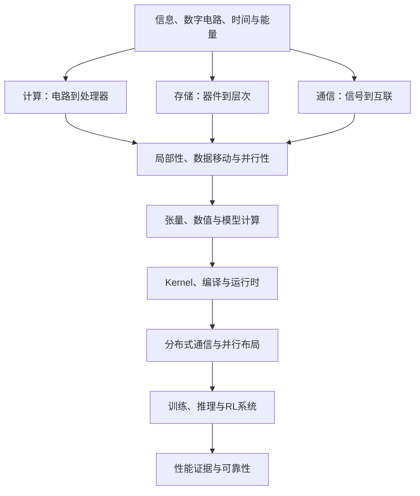

# AI Infra 百科

面向大模型训练、推理与 RL 的知识库。重点解释并行布局、执行运行时，以及训练、推理和RL的数据与状态管理；数学、物理和硬件条目提供必要背景。每个领域按概念与问题组织，可以独立查阅，也可以沿依赖与演进连续阅读。

**连接真实实现**：[四个贯穿案例](12_Performance_Reliability/贯穿案例索引.md) · **核对完整过程**：[手工推演索引](手工推演索引.md) · **按概念查**：[术语索引](术语索引.md) · **按现象查**：[问题索引](问题索引.md) · **理解来龙去脉**：[技术演进索引](技术演进索引.md) · **了解知识关联**：[概念关系与正文归属](概念关系与正文归属.md)。

## 从物理世界到 AI 系统

箭头表示解释依赖，不表示必须顺序读完。可从[一次矩阵乘到分布式训练](00_Physical_Foundations/从一次矩阵乘到分布式训练.md)观察同一个例子如何穿过这些层次。

## 知识领域

| 领域 | 主入口 | 核心问题 |
|---|---|---|
| 物理基础 | [计算、存储、通信](00_Physical_Foundations/README.md) | bit 如何保存、变换和传输，成本从哪里来？ |
| 数学与数值 | [张量、自动微分、精度](01_Math_Numerics/README.md) | 数学对象怎样变成程序状态？ |
| 模型结构 | [Transformer 与结构专题](02_Model_Architecture/README.md) | 模型改变了什么计算、状态和访问？ |
| 硬件与系统 | [主机与 GPU](03_Hardware_Systems/README.md) | 谁提交、谁执行、谁等待？ |
| 内存与存储 | [地址、分配与持久化](04_Memory_Storage/README.md) | 状态在哪里，何时可见和回收？ |
| Kernel | [算子与数据搬运](05_Kernels/README.md) | 数学操作如何使用设备资源？ |
| 编译器 | [图、IR 与执行](06_Compilers/README.md) | 如何生成、选择和提交设备工作？ |
| 通信 | [原语、算法与网络](07_Communication/README.md) | 数据怎样在参与者之间正确移动？ |
| 并行 | [布局与状态分片](08_Parallelism/README.md) | 如何划分工作、状态与依赖？ |
| 训练 | [更新、数据与恢复](09_Training_Systems/README.md) | 如何持续完成正确的参数更新？ |
| 推理 | [KV、调度与生成](10_Inference_Serving/README.md) | 如何在质量和延迟约束下服务请求？ |
| RL | [角色、样本与版本](11_RL_Systems/README.md) | 如何协调生成、评价、训练与换权？ |
| 性能与可靠性 | [模型、测量与故障](12_Performance_Reliability/README.md) | 如何证明改善、解释失败并恢复？ |

## 文章如何分工

- **概念条目**解释定义、机制、算例和边界，一个概念有明确的主要维护位置。
- **专题综述**串起问题、方法、代价和后续分支，区分可以组合与互相竞争的方案。
- **实现与案例**对应具体代码或历史模型版本，不能把特定实现当成普遍定义。

训练、推理和 RL 的通用原理在百科维护；[Megatron](../docs/megatron_code_walkthrough/README.md)、[SGLang](../docs/sglang_code_walkthrough/README.md)、[slime](../docs/code_walkthrough/README.md)负责实现走读。[论文详解](../docs/paper_read/README.md)负责原始方案的深入分析，[性能指南](../docs/performance_analysis_guide/README.md)负责工具操作、实验和报告。

## 演进的阅读方法

每条主线追问：原来的目标和约束是什么，旧方法在哪些条件下遇到瓶颈，新方法改变了什么，收益来自哪里，新问题是什么，旧方法在哪些条件下仍合理。时间线注明来源，避免把发表先后误写成替代或因果关系。

基础机制、论文报告、版本实现和测量结果采用不同证据口径。新增数字算例均为教学假设；旧模型与硬件资料的迁移不代表全面事实核验，详见[版本与验证范围](版本与验证范围.md)。

## 实践与维护

- [文档补充 TODO](文档补充TODO.md)：按编号逐项补充的优先级、具体内容、依赖和验收标准。
- [按目标阅读](guides/按目标阅读.md)：若需要连续理解，选择一条跨领域路径。
- [16 周实践路线](guides/16周实践路线.md)：保留原有可选实验安排，不再决定百科结构。
- [写作与证据约定](写作与证据约定.md)：条目、引用与演进关系的维护规则。
- [迁移索引](重构说明与迁移索引.md)：查找旧路径的正文去向。

维护数据：[当前条目登记](encyclopedia_catalog.json)、[历史迁移记录](document_routes.json)。结构检查：`python tools/validate_learning_docs.py`。
