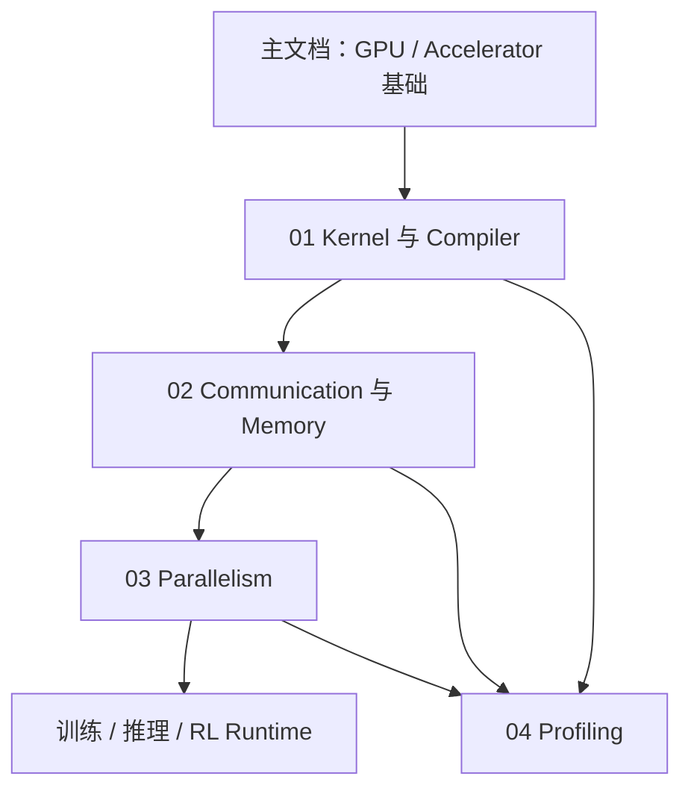

# AI Infra 知识库

> 本目录承载篇幅较大的 AI Infra 专题。主文档负责共同基础与导航，每个专题采用“总览 → 原理分章 → 案例 → 实验/排查”的结构。

## 当前结构

| 专题 | 目标 | 状态 |
|---|---|---|
| [01｜Kernel、GPU Programming 与 Compiler Stack](01_Kernel_GPU_Programming_Compiler/00_专题总览.md) | 从 PyTorch Operator 一路理解到 GPU 指令与 Tensor Core | 第一版完成，资料核对截至 2026-09-04 |
| [02｜Distributed Communication 与 Memory System](02_Distributed_Communication_Memory/00_专题总览.md) | 统一理解显存、Collective、NCCL、NVLink/InfiniBand、Offload 与 KV Cache | 第一版完成，资料核对截至 2026-09-04 |
| [03｜Parallelism](03_Parallelism/00_专题总览.md) | 理解 DP/TP/PP/SP/CP/EP 到底切什么、存什么、通信什么 | 第一版完成，资料核对截至 2026-09-05 |
| [04｜Profiling 与 Performance Analysis](04_Profiling_Performance_Analysis/00_专题总览.md) | 从 GPU 利用率、Timeline、Kernel counter、通信与 SLO 逐层定位关键路径 | 第一版完成，资料核对截至 2026-09-05 |

## 写作约定

- 缩写或专有名词第一次出现时给出英文全称与中文解释。
- 先讲问题和直觉，再给公式、实现与性能影响。
- 晦涩的数据路径、层级或时序优先使用 Mermaid 图。
- 结论区分“官方已确认”“论文/项目报告”“工程推断”。
- 涉及快速演进的软件栈时标注资料核对日期和版本。
- 公式统一使用 GitHub 可渲染的 `$...$` 或 `$$...$$`。
- 同一概念只保留一个权威解释，其他文档通过相对链接引用。
- 每个专题必须包含真实算子案例与可执行的排查/实验方法。

## 当前推荐阅读路径

RL = **Reinforcement Learning（强化学习）**。

## 已完成专题的衔接

- Kernel / Compiler 专题解释单卡算子如何执行；Communication / Memory 专题解释 tensor 离开单个算子后如何保存、分片与搬运。
- 第二专题新增 16 篇文档，覆盖进程与地址空间、显存核算、Collective 算法、节点内/跨节点互联、NCCL、性能模型、通信计算重叠、训练/推理内存、Checkpoint，以及 MoE 与 Prefill–Decode 两个端到端案例。
- 建议在进入 Parallelism 专题前，至少读完第二专题的 00、02、03、07、08、09；后续 DP/TP/PP/CP/EP 会直接引用这些概念。
- 第三专题采用总览加 16 个分章，统一使用 tensor layout 与 DeviceMesh 语言解释 DP/DDP、ZeRO/FSDP、TP、PP、SP、CP、EP，并加入训练、推理、RL、自动并行、DualPipe 案例和配置工作表。
- 第四专题采用总览加 16 个分章，建立“常驻遥测 → 系统时间线 → Operator/Kernel → 通信/内存 → 单变量验证”的完整方法，覆盖 Nsight Systems、Nsight Compute、PyTorch Profiler、DCGM、训练与生成式推理指标、MoE/长上下文/RL 和线上观测。
